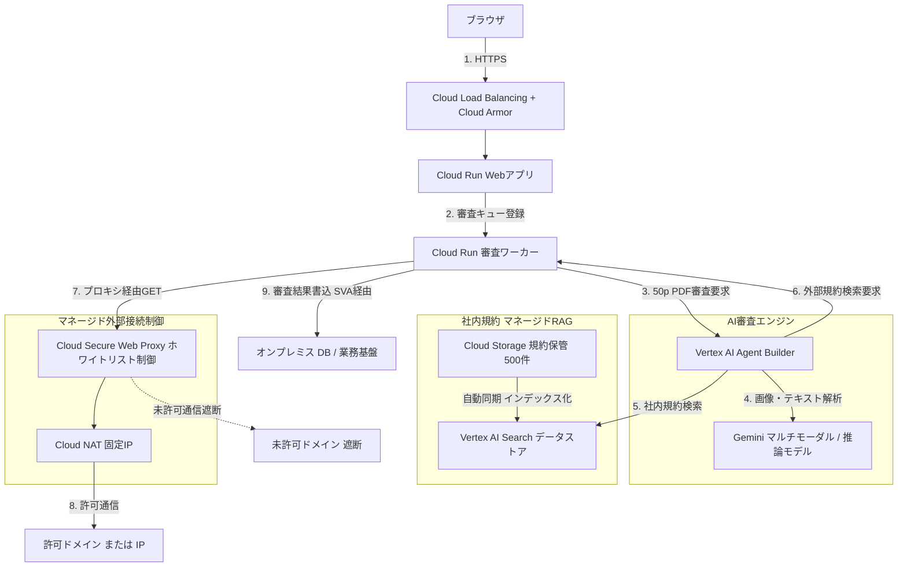
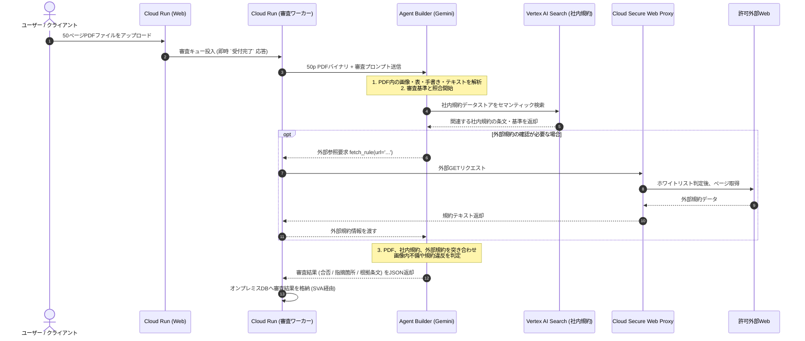

# 【AI問い合わせ用】Google Cloudにおけるファイル審査AI Agent・マネージドRAGアーキテクチャ検討プロンプト

## 1. 相談の背景と目的
現在、Google Cloud上で稼働するWeb/APIシステムにおいて、ユーザーからアップロードされた大容量・画像混在PDFドキュメントをAI Agentを活用して自動審査する仕組みを検討しています。
最新のGoogle Cloudサービス（AI Agent、マネージドRAG、セキュリティ制御等）を活用した**完全マネージドなベストプラクティス構成案**、**アーキテクチャ図（Mermaid）**、および**月額概算費用**を提示してください。

---

## 2. システム前提条件（現在の構成）
- **Web/APIアクセスルート**:
  `[ブラウザ]` -> `(Internet)` -> `[Cloud Load Balancing + Cloud Armor]` -> `[Cloud Run]` -> `[Serverless VPC Access (SVA)]` -> `[オンプレミスサーバ (DB等)]`
- **既存ストレージ**:
  `[Cloud Run]` -> `[Private Service Access (PSA)]` -> `[Filestore]`

---

## 3. 審査対象ドキュメントの要件・ワークロード
- **処理量**: 100 文書 / 日（稼働時間帯: 9:00〜18:00、月間換算: 約2,000文書）
- **1文書あたりの規模**:
  - 平均 **50 ページ** (PDF形式)
  - 1文書あたり平均 **50 個** の画像・イラスト・表を含む
- **認識要件**:
  - ドキュメント本文テキストだけでなく、**画像内の文字・手書き・図表内の数値も審査対象**

---

## 4. 規約照合・RAG・外部接続要件
- **社内規約の検索 (RAG基盤)**:
  - 初期登録文書数: **500 文書**（テキスト / PDF / Word等）
  - 月次差し替え・更新文書数: **50 文書 / 月**
  - 完全マネージドなRAG検索基盤（Vertex AI Search等のデータストア連携）を想定
- **外部公開規約の検索とアクセス制御 (ホワイトリスト)**:
  - 審査時に必要に応じてインターネット上に公開されている法令・官公庁ガイドライン等のWeb規約を参照
  - AI Agentの外部通信先は**FQDN（ドメイン）またはIPアドレスによるホワイトリスト方式**で厳格に遮断・制御
  - 自前VM管理を排除した**完全マネージドなセキュリティ制御（Cloud Secure Web Proxy等）**を採用

---

## 5. 出力に含めてほしい項目
1. **推奨アーキテクチャの概要と採用サービス選定理由**
   - AI Agent、マルチモーダルモデル、マネージドRAG、外部接続制御の組み合わせ理由
   - AIモデルの比較、処理に応じたAIモデルの使い分け
2. **全体アーキテクチャ図 (Mermaid形式)**
   - ※Mermaid v10系で構文エラー（Syntax error）にならないよう、英数字ベースの標準的なノードIDと特殊記号を含まないラベル記法を使用すること
3. **処理シーケンス図 (Mermaid形式)**
   - ファイル受付から審査、社内RAG検索、外部プロキシ検索、オンプレミスDB登録までの一連の流れ
4. **月額概算費用試算 (USD / JPY)**
   - 上記ワークロード（月間2,000文書 / 100,000ページ / RAG 500件）に基づいた内訳と合計
5. **担当者別タスク一覧**
   - インフラ/GCP構築担当者向けタスク
   - アプリケーション開発担当者向けタスク

---

# 完全マネージド構成によるAI Agentファイル審査・RAGアーキテクチャ設計書

本ドキュメントは、Google Cloudの完全マネージドサービスを活用し、大容量・画像混在PDFの自動審査および社内・外部規約照合（RAG/ホワイトリスト制御）を実現するアーキテクチャ設計書、モデル選定評価、および概算費用試算です。

---

## 1. 処理要件とキャパシティ前提

| 項目 | 条件・前提 | 備考 / 月間換算 (20営業日換算) |
| :--- | :--- | :--- |
| **審査対象文書数** | 100文書 / 日（9:00〜18:00） | **2,000 文書 / 月**（約11文書/時間） |
| **1文書あたりの規模** | PDF 50ページ / 画像・表・イラスト約50個 | **100,000 ページ / 月** |
| **文字・画像認識要件** | 画像内の文字・図表内の数値も審査対象 | マルチモーダルモデル（Gemini）による直接認識 |
| **社内RAG規約文書** | 初期：500文書、月次更新：50文書 | テキスト/PDF/Word形式（Vertex AI Searchで管理） |
| **外部規約参照** | 審査時に必要に応じて外部公開規約を参照 | Cloud Secure Web Proxyによるホワイトリスト制限 |

---

## 2. 全体アーキテクチャ構成図



---

## 3. 要件に対するアーキテクチャの対応ポイント

### ① 「50ページ＋50個の画像・表」の高速・高精度処理
- **Gemini マルチモーダル直接入力**:
  Gemini（Flash / Pro系）はネイティブでPDFドキュメントを直接読み込み、埋め込まれた画像・表・手書き文字を直接認識できます。事前OCR処理（Document AI等）を挟まずに直接投入できるため、**処理ステップの簡素化と大幅なコスト削減**が可能です。
- **1文書あたりの推定トークン数**:
  - 1ページあたり画像トークン（約258〜300トークン）＋ テキスト（約200トークン） ≒ 約500トークン/ページ
  - 50ページ ≒ **約25,000 インプットトークン / 文書**（Geminiの長文コンテキストウィンドウ内に十分収まります）。

### ② 社内規約RAG（初期500件＋月次50件更新）
- **Vertex AI Search の自動管理**:
  初期500文書および月次50文書の差し替えは、Cloud Storageにファイルを配置・更新するだけで、自動的にバックグラウンドでインデックスの差分同期が行われます。

### ③ 外部Web規約のホワイトリスト制御
- **Cloud Secure Web Proxy (SWP)**:
  サーバーレスプロキシのため、トラフィックの変動に関わらず安定稼働。外部の法令サイトや官公庁ガイドラインなど、許可されたFQDN/IP以外へのアクセスを完全に遮断します。

---

## 4. AIモデル選定・性能比較評価

50ページのPDFに含まれる画像50個の文字認識および複数規約の論理照合における、Geminiモデル間の性能差と選定基準です。

| 評価軸 | Gemini 1.5 Flash (軽量) | 上位・推論モデル (Gemini 3.7 Flash / 2.0 / 1.5 Pro) | 審査業務における具体的な影響 |
| :--- | :--- | :--- | :--- |
| **画像・図表内の微細文字認識** | 標準的。低解像度画像や小さな注記テキストの読み落としが発生する場合がある。 | **極めて高精度**。複雑なレイアウト、図表内の小さな数値、手書き文字の抽出精度が向上。 | 図や表内の数字の不備、注記（米印等）の規約違反の見落としリスクが低減。 |
| **長文・複数規約の論理推論 (Reasoning)** | 単純な抽出や定型チェックは得意だが、複数の条文を跨ぐ複合条件でハルシネーションが起きやすい。 | **思考プロセス（Reasoning）の制御に対応**。社内規約・外部規約を突き合わせた論理判定精度が高い。 | 「第○条の例外規定に該当するか」といった多面的な審査判断の信頼性が向上。 |
| **構造化出力 (JSON) の遵守性** | 指示が複雑になるとJSONフォーマット崩れや項目の欠落が稀に発生。 | 高精度にスキーマへ適合。エラーハンドリング不要な安定したレスポンス。 | 後続のオンプレミスDB登録処理でのパースエラーを防ぎ、システム連携が安定。 |
| **推奨適用領域** | 1次スクリーニング、定型フォーマット検証、必須項目チェック | **本番精密審査、画像・表の規約照合、PoC初期検証** | 本要件（画像50個＋条文照合）では上位推論モデルを基本推奨。 |

### モデル運用方針
1. **PoC（概念実証）段階**: 上位モデル（Gemini 3.7 Flash / Pro）を基準として精度検証を実施し、プロンプト・RAG精度の切り分けを行う。
2. **本番運用（ハイブリッド構成の検討）**: コストを最適化する場合、Cloud Run側で「定型不備チェック＝軽量Flash」「画像・規約照合＝推論モデル」と段階的に呼び分ける。

---

## 5. 概算費用試算（月額）

月間 **2,000文書（100,000ページ）** を処理した場合の概算費用です。（1 USD = 150 JPY 換算）

| サービス名 | 算出根拠・リソース量 | 月額見積 (USD) | 月額見積 (JPY) |
| :--- | :--- | :--- | :--- |
| **Vertex AI (Gemini 1.5 Flash利用時)** | 入力: 50M tokens ($0.075/M)<br>出力: 4M tokens ($0.30/M) | $4.95 | 約 740 円 |
| **Vertex AI (Gemini 1.5 Pro / 上位推論モデル利用時)** | 入力: 50M tokens ($1.25/M)<br>出力: 4M tokens ($5.00/M) | $82.50 | 約 12,380 円 |
| **Vertex AI Search (RAG)** | 規約検索: 6,000回 ($5.00/1,000 queries)<br>ストレージ: 500文書(~5GB) | $30.00 | 約 4,500 円 |
| **Cloud Secure Web Proxy** | 稼働時間: 730時間 ($0.072/hr)<br>データ転送量: ~10GB | $52.60 | 約 7,890 円 |
| **Cloud NAT & 固定IP** | 稼働時間: 730時間 ($0.045/hr)<br>データ処理量: ~10GB | $33.30 | 約 5,000 円 |
| **Cloud Run (ワーカー/Web)** | 2,000回 × 30秒 (2vCPU, 4GB RAM) | $5.00 | 約 750 円 |
| **Cloud Storage** | 一時保管＋規約保管 (~50GB) | $1.00 | 約 150 円 |
| **Cloud Load Balancing + Armor** | 既存基盤利用（追加増分のみ） | $15.00 | 約 2,250 円 |
| **月額合計 (Flash採用時)** | **軽量モデル構成** | **約 $141.85 /月** | **約 21,280 円 /月** |
| **月額合計 (上位推論モデル採用時)** | **推奨・高精度構成** | **約 $219.40 /月** | **約 32,910 円 /月** |

---

## 6. 審査シーケンス（時系列フロー）



---

## 7. 各担当者への作業依頼事項

```markdown
### 【インフラ・GCP担当者への依頼】
1. **社内規約用 GCSバケット作成 & 初期文書登録**
   - 規約保管用バケット（例: `company-rules-rag-prod`）を作成し、初期の500文書を格納してください。
2. **Vertex AI Search データストアの構築**
   - 上記GCSバケットをデータソースとする「非構造化（Unstructured）」データストアを作成し、自動同期を有効化してください。
3. **Cloud Secure Web Proxy (SWP) の構築**
   - VPC内にSWPインスタンスを作成し、許可対象ドメイン（外部官公庁・業界団体等）のURL Listポリシーを適用してください。
4. **Cloud NAT / 固定IPの設定**
   - SWPのアウトバウンド用にCloud NATおよび静的外部IPを割り当ててください。
5. **IAM権限設定**
   - 審査用Cloud Runサービスアカウントに `roles/discoveryengine.viewer` および `roles/aiplatform.user` を付与してください。

### 【アプリケーション開発担当者への依頼】
1. **Gemini マルチモーダル審査プロンプトの設計**
   - 50ページのPDFおよび画像内テキスト・図表を漏れなくスキャンするよう指示文を設計してください。
   - モデルにはPoC段階で推論精度の高い上位モデル（Gemini 3.7 Flash / Pro等）を指定してください。
   - 出力フォーマットをJSONスキーマ（合否判定、不備理由、該当ページ番号、違反条文）で定義してください。
2. **Agent Builder & RAG連携設定**
   - エージェントにVertex AI Searchデータストアを紐付け、社内規約を優先検索するよう設定してください。
3. **外部取得ツールの実装 (Cloud Run側)**
   - SWP経由（`http://<SWPエンドポイントIP>:4433`）で外部Web規約を取得するHTTPクライアント関数を実装してください。
4. **結果登録ロジックの実装**
   - Agentが返却したJSONをパースし、SVA経由でオンプレミスDBの該当レコードを更新する処理を実装してください。
```
