# 🚀 AWS：API Gateway / Lambda / Step Functions 構築・運用設計ガイド

本ドキュメントは、AWS 上で **Amazon ECS (AWS Fargate)** から **Amazon API Gateway（プライベート REST API）**、**AWS Lambda**、**AWS Step Functions** を経由して、バックエンドの **Amazon DynamoDB / Amazon S3 / Amazon Bedrock AgentCore** へ安全・高信頼・低レイテンシに連携するサーバーレス処理基盤を構築・運用するための総合設計・構築ガイドです。

既存の [AWS：ECS Fargate ガイド](file:///D:/Github/markdown/aws/markdown/AWS%EF%BC%9AECS.md) と完全に整合し、VPC-A 内の指定サブネット（`subnet-vpca-vpce-1a`, `subnet-vpca-vpce-1c`）に配置された **Interface型 VPC エンドポイント（AWS PrivateLink）** を活用して、VPC 内部完結のセキュアな通信を実現します。  
すべての構築・運用手順を **AWS マネジメントコンソール（GUI）** と **AWS CLI (v2)** の双方で解説します。

---

## 📑 目次

- [1. はじめに（全体アーキテクチャと基本設計）](#1-はじめに全体アーキテクチャと基本設計)
  - [1.1 サーバーレス統合アーキテクチャの概要](#11-サーバーレス統合アーキテクチャの概要)
  - [1.2 全体アーキテクチャ概要図](#12-全体アーキテクチャ概要図)
  - [1.3 エンドツーエンド通信フロー詳細](#13-エンドツーエンド通信フロー詳細)
  - [1.4 前提条件と設計パラメータ一覧](#14-前提条件と設計パラメータ一覧)
- [2. ネットワーク・サブネット・VPCエンドポイント設計](#2-ネットワークサブネットvpcエンドポイント設計)
  - [2.1 サブネット設計（東京 1a / 1c マルチAZ）](#21-サブネット設計東京-1a--1c-マルチaz)
  - [2.2 API Gateway用 Interface VPCエンドポイントの設計](#22-api-gateway用-interface-vpcエンドポイントの設計)
  - [2.3 Interface型VPCエンドポイントのプライベートIP固定化（静的割り当て）](#23-interface型vpcエンドポイントのプライベートip固定化静的割り当て)
  - [2.4 VPCエンドポイントの作成手順（GUI / CLI）](#24-vpcエンドポイントの作成手順gui--cli)
- [3. API Gateway（プライベート REST API）の作成とアクセス制御](#3-api-gatewayプライベート-rest-apiの作成とアクセス制御)
  - [3.1 プライベート REST API の基本設計（内部ALBの要否判断）](#31-プライベート-rest-api-の基本設計内部albの要否判断)
  - [3.2 リソースポリシー設計（特定VPCEのみ許可・外部完全遮断）](#32-リソースポリシー設計特定vpceのみ許可外部完全遮断)
  - [3.3 プライベート REST API の作成手順（GUI / CLI）](#33-プライベート-rest-api-の作成手順gui--cli)
  - [3.4 リソース・メソッド作成と Lambda 統合設定（GUI / CLI）](#34-リソースメソッド作成と-lambda-統合設定gui--cli)
  - [3.5 ステージの作成・デプロイ・スロットリング設定（GUI / CLI）](#35-ステージの作成デプロイスロットリング設定gui--cli)
- [4. Lambda 関数の作成・デプロイ](#4-lambda-関数の作成デプロイ)
  - [4.1 Lambda関数の構成設計（VPC Lambda vs 非VPC Lambdaの判断基準）](#41-lambda関数の構成設計vpc-lambda-vs-非vpc-lambdaの判断基準)
  - [4.2 Lambda関数コード実装（Step Functions 同期実行ハンドラー）](#42-lambda関数コード実装step-functions-同期実行ハンドラー)
  - [4.3 Lambda関数の作成と設定手順（GUI / CLI）](#43-lambda関数の作成と設定手順gui--cli)
  - [4.4 バージョン・エイリアス管理とデプロイ設定（GUI / CLI）](#44-バージョンエイリアス管理とデプロイ設定gui--cli)
- [5. Step Functions ステートマシンの作成・デプロイ](#5-step-functions-ステートマシンの作成デプロイ)
  - [5.1 ステートマシン設計（Standard vs Express Workflow の選定）](#51-ステートマシン設計standard-vs-express-workflow-の選定)
  - [5.2 ASL（Amazon States Language）定義（DynamoDB / S3 / Bedrock 直接統合）](#52-aslamazon-states-language定義dynamodb--s3--bedrock-直接統合)
  - [5.3 ステートマシンの作成手順（GUI / CLI）](#53-ステートマシンの作成手順gui--cli)
  - [5.4 エラーハンドリング（Retry / Catch）設計](#54-エラーハンドリングretry--catch設計)
- [6. IAMロール・ポリシーの設計と作成（最小権限設計）](#6-iamロールポリシーの設計と作成最小権限設計)
  - [6.1 IAMロール体系と権限マトリクス](#61-iamロール体系と権限マトリクス)
  - [6.2 ECS タスクロール（API Gateway 呼出権限）（GUI / CLI）](#62-ecs-タスクロールapi-gateway-呼出権限gui--cli)
  - [6.3 API Gateway 実行ロール（Lambda 呼出権限）（GUI / CLI）](#63-api-gateway-実行ロールlambda-呼出権限gui--cli)
  - [6.4 Lambda 実行ロール（Step Functions 実行権限）（GUI / CLI）](#64-lambda-実行ロールstep-functions-実行権限gui--cli)
  - [6.5 Step Functions 実行ロール（DynamoDB / S3 / Bedrock 権限）（GUI / CLI）](#65-step-functions-実行ロールdynamodb--s3--bedrock-権限gui--cli)
- [7. セキュリティグループの設計と設定](#7-セキュリティグループの設計と設定)
  - [7.1 セキュリティグループ設計マトリクス（最小権限）](#71-セキュリティグループ設計マトリクス最小権限)
  - [7.2 各セキュリティグループの作成とルール設定（GUI / CLI）](#72-各セキュリティグループの作成とルール設定gui--cli)
- [8. メンテナンス・バックアップ・構成管理（IaC）設計](#8-メンテナンスバックアップ構成管理iac設計)
  - [8.1 サーバーレス構成におけるバックアップの考え方（ステートレスとコード管理）](#81-サーバーレス構成におけるバックアップの考え方ステートレスとコード管理)
  - [8.2 OpenAPI (Swagger) 定義のエクスポートと構成管理（GUI / CLI）](#82-openapi-swagger-定義のエクスポートと構成管理gui--cli)
  - [8.3 Lambda / Step Functions のリビジョン管理と CI/CD](#83-lambda--step-functions-のリビジョン管理と-cicd)
  - [8.4 永続データ層（DynamoDB / S3）の AWS Backup 連携](#84-永続データ層dynamodb--s3の-aws-backup-連携)
- [9. 削除保護・誤操作防止設計](#9-削除保護誤操作防止設計)
  - [9.1 サーバーレスリソースの誤削除防止ガードレール（IAM / SCP）](#91-サーバーレスリソースの誤削除防止ガードレールiam--scp)
  - [9.2 CloudFormation / SAM スタック終了保護と DeletionPolicy 設計](#92-cloudformation--sam-スタック終了保護と-deletionpolicy-設計)
- [10. アクティビティログ・監査ログ（CloudTrail）](#10-アクティビティログ監査ログcloudtrail)
  - [10.1 CloudTrail による管理イベント記録（GUI / CLI）](#101-cloudtrail-による管理イベント記録gui--cli)
  - [10.2 Lambda データイベントの記録設定（GUI / CLI）](#102-lambda-データイベントの記録設定gui--cli)
  - [10.3 ログの S3 長期保存・改ざん防止（S3 Object Lock）（GUI / CLI）](#103-ログの-s3-長期保存改ざん防止s3-object-lockgui--cli)
- [11. アプリケーションログ・分散トレーシング（CloudWatch / X-Ray）](#11-アプリケーションログ分散トレーシングcloudwatch--x-ray)
  - [11.1 API Gateway 実行ログ & アクセスログ（JSON形式）設定（GUI / CLI）](#111-api-gateway-実行ログ--アクセスログjson形式設定gui--cli)
  - [11.2 Lambda 構造化ログ（JSON）とログ保持期間設定（GUI / CLI）](#112-lambda-構造化ログjsonとログ保持期間設定gui--cli)
  - [11.3 Step Functions 実行ログの CloudWatch 出力設定（GUI / CLI）](#113-step-functions-実行ログの-cloudwatch-出力設定gui--cli)
  - [11.4 AWS X-Ray によるエンドツーエンド分散トレーシング（GUI / CLI）](#114-aws-x-ray-によるエンドツーエンド分散トレーシングgui--cli)
- [12. 障害監視・パフォーマンス監視・アラート通知](#12-障害監視パフォーマンス監視アラート通知)
  - [12.1 監視設計マトリクス（重要メトリクスと推奨しきい値）](#121-監視設計マトリクス重要メトリクスと推奨しきい値)
  - [12.2 CloudWatch アラームの作成手順（GUI / CLI）](#122-cloudwatch-アラームの作成手順gui--cli)
  - [12.3 EventBridge + SNS による異常終了リアルタイムメール通知（GUI / CLI）](#123-eventbridge--sns-による異常終了リアルタイムメール通知gui--cli)
- [13. エンドツーエンド動作確認・疎通テスト手順](#13-エンドツーエンド動作確認疎通テスト手順)
  - [13.1 ECS Fargate（ECS Exec）からの API 呼び出しテスト（CLI）](#131-ecs-fargateecs-execからの-api-呼び出しテストcli)
  - [13.2 処理結果の確認（DynamoDB, S3, Bedrock, Step Functions）（CLI）](#132-処理結果の確認dynamodb-s3-bedrock-step-functionscli)
  - [13.3 CloudWatch Logs / X-Ray トレースの検証（CLI）](#133-cloudwatch-logs--x-ray-トレースの検証cli)
- [14. トラブルシューティングガイド](#14-トラブルシューティングガイド)
  - [14.1 API Gateway 403 Forbidden（リソースポリシー拒否・VPCE不一致・DNS未解決）](#141-api-gateway-403-forbiddenリソースポリシー拒否vpce不一致dns未解決)
  - [14.2 API Gateway 500 / 502 / 504 エラー（Lambdaタイムアウト・統合エラー）](#142-api-gateway-500--502--504-エラーlambdaタイムアウト統合エラー)
  - [14.3 Step Functions 実行失敗（IAM権限不足・タスク失敗）](#143-step-functions-実行失敗iam権限不足タスク失敗)
  - [14.4 VPCエンドポイント接続タイムアウト（SG未開放・ルート不正）](#144-vpcエンドポイント接続タイムアウトsg未開放ルート不正)

---

## 1. はじめに（全体アーキテクチャと基本設計）

### 1.1 サーバーレス統合アーキテクチャの概要

本アーキテクチャは、**ECS Fargate 上で動作するコンテナアプリケーション** から、バックエンドのビジネストランザクションや AI オーケストレーション処理を呼び出すためのセキュアなサーバーレス連携基盤です。

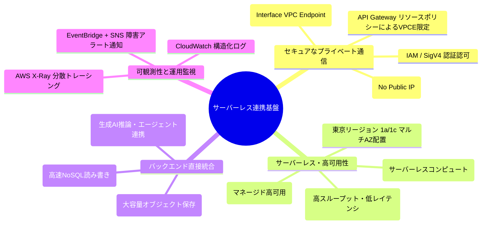

#### 本構成の特長と設計判断
1. **完全閉域ネットワーク**:
   - ECS から API Gateway への通信は、VPC-A 内の Interface型 VPC エンドポイント（`execute-api`）を経由し、AWS バックボーンネットワーク内のみを通過します。
   - API Gateway に **リソースポリシー** を設定し、特定の VPC エンドポイント ID からのリクエストのみを許可。インターネットや他アカウントからのアクセスは完全に遮断されます。
2. **内部 ALB は不要**:
   - ECS Fargate から Private REST API を呼び出す場合、VPC エンドポイントの **プライベート DNS** 機能により、`https://{restapi-id}.execute-api.ap-northeast-1.amazonaws.com/{stage}` を直接名前解決して HTTPS 呼び出しが可能です。内部 ALB を中継する必要はなく、不要なコストやレイテンシの増加を回避できます。
3. **Express Workflow による同期オーケストレーション**:
   - Lambda から Step Functions を呼び出す際、同期実行が可能な **Express Workflow (`StartSyncExecution`)** を採用します。ミリ秒単位の高速応答と高スループット、低コストを実現します。
4. **Step Functions のマネージド直接統合（Optimized Integrations）**:
   - Step Functions ステートマシンから DynamoDB, S3, Amazon Bedrock への呼び出しは、追加の Lambda コードを介さず Step Functions のネイティブタスク定義で直接実行し、コード保守コストを最小化します。

---

### 1.2 全体アーキテクチャ概要図

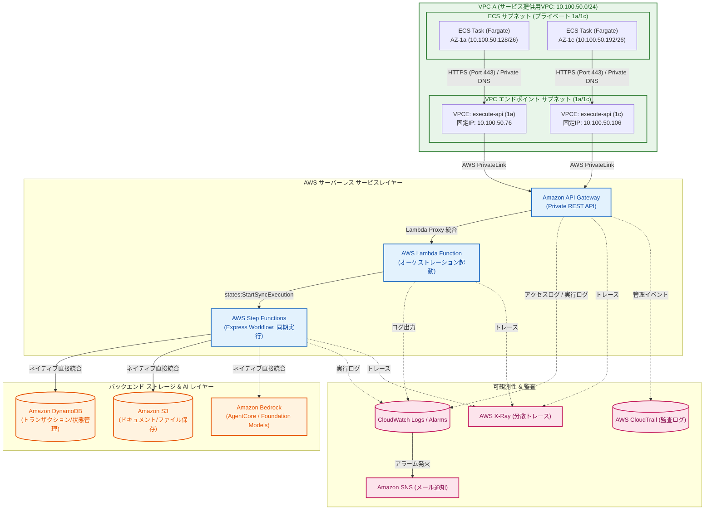

---

### 1.3 エンドツーエンド通信フロー詳細

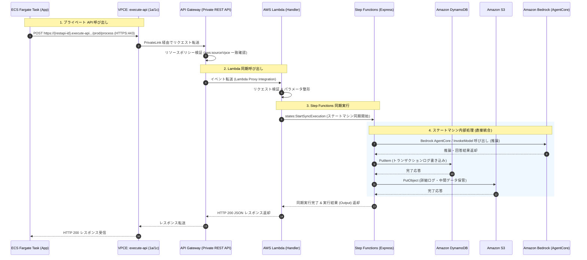

---

### 1.4 前提条件と設計パラメータ一覧

| 項目 | 設計値 / パラメータ | 備考 |
| :--- | :--- | :--- |
| **AWS リージョン** | `ap-northeast-1` (東京リージョン) | マルチ AZ 構成（1a, 1c） |
| **VPC-A (サービス用)** | CIDR: `10.100.50.0/24` | `AWS：ECS.md` と共通 |
| **ECS サブネット** | 1a: `10.100.50.128/26`<br>1c: `10.100.50.192/26` | `subnet-vpca-ecs-1a`, `subnet-vpca-ecs-1c` |
| **VPC エンドポイント サブネット** | 1a: `10.100.50.64/27`<br>1c: `10.100.50.96/27` | `subnet-vpca-vpce-1a`, `subnet-vpca-vpce-1c` |
| **API Gateway VPCE 固定 IP** | 1a: `10.100.50.76`<br>1c: `10.100.50.106` | Interface 型（`execute-api`）、Private DNS 有効 |
| **API Gateway エンドポイント種別** | **プライベート (PRIVATE)** | インターネット非公開、リソースポリシー必須 |
| **API Gateway プロトコル** | REST API (v1) | プライベートエンドポイントおよび詳細リソースポリシー対応 |
| **Lambda 実行環境** | Python 3.12 (または Node.js 20.x), arm64/x86_64 | メモリ: 512MB, タイムアウト: 30秒 |
| **Step Functions タイプ** | **Express Workflow** | API 連携に適した低レイテンシ同期実行 (`StartSyncExecution`) |
| **バックエンド連携サービス** | Amazon DynamoDB, Amazon S3, Amazon Bedrock AgentCore | 構築済み扱い（Step Functions から直接統合） |

---

## 2. ネットワーク・サブネット・VPCエンドポイント設計

### 2.1 サブネット設計（東京 1a / 1c マルチAZ）

[AWS：ECS Fargate ガイド](file:///D:/Github/markdown/aws/markdown/AWS%EF%BC%9AECS.md) のネットワーク設計に基づき、VPC-A 内の同一サブネット構成を利用します。

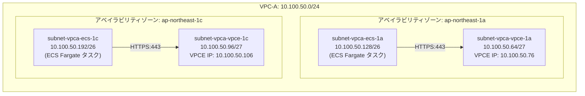

---

### 2.2 API Gateway用 Interface VPCエンドポイントの設計

- **サービス名**: `com.amazonaws.ap-northeast-1.execute-api`
- **タイプ**: Interface (AWS PrivateLink)
- **プライベート DNS (Private DNS)**: **有効 (Enabled)**
  - プライベート DNS を有効にすると、VPC 内からの `{restapi-id}.execute-api.ap-northeast-1.amazonaws.com` の DNS クエリが、エンドポイントのプライベート IP（`10.100.50.76` / `10.100.50.106`）に自動解決されます。
  - アプリケーションコード側で特別なエンドポイント URL や IP アドレスをハードコードする必要がなくなります。

---

### 2.3 Interface型VPCエンドポイントのプライベートIP固定化（静的割り当て）

| 項目 | サブネット 1a (`subnet-vpca-vpce-1a`) | サブネット 1c (`subnet-vpca-vpce-1c`) |
| :--- | :--- | :--- |
| **サブネット CIDR** | `10.100.50.64/27` | `10.100.50.96/27` |
| **エンドポイント固定 IP** | **`10.100.50.76`** | **`10.100.50.106`** |
| **アタッチする SG** | `sg-vpce-apigw` (TCP 443 許可) | `sg-vpce-apigw` (TCP 443 許可) |

> [!IMPORTANT]
> **VPC 予約 IP について**
> 各サブネットの先頭 4 つ（例: `10.100.50.64`〜`10.100.50.67`）および末尾 1 つ（`10.100.50.95`）は AWS 内部予約のため指定できません。本設計の `10.100.50.76` / `10.100.50.106` は安全に割り当て可能な範囲内です。

---

### 2.4 VPCエンドポイントの作成手順

#### VPCエンドポイント作成手順 (GUI)
1. AWS マネジメントコンソールで **[VPC]** $\rightarrow$ **[エンドポイント]** $\rightarrow$ **[エンドポイントを作成]** をクリック。
2. **名前タグ**: `vpce-execute-api`
3. **サービスカテゴリ**: **AWS のサービス**
4. **サービス名**: `com.amazonaws.ap-northeast-1.execute-api` を検索して選択。
5. **VPC**: `vpc-vpca` (CIDR: `10.100.50.0/24`) を選択。
6. **追加設定**:
   - **[プライベート DNS 名を有効にする]** に必ずチェックを入れる。
7. **サブネット**:
   - **AZ 1 (`ap-northeast-1a`)**: サブネット `subnet-vpca-vpce-1a` を選択 $\rightarrow$ **「IPv4 アドレス」** で **「カスタム IPv4 アドレス」** を選択し、`10.100.50.76` を入力。
   - **AZ 2 (`ap-northeast-1c`)**: サブネット `subnet-vpca-vpce-1c` を選択 $\rightarrow$ **「IPv4 アドレス」** で **「カスタム IPv4 アドレス」** を選択し、`10.100.50.106` を入力。
8. **セキュリティグループ**: `sg-vpce-apigw` を選択。
9. **ポリシー**: **フルアクセス** (アクセス制限は API Gateway 側のリソースポリシーで行います)
10. **[エンドポイントを作成]** をクリック。

#### VPCエンドポイント作成手順 (CLI)
```bash
# API Gateway Interface VPC エンドポイントの作成（プライベートIP固定割り当て）
aws ec2 create-vpc-endpoint \
    --vpc-id vpc-0123456789abcdef0 \
    --vpc-endpoint-type Interface \
    --service-name com.amazonaws.ap-northeast-1.execute-api \
    --subnet-configurations \
        SubnetId=subnet-0111111111111111a,Ipv4=10.100.50.76 \
        SubnetId=subnet-0222222222222222c,Ipv4=10.100.50.106 \
    --security-group-ids sg-0333333333333333e \
    --private-dns-enabled \
    --tag-specifications "ResourceType=vpc-endpoint,Tags=[{Key=Name,Value=vpce-execute-api},{Key=Environment,Value=Production}]"
```

---

## 3. API Gateway（プライベート REST API）の作成とアクセス制御

### 3.1 プライベート REST API の基本設計（内部ALBの要否判断）

#### 💡 内部 ALB は必要か？
- **結論: 原則不要です。**
- **理由**: ECS Fargate タスクから API Gateway を呼び出す場合、VPC 内に配置した Interface VPC エンドポイント（`execute-api`）とプライベート DNS により、内部ルーティングで直接 HTTPS 通信が行われます。内部 ALB を間に挟む必要はありません。
- **内部 ALB を検討する唯一の例外**: 独自ドメイン（カスタムドメイン `api.internal.example.com`）に対して、内部 ALB 経由でルーティングしたい場合や、ALB 固有のパスベースルーティング/WAF ルールを介在させたい場合のみです。本ガイドの標準構成では、**シンプルで低遅延・低コストな「ECS $\to$ VPCE $\to$ Private REST API」直接構成** を採用します。

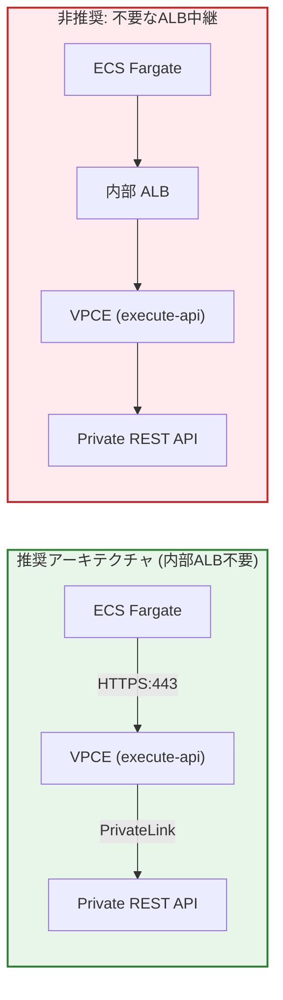

---

### 3.2 リソースポリシー設計（特定VPCEのみ許可・外部完全遮断）

プライベート REST API では、**リソースポリシー** を定義しなければすべての通信が拒否されます。  
以下のセキュリティ要件を満たすリソースポリシーを適用します：
1. **指定された VPC エンドポイント（`vpce-xxxx`）からの通信のみを明示的に許可**。
2. **インターネットや他の VPC、他の AWS アカウントからの通信は自動的に拒否（デフォルト拒否）**。

#### リソースポリシー定義 (`apigw-resource-policy.json`)
```json
{
  "Version": "2012-10-17",
  "Statement": [
    {
      "Effect": "Allow",
      "Principal": "*",
      "Action": "execute-api:Invoke",
      "Resource": "arn:aws:execute-api:ap-northeast-1:123456789012:*/*/*/*"
    },
    {
      "Effect": "Deny",
      "Principal": "*",
      "Action": "execute-api:Invoke",
      "Resource": "arn:aws:execute-api:ap-northeast-1:123456789012:*/*/*/*",
      "Condition": {
        "StringNotEquals": {
          "aws:sourceVpce": "vpce-0123456789abcdef0"
        }
      }
    }
  ]
}
```

> [!CAUTION]
> **リソースポリシー更新後の再デプロイ必須**
> リソースポリシーを追加または変更した後は、対象の **API をステージに再デプロイ** しないと変更が反映されません。

---

### 3.3 プライベート REST API の作成手順

#### プライベート REST API 作成手順 (GUI)
1. AWS マネジメントコンソールで **[API Gateway]** $\rightarrow$ **[API を作成]** をクリック。
2. **REST API**（※REST API プライベート ではなく「REST API」の **[構築]** を選択）。
3. **API の詳細設定**:
   - プロトコルを選択: **REST**
   - 新しい API の作成: **新しい API**
   - API 名: `internal-backend-api`
   - 説明: `Internal Backend API for ECS Fargate Integration`
   - エンドポイントタイプ: **プライベート (PRIVATE)**
   - VPC エンドポイント ID: 作成した VPC エンドポイントの ID (`vpce-0123456789abcdef0`) を入力。
4. **[API を作成]** をクリック。
5. 左メニューの **[リソースポリシー]** をクリック $\rightarrow$ 上記ポリシー JSON を貼り付け $\rightarrow$ **[保存]** をクリック。

#### プライベート REST API 作成手順 (CLI)
```bash
# 1. プライベート REST API の作成
API_ID=$(aws apigateway create-rest-api \
    --name "internal-backend-api" \
    --description "Internal Backend API for ECS Fargate Integration" \
    --endpoint-configuration types=PRIVATE,vpcEndpointIds=vpce-0123456789abcdef0 \
    --query "id" --output text)

echo "Created API ID: ${API_ID}"

# 2. リソースポリシーの適用
aws apigateway update-rest-api \
    --rest-api-id "${API_ID}" \
    --patch-operations op=replace,path=/policy,value='{\"Version\":\"2012-10-17\",\"Statement\":[{\"Effect\":\"Allow\",\"Principal\":\"*\",\"Action\":\"execute-api:Invoke\",\"Resource\":\"arn:aws:execute-api:ap-northeast-1:123456789012:'"${API_ID}"'/*\"},{\"Effect\":\"Deny\",\"Principal\":\"*\",\"Action\":\"execute-api:Invoke\",\"Resource\":\"arn:aws:execute-api:ap-northeast-1:123456789012:'"${API_ID}"'/*\",\"Condition\":{\"StringNotEquals\":{\"aws:sourceVpce\":\"vpce-0123456789abcdef0\"}}}]}'
```

---

### 3.4 リソース・メソッド作成と Lambda 統合設定

#### リソースおよびメソッド作成手順 (CLI)
```bash
# 1. ルートリソース ID の取得
ROOT_ID=$(aws apigateway get-resources \
    --rest-api-id "${API_ID}" \
    --query "items[?path=='/'].id" --output text)

# 2. /process リソースの作成
RESOURCE_ID=$(aws apigateway create-resource \
    --rest-api-id "${API_ID}" \
    --parent-id "${ROOT_ID}" \
    --path-part "process" \
    --query "id" --output text)

# 3. POST メソッドの作成 (IAM 認証または NONE)
aws apigateway put-method \
    --rest-api-id "${API_ID}" \
    --resource-id "${RESOURCE_ID}" \
    --http-method POST \
    --authorization-type NONE

# 4. Lambda Proxy 統合の設定
LAMBDA_ARN="arn:aws:lambda:ap-northeast-1:123456789012:function:backend-orchestrator-fn:prod"

aws apigateway put-integration \
    --rest-api-id "${API_ID}" \
    --resource-id "${RESOURCE_ID}" \
    --http-method POST \
    --type AWS_PROXY \
    --integration-http-method POST \
    --uri "arn:aws:apigateway:ap-northeast-1:lambda:path/2015-03-31/functions/${LAMBDA_ARN}/invocations"

# 5. Lambda 側に API Gateway からの呼び出し許可 (Permission) を付与
aws lambda add-permission \
    --function-name "backend-orchestrator-fn:prod" \
    --statement-id "AllowAPIGatewayInvoke-${API_ID}" \
    --action "lambda:InvokeFunction" \
    --principal "apigateway.amazonaws.com" \
    --source-arn "arn:aws:execute-api:ap-northeast-1:123456789012:${API_ID}/*/*/process"
```

---

### 3.5 ステージの作成・デプロイ・スロットリング設定

```bash
# 1. API のデプロイ (prod ステージ)
aws apigateway create-deployment \
    --rest-api-id "${API_ID}" \
    --stage-name "prod" \
    --stage-description "Production Stage" \
    --description "Initial Deployment"

# 2. スロットリング (レート制限: 1000 RPS, バースト: 2000 RPS) およびログ設定
aws apigateway update-stage \
    --rest-api-id "${API_ID}" \
    --stage-name "prod" \
    --patch-operations \
        op=replace,path=/*/*/throttling/rateLimit,value=1000 \
        op=replace,path=/*/*/throttling/burstLimit,value=2000 \
        op=replace,path=/*/*/logging/loglevel,value=INFO \
        op=replace,path=/*/*/logging/dataTrace,value=true \
        op=replace,path=/tracingEnabled,value=true
```

---

## 4. Lambda 関数の作成・デプロイ

### 4.1 Lambda関数の構成設計（VPC Lambda vs 非VPC Lambdaの判断基準）

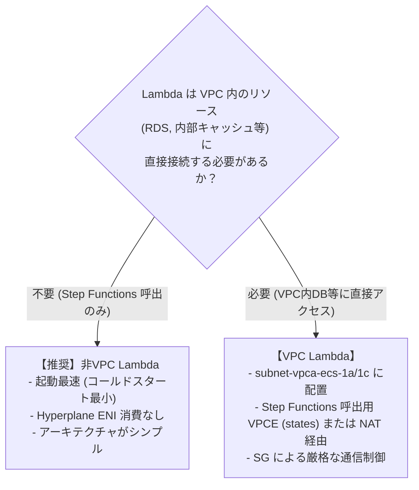

- **本設計の推奨**:
  - 本システムの Lambda は「API Gateway からのリクエストを受け取り、バリデーションを行って **Step Functions を同期実行（`StartSyncExecution`）** して結果を返す」オーケストレーターです。
  - 後続の DynamoDB, S3, Bedrock AgentCore へのアクセスは **Step Functions が直接実行** するため、Lambda 自体は **非VPC Lambda（または標準構成）** として動作させるのが最も軽量・高速・低コストです。
  - ※社内セキュリティ規程等で VPC 内配置が必須の場合は、VPC Lambda として作成し、Step Functions 用の Interface VPC エンドポイント（`com.amazonaws.ap-northeast-1.states`）を VPC 内に配置します。

---

### 4.2 Lambda関数コード実装（Step Functions 同期実行ハンドラー）

#### Python 実装コード (`lambda_function.py`)
```python
import json
import os
import boto3
import logging
from botocore.exceptions import ClientError

# ロギング設定
logger = logging.getLogger()
logger.setLevel(logging.INFO)

# Step Functions クライアント初期化 (X-Ray トレース自動対応)
sfn_client = boto3.client('stepfunctions')
STATE_MACHINE_ARN = os.environ.get('STATE_MACHINE_ARN')

def lambda_handler(event, context):
    logger.info("Received event: %s", json.dumps(event))
    
    # 1. リクエストボディのパース
    try:
        if isinstance(event.get('body'), str):
            body = json.loads(event['body'])
        else:
            body = event.get('body', {})
    except Exception as e:
        logger.error("JSON parse error: %s", str(e))
        return {
            "statusCode": 400,
            "headers": {"Content-Type": "application/json"},
            "body": json.dumps({"error": "Invalid JSON format", "detail": str(e)})
        }

    # 2. バリデーション
    request_id = body.get('requestId') or context.aws_request_id
    action = body.get('action')
    payload = body.get('payload', {})

    if not action:
        return {
            "statusCode": 400,
            "headers": {"Content-Type": "application/json"},
            "body": json.dumps({"error": "Missing required field: action"})
        }

    # 3. Step Functions 入力データ構築
    sfn_input = {
        "requestId": request_id,
        "action": action,
        "payload": payload,
        "callerContext": {
            "sourceIp": event.get('requestContext', {}).get('identity', {}).get('sourceIp'),
            "userAgent": event.get('requestContext', {}).get('identity', {}).get('userAgent')
        }
    }

    # 4. Step Functions Express Workflow の同期実行 (StartSyncExecution)
    try:
        logger.info("Executing Step Functions: %s", STATE_MACHINE_ARN)
        response = sfn_client.start_sync_execution(
            stateMachineArn=STATE_MACHINE_ARN,
            name=f"exec-{request_id}",
            input=json.dumps(sfn_input)
        )

        status = response.get('status')
        logger.info("Step Functions status: %s", status)

        if status == 'SUCCEEDED':
            output = json.loads(response.get('output', '{}'))
            return {
                "statusCode": 200,
                "headers": {
                    "Content-Type": "application/json",
                    "X-Request-Id": request_id
                },
                "body": json.dumps({
                    "status": "SUCCESS",
                    "requestId": request_id,
                    "data": output
                })
            }
        else:
            # 実行失敗 (FAILED / TIMED_OUT 等)
            error_cause = response.get('cause', 'Unknown error')
            logger.error("Step Functions failed: %s, Cause: %s", status, error_cause)
            return {
                "statusCode": 500,
                "headers": {"Content-Type": "application/json"},
                "body": json.dumps({
                    "status": "FAILED",
                    "requestId": request_id,
                    "error": response.get('error', 'ExecutionFailed'),
                    "cause": error_cause
                })
            }

    except ClientError as e:
        logger.error("Boto3 ClientError: %s", str(e))
        return {
            "statusCode": 500,
            "headers": {"Content-Type": "application/json"},
            "body": json.dumps({"error": "Internal Server Error", "detail": e.response['Error']['Message']})
        }
```

---

### 4.3 Lambda関数の作成と設定手順

#### Lambda関数作成手順 (CLI)
```bash
# 1. コードの ZIP パッケージ化
zip function.zip lambda_function.py

# 2. Lambda 関数の作成
aws lambda create-function \
    --function-name backend-orchestrator-fn \
    --runtime python3.12 \
    --role arn:aws:iam::123456789012:role/role-lambda-orchestrator \
    --handler lambda_function.lambda_handler \
    --zip-file fileb://function.zip \
    --timeout 30 \
    --memory-size 512 \
    --architectures arm64 \
    --environment "Variables={STATE_MACHINE_ARN=arn:aws:states:ap-northeast-1:123456789012:stateMachine:BackendProcessingStateMachine}" \
    --tracing-config Mode=Active \
    --tags Key=Environment,Value=Production Key=Project,Value=BackendIntegration
```

---

### 4.4 バージョン・エイリアス管理とデプロイ設定

本番運用では、関数への直接参照ではなく **エイリアス（`prod`）** を使用してデプロイと切り戻しを制御します。

```bash
# 1. 新規バージョンの発行
VERSION=$(aws lambda publish-version \
    --function-name backend-orchestrator-fn \
    --query "Version" --output text)

# 2. prod エイリアスの作成または更新
aws lambda create-alias \
    --function-name backend-orchestrator-fn \
    --name prod \
    --function-version "${VERSION}" \
    --description "Production Alias" || \
aws lambda update-alias \
    --function-name backend-orchestrator-fn \
    --name prod \
    --function-version "${VERSION}"
```

---

## 5. Step Functions ステートマシンの作成・デプロイ

### 5.1 ステートマシン設計（Standard vs Express Workflow の選定）

| 比較項目 | Standard Workflow | Express Workflow (採用) |
| :--- | :--- | :--- |
| **最大実行時間** | 最長 1 年 | 最長 5 分 |
| **実行モデル** | 非同期 (At-least-once) | **同期 (`StartSyncExecution`)** / 非同期 |
| **実行レート** | 2,000 / 秒 | **100,000 / 秒 以上** |
| **レイテンシ** | 数秒〜 | **ミリ秒単位 (超低遅延)** |
| **料金体系** | 状態遷移数課金 ($0.025 / 1,000遷移) | 実行回数・実行時間課金 (超安価) |
| **ユースケース** | 長時間バッチ、人間承認フロー | **API バックエンド、リアルタイムデータ処理** |

---

### 5.2 ASL（Amazon States Language）定義

ステートマシン内で **Amazon Bedrock (AgentCore/推論)**、**Amazon DynamoDB (PutItem)**、**Amazon S3 (PutObject)** を直接実行する ASL 定義です。

#### ステートマシン定義 (`state-machine-definition.json`)
```json
{
  "Comment": "Backend Processing Workflow integrating Bedrock, DynamoDB, and S3",
  "StartAt": "InvokeBedrockAgent",
  "States": {
    "InvokeBedrockAgent": {
      "Type": "Task",
      "Resource": "arn:aws:states:::bedrock:invokeModel",
      "Parameters": {
        "ModelId": "anthropic.claude-3-5-sonnet-20241022-v2:0",
        "ContentType": "application/json",
        "Accept": "application/json",
        "Body": {
          "anthropic_version": "bedrock-2023-05-31",
          "max_tokens": 1000,
          "messages": [
            {
              "role": "user",
              "content": [
                {
                  "type": "text",
                  "text.$": "$.payload.prompt"
                }
              ]
            }
          ]
        }
      },
      "ResultSelector": {
        "aiResponse.$": "$.Body.content[0].text"
      },
      "ResultPath": "$.bedrockResult",
      "Next": "SaveToDynamoDB",
      "Retry": [
        {
          "ErrorEquals": ["Bedrock.ThrottlingException", "Bedrock.ServiceUnavailableException"],
          "IntervalSeconds": 2,
          "MaxAttempts": 3,
          "BackoffRate": 2.0
        }
      ],
      "Catch": [
        {
          "ErrorEquals": ["States.ALL"],
          "ResultPath": "$.errorInfo",
          "Next": "HandleProcessingError"
        }
      ]
    },
    "SaveToDynamoDB": {
      "Type": "Task",
      "Resource": "arn:aws:states:::dynamodb:putItem",
      "Parameters": {
        "TableName": "TransactionHistoryTable",
        "Item": {
          "RequestId": {
            "S.$": "$.requestId"
          },
          "Action": {
            "S.$": "$.action"
          },
          "AiResult": {
            "S.$": "$.bedrockResult.aiResponse"
          },
          "CreatedAt": {
            "S.$": "$$.State.EnteredTime"
          }
        }
      },
      "ResultPath": "$.dynamoResult",
      "Next": "SavePayloadToS3",
      "Catch": [
        {
          "ErrorEquals": ["States.ALL"],
          "ResultPath": "$.errorInfo",
          "Next": "HandleProcessingError"
        }
      ]
    },
    "SavePayloadToS3": {
      "Type": "Task",
      "Resource": "arn:aws:states:::s3:putObject",
      "Parameters": {
        "Bucket": "app-backend-processed-logs-123456789012",
        "Key.$": "States.Format('results/{}/{}.json', $.action, $.requestId)",
        "Body": {
          "input.$": "$.payload",
          "result.$": "$.bedrockResult",
          "timestamp.$": "$$.State.EnteredTime"
        },
        "ContentType": "application/json"
      },
      "ResultPath": "$.s3Result",
      "Next": "FormatSuccessOutput"
    },
    "FormatSuccessOutput": {
      "Type": "Pass",
      "Parameters": {
        "result": "SUCCESS",
        "requestId.$": "$.requestId",
        "response.$": "$.bedrockResult.aiResponse"
      },
      "End": true
    },
    "HandleProcessingError": {
      "Type": "Fail",
      "Error": "WorkflowExecutionError",
      "Cause.$": "$.errorInfo.Cause"
    }
  }
}
```

---

### 5.3 ステートマシンの作成手順

#### ステートマシン作成手順 (GUI)
1. **[Step Functions]** $\rightarrow$ **[ステートマシン]** $\rightarrow$ **[ステートマシンの作成]** をクリック。
2. タイプ: **Express (同期実行対応)** を選択。
3. コードエディタで上記 ASL JSON を貼り付け。
4. ステートマシン名: `BackendProcessingStateMachine`
5. 実行ロール: `role-stepfunctions-backend` を選択。
6. ログ記録: **有効** (ログレベル: `ALL`, CloudWatch Logs ロググループ: `/aws/vendedlogs/states/BackendProcessingStateMachine`)
7. トレース: **X-Ray トレースを有効化** にチェック。
8. **[作成]** をクリック。

#### ステートマシン作成手順 (CLI)
```bash
aws stepfunctions create-state-machine \
    --name "BackendProcessingStateMachine" \
    --type "EXPRESS" \
    --role-arn "arn:aws:iam::123456789012:role/role-stepfunctions-backend" \
    --definition file://state-machine-definition.json \
    --logging-configuration '{
        "level": "ALL",
        "includeExecutionData": true,
        "destinations": [
            {
                "cloudWatchLogsLogGroup": {
                    "logGroupArn": "arn:aws:logs:ap-northeast-1:123456789012:log-group:/aws/vendedlogs/states/BackendProcessingStateMachine:*"
                }
            }
        ]
    }' \
    --tracing-configuration enabled=true \
    --tags Key=Environment,Value=Production
```

---

## 6. IAMロール・ポリシーの設計と作成（最小権限設計）

### 6.1 IAMロール体系と権限マトリクス

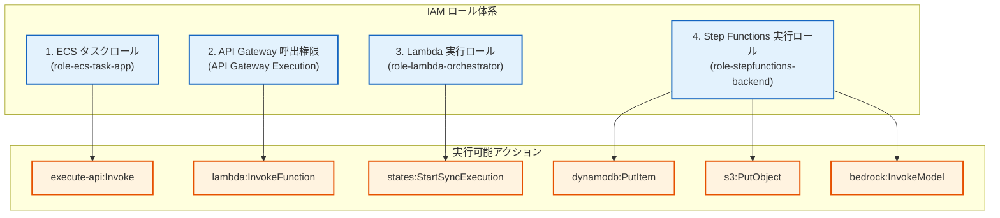

---

### 6.2 ECS タスクロール（API Gateway 呼出権限）

ECS コンテナが API Gateway を呼び出す際に IAM 認証（AWS SigV4）を使用する場合のポリシーです。

#### ポリシー定義 (`ecs-apigw-invoke-policy.json`)
```json
{
  "Version": "2012-10-17",
  "Statement": [
    {
      "Sid": "AllowInvokePrivateAPIGateway",
      "Effect": "Allow",
      "Action": "execute-api:Invoke",
      "Resource": "arn:aws:execute-api:ap-northeast-1:123456789012:*/*/*/*"
    }
  ]
}
```

---

### 6.3 API Gateway 実行ロール（Lambda 呼出権限）

API Gateway が Lambda 関数を実行するためのリソースベースポリシー設定（`aws lambda add-permission` にて適用済み）。

---

### 6.4 Lambda 実行ロール（Step Functions 実行権限）

#### 信頼ポリシー (`lambda-trust-policy.json`)
```json
{
  "Version": "2012-10-17",
  "Statement": [
    {
      "Effect": "Allow",
      "Principal": {
        "Service": "lambda.amazonaws.com"
      },
      "Action": "sts:AssumeRole"
    }
  ]
}
```

#### 権限ポリシー (`lambda-orchestrator-policy.json`)
```json
{
  "Version": "2012-10-17",
  "Statement": [
    {
      "Sid": "AllowStepFunctionsSyncExecution",
      "Effect": "Allow",
      "Action": [
        "states:StartSyncExecution",
        "states:DescribeExecution"
      ],
      "Resource": "arn:aws:states:ap-northeast-1:123456789012:stateMachine:BackendProcessingStateMachine"
    },
    {
      "Sid": "AllowCloudWatchLogsAndXRay",
      "Effect": "Allow",
      "Action": [
        "logs:CreateLogGroup",
        "logs:CreateLogStream",
        "logs:PutLogEvents",
        "xray:PutTraceSegments",
        "xray:PutTelemetryRecords"
      ],
      "Resource": "*"
    }
  ]
}
```

#### ロール作成コマンド (CLI)
```bash
aws iam create-role \
    --role-name role-lambda-orchestrator \
    --assume-role-policy-document file://lambda-trust-policy.json

aws iam put-role-policy \
    --role-name role-lambda-orchestrator \
    --policy-name policy-lambda-orchestrator \
    --policy-document file://lambda-orchestrator-policy.json
```

---

### 6.5 Step Functions 実行ロール（DynamoDB / S3 / Bedrock 権限）

#### 信頼ポリシー (`sfn-trust-policy.json`)
```json
{
  "Version": "2012-10-17",
  "Statement": [
    {
      "Effect": "Allow",
      "Principal": {
        "Service": "states.amazonaws.com"
      },
      "Action": "sts:AssumeRole"
    }
  ]
}
```

#### 権限ポリシー (`sfn-backend-policy.json`)
```json
{
  "Version": "2012-10-17",
  "Statement": [
    {
      "Sid": "AllowBedrockInvoke",
      "Effect": "Allow",
      "Action": [
        "bedrock:InvokeModel"
      ],
      "Resource": "arn:aws:bedrock:ap-northeast-1::foundation-model/anthropic.claude-3-5-sonnet-20241022-v2:0"
    },
    {
      "Sid": "AllowDynamoDBPut",
      "Effect": "Allow",
      "Action": [
        "dynamodb:PutItem"
      ],
      "Resource": "arn:aws:dynamodb:ap-northeast-1:123456789012:table/TransactionHistoryTable"
    },
    {
      "Sid": "AllowS3Put",
      "Effect": "Allow",
      "Action": [
        "s3:PutObject"
      ],
      "Resource": "arn:aws:s3:::app-backend-processed-logs-123456789012/*"
    },
    {
      "Sid": "AllowCloudWatchLogsAndXRay",
      "Effect": "Allow",
      "Action": [
        "logs:CreateLogDelivery",
        "logs:GetLogDelivery",
        "logs:UpdateLogDelivery",
        "logs:DeleteLogDelivery",
        "logs:ListLogDeliveries",
        "logs:PutResourcePolicy",
        "logs:DescribeResourcePolicies",
        "logs:DescribeLogGroups",
        "xray:PutTraceSegments",
        "xray:PutTelemetryRecords",
        "xray:GetSamplingRules",
        "xray:GetSamplingTargets"
      ],
      "Resource": "*"
    }
  ]
}
```

#### ロール作成コマンド (CLI)
```bash
aws iam create-role \
    --role-name role-stepfunctions-backend \
    --assume-role-policy-document file://sfn-trust-policy.json

aws iam put-role-policy \
    --role-name role-stepfunctions-backend \
    --policy-name policy-stepfunctions-backend \
    --policy-document file://sfn-backend-policy.json
```

---

## 7. セキュリティグループの設計と設定

### 7.1 セキュリティグループ設計マトリクス（最小権限）

| セキュリティグループ名 | 主な用途 | インバウンドルール | アウトバウンドルール |
| :--- | :--- | :--- | :--- |
| **`sg-ecs-task`** | ECS Fargate タスク用 | ALB からの HTTP 通信 (`8080`) | **`sg-vpce-apigw` 向け TCP 443 許可**<br>他 AWS サービス VPCE 向け TCP 443 許可 |
| **`sg-vpce-apigw`** | API Gateway VPCE 用 | **`sg-ecs-task` からの TCP 443 許可** | なし（または不要） |

---

### 7.2 各セキュリティグループの作成とルール設定

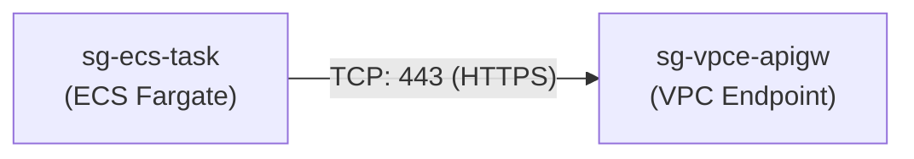

#### セキュリティグループ設定 (CLI)
```bash
# 1. API Gateway VPC エンドポイント用 SG の作成
SG_VPCE_ID=$(aws ec2 create-security-group \
    --group-name sg-vpce-apigw \
    --description "Security Group for API Gateway VPC Endpoint" \
    --vpc-id vpc-0123456789abcdef0 \
    --query "GroupId" --output text)

# 2. ECS タスク SG (sg-ecs-task) からの HTTPS (443) インバウンドを許可
aws ec2 authorize-security-group-ingress \
    --group-id "${SG_VPCE_ID}" \
    --protocol tcp \
    --port 443 \
    --source-group sg-0111222233334444e \
    --tag-specifications "ResourceType=security-group-rule,Tags=[{Key=Name,Value=Allow-ECS-to-APIGW-VPCE}]"
```

---

## 8. メンテナンス・バックアップ・構成管理（IaC）設計

### 8.1 サーバーレス構成におけるバックアップの考え方（ステートレスとコード管理）

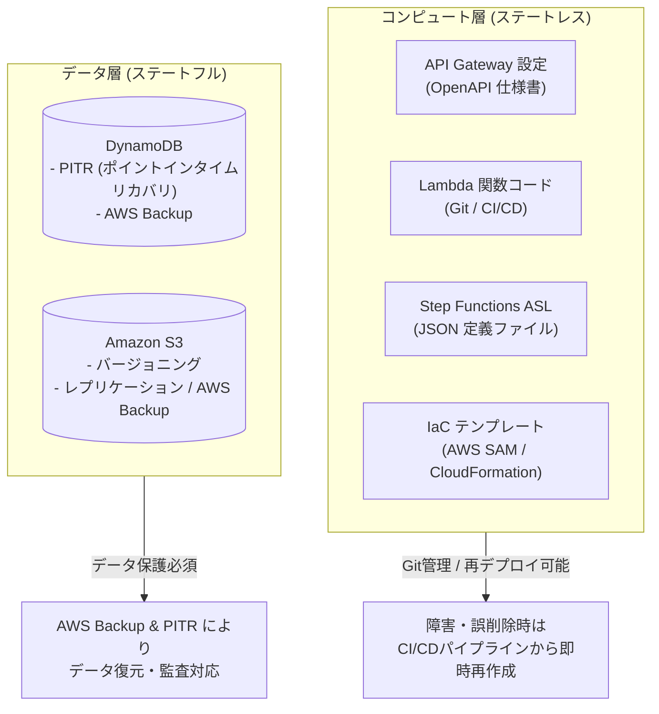

> [!NOTE]
> **「何かあったら再度デプロイすれば良いか？」に対するベストプラクティス**
> API Gateway、Lambda、Step Functions は完全にステートレスなリソースです。バックアップの本質は「**設定・定義・コードをすべて IaC (AWS SAM / CloudFormation / OpenAPI) として Git リポジトリでバージョン管理すること**」です。障害や誤削除が発生した場合は、Git からの自動デプロイで数分で同一構成を復元できます。  
> 一方、永続データを持つ DynamoDB と S3 は、**AWS Backup** と **PITR** で厳重にバックアップを運用します。

---

### 8.2 OpenAPI (Swagger) 定義のエクスポートと構成管理

API Gateway の定義を OpenAPI 3.0 仕様としてエクスポートし、Git リポジトリに構成保存します。

```bash
# API Gateway 定義のエクスポート (OpenAPI 3.0 + API Gateway 拡張)
aws apigateway get-export \
    --rest-api-id "${API_ID}" \
    --stage-name "prod" \
    --export-type oas30 \
    --parameters extensions='apigateway' \
    api-definition-prod.json
```

---

### 8.3 Lambda / Step Functions のリビジョン管理と CI/CD

1. **Lambda**:
   - ソースコードおよび依存ライブラリを Git で管理。
   - デプロイごとにバージョンを発行（例: `v1`, `v2`）し、動作確認後にエイリアス（`prod`）の参照バージョンを切り替えることで、瞬時のロールバックを可能にします。
2. **Step Functions**:
   - ASL 定義ファイルを JSON/YAML として Git 管理。
   - ステートマシンの更新は `aws stepfunctions update-state-machine` または SAM/CloudFormation 経由で適用。

---

### 8.4 永続データ層（DynamoDB / S3）の AWS Backup 連携

DynamoDB テーブルの PITR (Point-in-Time Recovery) を有効化し、AWS Backup で日次バックアップを取得します。

```bash
# DynamoDB PITR (ポイントインタイムリカバリ) の有効化
aws dynamodb update-continuous-backups \
    --table-name TransactionHistoryTable \
    --point-in-time-recovery-specification PointInTimeRecoveryEnabled=true
```

---

## 9. 削除保護・誤操作防止設計

### 9.1 サーバーレスリソースの誤削除防止ガードレール（IAM / SCP）

本番環境の API Gateway, Lambda, Step Functions が誤って削除されることを防ぐため、IAM ポリシーおよび SCP（サービスコントロールポリシー）で `Delete` アクションを制限します。

#### 削除拒否 SCP 例 (`scp-serverless-delete-protection.json`)
```json
{
  "Version": "2012-10-17",
  "Statement": [
    {
      "Sid": "DenyServerlessDeletionInProd",
      "Effect": "Deny",
      "Action": [
        "apigateway:DELETE",
        "lambda:DeleteFunction",
        "lambda:DeleteAlias",
        "states:DeleteStateMachine"
      ],
      "Resource": "*",
      "Condition": {
        "StringNotEquals": {
          "aws:PrincipalArn": "arn:aws:iam::123456789012:role/admin-breakglass-role"
        }
      }
    }
  ]
}
```

---

### 9.2 CloudFormation / SAM スタック終了保護と DeletionPolicy 設計

IaC (CloudFormation/SAM) テンプレートにおいて、スタックの終了保護（Termination Protection）を有効化し、各リソースに `DeletionPolicy: Retain` を設定します。

```yaml
# SAM / CloudFormation 例
Resources:
  TransactionTable:
    Type: AWS::DynamoDB::Table
    DeletionPolicy: Retain
    Properties:
      TableName: TransactionHistoryTable
      ...
```

---

## 10. アクティビティログ・監査ログ（CloudTrail）

### 10.1 CloudTrail による管理イベント記録

すべての API Gateway, Lambda, Step Functions に対する管理操作（作成・変更・削除）は、**AWS CloudTrail** により自動的に記録されます。

```bash
# CloudTrail のログ配信状態確認
aws cloudtrail get-trail-status --name arn:aws:cloudtrail:ap-northeast-1:123456789012:trail/management-events-trail
```

---

### 10.2 Lambda データイベントの記録設定

Lambda 関数の実行履歴（`Invoke` 呼び出し）を監査対象とする場合、CloudTrail でデータイベントを有効化します。

```bash
aws cloudtrail put-event-selectors \
    --trail-name management-events-trail \
    --event-selectors '[
      {
        "ReadWriteType": "All",
        "IncludeManagementEvents": true,
        "DataResources": [
          {
            "Type": "AWS::Lambda::Function",
            "Values": ["arn:aws:lambda:ap-northeast-1:123456789012:function:backend-orchestrator-fn"]
          }
        ]
      }
    ]'
```

---

### 10.3 ログの S3 長期保存・改ざん防止（S3 Object Lock）

監査証跡ログを保管する S3 バケットには、**S3 Object Lock（Write Once, Read Many: WORM）** および **KMS CMK 暗号化** を適用し、ログの改ざんや削除を防止します。

---

## 11. アプリケーションログ・分散トレーシング（CloudWatch / X-Ray）

### 11.1 API Gateway 実行ログ & アクセスログ（JSON形式）設定

#### 推奨アクセスログ形式 (JSON)
```json
{
  "requestId": "$context.requestId",
  "ip": "$context.identity.sourceIp",
  "caller": "$context.identity.caller",
  "user": "$context.identity.user",
  "requestTime": "$context.requestTime",
  "httpMethod": "$context.httpMethod",
  "resourcePath": "$context.resourcePath",
  "status": "$context.status",
  "protocol": "$context.protocol",
  "responseLength": "$context.responseLength",
  "responseLatency": "$context.responseLatency",
  "integrationLatency": "$context.integrationLatency",
  "integrationStatus": "$context.integrationStatus",
  "errorMessage": "$context.error.message",
  "principalId": "$context.authorizer.principalId"
}
```

#### アクセスログ設定 (CLI)
```bash
# 1. CloudWatch ロググループの作成
aws logs create-log-group \
    --log-group-name "/aws/apigateway/internal-backend-api/access-logs"

# 2. ロググループの保持期間を 90 日に設定
aws logs put-retention-policy \
    --log-group-name "/aws/apigateway/internal-backend-api/access-logs" \
    --retention-in-days 90

# 3. API Gateway ステージにアクセスログを設定
LOG_GROUP_ARN="arn:aws:logs:ap-northeast-1:123456789012:log-group:/aws/apigateway/internal-backend-api/access-logs"
LOG_FORMAT='{"requestId":"$context.requestId","ip":"$context.identity.sourceIp","requestTime":"$context.requestTime","httpMethod":"$context.httpMethod","resourcePath":"$context.resourcePath","status":"$context.status","responseLatency":"$context.responseLatency","integrationLatency":"$context.integrationLatency"}'

aws apigateway update-stage \
    --rest-api-id "${API_ID}" \
    --stage-name "prod" \
    --patch-operations \
        op=replace,path=/accessLogSettings/destinationArn,value="${LOG_GROUP_ARN}" \
        op=replace,path=/accessLogSettings/format,value="${LOG_FORMAT}"
```

---

### 11.2 Lambda 構造化ログ（JSON）とログ保持期間設定

```bash
# ログ保持期間を 90 日に設定
aws logs put-retention-policy \
    --log-group-name "/aws/lambda/backend-orchestrator-fn" \
    --retention-in-days 90
```

---

### 11.3 Step Functions 実行ログの CloudWatch 出力設定

```bash
# Step Functions 用ロググループの作成と保持期間設定
aws logs create-log-group \
    --log-group-name "/aws/vendedlogs/states/BackendProcessingStateMachine"

aws logs put-retention-policy \
    --log-group-name "/aws/vendedlogs/states/BackendProcessingStateMachine" \
    --retention-in-days 90
```

---

### 11.4 AWS X-Ray によるエンドツーエンド分散トレーシング

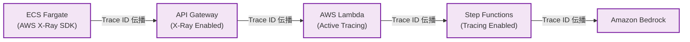

API Gateway、Lambda、Step Functions のすべてで **X-Ray Active Tracing** を有効化することにより、1 つのリクエストが各サービスを通過する際のレイテンシやエラー発生箇所を単一のトレースマップで可視化できます。

---

## 12. 障害監視・パフォーマンス監視・アラート通知

### 12.1 監視設計マトリクス（重要メトリクスと推奨しきい値）

| 監視対象 | メトリクス名 | 推奨しきい値 | アラート重要度 | 説明 |
| :--- | :--- | :--- | :--- | :--- |
| **API Gateway** | `5XXError` | $\ge 1$ 回 (5分間) | **CRITICAL** | API Gateway 内部エラー / Lambda タイムアウト |
| **API Gateway** | `4XXError` | $\ge 10$ 回 (5分間) | **WARNING** | クライアント側リクエスト不正 / 認証エラー |
| **API Gateway** | `Latency` | $\ge 5000$ ms (5分間平均) | **WARNING** | バックエンド処理遅延 |
| **Lambda** | `Errors` | $\ge 1$ 回 (5分間) | **CRITICAL** | ハンドラー例外・クラッシュ |
| **Lambda** | `Throttles` | $\ge 1$ 回 (5分間) | **CRITICAL** | 同時実行数上限到達によるスロットリング |
| **Step Functions** | `ExecutionsFailed` | $\ge 1$ 回 (5分間) | **CRITICAL** | ステートマシン実行異常終了 |
| **Step Functions** | `ExecutionsTimedOut` | $\ge 1$ 回 (5分間) | **CRITICAL** | 実行タイムアウト |

---

### 12.2 CloudWatch アラームの作成手順

```bash
# 1. API Gateway 5XX エラーアラームの作成
aws cloudwatch put-metric-alarm \
    --alarm-name "APIGW-5XXErrors-High-Production" \
    --alarm-description "Alarm when API Gateway returns 5XX errors" \
    --metric-name "5XXError" \
    --namespace "AWS/ApiGateway" \
    --statistic "Sum" \
    --period 300 \
    --threshold 1 \
    --comparison-operator "GreaterThanOrEqualToThreshold" \
    --evaluation-periods 1 \
    --dimensions Name=ApiName,Value=internal-backend-api Name=Stage,Value=prod \
    --alarm-actions "arn:aws:sns:ap-northeast-1:123456789012:topic-system-alerts"

# 2. Step Functions 実行失敗アラームの作成
aws cloudwatch put-metric-alarm \
    --alarm-name "SFN-ExecutionsFailed-High-Production" \
    --alarm-description "Alarm when Step Functions Express workflow execution fails" \
    --metric-name "ExecutionsFailed" \
    --namespace "AWS/States" \
    --statistic "Sum" \
    --period 300 \
    --threshold 1 \
    --comparison-operator "GreaterThanOrEqualToThreshold" \
    --evaluation-periods 1 \
    --dimensions Name=StateMachineArn,Value=arn:aws:states:ap-northeast-1:123456789012:stateMachine:BackendProcessingStateMachine \
    --alarm-actions "arn:aws:sns:ap-northeast-1:123456789012:topic-system-alerts"
```

---

### 12.3 EventBridge + SNS による異常終了リアルタイムメール通知

Step Functions の実行失敗イベントを Amazon EventBridge でリアルタイムにキャッチし、Amazon SNS 経由で運用担当者へメール通知します。

#### EventBridge ルール作成 (CLI)
```bash
# 1. EventBridge ルールの作成
aws events put-rule \
    --name "rule-sfn-execution-failure" \
    --event-pattern '{
      "source": ["aws.states"],
      "detail-type": ["Step Functions Execution Status Change"],
      "detail": {
        "status": ["FAILED", "TIMED_OUT"],
        "stateMachineArn": ["arn:aws:states:ap-northeast-1:123456789012:stateMachine:BackendProcessingStateMachine"]
      }
    }' \
    --description "Notify on Step Functions failure"

# 2. SNS トピックをターゲットとして登録
aws events put-targets \
    --rule "rule-sfn-execution-failure" \
    --targets '[
      {
        "Id": "1",
        "Arn": "arn:aws:sns:ap-northeast-1:123456789012:topic-system-alerts"
      }
    ]'
```

---

## 13. エンドツーエンド動作確認・疎通テスト手順

### 13.1 ECS Fargate（ECS Exec）からの API 呼び出しテスト

ECS Fargate タスク内部に入り、VPC エンドポイント経由でプライベート API Gateway を呼び出します。

```bash
# 1. ECS タスク内に対話型ログイン (ECS Exec)
aws ecs execute-command \
    --cluster app-production-cluster \
    --task $(aws ecs list-tasks --cluster app-production-cluster --query "taskArns[0]" --output text) \
    --container app-container \
    --interactive \
    --command "/bin/sh"

# 2. コンテナ内での名前解決確認 (エンドポイント固定IP 10.100.50.76 または 10.100.50.106 が返ることを確認)
nslookup ${API_ID}.execute-api.ap-northeast-1.amazonaws.com

# 3. プライベート API の呼び出しテスト (POST リクエスト)
curl -X POST "https://${API_ID}.execute-api.ap-northeast-1.amazonaws.com/prod/process" \
     -H "Content-Type: application/json" \
     -d '{
       "requestId": "test-req-001",
       "action": "ANALYZE_PROMPT",
       "payload": {
         "prompt": "AWSにおけるAPI GatewayとLambdaの連携ベストプラクティスを3点要約してください。"
       }
     }'
```

#### 期待されるレスポンス
```json
{
  "status": "SUCCESS",
  "requestId": "test-req-001",
  "data": {
    "result": "SUCCESS",
    "requestId": "test-req-001",
    "response": "1. リソースポリシーによるVPCエンドポイント制限とIAM最小権限の徹底...\n2. 同期処理にはExpress Workflowを活用し低遅延化...\n3. CloudWatch LogsとX-Rayによるエンドツーエンド可観測性の確保..."
  }
}
```

---

### 13.2 処理結果の確認（DynamoDB, S3, Bedrock, Step Functions）

```bash
# 1. DynamoDB へのレコード登録確認
aws dynamodb get-item \
    --table-name TransactionHistoryTable \
    --key '{"RequestId": {"S": "test-req-001"}}'

# 2. S3 へのオブジェクト保存確認
aws s3 ls s3://app-backend-processed-logs-123456789012/results/ANALYZE_PROMPT/
```

---

### 13.3 CloudWatch Logs / X-Ray トレースの検証

```bash
# Lambda の最新ログストリーム確認
aws logs tail "/aws/lambda/backend-orchestrator-fn" --since 5m --format short
```

---

## 14. トラブルシューティングガイド

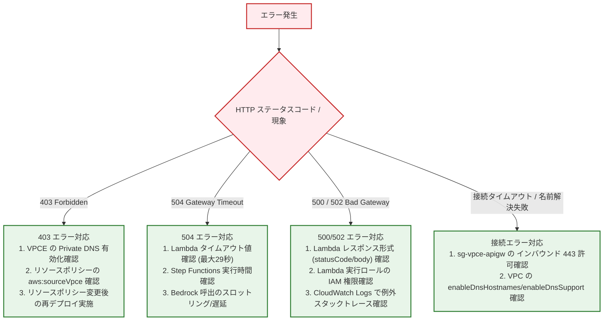

### 14.1 API Gateway 403 Forbidden
- **原因 1**: API Gateway のリソースポリシーで指定している VPC エンドポイント ID（`aws:sourceVpce`）と実際のエンドポイント ID が一致していない。
- **原因 2**: リソースポリシーを変更した後に API の「デプロイ」を実行していない。
- **原因 3**: VPC エンドポイントの「プライベート DNS」が無効になっており、パブリック IP にリクエストが送信されている。

### 14.2 API Gateway 500 / 502 / 504 エラー
- **原因 1 (502 Bad Gateway)**: Lambda 関数が API Gateway プロキシ統合で要求される JSON 形式（`statusCode`, `headers`, `body`）を返していない。
- **原因 2 (504 Gateway Timeout)**: Lambda 関数の実行時間または Step Functions の同期実行時間が API Gateway の統合タイムアウト上限（29 秒）を超過した。

### 14.3 Step Functions 実行失敗
- **原因**: Step Functions 実行ロールに DynamoDB、S3、Bedrock へのアクセス権限が不足している（`AccessDeniedException`）。CloudWatch Logs でステートごとの詳細エラーを確認し、IAM ポリシーを調整します。

### 14.4 VPCエンドポイント接続タイムアウト
- **原因**: エンドポイント用セキュリティグループ（`sg-vpce-apigw`）で、ECS タスクセキュリティグループ（`sg-ecs-task`）からのポート 443 が許可されていない。
