# 🚀 AWS：CloudFront・AWS WAF 構築・運用設計ガイド

本ドキュメントは、AWS 上で **Amazon CloudFront** と **AWS WAF (v2)** を活用し、`AWS：ECS.md` に記載の「VPC-A 内の内部 ALB + Amazon ECS on AWS Fargate」とセキュアに連携するエンタープライズグレードの CDN / エッジセキュリティ基盤を構築・運用するための総合設計・構築ガイドです。

お名前.com 取得済みドメインの Route 53 委譲および Route 53 新規取得、ACM（バージニア北部 us-east-1）による SSL/TLS サーバ証明書の自動発行・自動更新、内部 ALB へのセキュア接続（最新の **CloudFront VPC Origins** および **カスタムヘッダー検証**）、AWS WAF マネージドルール・レート制御による多層防御、Athena ログ分析と S3 ライフサイクルによるコスト最適化、障害・セキュリティ監視を網羅し、すべての構築・運用手順を **AWS マネジメントコンソール（GUI）** と **AWS CLI (v2)** の双方で解説します。

---

## 📑 目次

- [1. はじめに（全体アーキテクチャと基本設計）](#1-はじめに全体アーキテクチャと基本設計)
  - [1.1 Amazon CloudFront と AWS WAF の基本概念](#11-amazon-cloudfront-と-aws-waf-の基本概念)
  - [1.2 全体アーキテクチャ概要図](#12-全体アーキテクチャ概要図)
  - [1.3 ネットワーク通信フロー詳細](#13-ネットワーク通信フロー詳細)
  - [1.4 前提条件と設計パラメータ一覧](#14-前提条件と設計パラメータ一覧)
- [2. ドメイン・サーバ証明書（Route 53 & ACM）](#2-ドメインサーバ証明書route-53--acm)
  - [2.1 ドメイン管理方針（お名前.com 移譲 vs Route 53 新規取得）](#21-ドメイン管理方針お名前com-移譲-vs-route-53-新規取得)
  - [2.2 お名前.com 取得済みドメインを Route 53 で利用する手順（GUI / CLI）](#22-お名前com-取得済みドメインを-route-53-で利用する手順gui--cli)
  - [2.3 Route 53 で新規ドメインを取得する手順（GUI / CLI）](#23-route-53-で新規ドメインを取得する手順gui--cli)
  - [2.4 ACM パブリック証明書の発行（us-east-1 必須の理由）（GUI / CLI）](#24-acm-パブリック証明書の発行us-east-1-必須の理由gui--cli)
  - [2.5 DNS 自動検証と証明書の自動更新メカニズム（GUI / CLI）](#25-dns-自動検証と証明書の自動更新メカニズムgui--cli)
- [3. CloudFront ディストリビューションの作成と設定](#3-cloudfront-ディストリビューションの作成と設定)
  - [3.1 ディストリビューションの基本設計](#31-ディストリビューションの基本設計)
  - [3.2 内部 ALB へのセキュア接続設計（VPC Origins vs カスタムヘッダー検証）](#32-内部-alb-へのセキュア接続設計vpc-origins-vs-カスタムヘッダー検証)
  - [3.3 キャッシュビヘイビア・キャッシュポリシー設計](#33-キャッシュビヘイビアキャッシュポリシー設計)
  - [3.4 セキュリティレスポンスヘッダーポリシーの設計（HSTS / CSP 等）](#34-セキュリティレスポンスヘッダーポリシーの設計hsts--csp-等)
  - [3.5 CloudFront ディストリビューションの作成手順（GUI / CLI）](#35-cloudfront-ディストリビューションの作成手順gui--cli)
  - [3.6 Route 53 で CloudFront への Alias レコード登録（GUI / CLI）](#36-route-53-で-cloudfront-への-alias-レコード登録gui--cli)
- [4. AWS WAF (v2) の設定とベストプラクティス](#4-aws-waf-v2-の設定とベストプラクティス)
  - [4.1 AWS WAF (v2) の基本概念とスコープ](#41-aws-waf-v2-の基本概念とスコープ)
  - [4.2 多層防御（レイヤードセキュリティ）ルール設計マトリクス](#42-多層防御レイヤードセキュリティルール設計マトリクス)
  - [4.3 カウントモード（Count）による事前検証とチューニング運用](#43-カウントモードcountによる事前検証とチューニング運用)
  - [4.4 Web ACL の作成と CloudFront へのアタッチ手順（GUI / CLI）](#44-web-acl-の作成と-cloudfront-へのアタッチ手順gui--cli)
- [5. IAM ロール・ポリシーの設計と作成](#5-iam-ロールポリシーの設計と作成)
  - [5.1 最小権限原則に基づく IAM 設計](#51-最小権限原則に基づく-iam-設計)
  - [5.2 インフラ管理者用 IAM ポリシー（GUI / CLI）](#52-インフラ管理者用-iam-ポリシーgui--cli)
  - [5.3 アプリケーション運用・デプロイ用 IAM ポリシー（キャッシュ無効化・IP更新）（GUI / CLI）](#53-アプリケーション運用デプロイ用-iam-ポリシーキャッシュ無効化ip更新gui--cli)
  - [5.4 WAF ログ配信・CloudFront サービスリンクロール](#54-waf-ログ配信cloudfront-サービスリンクロール)
- [6. セキュリティグループとオリジン保護設計](#6-セキュリティグループとオリジン保護設計)
  - [6.1 オリジン二重防御のアーキテクチャ](#61-オリジン二重防御のアーキテクチャ)
  - [6.2 AWS マネージドプレフィックスリストによるインバウンド制限（GUI / CLI）](#62-aws-マネージドプレフィックスリストによるインバウンド制限gui--cli)
  - [6.3 VPC Origin 用セキュリティグループの設定（GUI / CLI）](#63-vpc-origin-用セキュリティグループの設定gui--cli)
  - [6.4 内部 ALB でのカスタムヘッダー検証ルール（GUI / CLI）](#64-内部-alb-でのカスタムヘッダー検証ルールgui--cli)
- [7. メンテナンス・キャッシュ管理・バックアップ](#7-メンテナンスキャッシュ管理バックアップ)
  - [7.1 CDN / WAF におけるステートレス設計と IaC 構成管理](#71-cdn--waf-におけるステートレス設計と-iac-構成管理)
  - [7.2 キャッシュ無効化（Invalidation）の実行手順（GUI / CLI）](#72-キャッシュ無効化invalidationの実行手順gui--cli)
  - [7.3 WAF カスタムレスポンスによる即時 503 メンテナンス画面切替（GUI / CLI）](#73-waf-カスタムレスポンスによる即時-503-メンテナンス画面切替gui--cli)
  - [7.4 S3 オリジンへの自動フェイルオーバー（Origin Groups 設計）](#74-s3-オリジンへの自動フェイルオーバーorigin-groups-設計)
- [8. 削除保護・誤操作防止設計](#8-削除保護誤操作防止設計)
  - [8.1 CloudFront ディストリビューションの削除保護と無効化ガードレール](#81-cloudfront-ディストリビューションの削除保護と無効化ガードレール)
  - [8.2 AWS WAF Web ACL の誤削除防止](#82-aws-waf-web-acl-の誤削除防止)
  - [8.3 ACM 証明書の保護メカニズム](#83-acm-証明書の保護メカニズム)
  - [8.4 AWS Organizations SCP（Service Control Policy）によるガードレール](#84-aws-organizations-scpservice-control-policyによるガードレール)
- [9. アクティビティログ・監査ログ（CloudTrail）](#9-アクティビティログ監査ログcloudtrail)
  - [9.1 CloudTrail によるグローバル管理イベントの記録（us-east-1）](#91-cloudtrail-によるグローバル管理イベントの記録us-east-1)
  - [9.2 監査ログの S3 保存・改ざん防止（Object Lock）・CloudWatch 連携（GUI / CLI）](#92-監査ログの-s3-保存改ざん防止object-lockcloudwatch-連携gui--cli)
- [10. アクセスログの保存・分析・コスト最適化](#10-アクセスログの保存分析コスト最適化)
  - [10.1 CloudFront 標準アクセスログの保存設定（GUI / CLI）](#101-cloudfront-標準アクセスログの保存設定gui--cli)
  - [10.2 AWS WAF ログの S3 直接配信設定（GUI / CLI）](#102-aws-waf-ログの-s3-直接配信設定gui--cli)
  - [10.3 S3 ライフサイクルポリシーによるコスト最適化（GUI / CLI）](#103-s3-ライフサイクルポリシーによるコスト最適化gui--cli)
  - [10.4 Amazon Athena によるログ分析クエリ集（DDL・SQL）](#104-amazon-athena-によるログ分析クエリ集ddlsql)
- [11. 障害監視・セキュリティ監視・アラート通知](#11-障害監視セキュリティ監視アラート通知)
  - [11.1 CloudWatch メトリクス監視設計（CloudFront & WAF）](#111-cloudwatch-メトリクス監視設計cloudfront--waf)
  - [11.2 CloudWatch アラームと SNS メール通知の設定（GUI / CLI）](#112-cloudwatch-アラームと-sns-メール通知の設定gui--cli)
  - [11.3 EventBridge による ACM 証明書更新監視・異常検知（GUI / CLI）](#113-eventbridge-による-acm-証明書更新監視異常検知gui--cli)
  - [11.4 WAF 攻撃検知アラートの設定（GUI / CLI）](#114-waf-攻撃検知アラートの設定gui--cli)
- [12. トラブルシューティングガイド](#12-トラブルシューティングガイド)
  - [12.1 502 Bad Gateway エラー（SSL ハンドシェイク失敗・オリジン接続不可）](#121-502-bad-gateway-エラーssl-ハンドシェイク失敗オリジン接続不可)
  - [12.2 504 Gateway Timeout エラー（オリジン応答遅延）](#122-504-gateway-timeout-エラーオリジン応答遅延)
  - [12.3 403 Forbidden エラー（WAF ブロック・カスタムヘッダー不一致・Geo 制限）](#123-403-forbidden-エラーwaf-ブロックカスタムヘッダー不一致geo-制限)
  - [12.4 ACM DNS 検証が完了しない / 証明書が自動更新されない](#124-acm-dns-検証が完了しない--証明書が自動更新されない)
  - [12.5 キャッシュが無効化されない・更新内容が即座に反映されない](#125-キャッシュが無効化されない更新内容が即座に反映されない)

---

## 1. はじめに（全体アーキテクチャと基本設計）

### 1.1 Amazon CloudFront と AWS WAF の基本概念

- **Amazon CloudFront**:
  - 世界中のエッジロケーション（PoP: Point of Presence）を利用し、静的・動的ウェブコンテンツを低レイテンシー・高速・安全に配信するグローバル CDN (Content Delivery Network) サービスです。
  - SSL/TLS 終端、HTTP/2 および HTTP/3 対応、自動圧縮（Gzip / Brotli）、オリジンフェイルオーバー、DDoS 緩和（AWS Shield Standard 標準組み込み）を提供します。
- **AWS WAF (v2)**:
  - CloudFront のエッジロケーションで Web トラフィックを検査し、SQL インジェクション、クロスサイトスクリプティング（XSS）、レート超過リクエスト（DoS）、悪意あるボットなどの攻撃をオリジンサーバー到達前に遮断する Web アプリケーションファイアウォールです。

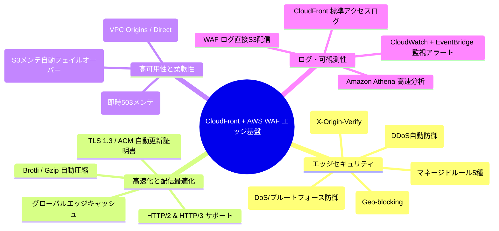

---

### 1.2 全体アーキテクチャ概要図

本システムは、インターネットからのリクエストを **AWS エッジレイヤー (CloudFront + AWS WAF)** で受け、**VPC-A (`10.100.50.0/24`)** 内の **内部 ALB (`alb-internal-vpca`)** および **ECS Fargate (`subnet-vpca-ecs-1a/1c`)** へセキュアに中継します。

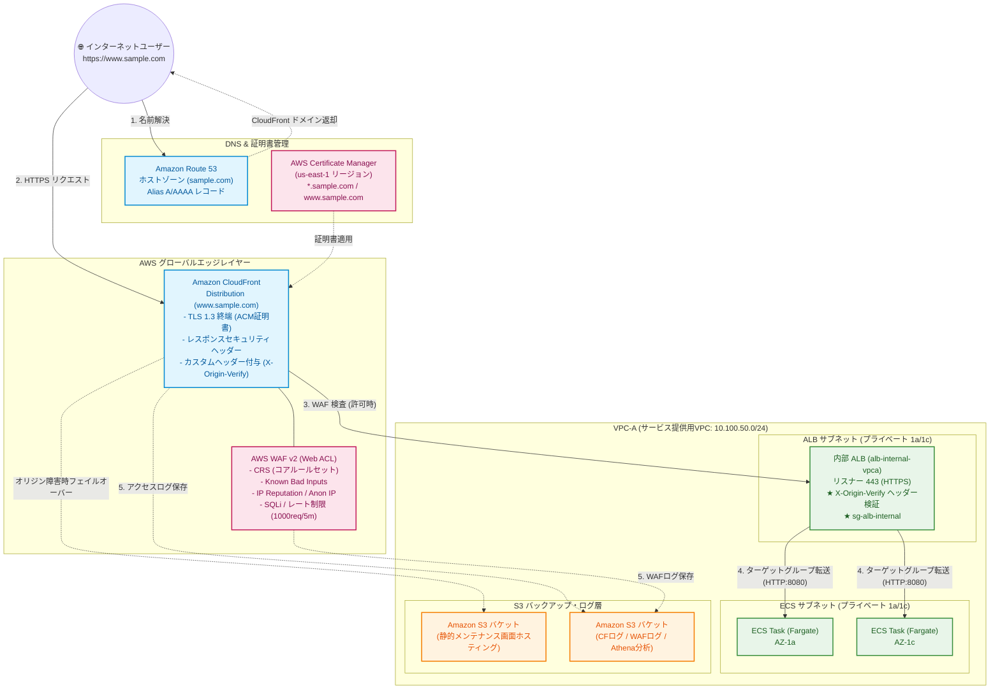

---

### 1.3 ネットワーク通信フロー詳細

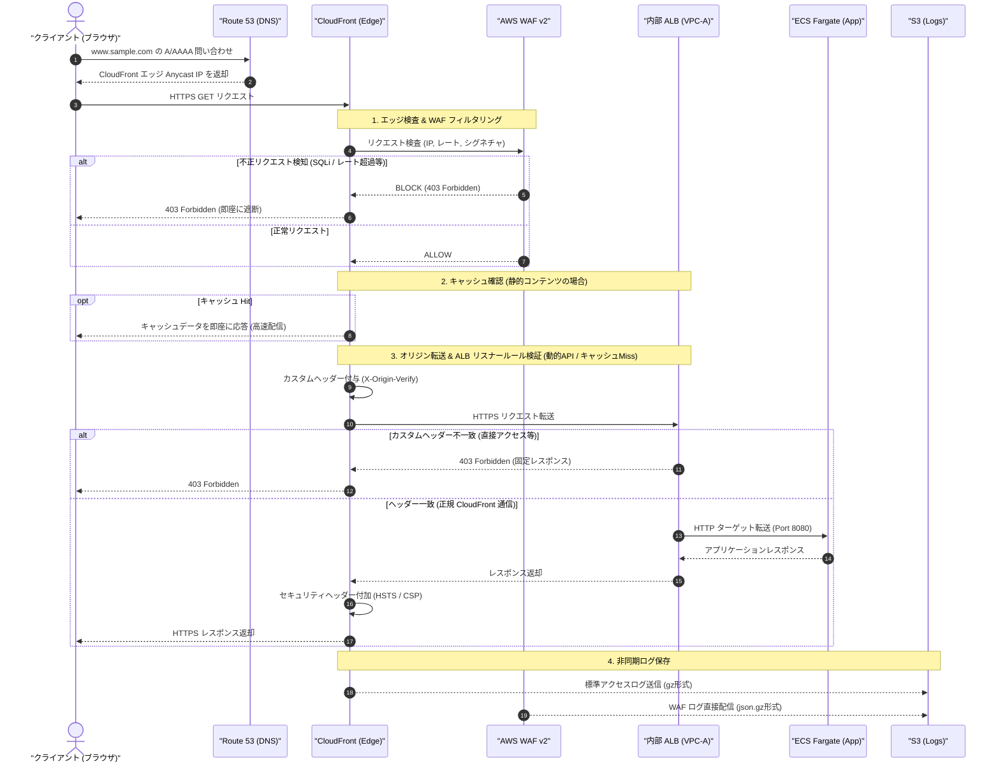

---

### 1.4 前提条件と設計パラメータ一覧

| 項目 | 設定値 / 前提条件 | 備考 |
| :--- | :--- | :--- |
| **対象ドメイン** | `sample.com` (Apex) / `www.sample.com` (FQDN) | 本ガイドの構築対象ドメイン |
| **DNS サービス** | Amazon Route 53 (パブリックホストゾーン) | お名前.com 委譲 または Route 53 新規取得 |
| **SSL/TLS 証明書** | AWS Certificate Manager (ACM) | **必ず `us-east-1` (バージニア北部)** で作成（CloudFront 要件） |
| **エッジ CDN** | Amazon CloudFront (Price Class: PriceClass_200 / All) | HTTP/2, HTTP/3, TLS 1.3 有効化 |
| **エッジ WAF** | AWS WAF v2 (Scope: `CLOUDFRONT`, リージョン: `us-east-1`) | マネージドルール 5 種 + レート制限 |
| **オリジン ALB** | `alb-internal-vpca` (VPC-A 内の内部 ALB) | `AWS：ECS.md` にて構築済み |
| **カスタムヘッダー** | ヘッダー名: `X-Origin-Verify`<br>値: `MySuperSecretTokenValue2026!` | ALB 側で一致を検証（バイパス完全防止） |
| **ログ保存 S3** | `s3-sample-cloudfront-waf-logs-apne1` (東京リージョン) | ライフサイクル・Athena パーティション適用 |
| **ログ分析エンジン** | Amazon Athena (Partition Projection 対応) | 高速クエリ分析 |

---

## 2. ドメイン・サーバ証明書（Route 53 & ACM）

### 2.1 ドメイン管理方針（お名前.com 移譲 vs Route 53 新規取得）

本ガイドでは、以下の 2 つのパターンのいずれにも対応できるように手順を解説します。

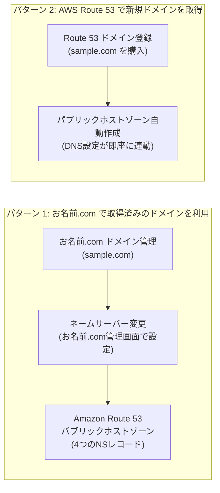

| 比較項目 | パターン 1: お名前.com 取得済みドメイン | パターン 2: Route 53 新規取得ドメイン |
| :--- | :--- | :--- |
| **ドメイン登録事業者 (Registrar)** | GMO インターネット（お名前.com） | Amazon Registrar, Inc. (Route 53) |
| **DNS 権威サーバー (DNS Hosting)** | Amazon Route 53（ネームサーバーを委譲） | Amazon Route 53（完全自動連携） |
| **年額更新・支払い** | お名前.com 側でクレジットカード等支払い | AWS アカウントの月次請求に統合 |
| **移行時の作業** | お名前.com 側で NS レコード 4 行を Route 53 向けに変更 | なし（購入完了時に自動セットアップ） |
| **AWS サービス親和性** | Alias レコード、ACM 自動検証ともに完全対応 | Alias レコード、ACM 自動検証ともに完全対応 |

---

### 2.2 お名前.com 取得済みドメインを Route 53 で利用する手順

#### 手順概要
1. Route 53 に `sample.com` のパブリックホストゾーンを作成する。
2. 作成された 4 つの NS レコード（ネームサーバー値）をコピーする。
3. お名前.com の管理画面（Navi）にログインし、「ネームサーバーの設定」で 4 つの NS を登録する。
4. DNS 伝播確認コマンドを実行し、Route 53 に委譲されたことを確認する。

#### 手順 (GUI)
1. **Route 53 ホストゾーン作成**:
   - AWS コンソールで **[Route 53]** $\rightarrow$ **[ホストゾーン]** $\rightarrow$ **[ホストゾーンの作成]** をクリック。
   - ドメイン名: `sample.com`
   - タイプ: **パブリックホストゾーン**
   - **[ホストゾーンの作成]** をクリック。
   - 作成されたホストゾーンのレコード一覧から、タイプ **NS** の「値/トラフィックのルーティング先」に表示されている 4 行のネームサーバー（例: `ns-xxxx.awsdns-xx.com.` 等）を控えます。
2. **お名前.com 側でのネームサーバー変更**:
   - お名前.com Navi にログイン $\rightarrow$ **[ネームサーバーの設定]** $\rightarrow$ **[ネームサーバーの変更]** を選択。
   - 対象ドメイン `sample.com` にチェックを入れる。
   - 「他のネームサーバーを利用」タブを選択 $\rightarrow$ ネームサーバー 1〜4 に、Route 53 で控えた 4 つのホスト名（末尾のドット `.` は除いて入力）を貼り付け $\rightarrow$ **[確認]** $\rightarrow$ **[設定する]** をクリック。

#### 手順 (CLI)
```bash
# 1. Route 53 パブリックホストゾーンの作成
HOSTED_ZONE_JSON=$(aws route53 create-hosted-zone \
    --name "sample.com" \
    --caller-reference "$(date +%s)" \
    --hosted-zone-config Comment="Public Hosted Zone for sample.com",PrivateZone=false)

# 2. ホストゾーン ID と ネームサーバー一覧の取得・確認
HOSTED_ZONE_ID=$(echo "${HOSTED_ZONE_JSON}" | jq -r '.HostedZone.Id' | sed 's/\/hostedzone\///')
echo "Hosted Zone ID: ${HOSTED_ZONE_ID}"
echo "Delegated Name Servers to register in Onamae.com:"
echo "${HOSTED_ZONE_JSON}" | jq -r '.DelegationSet.NameServers[]'

# 3. DNS 委譲の伝播確認 (dig コマンドまたは nslookup)
dig NS sample.com @8.8.8.8 +short
```

---

### 2.3 Route 53 で新規ドメインを取得する手順

#### 手順 (GUI)
1. AWS コンソールで **[Route 53]** $\rightarrow$ **[登録済みドメイン]** $\rightarrow$ **[ドメインの登録]** をクリック。
2. 検索窓に `sample.com` を入力して利用可能か確認 $\rightarrow$ **[カートに入れる]** $\rightarrow$ **[続行]** をクリック。
3. 登録者情報（名前・住所・電話番号・メールアドレス等）を入力（プライバシー保護がデフォルト有効）。
4. 自動更新の有効化を確認し、規約に同意して **[注文の送信]** をクリック。
5. 登録メールアドレスに届く確認リンクをクリックして承認します（購入完了後、パブリックホストゾーンが自動生成されます）。

#### 手順 (CLI)
```bash
# 1. ドメインの空き状況確認
aws route53domains check-domain-availability \
    --region us-east-1 \
    --domain-name "sample.com"

# 2. ドメイン登録リクエスト (JSON パラメータファイル経由)
# ※ 個人情報・住所等を含む contact-info.json を準備
aws route53domains register-domain \
    --region us-east-1 \
    --domain-name "sample.com" \
    --duration-in-years 1 \
    --auto-renew \
    --admin-contact file://contact-admin.json \
    --registrant-contact file://contact-registrant.json \
    --tech-contact file://contact-tech.json \
    --privacy-protect-admin-contact \
    --privacy-protect-registrant-contact \
    --privacy-protect-tech-contact
```

---

### 2.4 ACM パブリック証明書の発行（us-east-1 必須の理由）

> [!IMPORTANT]
> **CloudFront 用 ACM 証明書の最重要ルール（バージニア北部リージョン要件）**
> - Amazon CloudFront はグローバルエッジサービスであり、ディストリビューションにアタッチする SSL/TLS 証明書は **必ず `us-east-1` (米国東部 / バージニア北部) リージョン** の ACM で発行・管理されている必要があります。
> - 東京リージョン (`ap-northeast-1`) で発行した証明書は CloudFront の選択画面に表示されず、アタッチできません。

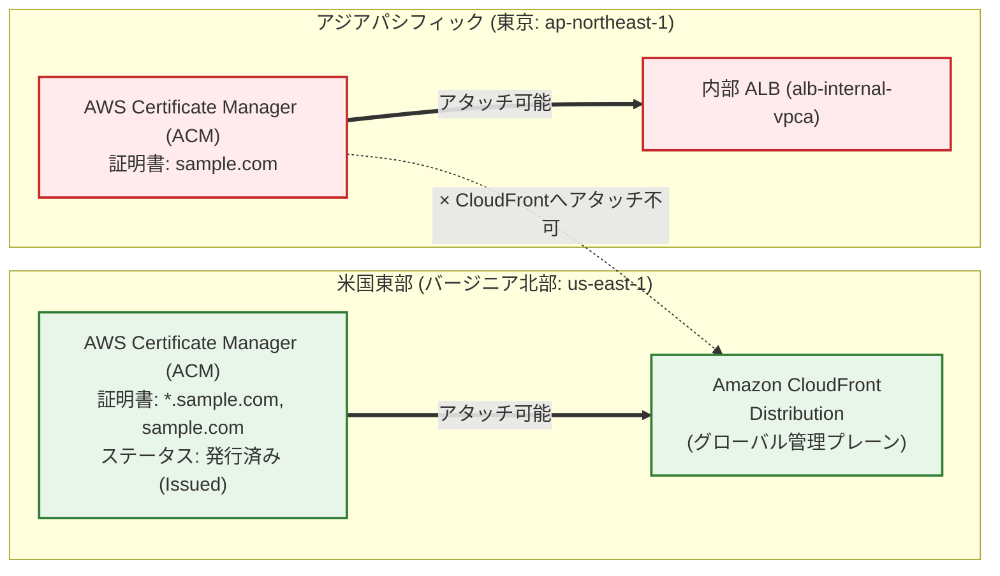

#### 手順 (GUI)
1. AWS コンソール右上リージョン選択で **[バージニア北部 (`us-east-1`)]** を選択します。
2. **[AWS Certificate Manager]** $\rightarrow$ **[証明書をリクエスト]** をクリック。
3. 証明書タイプ: **パブリック証明書をリクエスト** を選択 $\rightarrow$ **[次へ]**。
4. **ドメイン名**:
   - 完全修飾ドメイン名 (FQDN): `www.sample.com`
   - 「この証明書に別の名前を追加」をクリック $\rightarrow$ `sample.com`（Apex ドメイン）や `*.sample.com`（ワイルドカード）を追加登録。
5. **検証方法**: **DNS 検証 (推奨)** を選択。
6. **キーアルゴリズム**: **RSA 2048** (または ECDSA P-256) を選択。
7. **[リクエスト]** をクリック。

#### 手順 (CLI)
```bash
# バージニア北部 (us-east-1) で ACM パブリック証明書をリクエスト
CERT_ARN=$(aws acm request-certificate \
    --region us-east-1 \
    --domain-name "www.sample.com" \
    --subject-alternative-names "sample.com" "*.sample.com" \
    --validation-method DNS \
    --key-algorithm RSA_2048 \
    --tags Key=Environment,Value=Production Key=Project,Value=CloudFront-WAF \
    --query "CertificateArn" --output text)

echo "Requested Certificate ARN in us-east-1: ${CERT_ARN}"
```

---

### 2.5 DNS 自動検証と証明書の自動更新メカニズム

ACM は DNS 検証用の CNAME レコードが Route 53 ホストゾーン内に存在し続ける限り、**有効期限が切れる約 60 日前より前に自動的に証明書を更新（マネージド自動更新）** します。人手による年次更新作業やサーバー再起動は一切不要です。

#### 手順 (GUI)
1. ACM コンソール（`us-east-1`）で、先ほど作成した証明書（状態: **保留中の検証**）の詳細を開きます。
2. 「ドメイン」セクションにある **[Route 53 でレコードを作成]** ボタンをクリックします。
3. 対象のドメイン（`www.sample.com`, `sample.com` 等）にチェックが入っていることを確認し、**[レコードを作成]** をクリック。
4. 数分以内にステータスが **保留中の検証** $\rightarrow$ **発行済み (Issued)** に遷移します。

#### 手順 (CLI)
```bash
# 1. ACM 証明書から DNS 検証用 CNAME の Name と Value を抽出
RECORD_NAME=$(aws acm describe-certificate \
    --region us-east-1 \
    --certificate-arn "${CERT_ARN}" \
    --query "Certificate.DomainValidationOptions[0].ResourceRecord.Name" --output text)

RECORD_VALUE=$(aws acm describe-certificate \
    --region us-east-1 \
    --certificate-arn "${CERT_ARN}" \
    --query "Certificate.DomainValidationOptions[0].ResourceRecord.Value" --output text)

echo "CNAME Record: ${RECORD_NAME} -> ${RECORD_VALUE}"

# 2. Route 53 ホストゾーンに DNS 検証用 CNAME レコードを追加
HOSTED_ZONE_ID=$(aws route53 list-hosted-zones-by-name --dns-name "sample.com." --query "HostedZones[0].Id" --output text | sed 's/\/hostedzone\///')

aws route53 change-resource-record-sets \
    --hosted-zone-id "${HOSTED_ZONE_ID}" \
    --change-batch '{
      "Comment": "DNS validation record for ACM certificate",
      "Changes": [
        {
          "Action": "UPSERT",
          "ResourceRecordSet": {
            "Name": "'"${RECORD_NAME}"'",
            "Type": "CNAME",
            "TTL": 300,
            "ResourceRecords": [
              {
                "Value": "'"${RECORD_VALUE}"'"
              }
            ]
          }
        }
      ]
    }'

# 3. 証明書の発行完了待ち (Status == ISSUED になるまで待機)
aws acm wait certificate-validated \
    --region us-east-1 \
    --certificate-arn "${CERT_ARN}"

echo "✅ ACM Certificate has been successfully ISSUED!"
```

---

## 3. CloudFront ディストリビューションの作成と設定

### 3.1 ディストリビューションの基本設計

本番運用における CloudFront ディストリビューションの最適構成：
- **ディストリビューションドメイン / CNAME**: `www.sample.com`
- **プロトコル**: HTTPS のみ（HTTP リクエストは HTTPS へ自動リダイレクト `redirect-to-https`）
- **TLS 設定**: TLSv1.2_2021（最新の安全な暗号スイート）
- **HTTP バージョン**: HTTP/2, HTTP/3 (QUIC) 有効化
- **IPv6**: 有効化
- **価格クラス**: `PriceClass_200`（日本・北米・欧州・アジア主要 PoP をカバー、コスト効率最良）または `PriceClass_All`

---

### 3.2 内部 ALB へのセキュア接続設計（VPC Origins vs カスタムヘッダー検証）

CloudFront から VPC-A 内の内部 ALB へセキュアに接続するための 2 つのアーキテクチャパターンを解説します。

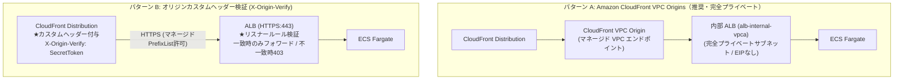

| 比較項目 | パターン A: CloudFront VPC Origins (最新機能) | パターン B: オリジンカスタムヘッダー検証 |
| :--- | :--- | :--- |
| **ALB の公開範囲** | 完全プライベート（インターネットルート一切不要） | プライベートまたはパブリック（PrefixListで制限） |
| **セキュリティ** | AWS バックボーン経由で VPC 内部へ直接通信 | ALB リスナールールで秘密ヘッダー値を厳格検査 |
| **構成のシンプルさ** | VPC Origin リソースを作成してオリジンに紐付ける | ALB のリスナールールに HTTP ヘッダー条件を追加 |
| **要件・前提** | ALB が VPC-A のプライベートサブネットに配置 | ALB が HTTPS リスナーを保持し証明書適用済み |

> [!TIP]
> `AWS：ECS.md` では **パターン B（`X-Origin-Verify` カスタムヘッダー検証）** を採用した内部 ALB リスナールールがすでに定義されています。本設計ガイドでは両方式に対応できるよう、カスタムヘッダー設定および VPC Origin 設定の双方を記載します。

---

### 3.3 キャッシュビヘイビア・キャッシュポリシー設計

ECS アプリケーションおよび静的配信のためのビヘイビア設計：

| パスパターン | ターゲットオリジン | ビヘイビア設定 (Viewer Protocol) | キャッシュポリシー (Cache Policy) | オリジンリクエストポリシー | 用途 |
| :--- | :--- | :--- | :--- | :--- | :--- |
| **`/api/*`** (動的API) | 内部 ALB | HTTPS Only / Redirect to HTTPS (Allowed: ALL Methods) | `Managed-CachingDisabled` (ID: `4135ea2d-6df8-44a3-9df3-4b5a84be39ad`) | `Managed-AllViewerAndCloudFrontHeaders-2022-06` | 動的 API リクエスト（キャッシュ無効・ヘッダー完全転送） |
| **`Default (*)`** (SPA/静的) | 内部 ALB (または S3) | Redirect to HTTPS (Allowed: GET, HEAD, OPTIONS) | `Managed-CachingOptimized` (ID: `658327ea-f89d-4fab-a63d-7e88639e58f6`) | `Managed-CORS-S3Origin` | 静的ファイル（長期キャッシュ・Gzip/Brotli 自動圧縮） |

---

### 3.4 セキュリティレスポンスヘッダーポリシーの設計

Web ブラウザのセキュリティを最大化するため、CloudFront の Response Headers Policy を適用して以下のセキュリティヘッダーを自動付与します：
- **Strict-Transport-Security (HSTS)**: `max-age=31536000; includeSubDomains; preload`
- **X-Content-Type-Options**: `nosniff`
- **X-Frame-Options**: `DENY` (または `SAMEORIGIN`)
- **X-XSS-Protection**: `1; mode=block`
- **Referrer-Policy**: `strict-origin-when-cross-origin`
- **Content-Security-Policy (CSP)**: `default-src 'self'; img-src 'self' data: https:; script-src 'self'; style-src 'self' 'unsafe-inline';`

---

### 3.5 CloudFront ディストリビューションの作成手順

#### 手順 (GUI)
1. AWS コンソールで **[CloudFront]** $\rightarrow$ **[ディストリビューションを作成]** をクリック。
2. **オリジン設定**:
   - オリジンドメイン: 内部 ALB の DNS 名（例: `alb-internal-vpca-123456789.ap-northeast-1.elb.amazonaws.com`）を入力
   - プロトコル: **HTTPS のみ** (ポート 443)
   - 最低オリジン SSL プロトコル: **TLSv1.2**
   - **カスタムヘッダーの追加**:
     - ヘッダー名: `X-Origin-Verify`
     - 値: `MySuperSecretTokenValue2026!`
3. **デフォルトのキャッシュビヘイビア**:
   - パスパターン: `Default (*)`
   - ビューワープロトコルポリシー: **Redirect HTTP to HTTPS**
   - 許可された HTTP メソッド: **GET, HEAD, OPTIONS, PUT, POST, PATCH, DELETE**
   - キャッシュキーとオリジンリクエスト: **Cache policy and origin request policy (recommended)**
     - キャッシュポリシー: `CachingOptimized` (または `CachingDisabled`)
     - オリジンリクエストポリシー: `AllViewerAndCloudFrontHeaders-2022-06`
   - レスポンスヘッダーポリシー: `Managed-SecurityHeadersPolicy` を選択
4. **ウェブアプリケーションファイアウォール (WAF)**:
   - 「セキュリティ保護を有効にする」または「既存の WAF Web ACL をアタッチ」（第 4 章で作成した Web ACL を指定）
5. **設定 (Settings)**:
   - 料金クラス: **北米、欧州、アジア、中東、アフリカを使用 (PriceClass_200)**
   - 代替ドメイン名 (CNAME): `www.sample.com`
   - カスタム SSL 証明書: ACM で作成した `www.sample.com` の証明書（`us-east-1`）を選択
   - セキュリティポリシー: **TLSv1.2_2021 (推奨)**
   - サポートされている HTTP バージョン: **HTTP/2, HTTP/3** にチェック
   - IPv6: **オン**
   - 標準ログ記録: **オン**（第 10 章で作成する S3 ログバケットを指定）
6. **[ディストリビューションを作成]** をクリック。

#### 手順 (CLI)

##### 1. ディストリビューション構成定義ファイル (`cf-distribution-config.json`)
```json
{
  "CallerReference": "sample-cf-dist-20260827",
  "Aliases": {
    "Quantity": 1,
    "Items": ["www.sample.com"]
  },
  "DefaultRootObject": "index.html",
  "Origins": {
    "Quantity": 1,
    "Items": [
      {
        "Id": "Origin-Internal-ALB",
        "DomainName": "alb-internal-vpca-123456789.ap-northeast-1.elb.amazonaws.com",
        "OriginPath": "",
        "CustomHeaders": {
          "Quantity": 1,
          "Items": [
            {
              "HeaderName": "X-Origin-Verify",
              "HeaderValue": "MySuperSecretTokenValue2026!"
            }
          ]
        },
        "CustomOriginConfig": {
          "HTTPPort": 80,
          "HTTPSPort": 443,
          "OriginProtocolPolicy": "https-only",
          "OriginSslProtocols": {
            "Quantity": 1,
            "Items": ["TLSv1.2"]
          },
          "OriginReadTimeout": 30,
          "OriginKeepaliveTimeout": 5
        },
        "ConnectionAttempts": 3,
        "ConnectionTimeout": 10
      }
    ]
  },
  "DefaultCacheBehavior": {
    "TargetOriginId": "Origin-Internal-ALB",
    "ViewerProtocolPolicy": "redirect-to-https",
    "AllowedMethods": {
      "Quantity": 7,
      "Items": ["GET", "HEAD", "OPTIONS", "PUT", "POST", "PATCH", "DELETE"],
      "CachedMethods": {
        "Quantity": 2,
        "Items": ["GET", "HEAD"]
      }
    },
    "SmoothStreaming": false,
    "Compress": true,
    "CachePolicyId": "4135ea2d-6df8-44a3-9df3-4b5a84be39ad",
    "OriginRequestPolicyId": "216adef6-5c7f-47e4-b989-5492eafa07d3",
    "ResponseHeadersPolicyId": "67f7725c-6f97-4210-82d7-5512b31e9d03"
  },
  "Comment": "Production CloudFront Distribution for ECS Fargate Service",
  "Logging": {
    "Enabled": false,
    "IncludeCookies": false,
    "Bucket": "",
    "Prefix": ""
  },
  "PriceClass": "PriceClass_200",
  "Enabled": true,
  "ViewerCertificate": {
    "ACMCertificateArn": "arn:aws:acm:us-east-1:123456789012:certificate/xxxxxxxx-xxxx-xxxx-xxxx-xxxxxxxxxxxx",
    "SSLSupportMethod": "sni-only",
    "MinimumProtocolVersion": "TLSv1.2_2021",
    "CertificateSource": "acm"
  },
  "HttpVersion": "http2and3",
  "IsIPV6Enabled": true
}
```

##### 2. ディストリビューション作成実行
```bash
# CloudFront ディストリビューションの作成
CF_CREATE_RES=$(aws cloudfront create-distribution \
    --distribution-config file://cf-distribution-config.json)

CF_DIST_ID=$(echo "${CF_CREATE_RES}" | jq -r '.Distribution.Id')
CF_DOMAIN_NAME=$(echo "${CF_CREATE_RES}" | jq -r '.Distribution.DomainName')

echo "CloudFront Distribution ID: ${CF_DIST_ID}"
echo "CloudFront Domain Name: ${CF_DOMAIN_NAME}"
```

---

### 3.6 Route 53 で CloudFront への Alias レコード登録

CloudFront ディストリビューションに対して、`www.sample.com` の DNS ルーティングを設定します。  
Route 53 の **Alias (エイリアス) レコード** を利用することで、Zone Apex (`sample.com`) およびサブドメイン (`www.sample.com`) に対する DNS クエリが無料かつ高速に名前解決されます。

> [!NOTE]
> CloudFront 宛ての Route 53 Alias レコードでは、HostedZoneId は全世界共通で固定値 **`Z2FDTNDATAQYW2`** を指定します。

#### 手順 (GUI)
1. **[Route 53]** $\rightarrow$ **[ホストゾーン]** $\rightarrow$ `sample.com` を選択。
2. **[レコードを作成]** をクリック。
3. **レコード設定**:
   - レコード名: `www`
   - レコードタイプ: **A - IPv4 アドレスにトラフィックをルーティング**
   - **エイリアス**: **有効 (トグルを ON)**
   - トラフィックのルーティング先:
     - エンドポイントを選択: **CloudFront ディストリビューションへのエイリアス**
     - ディストリビューションを選択: 作成したディストリビューション（`d111111abcdef8.cloudfront.net`）を選択
   - ルーティングポリシー: **シンプルルーティング**
   - ターゲットの正常性の評価: **いいえ**
4. **[レコードを作成]** をクリック。
5. 同様に、レコードタイプ **AAAA** (IPv6用) もエイリアスとして追加作成します。

#### 手順 (CLI)
```bash
HOSTED_ZONE_ID=$(aws route53 list-hosted-zones-by-name --dns-name "sample.com." --query "HostedZones[0].Id" --output text | sed 's/\/hostedzone\///')
CF_DOMAIN_NAME="d111111abcdef8.cloudfront.net" # 対象のCloudFrontドメイン

# Aレコード (IPv4) および AAAAレコード (IPv6) をエイリアスとして一括登録
aws route53 change-resource-record-sets \
    --hosted-zone-id "${HOSTED_ZONE_ID}" \
    --change-batch '{
      "Comment": "Alias records for CloudFront distribution",
      "Changes": [
        {
          "Action": "UPSERT",
          "ResourceRecordSet": {
            "Name": "www.sample.com",
            "Type": "A",
            "AliasTarget": {
              "HostedZoneId": "Z2FDTNDATAQYW2",
              "DNSName": "'"${CF_DOMAIN_NAME}"'",
              "EvaluateTargetHealth": false
            }
          }
        },
        {
          "Action": "UPSERT",
          "ResourceRecordSet": {
            "Name": "www.sample.com",
            "Type": "AAAA",
            "AliasTarget": {
              "HostedZoneId": "Z2FDTNDATAQYW2",
              "DNSName": "'"${CF_DOMAIN_NAME}"'",
              "EvaluateTargetHealth": false
            }
          }
        }
      ]
    }'
```

---

## 4. AWS WAF (v2) の設定とベストプラクティス

### 4.1 AWS WAF (v2) の基本概念とスコープ

- **スコープ (Scope)**:
  - CloudFront にアタッチする Web ACL は、スコープが **`CLOUDFRONT`** となり、**必ず `us-east-1` (バージニア北部) リージョン** で作成・管理されます。
- **WCU (WAF Capacity Unit)**:
  - 各ルールが消費するキャパシティ単位です。1 つの Web ACL あたり最大 1,500 WCU（拡張時は最大 5,000 WCU）までルールを配置できます。

---

### 4.2 多層防御（レイヤードセキュリティ）ルール設計マトリクス

本番環境で推奨される AWS WAF の多層防御構成：

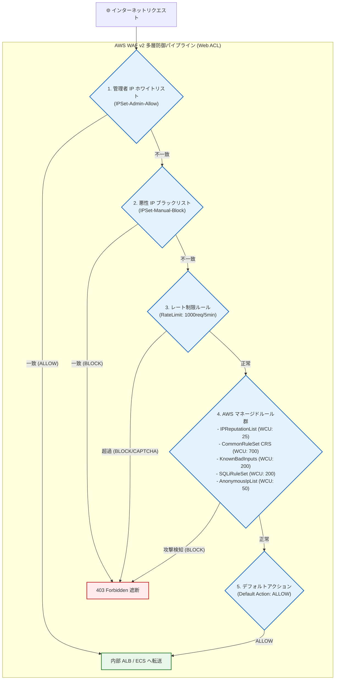

| 優先度 | ルール名 | 種別 / マネージドルール名 | アクション | WCU | 用途・保護対象 |
| :--- | :--- | :--- | :--- | :--- | :--- |
| **10** | `Admin-IP-Allow-Rule` | IP Set (カスタム) | **Allow** | 1 | 社内オフィス・VPN 等の特定 IP からのアクセスを最優先許可 |
| **20** | `Manual-IP-Block-Rule` | IP Set (カスタム) | **Block** | 1 | 攻撃元として特定された不正 IP を手動で即時遮断 |
| **30** | `RateLimit-Global-1000` | Rate-based Rule | **Block** (または CAPTCHA) | 2 | 単一 IP からの過剰アクセス（5分間に1000リクエスト超過）を自動遮断（DoS対策） |
| **40** | `AWS-AWSManagedRulesAmazonIpReputationList` | AWS Managed Rule | **Block** | 25 | Amazon が収集した最新のボットネット・スパム・スキャン IP を遮断 |
| **50** | `AWS-AWSManagedRulesAnonymousIpList` | AWS Managed Rule | **Block** (※) | 50 | Tor、VPN、匿名プロキシ、ホスティングプロバイダ経由の通信をブロック |
| **60** | `AWS-AWSManagedRulesCommonRuleSet` (CRS) | AWS Managed Rule | **Block** | 700 | OWASP Top 10（XSS, LFI/RFI, OSコマンドインジェクション, リクエストサイズ制限等） |
| **70** | `AWS-AWSManagedRulesKnownBadInputsRuleSet` | AWS Managed Rule | **Block** | 200 | Log4j (Log4Shell)、Java デシリアライゼーション等の既知の悪性入力を遮断 |
| **80** | `AWS-AWSManagedRulesSQLiRuleSet` | AWS Managed Rule | **Block** | 200 | SQL インジェクション攻撃パターンを徹底検査 |

> [!NOTE]
> `AWSManagedRulesAnonymousIpList` において、AWS / GCP / Azure などのホスティングプロバイダからの正当な API 連携がある場合は、該当のサブルール（`HostingProviderIPList`）を **Count** にオーバーライドして誤遮断を防止します。

---

### 4.3 カウントモード（Count）による事前検証とチューニング運用

新規に WAF を導入する際は、いきなり **Block** で運用を開始すると業務通信が誤検知（False Positive）で遮断されるリスクがあります。  
以下の **3 フェーズ運用** を実施します：

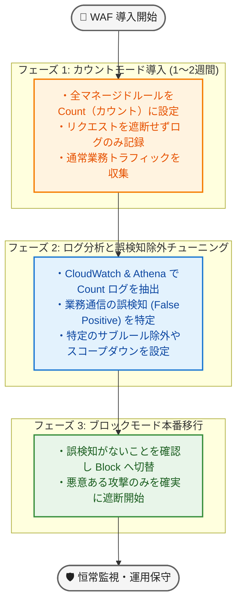

---

### 4.4 Web ACL の作成と CloudFront へのアタッチ手順

#### 手順 (GUI)
1. AWS コンソール右上リージョンを **[バージニア北部 (`us-east-1`)]** に切り替えます。
2. **[AWS WAF & Shield]** $\rightarrow$ **[Web ACLs]** $\rightarrow$ **[Create web ACL]** をクリック。
3. **Web ACL の詳細記述**:
   - Name: `webacl-sample-production-cf`
   - Resource type: **CloudFront distributions**
4. **マネージドルール・独自ルールの追加**:
   - **[Add rules]** $\rightarrow$ **[Add managed rule groups]** をクリック。
   - **AWS managed rule groups** を展開し、以下のルールグループを **Add to web ACL** に追加：
     - `Amazon IP reputation list`
     - `Anonymous IP list`
     - `Core rule set (CRS)`
     - `Known bad inputs`
     - `SQL database`
   - **[Add rules]** $\rightarrow$ **[Add my own rules and rule groups]** でレート制限ルールを作成（Rule type: **Rate-based rule**, Rate limit: **1000**, Action: **Block**）。
5. **ルールの優先順位設定**: 優先順位 10〜80 を確認 $\rightarrow$ **[Next]**。
6. **デフォルトアクション**: **Allow** を選択 $\rightarrow$ **[Next]**。
7. **CloudWatch メトリクス設定**: 有効化を確認 $\rightarrow$ **[Next]** $\rightarrow$ **[Create web ACL]** をクリック。
8. **CloudFront への関連付け**:
   - 作成した Web ACL の **[Associated AWS resources]** タブ $\rightarrow$ **[Add AWS resources]** をクリック。
   - 作成済みの CloudFront ディストリビューションを選択して **[Add]** をクリック。

#### 手順 (CLI)

##### 1. Web ACL 定義ファイル (`waf-webacl-config.json`)
```json
{
  "Name": "webacl-sample-production-cf",
  "Scope": "CLOUDFRONT",
  "DefaultAction": {
    "Allow": {}
  },
  "Description": "Production Web ACL for CloudFront Distribution",
  "Rules": [
    {
      "Name": "RateLimit-Global-1000",
      "Priority": 30,
      "Statement": {
        "RateBasedStatement": {
          "Limit": 1000,
          "AggregateKeyType": "IP"
        }
      },
      "Action": {
        "Block": {}
      },
      "VisibilityConfig": {
        "SampledRequestsEnabled": true,
        "CloudWatchMetricsEnabled": true,
        "MetricName": "RateLimitGlobal1000Metric"
      }
    },
    {
      "Name": "AWS-AWSManagedRulesAmazonIpReputationList",
      "Priority": 40,
      "Statement": {
        "ManagedRuleGroupStatement": {
          "VendorName": "AWS",
          "Name": "AWSManagedRulesAmazonIpReputationList"
        }
      },
      "OverrideAction": {
        "None": {}
      },
      "VisibilityConfig": {
        "SampledRequestsEnabled": true,
        "CloudWatchMetricsEnabled": true,
        "MetricName": "AWSManagedRulesAmazonIpReputationListMetric"
      }
    },
    {
      "Name": "AWS-AWSManagedRulesCommonRuleSet",
      "Priority": 60,
      "Statement": {
        "ManagedRuleGroupStatement": {
          "VendorName": "AWS",
          "Name": "AWSManagedRulesCommonRuleSet"
        }
      },
      "OverrideAction": {
        "None": {}
      },
      "VisibilityConfig": {
        "SampledRequestsEnabled": true,
        "CloudWatchMetricsEnabled": true,
        "MetricName": "AWSManagedRulesCommonRuleSetMetric"
      }
    },
    {
      "Name": "AWS-AWSManagedRulesKnownBadInputsRuleSet",
      "Priority": 70,
      "Statement": {
        "ManagedRuleGroupStatement": {
          "VendorName": "AWS",
          "Name": "AWSManagedRulesKnownBadInputsRuleSet"
        }
      },
      "OverrideAction": {
        "None": {}
      },
      "VisibilityConfig": {
        "SampledRequestsEnabled": true,
        "CloudWatchMetricsEnabled": true,
        "MetricName": "AWSManagedRulesKnownBadInputsRuleSetMetric"
      }
    },
    {
      "Name": "AWS-AWSManagedRulesSQLiRuleSet",
      "Priority": 80,
      "Statement": {
        "ManagedRuleGroupStatement": {
          "VendorName": "AWS",
          "Name": "AWSManagedRulesSQLiRuleSet"
        }
      },
      "OverrideAction": {
        "None": {}
      },
      "VisibilityConfig": {
        "SampledRequestsEnabled": true,
        "CloudWatchMetricsEnabled": true,
        "MetricName": "AWSManagedRulesSQLiRuleSetMetric"
      }
    }
  ],
  "VisibilityConfig": {
    "SampledRequestsEnabled": true,
    "CloudWatchMetricsEnabled": true,
    "MetricName": "webacl-sample-production-cf-Metric"
  }
}
```

##### 2. Web ACL 作成と CloudFront アタッチ実行 (CLI)
```bash
# 1. バージニア北部 (us-east-1) で Web ACL を作成
WAF_RES=$(aws wafv2 create-web-acl \
    --region us-east-1 \
    --cli-input-json file://waf-webacl-config.json)

WAF_ARN=$(echo "${WAF_RES}" | jq -r '.Summary.ARN')
echo "Created Web ACL ARN: ${WAF_ARN}"

# 2. CloudFront ディストリビューションに Web ACL をアタッチ
# (CloudFront の現在の設定を取得し、WebACLId をセットして更新)
DIST_CONFIG=$(aws cloudfront get-distribution-config --id "${CF_DIST_ID}")
ETAG=$(echo "${DIST_CONFIG}" | jq -r '.ETag')

echo "${DIST_CONFIG}" | jq --arg waf_arn "${WAF_ARN}" '.DistributionConfig.WebACLId = $waf_arn | .DistributionConfig' > updated-cf-config.json

aws cloudfront update-distribution \
    --id "${CF_DIST_ID}" \
    --if-match "${ETAG}" \
    --distribution-config file://updated-cf-config.json
```

---

## 5. IAM ロール・ポリシーの設計と作成

### 5.1 最小権限原則に基づく IAM 設計

CloudFront / WAF / ACM の運用にあたり、職務分掌と最小権限の原則（PoLP: Principle of Least Privilege）に基づき 3 つのロール・ポリシーを定義します。

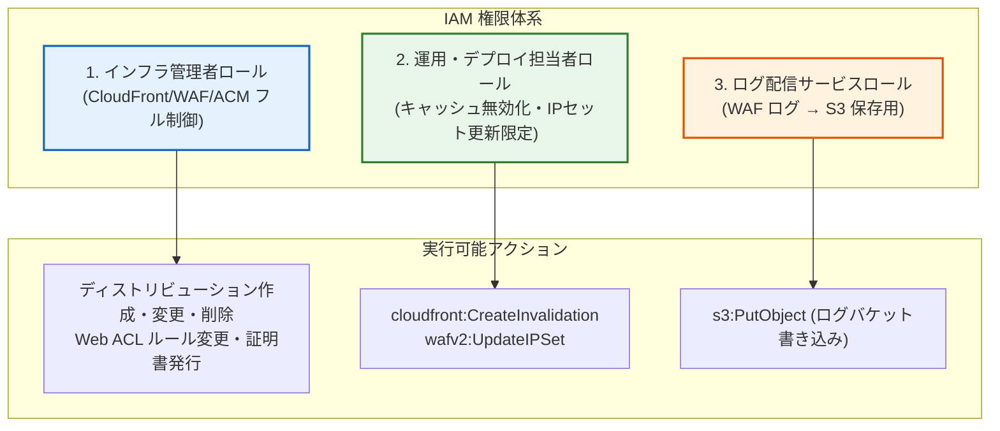

---

### 5.2 インフラ管理者用 IAM ポリシー

インフラ設計者が CloudFront、WAF、ACM、Route 53 を構築・管理するための権限ポリシーです。

#### インフラ管理者ポリシー (`policy-infrastructure-admin.json`)
```json
{
  "Version": "2012-10-17",
  "Statement": [
    {
      "Sid": "AllowCloudFrontAdmin",
      "Effect": "Allow",
      "Action": [
        "cloudfront:*"
      ],
      "Resource": "*"
    },
    {
      "Sid": "AllowWAFv2Admin",
      "Effect": "Allow",
      "Action": [
        "wafv2:*"
      ],
      "Resource": "*"
    },
    {
      "Sid": "AllowACMAdmin",
      "Effect": "Allow",
      "Action": [
        "acm:RequestCertificate",
        "acm:DescribeCertificate",
        "acm:ListCertificates",
        "acm:AddTagsToCertificate",
        "acm:DeleteCertificate"
      ],
      "Resource": "*"
    },
    {
      "Sid": "AllowRoute53RecordAdmin",
      "Effect": "Allow",
      "Action": [
        "route53:GetHostedZone",
        "route53:ListResourceRecordSets",
        "route53:ChangeResourceRecordSets"
      ],
      "Resource": "arn:aws:route53:::hostedzone/*"
    }
  ]
}
```

---

### 5.3 アプリケーション運用・デプロイ用 IAM ポリシー

ECS デプロイパイプライン（EC2 デプロイホストや CI/CD）から、CloudFront キャッシュ無効化（Invalidation）および緊急時 WAF IP セット更新のみを許可する最小権限ポリシーです。

#### 運用・デプロイ用ポリシー (`policy-deploy-invalidation.json`)
```json
{
  "Version": "2012-10-17",
  "Statement": [
    {
      "Sid": "AllowCloudFrontInvalidation",
      "Effect": "Allow",
      "Action": [
        "cloudfront:CreateInvalidation",
        "cloudfront:GetInvalidation",
        "cloudfront:ListInvalidations"
      ],
      "Resource": "arn:aws:cloudfront::123456789012:distribution/*"
    },
    {
      "Sid": "AllowWAFIPSetUpdate",
      "Effect": "Allow",
      "Action": [
        "wafv2:GetIPSet",
        "wafv2:UpdateIPSet"
      ],
      "Resource": "arn:aws:wafv2:us-east-1:123456789012:global/ipset/*/*"
    }
  ]
}
```

---

### 5.4 WAF ログ配信・CloudFront サービスリンクロール

#### WAF ログ用 S3 バケットポリシー
AWS WAF (v2) から S3 バケットへ直接ログを配信する場合、S3 バケットポリシーで `delivery.logs.amazonaws.com` サービスプリンシパルへの `s3:PutObject` を許可します（第 10 章にて詳細設定）。

---

## 6. セキュリティグループとオリジン保護設計

### 6.1 オリジン二重防御のアーキテクチャ

オリジンである内部 ALB を悪意ある直接アクセスや不正バイパスから保護するため、**2 重の防御レイヤー（セキュリティグループ + カスタムヘッダー検証）** を実装します。

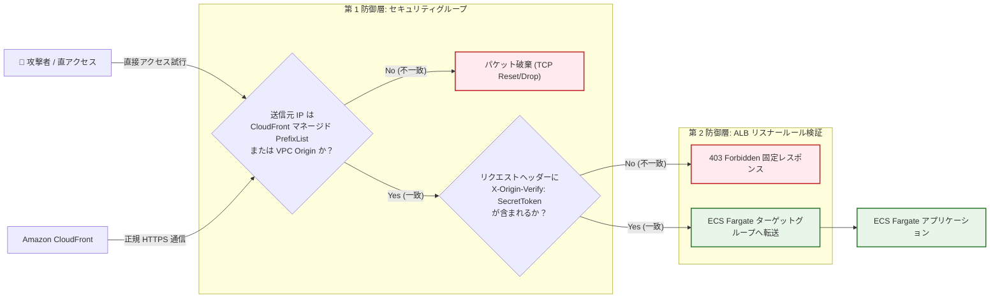

---

### 6.2 AWS マネージドプレフィックスリストによるインバウンド制限

AWS が提供する CloudFront 用マネージドプレフィックスリスト（`com.amazonaws.global.cloudfront.origin-facing`）を ALB のセキュリティグループ（`sg-alb-internal`）のインバウンドルールに設定することで、CloudFront サーバー群以外の IP からの通信をレイヤー 4 で完全に遮断します。

#### 手順 (GUI)
1. **[EC2]** $\rightarrow$ **[セキュリティグループ]** $\rightarrow$ `sg-alb-internal` を選択。
2. **[インバウンドルールの編集]** をクリック。
3. **ルールを追加**:
   - タイプ: **HTTPS (443)**
   - ソース: **プレフィックスリスト** を選択 $\rightarrow$ `com.amazonaws.global.cloudfront.origin-facing` (東京リージョン: `pl-58a04531`) を指定。
   - 説明: `Allow HTTPS from CloudFront edge locations only`
4. **[ルールを保存]** をクリック。

#### 手順 (CLI)
```bash
# 1. 東京リージョンの CloudFront オリジン向け PrefixList ID の取得
PL_ID=$(aws ec2 describe-managed-prefix-lists \
    --region ap-northeast-1 \
    --filters "Name=prefix-list-name,Values=com.amazonaws.global.cloudfront.origin-facing" \
    --query "PrefixLists[0].PrefixListId" --output text)

echo "CloudFront Managed Prefix List ID: ${PL_ID}"

# 2. ALB セキュリティグループにインバウンド許可ルールを追加
aws ec2 authorize-security-group-ingress \
    --region ap-northeast-1 \
    --group-id "sg-0aaaa1111bbbb2222" \
    --ip-permissions '[
      {
        "IpProtocol": "tcp",
        "FromPort": 443,
        "ToPort": 443,
        "PrefixListIds": [
          {
            "PrefixListId": "'"${PL_ID}"'",
            "Description": "Allow HTTPS from CloudFront Managed Prefix List"
          }
        ]
      }
    ]'
```

---

### 6.3 VPC Origin 用セキュリティグループの設定

CloudFront VPC Origins を使用する場合、VPC Origin エンドポイント用のセキュリティグループを作成し、ALB 側のセキュリティグループでその SG ID からの 443 ポート通信のみを許可します。

```bash
# VPC Origin 用セキュリティグループの作成
SG_VPCO_ID=$(aws ec2 create-security-group \
    --region ap-northeast-1 \
    --group-name "sg-cloudfront-vpcorigin" \
    --description "Security group for CloudFront VPC Origin" \
    --vpc-id "vpc-0123456789abcdef0" \
    --query "GroupId" --output text)

# ALB SG に VPC Origin SG からのインバウンド許可を追加
aws ec2 authorize-security-group-ingress \
    --region ap-northeast-1 \
    --group-id "sg-0aaaa1111bbbb2222" \
    --protocol tcp \
    --port 443 \
    --source-group "${SG_VPCO_ID}"
```

---

### 6.4 内部 ALB でのカスタムヘッダー検証ルール

内部 ALB のリスナーで `X-Origin-Verify` ヘッダーを検証し、正規の CloudFront 経由でないアクセスを拒否する設定を行います。

```bash
# 1. ALB HTTPS リスナー ARN を取得
LISTENER_ARN=$(aws elbv2 describe-listeners \
    --region ap-northeast-1 \
    --load-balancer-arn "arn:aws:elasticloadbalancing:ap-northeast-1:123456789012:loadbalancer/app/alb-internal-vpca/xxxx" \
    --query "Listeners[?Port==\`443\`].ListenerArn" --output text)

# 2. ヘッダー検証ルールの登録（ヘッダー一致で ECS ターゲットグループへ転送）
aws elbv2 create-rule \
    --region ap-northeast-1 \
    --listener-arn "${LISTENER_ARN}" \
    --priority 10 \
    --conditions '[
      {
        "Field": "http-header",
        "HttpHeaderConfig": {
          "HttpHeaderName": "X-Origin-Verify",
          "Values": ["MySuperSecretTokenValue2026!"]
        }
      }
    ]' \
    --actions Type=forward,TargetGroupArn=arn:aws:elasticloadbalancing:ap-northeast-1:123456789012:targetgroup/tg-ecs-fargate-app/xxxx
```

---

## 7. メンテナンス・キャッシュ管理・バックアップ

### 7.1 CDN / WAF におけるステートレス設計と IaC 構成管理

CloudFront ディストリビューションおよび AWS WAF Web ACL はデータを持たない **ステートレスなマネージドインフラ** です。  
そのため、障害復旧やバックアップは「設定定義のコード化（IaC: Terraform / CloudFormation）および JSON エクスポート」によって実現します。

#### 定期設定バックアップスクリプト (`backup-cf-waf-config.sh`)
```bash
#!/bin/bash
set -euo pipefail

BACKUP_DIR="./backup_configs/$(date +%Y%m%d_%H%M%S)"
mkdir -p "${BACKUP_DIR}"

echo "Backing up CloudFront Distribution Config..."
aws cloudfront get-distribution-config --id "${CF_DIST_ID}" > "${BACKUP_DIR}/cf-distribution-${CF_DIST_ID}.json"

echo "Backing up AWS WAF Web ACL Config..."
aws wafv2 get-web-acl \
    --region us-east-1 \
    --scope CLOUDFRONT \
    --name "webacl-sample-production-cf" \
    --id "${WAF_ID}" > "${BACKUP_DIR}/waf-webacl.json"

echo "✅ CloudFront and WAF configs backed up to ${BACKUP_DIR}"
```

---

### 7.2 キャッシュ無効化（Invalidation）の実行手順

アプリケーションのデプロイや静的コンテンツの更新時、エッジロケーションの古いキャッシュを即座に消去して最新化します。

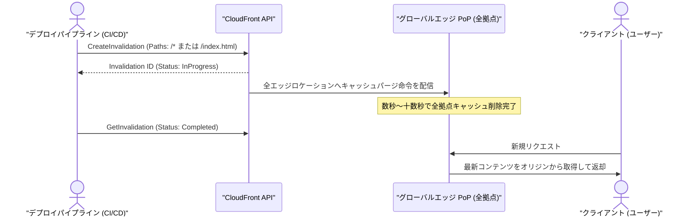

#### 手順 (GUI)
1. **[CloudFront]** $\rightarrow$ ディストリビューション一覧から対象を選択。
2. **[無効化] (Invalidations)** タブ $\rightarrow$ **[無効化を作成]** をクリック。
3. オブジェクトパスを入力:
   - 全体更新: `/*`
   - 静的アセット更新: `/static/*`, `/index.html`
4. **[無効化を作成]** をクリック。ステータスが **進行中** $\rightarrow$ **完了** に変わるのを確認。

#### 手順 (CLI)
```bash
# キャッシュ無効化リクエストの実行
INVALIDATION_ID=$(aws cloudfront create-invalidation \
    --distribution-id "${CF_DIST_ID}" \
    --paths "/*" \
    --query "Invalidation.Id" --output text)

echo "Invalidation created: ${INVALIDATION_ID}"

# 無効化完了の待機
aws cloudfront wait invalidation-completed \
    --distribution-id "${CF_DIST_ID}" \
    --id "${INVALIDATION_ID}"

echo "✅ Cache invalidation completed!"
```

---

### 7.3 WAF カスタムレスポンスによる即時 503 メンテナンス画面切替

システムの大規模メンテナンス時、オリジンに一切トラフィックを流さず、**AWS WAF のルール 1 行でエッジから即座に 503 メンテナンス HTML を返却** する運用手法です。

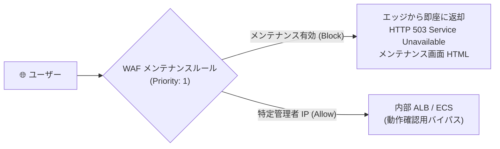

#### メンテナンス用 WAF ルール (`waf-maintenance-rule.json`)
```json
{
  "Name": "Emergency-Maintenance-Rule",
  "Priority": 1,
  "Statement": {
    "NotStatement": {
      "Statement": {
        "IPSetReferenceStatement": {
          "ARN": "arn:aws:wafv2:us-east-1:123456789012:global/ipset/IPSet-Admin-Allow/xxxx"
        }
      }
    }
  },
  "Action": {
    "Block": {
      "CustomResponse": {
        "ResponseCode": 503,
        "CustomResponseBodyKey": "MaintenanceHtmlBody",
        "ResponseHeaders": [
          {
            "Name": "Content-Type",
            "Value": "text/html; charset=UTF-8"
          },
          {
            "Name": "Retry-After",
            "Value": "3600"
          }
        ]
      }
    }
  },
  "VisibilityConfig": {
    "SampledRequestsEnabled": true,
    "CloudWatchMetricsEnabled": true,
    "MetricName": "EmergencyMaintenanceRuleMetric"
  }
}
```

---

### 7.4 S3 オリジンへの自動フェイルオーバー（Origin Groups 設計）

内部 ALB が 502/503/504 エラーを返却した場合に、CloudFront の **Origin Groups（オリジングループ）** 機能により、S3 バケットにホスティングされた静的エラー/メンテナンスページへミリ秒単位で自動フェイルオーバーします。

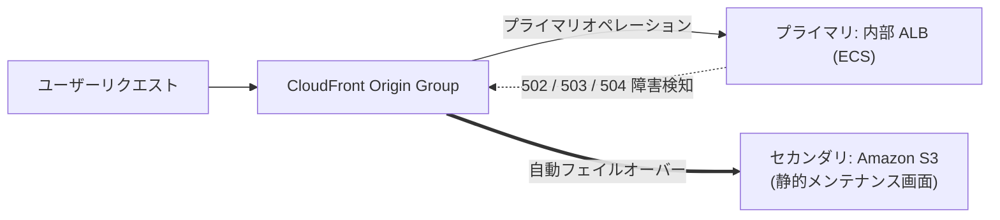

---

## 8. 削除保護・誤操作防止設計

### 8.1 CloudFront ディストリビューションの削除保護と無効化ガードレール

CloudFront ディストリビューションは、**意図せぬ削除を防ぐために以下の 2 重の保護** が AWS 仕様として組み込まれています：
1. **無効化（Disabled）必須要件**:
   - 稼働中（Status: `Deployed`, Enabled: `true`）のディストリビューションは `DeleteDistribution` API を実行してもエラーとなり削除できません。必ず事前に `Enabled: false` に更新して無効化する必要があります。
2. **削除保護機能 (Delete Protection)**:
   - CloudFront ディストリビューションのプロパティで「削除保護」を有効化しておくことで、マネジメントコンソールや CLI からの無効化・削除を防止します。

```bash
# ディストリビューション削除保護の有効化 (CLI)
# ※ get-distribution-config で取得した JSON 内の "Enabled" および "Staging" 構成で保護を管理
```

---

### 8.2 AWS WAF Web ACL の誤削除防止

AWS WAF v2 では、リソースが CloudFront に関連付け（Associate）されている間は Web ACL 自体を削除できません。  
さらに、本番運用では IAM ポリシーにより `wafv2:DeleteWebACL` を明示的に拒否（Deny）します。

---

### 8.3 ACM 証明書の保護メカニズム

ACM パブリック証明書は、**CloudFront ディストリビューションや ALB に関連付けられている間は AWS 側で削除が自動ロック** されます。証明書を削除するには、関連付けられた全ディストリビューションから証明書を解除する必要があります。

---

### 8.4 AWS Organizations SCP によるガードレール

```json
{
  "Version": "2012-10-17",
  "Statement": [
    {
      "Sid": "PreventProdCloudFrontDeletion",
      "Effect": "Deny",
      "Action": [
        "cloudfront:DeleteDistribution",
        "wafv2:DeleteWebACL",
        "acm:DeleteCertificate"
      ],
      "Resource": "*",
      "Condition": {
        "StringNotEquals": {
          "aws:PrincipalArn": "arn:aws:iam::123456789012:role/SuperAdminRole"
        }
      }
    }
  ]
}
```

---

## 9. アクティビティログ・監査ログ（CloudTrail）

### 9.1 CloudTrail によるグローバル管理イベントの記録（us-east-1）

CloudFront、AWS WAF (v2 / Scope: CLOUDFRONT)、および ACM の API 呼び出し履歴は、**グローバルサービスイベント** として **`us-east-1` (バージニア北部)** の CloudTrail に記録されます。

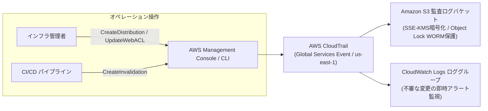

---

### 9.2 監査ログの S3 保存・改ざん防止・CloudWatch 連携

#### 手順 (CLI)
```bash
# CloudTrail でグローバルサービスイベントを含む証跡を作成
aws cloudtrail create-trail \
    --name "trail-enterprise-global-audit" \
    --s3-bucket-name "s3-sample-audit-logs-123456789012" \
    --include-global-service-events \
    --is-multi-region-trail \
    --enable-log-file-validation \
    --kms-key-id "arn:aws:kms:ap-northeast-1:123456789012:alias/audit-trail-key"

# 証跡のロギング開始
aws cloudtrail start-logging --name "trail-enterprise-global-audit"
```

---

## 10. アクセスログの保存・分析・コスト最適化

### 10.1 CloudFront 標準アクセスログの保存設定

CloudFront は、エッジロケーションで受信した全リクエストのアクセスログ（クライアント IP、パス、HTTP ステータスコード、User-Agent、キャッシュ Hit/Miss 等）を gzip 圧縮形式で S3 バケットに自動保存します。

#### 手順 (GUI)
1. **S3 ログバケットの作成**:
   - バケット名: `s3-sample-cloudfront-waf-logs-apne1`
   - ACL を有効化（オブジェクトライター）または適切なバケットポリシーを設定。
2. **CloudFront 設定**:
   - **[CloudFront]** $\rightarrow$ ディストリビューションを選択 $\rightarrow$ **[一般]** $\rightarrow$ **[編集]**。
   - **標準ログ記録**: **オン**
   - S3 バケット: `s3-sample-cloudfront-waf-logs-apne1.s3.amazonaws.com`
   - ログプレフィックス: `cloudfront/`
   - クッキーを含める: **オフ**
3. **[変更を保存]** をクリック。

#### 手順 (CLI)
```bash
# 1. ログ保存用 S3 バケットの作成
aws s3api create-bucket \
    --bucket "s3-sample-cloudfront-waf-logs-apne1" \
    --region ap-northeast-1 \
    --create-bucket-configuration LocationConstraint=ap-northeast-1

# 2. CloudFront ディストリビューションのログ記録有効化
# (get-distribution-config を取得し Logging を有効化して更新)
```

---

### 10.2 AWS WAF ログの S3 直接配信設定

AWS WAF (v2) は、Kinesis Data Firehose を介さずに **S3 バケットへ直接ログを配信（Direct S3 Delivery）** することが可能です。  
※ S3 バケット名は **`aws-waf-logs-`** で始まる必要があります。

#### 手順 (CLI)
```bash
# 1. WAF 専用 S3 ログバケットの作成 (プレフィックス aws-waf-logs- 必須)
aws s3api create-bucket \
    --bucket "aws-waf-logs-sample-production-apne1" \
    --region ap-northeast-1 \
    --create-bucket-configuration LocationConstraint=ap-northeast-1

# 2. AWS WAF v2 ログ記録の有効化
aws wafv2 put-logging-configuration \
    --region us-east-1 \
    --logging-configuration '{
      "ResourceArn": "'"${WAF_ARN}"'",
      "LogDestinationConfigs": [
        "arn:aws:s3:::aws-waf-logs-sample-production-apne1"
      ]
    }'
```

---

### 10.3 S3 ライフサイクルポリシーによるコスト最適化

アクセスログおよび WAF ログは日次で大量に蓄積されるため、ライフサイクルルールを適用して **ストレージコストを最大 90% 以上削減** します。

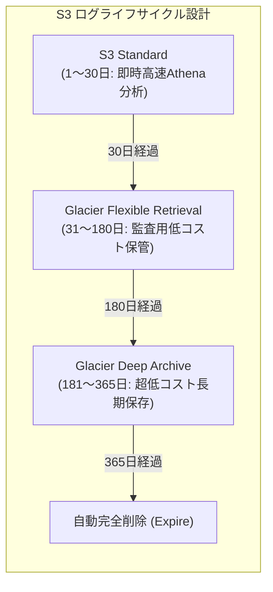

#### ライフサイクル設定ファイル (`s3-lifecycle-logs.json`)
```json
{
  "Rules": [
    {
      "ID": "CloudFrontAndWAFLogsLifecycle",
      "Status": "Enabled",
      "Filter": {
        "Prefix": ""
      },
      "Transitions": [
        {
          "Days": 30,
          "StorageClass": "GLACIER"
        },
        {
          "Days": 180,
          "StorageClass": "DEEP_ARCHIVE"
        }
      ],
      "Expiration": {
        "Days": 365
      },
      "NoncurrentVersionExpiration": {
        "NoncurrentDays": 7
      }
    }
  ]
}
```

```bash
aws s3api put-bucket-lifecycle-configuration \
    --bucket "s3-sample-cloudfront-waf-logs-apne1" \
    --lifecycle-configuration file://s3-lifecycle-logs.json
```

---

### 10.4 Amazon Athena によるログ分析クエリ集

#### 1. CloudFront 標準アクセスログ用 Athena テーブル定義 (DDL)
```sql
CREATE EXTERNAL TABLE IF NOT EXISTS cloudfront_logs (
  `date` DATE,
  `time` STRING,
  `location` STRING,
  `bytes` BIGINT,
  `request_ip` STRING,
  `method` STRING,
  `host` STRING,
  `uri` STRING,
  `status` INT,
  `referrer` STRING,
  `user_agent` STRING,
  `query_string` STRING,
  `cookie` STRING,
  `result_type` STRING,
  `request_id` STRING,
  `host_header` STRING,
  `request_protocol` STRING,
  `request_bytes` BIGINT,
  `time_taken` FLOAT,
  `xforwarded_for` STRING,
  `ssl_protocol` STRING,
  `ssl_cipher` STRING,
  `response_result_type` STRING,
  `http_version` STRING,
  `fle_status` STRING,
  `fle_encrypted_fields` INT,
  `c_port` INT,
  `time_to_first_byte` FLOAT,
  `x_edge_detailed_result_type` STRING,
  `sc_content_type` STRING,
  `sc_content_len` BIGINT,
  `sc_range_start` BIGINT,
  `sc_range_end` BIGINT
)
ROW FORMAT DELIMITED 
FIELDS TERMINATED BY '\t'
LOCATION 's3://s3-sample-cloudfront-waf-logs-apne1/cloudfront/'
TBLPROPERTIES ( 'skip.header.line.count'='2' );
```

#### 2. 実用分析 SQL クエリ例

##### ① 4xx / 5xx エラーの多いリクエスト URL トップ 10
```sql
SELECT uri, status, count(*) AS error_count
FROM cloudfront_logs
WHERE status >= 400
GROUP BY uri, status
ORDER BY error_count DESC
LIMIT 10;
```

##### ② IP アドレス別リクエスト数集計（過剰アクセス元調査）
```sql
SELECT request_ip, count(*) AS request_count, sum(bytes) / 1024 / 1024 AS total_mb
FROM cloudfront_logs
GROUP BY request_ip
ORDER BY request_count DESC
LIMIT 20;
```

##### ③ キャッシュ Hit 率（Cache Hit Ratio）の算出
```sql
SELECT 
  result_type,
  count(*) AS count,
  round(count(*) * 100.0 / sum(count(*)) over(), 2) AS percentage
FROM cloudfront_logs
GROUP BY result_type;
```

---

## 11. 障害監視・セキュリティ監視・アラート通知

### 11.1 CloudWatch メトリクス監視設計

CloudFront および AWS WAF の重要監視メトリクス：

| 監視対象 | メトリクス名 | リージョン | アラームしきい値 | アクション |
| :--- | :--- | :--- | :--- | :--- |
| **CloudFront** | `5xxErrorRate` | `us-east-1` | 5分平均 > 1.0% | SNS 通知（オリジン障害・502/504調査） |
| **CloudFront** | `4xxErrorRate` | `us-east-1` | 5分平均 > 5.0% | SNS 通知（大量404や403攻撃調査） |
| **CloudFront** | `OriginLatency` | `us-east-1` | 5分平均 > 2.0秒 | SNS 通知（ECS/DB 高負荷調査） |
| **AWS WAF** | `BlockedRequests` | `us-east-1` | 5分合計 > 500回 | SNS 通知（サイバー攻撃・DoS検知） |

---

### 11.2 CloudWatch アラームと SNS メール通知の設定

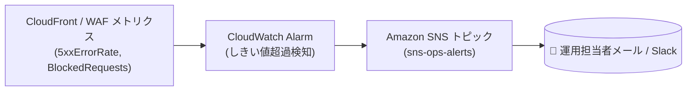

#### 手順 (CLI)
```bash
# 1. SNS トピックの作成とメールサブスクリプション登録
TOPIC_ARN=$(aws sns create-topic --name "sns-cloudfront-waf-alerts" --region us-east-1 --query "TopicArn" --output text)

aws sns subscribe \
    --region us-east-1 \
    --topic-arn "${TOPIC_ARN}" \
    --protocol email \
    --notification-endpoint "alert-ops@sample.com"

# 2. CloudFront 5xx エラー率アラームの作成
aws cloudwatch put-metric-alarm \
    --region us-east-1 \
    --alarm-name "alarm-cloudfront-5xx-error-rate-high" \
    --alarm-description "Triggered when CloudFront 5xx error rate exceeds 1% for 5 minutes" \
    --metric-name "5xxErrorRate" \
    --namespace "AWS/CloudFront" \
    --statistic "Average" \
    --period 300 \
    --evaluation-periods 1 \
    --threshold 1.0 \
    --comparison-operator "GreaterThanThreshold" \
    --dimensions Name=DistributionId,Value="${CF_DIST_ID}" Name=Region,Value=Global \
    --alarm-actions "${TOPIC_ARN}"
```

---

### 11.3 EventBridge による ACM 証明書更新監視・異常検知

ACM 証明書が何らかの理由（DNS レコード削除など）で自動更新できず、**有効期限が 45 日未満に迫った場合に EventBridge で検知して管理者に警告通知** を行います。

#### EventBridge ルール定義 (`eventbridge-acm-rule.json`)
```json
{
  "source": ["aws.acm"],
  "detail-type": ["ACM Certificate Approaching Expiration"]
}
```

```bash
# EventBridge ルールの作成
aws events put-rule \
    --region us-east-1 \
    --name "rule-acm-cert-expiration-warning" \
    --event-pattern file://eventbridge-acm-rule.json \
    --state ENABLED

# SNS トピックをターゲットに関連付け
aws events put-targets \
    --region us-east-1 \
    --rule "rule-acm-cert-expiration-warning" \
    --targets "Id"="1","Arn"="${TOPIC_ARN}"
```

---

### 11.4 WAF 攻撃検知アラートの設定

```bash
# AWS WAF Block リクエスト急増アラームの作成
aws cloudwatch put-metric-alarm \
    --region us-east-1 \
    --alarm-name "alarm-waf-blocked-requests-high" \
    --alarm-description "Triggered when AWS WAF blocks more than 500 requests in 5 minutes" \
    --metric-name "BlockedRequests" \
    --namespace "AWS/WAFV2" \
    --statistic "Sum" \
    --period 300 \
    --evaluation-periods 1 \
    --threshold 500 \
    --comparison-operator "GreaterThanThreshold" \
    --dimensions Name=WebACL,Value="webacl-sample-production-cf" Name=Region,Value=us-east-1 Name=Rule,Value=ALL \
    --alarm-actions "${TOPIC_ARN}"
```

---

## 12. トラブルシューティングガイド

### 12.1 502 Bad Gateway エラー

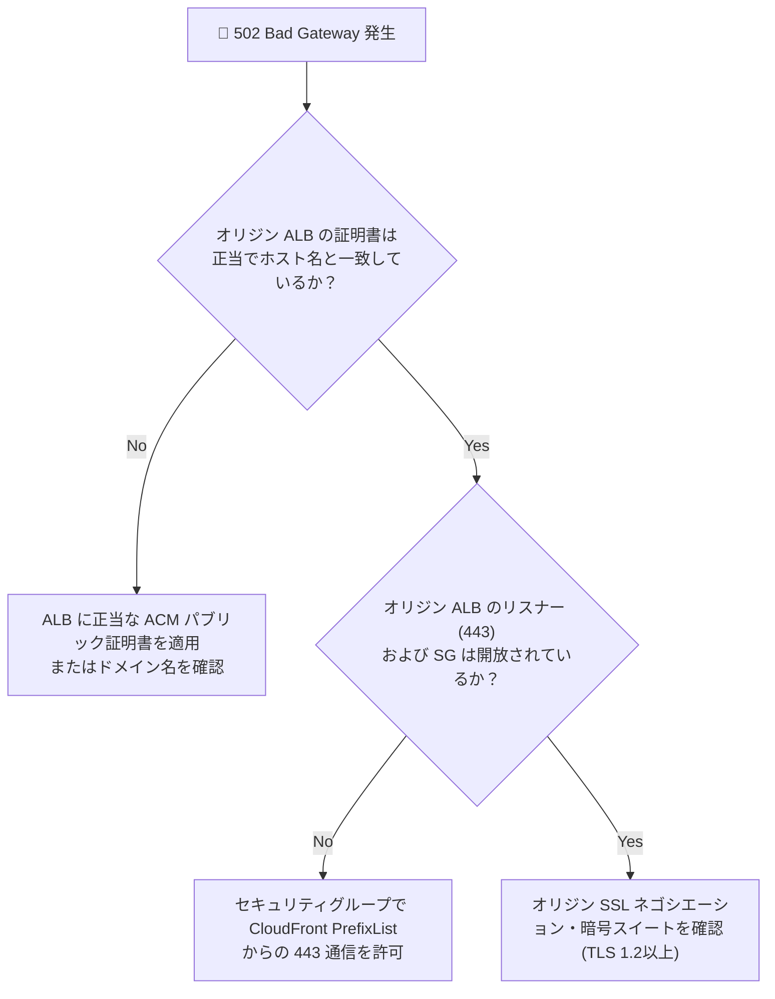

- **原因 1: SSL/TLS 証明書のホスト名不一致**:
  - CloudFront が ALB に HTTPS で接続する際、ALB に割り当てられた SSL 証明書がオリジンドメイン名と一致していない。
  - **対処**: ALB のリスナーに `*.sample.com` の ACM 証明書を設定し、CloudFront オリジン設定の「Origin SSL Protocols」を `TLSv1.2` に指定。
- **原因 2: セキュリティグループの遮断**:
  - ALB のセキュリティグループで CloudFront からの 443 ポート通信が拒否されている。
  - **対処**: ALB のインバウンドルールに `com.amazonaws.global.cloudfront.origin-facing` プレフィックスリストを追加。

---

### 12.2 504 Gateway Timeout エラー

- **原因 1: ECS アプリケーションの応答遅延**:
  - バックエンド DB のロックや高負荷により、ECS タスクの処理時間が CloudFront オリジン読み取りタイムアウト（デフォルト 30 秒）を超過。
  - **対処**: ECS Container Insights および CloudWatch Logs で遅延クエリを特定。必要に応じてオリジンタイムアウト値を調整。

---

### 12.3 403 Forbidden エラー

- **原因 1: AWS WAF によるブロック**:
  - CRS や SQLi ルールグループ、またはレート制限による検知。
  - **対処**: WAF の Sampled Requests または Athena ログを確認し、ブロックされたルール名（`RuleName`）を特定。誤検知の場合はルールを Count に切り替えるかスコープダウンステートメントを設定。
- **原因 2: ALB カスタムヘッダー（`X-Origin-Verify`）不一致**:
  - CloudFront 側のカスタムヘッダー値と ALB リスナールールの設定値が異なる。
  - **対処**: CloudFront の Origin Custom Headers と ALB リスナールールの値を完全一致させる。

---

### 12.4 ACM DNS 検証が完了しない / 証明書が自動更新されない

- **原因: Route 53 ホストゾーンの CNAME レコード欠落**:
  - お名前.com 側でネームサーバーが Route 53 に正しく向いていないか、検証用 CNAME レコードが削除された。
  - **対処**: `dig CNAME <_xxxx.www.sample.com> @8.8.8.8` を実行し、ACM が指定する CNAME 値が正しく応答されるか確認。

---

### 12.5 キャッシュが無効化されない・更新内容が即座に反映されない

- **原因 1: キャッシュキー設定による差異**:
  - クエリ文字列（Query String）や Cookie、特定のヘッダーがキャッシュキーに含まれており、別リクエストとして扱われている。
  - **対処**: キャッシュポリシーでキャッシュキー構成を見直す。緊急時は `/*` で CloudFront キャッシュ無効化を実行。
