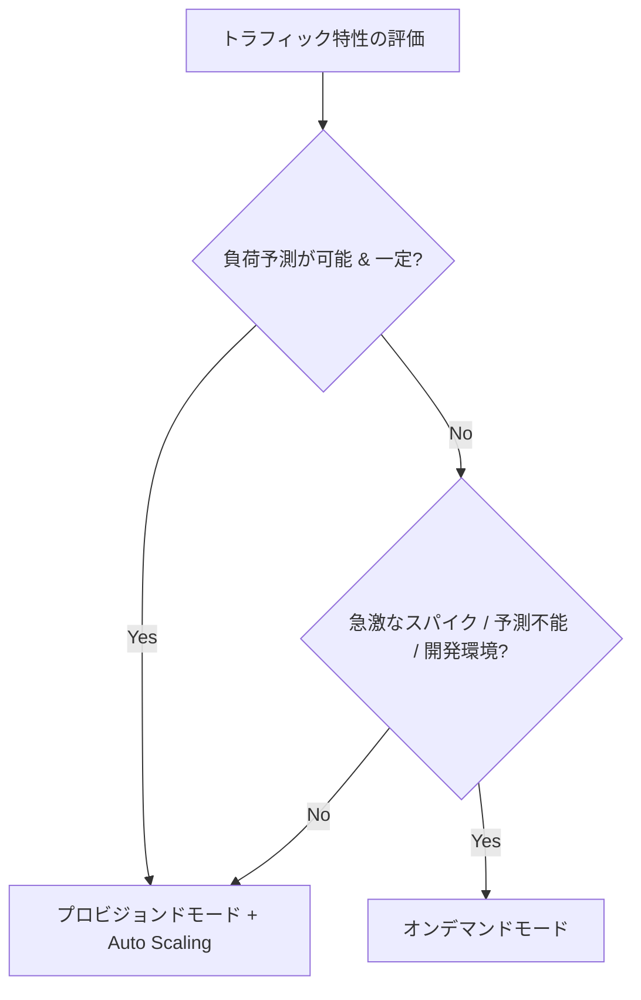
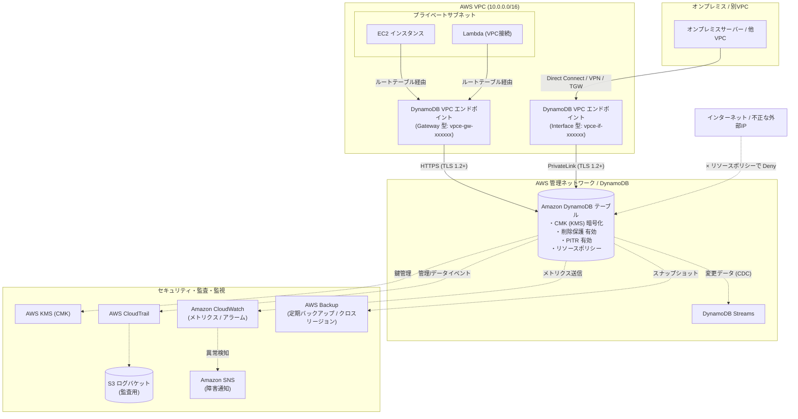
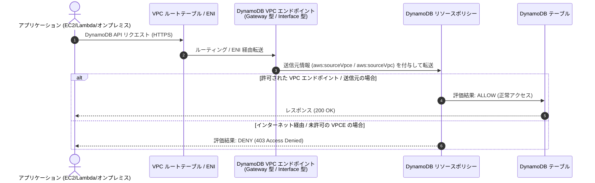
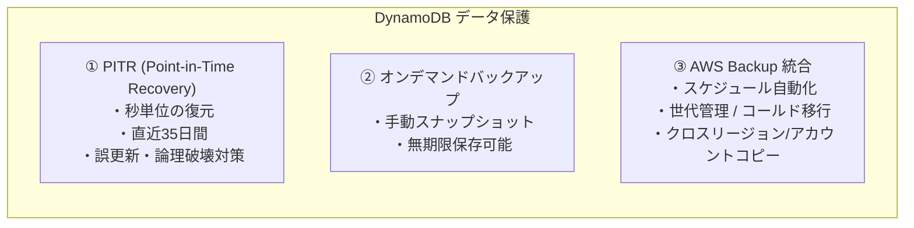
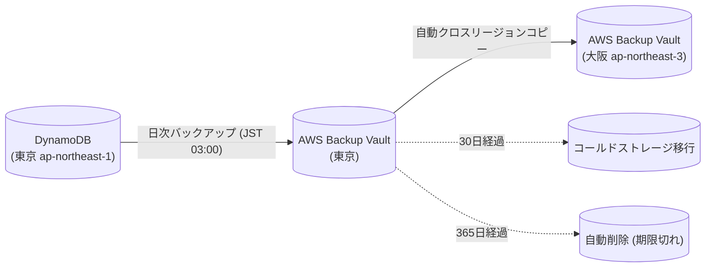
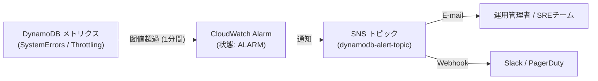
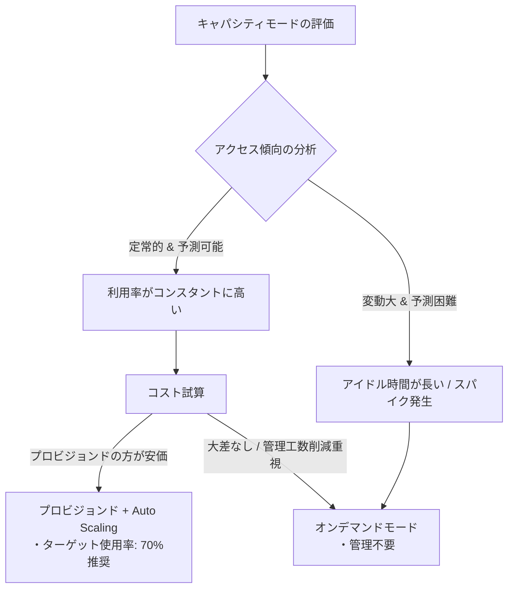

# 🚀 AWS：DynamoDB 構築・運用設計ガイド

本ドキュメントは、AWS 上で **Amazon DynamoDB** を安全、高可用、かつ最適なコストで構築・運用するための総合ガイドです。  
エンタープライズシステムにおける要件（ネットワーク遮断、KMS 暗号化、自動バックアップ、削除保護、監査ログ、障害監視、コスト最適化）を網羅し、各設定手順を **AWS マネジメントコンソール（GUI）** と **AWS CLI** の双方で解説します。

---

## 📑 目次

- [1. はじめに（基本概念と全体アーキテクチャ）](#1-はじめに基本概念と全体アーキテクチャ)
  - [1.1 DynamoDB の基本概念](#11-dynamodb-の基本概念)
  - [1.2 キャパシティモード・テーブルクラスの選定基準](#12-キャパシティモードテーブルクラスの選定基準)
  - [1.3 全体アーキテクチャ概要図](#13-全体アーキテクチャ概要図)
- [2. テーブルの作成・基本設計](#2-テーブルの作成基本設計)
  - [2.1 テーブル設計パラメータ一覧](#21-テーブル設計パラメータ一覧)
  - [2.2 テーブル作成手順（GUI / CLI）](#22-テーブル作成手順gui--cli)
  - [2.3 テーブル状態確認手順](#23-テーブル状態確認手順)
- [3. ネットワーク・アクセス制御（インターネットアクセス禁止設定）](#3-ネットワークアクセス制御インターネットアクセス禁止設定)
  - [3.1 プライベートアクセス構成と多層防御](#31-プライベートアクセス構成と多層防御)
  - [3.2 VPC エンドポイント方式の比較（Gateway 型 vs Interface 型）](#32-vpc-エンドポイント方式の比較gateway-型-vs-interface-型)
  - [3.3 ゲートウェイ型 VPC エンドポイントの作成](#33-ゲートウェイ型-vpc-エンドポイントの作成)
  - [3.4 インターフェイス型 VPC エンドポイント（AWS PrivateLink）の作成](#34-インターフェイス型-vpc-エンドポイントaws-privatelinkの作成)
  - [3.5 DynamoDB リソースベースポリシーの設定](#35-dynamodb-リソースベースポリシーの設定)
  - [3.6 アクセス元（IAM ロール）ポリシーの設定](#36-アクセス元iam-ロールポリシーの設定)
  - [3.7 転送時暗号化（TLS 1.2+）の強制](#37-転送時暗号化tls-12の強制)
- [4. 暗号化の設定と鍵管理](#4-暗号化の設定と鍵管理)
  - [4.1 暗号化方式の比較と選定](#41-暗号化方式の比較と選定)
  - [4.2 KMS カスタマーマネージドキー（CMK）の作成とポリシー設定](#42-kms-カスタマーマネージドキーcmkの作成とポリシー設定)
  - [4.3 テーブル暗号化の適用手順（GUI / CLI）](#43-テーブル暗号化の適用手順gui--cli)
- [5. メンテナンス・バックアップ・リストア設計](#5-メンテナンスバックアップリストア設計)
  - [5.1 DynamoDB のメンテナンスに関する重要事項](#51-dynamodb-のメンテナンスに関する重要事項)
  - [5.2 バックアップ方式の比較](#52-バックアップ方式の比較)
  - [5.3 ポイントインタイムリカバリ（PITR）の設定とリストア](#53-ポイントインタイムリカバリpitrの設定とリストア)
  - [5.4 オンデマンドバックアップの作成とリストア](#54-オンデマンドバックアップの作成とリストア)
  - [5.5 AWS Backup による統合管理（クロスリージョン/世代管理）](#55-aws-backup-による統合管理クロスリージョン世代管理)
  - [5.6 バックアップデータのアクセス制限・暗号化・障害検知](#56-バックアップデータのアクセス制限暗号化障害検知)
- [6. 削除保護・誤操作防止](#6-削除保護誤操作防止)
  - [6.1 削除保護の概要](#61-削除保護の概要)
  - [6.2 削除保護の設定手順（GUI / CLI）](#62-削除保護の設定手順gui--cli)
  - [6.3 IAM / SCP による削除ガードレール](#63-iam--scp-による削除ガードレール)
- [7. アクティビティログ・監査ログ（CloudTrail / Streams）](#7-アクティビティログ監査ログcloudtrail--streams)
  - [7.1 監査ログ・変更追跡の全体像](#71-監査ログ変更追跡の全体像)
  - [7.2 CloudTrail 管理イベントの記録（S3 / CloudWatch 保存）](#72-cloudtrail-管理イベントの記録s3--cloudwatch-保存)
  - [7.3 CloudTrail データイベントの記録とコスト考慮](#73-cloudtrail-データイベントの記録とコスト考慮)
  - [7.4 DynamoDB Streams による変更データキャプチャ（CDC）](#74-dynamodb-streams-による変更データキャプチャcdc)
- [8. 監視・障害検知・アラート通知](#8-監視障害検知アラート通知)
  - [8.1 監視すべき主要メトリクス一覧](#81-監視すべき主要メトリクス一覧)
  - [8.2 SNS トピックと通知先の設定](#82-sns-トピックと通知先の設定)
  - [8.3 CloudWatch アラームの作成手順（GUI / CLI）](#83-cloudwatch-アラームの作成手順gui--cli)
  - [8.4 EventBridge によるサービスイベント・状態変化検知](#84-eventbridge-によるサービスイベント状態変化検知)
- [9. コスト最適化・運用ベストプラクティス](#9-コスト最適化運用ベストプラクティス)
  - [9.1 キャパシティモードの切り替え判断フロー](#91-キャパシティモードの切り替え判断フロー)
  - [9.2 TTL（Time to Live: 有効期限）によるストレージ削減](#92-ttltime-to-live-有効期限によるストレージ削減)
  - [9.3 ホットパーティションの回避と設計のコツ](#93-ホットパーティションの回避と設計のコツ)

---

## 💻 1. はじめに（基本概念と全体アーキテクチャ）

### 1.1 DynamoDB の基本概念

Amazon DynamoDB は、任意の規模で一桁ミリ秒単位のパフォーマンスを提供する、フルマネージドなサーバーレス NoSQL データベースサービスです。

| 概念 | 説明 | リレーショナルDB（RDBMS）との対比 |
| :--- | :--- | :--- |
| **テーブル (Table)** | データのコレクション。 | テーブル |
| **アイテム (Item)** | 属性の集合体。1アイテムの最大サイズは **400 KB**。 | レコード / 行 (Row) |
| **属性 (Attribute)** | 各アイテムに含まれるデータ要素（キーと値のペア）。 | カラム / 列 (Column) |
| **パーティションキー (PK)** | データを内部パーティションに分散配置するための必須キー（ハッシュキー）。 | 主キー (Primary Key) の一部 |
| **ソートキー (SK)** | 同一 PK 内でアイテムを並べ替えて格納するための任意キー（レンジキー）。 | 主キー (Primary Key) の一部 / 複合キー |
| **GSI (Global Secondary Index)** | テーブルと異なる PK/SK を定義して検索できるインデックス。 | 独立したセカンダリインデックス |
| **LSI (Local Secondary Index)** | テーブルと同じ PK かつ異なる SK を定義するインデックス（テーブル作成時のみ定義可能）。 | 複合インデックス |

---

### 1.2 キャパシティモード・テーブルクラスの選定基準

#### ① キャパシティモード比較



| 項目 | オンデマンド (On-Demand) | プロビジョンド (Provisioned) |
| :--- | :--- | :--- |
| **特徴** | リクエスト数に応じた従量課金。自動スケール。 | 事前に RCU / WCU を割り当て。Auto Scaling 連携可能。 |
| **適したユースケース** | 新規サービス、アクセス予測が困難、突発的なスパイク | アクセス数が予測可能、一定のベースロードがある、コスト最適化 |
| **課金単位** | 読み込み・書き込みリクエスト単位 (RRU / WRU) | 1秒あたりのキャパシティユニット (RCU / WCU) |
| **管理負荷** | ほぼゼロ | キャパシティ計画・Auto Scaling 閾値調整が必要 |

#### ② テーブルクラス比較

| テーブルクラス | 適した用途 | 特徴 |
| :--- | :--- | :--- |
| **DynamoDB Standard** | 頻繁にアクセスされるデータ（デフォルト） | ストレージコスト標準、リクエストコスト標準 |
| **DynamoDB Standard-IA** | アクセス頻度が低く、長期間保管するデータ（ログ、履歴など） | ストレージコストが最大 **60% 安価**、リクエストコストは高め |

---

### 1.3 全体アーキテクチャ概要図

エンタープライズ標準に準拠したセキュアな DynamoDB 構成図です。



---

## 💻 2. テーブルの作成・基本設計

### 2.1 テーブル設計パラメータ一覧

| 設計項目 | 推奨設定値 | 備考 |
| :--- | :--- | :--- |
| **テーブル名** | `App_UserMaster_Prod` など | システム名_エンティティ名_環境名 で命名規約化 |
| **パーティションキー (PK)** | `UserId` (String) など | カーディナリティが高く均一に分散するキーを選定 |
| **ソートキー (SK)** | `CreatedAt` (String/Number) など | 範囲検索や複合主キーが必要な場合に指定（任意） |
| **キャパシティモード** | オンデマンド または プロビジョンド | トラフィック特性に応じて選択 |
| **暗号化** | カスタマーマネージドキー (KMS CMK) | 鍵のライフサイクル・アクセス制御を自組織で管理 |
| **削除保護** | **有効 (Enabled)** | 誤操作によるテーブル削除を防止 |
| **PITR** | **有効 (Enabled)** | 過去35日間の任意の秒にリストア可能にする |

---

### 2.2 テーブル作成手順（GUI / CLI）

#### 【GUI 手順】マネジメントコンソール
1. AWS マネジメントコンソールで **[DynamoDB]** を開きます。
2. 左側メニューの **[テーブル]** を選択し、**[テーブルの作成]** をクリックします。
3. **[テーブルの詳細]** を設定します：
   - **テーブル名**: `SampleTable`
   - **パーティションキー**: `PK`（タイプ: `文字列`）
   - **ソートキー**: `SK`（タイプ: `文字列` ※任意）
4. **[テーブル設定]** で **[設定をカスタマイズ]** を選択します：
   - **テーブルクラス**: `DynamoDB Standard`
   - **読み込み/書き込みキャパシティ設定**: `オンデマンド`（または `プロビジョンド`）
   - **セカンダリインデックス**: 必要に応じて GSI を追加
   - **保管時の暗号化**: `KMS - カスタマーマネージドキー` を選択し、対象の KMS キー ARN を指定
   - **削除保護**: `削除保護を有効化` にチェック
5. ページ下部の **[テーブルの作成]** をクリックします。

---

#### 【CLI 手順】AWS CLI

```bash
# 1. オンデマンドモード・削除保護有効・タグ付きでテーブルを作成
aws dynamodb create-table \
  --table-name "SampleTable" \
  --attribute-definitions \
      AttributeName=PK,AttributeType=S \
      AttributeName=SK,AttributeType=S \
  --key-schema \
      AttributeName=PK,KeyType=HASH \
      AttributeName=SK,KeyType=RANGE \
  --billing-mode PAY_PER_REQUEST \
  --deletion-protection-enabled \
  --sse-specification Enabled=true,SSEType=KMS,KMSMasterKeyId="arn:aws:kms:ap-northeast-1:123456789012:key/xxxxxxxx-xxxx-xxxx-xxxx-xxxxxxxxxxxx" \
  --tags Key=Environment,Value=Production Key=Project,Value=CoreService \
  --region ap-northeast-1
```

> [!TIP]
> **プロビジョンドモードの場合の例**：
> `--billing-mode PROVISIONED --provisioned-throughput ReadCapacityUnits=5,WriteCapacityUnits=5` を指定します。

---

### 2.3 テーブル状態確認手順

#### 【CLI 手順】
```bash
# テーブルのステータスおよび詳細設定を確認
aws dynamodb describe-table \
  --table-name "SampleTable" \
  --region ap-northeast-1 \
  --query "Table.{Name:TableName,Status:TableStatus,BillingMode:BillingModeSummary.BillingMode,DeletionProtection:DeletionProtectionEnabled,SSE:SSEDescription.Status}" \
  --output table
```

---

## 💻 3. ネットワーク・アクセス制御（インターネットアクセス禁止設定）

DynamoDB はパブリックエンドポイントを持つマネージドサービスですが、**VPC エンドポイント（Gateway 型 または Interface 型）** と **DynamoDB リソースベースポリシー**、**IAM ポリシー** を組み合わせることで、**インターネット経由のアクセスを完全に遮断し、指定 VPC やオンプレミス環境のみからのアクセスに限定**できます。

### 3.1 プライベートアクセス構成と多層防御



---

### 3.2 VPC エンドポイント方式の比較（Gateway 型 vs Interface 型）

DynamoDB では **Gateway 型** と **Interface 型（AWS PrivateLink）** の 2 種類のエンドポイントが提供されています。要件に応じて選択または併用します。

| 比較項目 | ゲートウェイ型 (Gateway) | インターフェイス型 (Interface / PrivateLink) |
| :--- | :--- | :--- |
| **提供形態** | VPC ルートテーブルのプレフィックスリスト | サブネット内の ENI（Elastic Network Interface） |
| **利用料金** | **完全無料**（時間課金・データ処理課金ともになし） | **有料**（$0.014/時間/AZ + $0.01/GB のデータ処理費 ※東京） |
| **VPC 内からのアクセス** | **推奨（コスト最適）** | 利用可能（追加コストが発生） |
| **オンプレミスからのアクセス** | ❌ 不可（Direct Connect / VPN 経由は非対応） | **⭕ 可能**（Direct Connect / Site-to-Site VPN 経由） |
| **別 VPC / Transit Gateway 経由** | ❌ 不可（ピアリング / TGW 経由の推移的ルーティング非対応） | **⭕ 可能**（Transit Gateway や VPC Peering 経由で共有可能） |
| **セキュリティグループ制御** | ❌ 非対応（ルートテーブルで制御） | **⭕ 対応**（ENI にセキュリティグループを適用） |
| **エンドポイント URL** | 標準エンドポイント（`dynamodb.<region>.amazonaws.com`） | プライベート DNS 有効化 または エンドポイント固有 DNS 名 |

> [!TIP]
> **選定の目安**：
> - **同一 VPC 内の EC2 / ECS / Lambda からのアクセス**: コストのかからない **Gateway 型** を選択します。
> - **オンプレミスや別 VPC（マルチアカウント構成）からの集中アクセス**: **Interface 型** を作成し、Transit Gateway や Direct Connect 経由でルーティングします。

---

### 3.3 ゲートウェイ型 VPC エンドポイントの作成

DynamoDB への VPC 内通信は、**Gateway 型 VPC エンドポイント（無料）** を利用します。

#### 【GUI 手順】マネジメントコンソール
1. **[VPC]** コンソールを開き、左メニューの **[エンドポイント]** を選択します。
2. **[エンドポイントを作成]** をクリックします。
3. 設定項目を入力します：
   - **名前タグ**: `vpce-dynamodb-gw-prod`
   - **サービスカテゴリ**: `AWS のサービス`
   - **サービス名**: `com.amazonaws.ap-northeast-1.dynamodb`（タイプ: **Gateway**）
   - **VPC**: 接続元の VPC を選択
   - **ルートテーブル**: DynamoDB にアクセスするサブネットに関連付けられているルートテーブルにチェック
   - **ポリシー**: `フルアクセス`（または必要に応じてカスタムポリシー）
4. **[エンドポイントを作成]** をクリックします。

---

#### 【CLI 手順】AWS CLI

```bash
# 1. ゲートウェイ型 VPC エンドポイントの作成とルートテーブルへの関連付け
aws ec2 create-vpc-endpoint \
  --vpc-id "vpc-0123456789abcdef0" \
  --service-name "com.amazonaws.ap-northeast-1.dynamodb" \
  --vpc-endpoint-type Gateway \
  --route-table-ids "rtb-0123456789abcdef0" "rtb-0fedcba9876543210" \
  --tag-specifications 'ResourceType=vpc-endpoint,Tags=[{Key=Name,Value=vpce-dynamodb-gw-prod}]' \
  --region ap-northeast-1
```

---

### 3.4 インターフェイス型 VPC エンドポイント（AWS PrivateLink）の作成

オンプレミス環境（Direct Connect / VPN）や別 VPC から DynamoDB へプライベート接続する場合、**Interface 型 VPC エンドポイント** を作成します。

#### ① 事前準備：エンドポイント用セキュリティグループの作成
エンドポイント ENI に対する HTTPS (ポート 443) のインバウンドトラフィックを許可するセキュリティグループを作成します。

```bash
# 1. セキュリティグループの作成
SG_ID=$(aws ec2 create-security-group \
  --group-name "sg-vpce-dynamodb-prod" \
  --description "Security Group for DynamoDB Interface VPC Endpoint" \
  --vpc-id "vpc-0123456789abcdef0" \
  --region ap-northeast-1 \
  --query "GroupId" --output text)

# 2. VPC 内およびオンプレミス CIDR からの HTTPS (443) 受信を許可
aws ec2 authorize-security-group-ingress \
  --group-id "$SG_ID" \
  --protocol tcp \
  --port 443 \
  --cidr "10.0.0.0/16" \
  --region ap-northeast-1
```

#### ② インターフェイス型エンドポイントの作成

> [!TIP]
> **プライベート IP アドレスの固定化（静的割り当て）**：
> インターフェイス型 VPC エンドポイントは、作成時に各サブネットの ENI に対して **プライベート IPv4 アドレスを直接指定して固定化** できます。
> これにより、オンプレミス側のファイアウォール（FW）ルールの固定化や、社内 DNS サーバーでの条件付きフォワーダー設定が容易になります。

#### 【GUI 手順】マネジメントコンソール
1. **[VPC]** コンソールを開き、左メニューの **[エンドポイント]** を選択します。
2. **[エンドポイントを作成]** をクリックします。
3. 設定項目を入力します：
   - **名前タグ**: `vpce-dynamodb-interface-prod`
   - **サービスカテゴリ**: `AWS のサービス`
   - **サービス名**: `com.amazonaws.ap-northeast-1.dynamodb`（タイプ: **Interface**）
   - **VPC**: 対象の VPC を選択
   - **サブネット**: エンドポイント ENI を配置する各アベイラビリティゾーンのサブネットを選択（高可用性のため 2 つ以上選択を推奨）
     - **IP アドレスの固定化（静的割り当てを行う場合）**:
       - 各サブネット行の **[IPv4 アドレス]** で `カスタム IPv4 アドレスを指定` を選択します。
       - サブネットの CIDR 範囲内にある未使用のプライベート IP（例: `10.0.1.50`, `10.0.2.50`）を入力します。
   - **セキュリティグループ**: 作成したエンドポイント用セキュリティグループ（`sg-vpce-dynamodb-prod`）を選択
   - **プライベート DNS 名**: `DNS 名を有効化`（プライベート DNS を有効にすると、既存コードのエンドポイント URL 変更不要で接続可能）
   - **ポリシー**: `フルアクセス`（または必要に応じてカスタムポリシー）
4. **[エンドポイントを作成]** をクリックします。

---

#### 【CLI 手順】AWS CLI

##### パターン A: プライベート IP アドレスを自動割り当てで作成
```bash
# サブネット ID のみを指定（IP は自動割り当て）
aws ec2 create-vpc-endpoint \
  --vpc-id "vpc-0123456789abcdef0" \
  --service-name "com.amazonaws.ap-northeast-1.dynamodb" \
  --vpc-endpoint-type Interface \
  --subnet-ids "subnet-0123456789abcdef0" "subnet-0fedcba9876543210" \
  --security-group-ids "$SG_ID" \
  --ip-address-type ipv4 \
  --private-dns-enabled \
  --tag-specifications 'ResourceType=vpc-endpoint,Tags=[{Key=Name,Value=vpce-dynamodb-interface-prod}]' \
  --region ap-northeast-1
```

##### パターン B: プライベート IP アドレスを直接指定して固定化（静的割り当て）
`--subnet-configurations` パラメータを使用し、サブネット ID と割り当てる IPv4 アドレスのペアを指定します。

```bash
# 各サブネットの ENI に静的プライベート IP を指定して作成
aws ec2 create-vpc-endpoint \
  --vpc-id "vpc-0123456789abcdef0" \
  --service-name "com.amazonaws.ap-northeast-1.dynamodb" \
  --vpc-endpoint-type Interface \
  --subnet-configurations \
      SubnetId=subnet-0123456789abcdef0,Ipv4=10.0.1.50 \
      SubnetId=subnet-0fedcba9876543210,Ipv4=10.0.2.50 \
  --security-group-ids "$SG_ID" \
  --ip-address-type ipv4 \
  --private-dns-enabled \
  --tag-specifications 'ResourceType=vpc-endpoint,Tags=[{Key=Name,Value=vpce-dynamodb-interface-prod}]' \
  --region ap-northeast-1
```

#### ③ 作成後の固定 IP アドレス確認手順
```bash
# 作成されたエンドポイントの ENI および固定 IP アドレスを確認
aws ec2 describe-vpc-endpoints \
  --vpc-endpoint-ids "vpce-0123456789abcdef0" \
  --region ap-northeast-1 \
  --query "VpcEndpoints[0].NetworkInterfaceIds" \
  --output table

# ネットワークインターフェイスの詳細と割り当て IP の確認
aws ec2 describe-network-interfaces \
  --network-interface-ids "eni-0123456789abcdef0" "eni-0fedcba9876543210" \
  --region ap-northeast-1 \
  --query "NetworkInterfaces[*].{ID:NetworkInterfaceId,Subnet:SubnetId,PrivateIp:PrivateIpAddress,Status:Status}" \
  --output table
```

> [!NOTE]
> **プライベート DNS を無効にする場合**:
> プライベート DNS を無効にした場合は、AWS CLI / SDK 実行時にエンドポイント URL（例: `--endpoint-url https://vpce-0123456789abcdef0-xxxxxxxx.dynamodb.ap-northeast-1.vpce.amazonaws.com`）を明示的に指定する必要があります。

---

### 3.5 DynamoDB リソースベースポリシーの設定

DynamoDB は **リソースベースポリシー** をネイティブサポートしています。  
テーブル側にポリシーを適用することで、**指定した VPC エンドポイントを経由しないアクセス（インターネット経由を含む）をすべて拒否（Deny）** します。

#### 適用するリソースポリシー（JSON）

```json
{
  "Version": "2012-10-17",
  "Statement": [
    {
      "Sid": "EnforceAccessThroughSpecificVPCEndpoint",
      "Effect": "Deny",
      "Principal": "*",
      "Action": "dynamodb:*",
      "Resource": [
        "arn:aws:dynamodb:ap-northeast-1:123456789012:table/SampleTable",
        "arn:aws:dynamodb:ap-northeast-1:123456789012:table/SampleTable/*"
      ],
      "Condition": {
        "StringNotEquals": {
          "aws:sourceVpce": [
            "vpce-0123456789abcdef0",
            "vpce-0987654321fedcba0"
          ]
        }
      }
    }
  ]
}
```

> [!CAUTION]
> **管理者権限のロックアウト注意**：
> `Principal: "*"` で `Deny` を設定する場合、AWS マネジメントコンソール（Webブラウザ）からの閲覧もブロックされます。コンソールアクセスを許可したい場合は、Condition 句に `ArnNotEquals: { "aws:PrincipalArn": "arn:aws:iam::123456789012:role/AdminRole" }` 等の除外条件を追加してください。

#### 【GUI 手順】
1. DynamoDB コンソールで対象テーブル（例: `SampleTable`）を開きます。
2. 左メニューまたはタブの **[追加設定]** または **[リソースベースのポリシー]** を選択します。
3. **[ポリシーのアタッチ]** または **[編集]** をクリックし、上記 JSON ポリシーを貼り付けて保存します。

#### 【CLI 手順】
```bash
# リソースベースポリシーの適用
aws dynamodb put-resource-policy \
  --resource-arn "arn:aws:dynamodb:ap-northeast-1:123456789012:table/SampleTable" \
  --policy file://ddb-resource-policy.json \
  --region ap-northeast-1
```

---

### 3.6 アクセス元（IAM ロール）ポリシーの設定

EC2 インスタンスプロファイルや Lambda 関数の IAM 実行ロール側でも、対象テーブルへのアクセス許可と VPCE 経由の強制を設定します。

```json
{
  "Version": "2012-10-17",
  "Statement": [
    {
      "Sid": "AllowDynamoDBTableAccess",
      "Effect": "Allow",
      "Action": [
        "dynamodb:GetItem",
        "dynamodb:PutItem",
        "dynamodb:UpdateItem",
        "dynamodb:DeleteItem",
        "dynamodb:Query",
        "dynamodb:Scan",
        "dynamodb:BatchGetItem",
        "dynamodb:BatchWriteItem"
      ],
      "Resource": [
        "arn:aws:dynamodb:ap-northeast-1:123456789012:table/SampleTable",
        "arn:aws:dynamodb:ap-northeast-1:123456789012:table/SampleTable/index/*"
      ]
    },
    {
      "Sid": "DenyAccessOutsideSpecificVPCE",
      "Effect": "Deny",
      "Action": "dynamodb:*",
      "Resource": "*",
      "Condition": {
        "StringNotEquals": {
          "aws:sourceVpce": "vpce-0123456789abcdef0"
        }
      }
    }
  ]
}
```

---

### 3.7 転送時暗号化（TLS 1.2+）の強制

平文（HTTP）通信や古い TLS バージョンからのリクエストを拒否するため、リソースポリシーまたは IAM ポリシーに `aws:SecureTransport` 条件を追加します。

```json
{
  "Sid": "EnforceTLSRequestsOnly",
  "Effect": "Deny",
  "Principal": "*",
  "Action": "dynamodb:*",
  "Resource": "arn:aws:dynamodb:ap-northeast-1:123456789012:table/SampleTable",
  "Condition": {
    "Bool": {
      "aws:SecureTransport": "false"
    }
  }
}
```

---

## 💻 4. 暗号化の設定と鍵管理

### 4.1 暗号化方式の比較と選定

DynamoDB はすべてのデータをデフォルトで暗号化（保管時の暗号化: Encryption at Rest）して保存します。

| 暗号化方式 | 特徴 | KMS 課金 | 鍵のローテーション | 推奨ユースケース |
| :--- | :--- | :--- | :--- | :--- |
| **AWS 所有キー (AWS owned key)** | 無料・デフォルト設定。AWS が内部管理するキー。 | 無料 | AWS による自動管理 | 開発・テスト環境、一般的な要件 |
| **AWS マネージドキー (`aws/dynamodb`)** | アカウント内の DynamoDB 専用キー。 | 無料（API 課金のみ） | 1 年ごとに自動ローテーション | 一般的な本番環境 |
| **カスタマーマネージドキー (CMK)** | ユーザーが作成・管理する KMS キー。キーポリシーで厳格に制御可能。 | $1/月 + API リクエスト課金 | 自動またはオンデマンドで制御可能 | **厳格なセキュリティ・コンプライアンスが求められる本番環境（推奨）** |

---

### 4.2 KMS カスタマーマネージドキー（CMK）の作成とポリシー設定

#### 【KMS キーポリシー例（JSON）】
```json
{
  "Version": "2012-10-17",
  "Id": "key-policy-dynamodb",
  "Statement": [
    {
      "Sid": "EnableIAMUserPermissions",
      "Effect": "Allow",
      "Principal": {
        "AWS": "arn:aws:iam::123456789012:root"
      },
      "Action": "kms:*",
      "Resource": "*"
    },
    {
      "Sid": "AllowDynamoDBServiceAccess",
      "Effect": "Allow",
      "Principal": {
        "AWS": "arn:aws:iam::123456789012:role/AppExecutionRole"
      },
      "Action": [
        "kms:Decrypt",
        "kms:DescribeKey",
        "kms:Encrypt",
        "kms:GenerateDataKey*",
        "kms:ReEncrypt*"
      ],
      "Resource": "*"
    }
  ]
}
```

---

### 4.3 テーブル暗号化の適用手順（GUI / CLI）

#### 【GUI 手順】
1. **[DynamoDB]** コンソールで **[テーブル]** を選択し、対象テーブルをクリックします。
2. **[追加設定]** タブを開き、**[保管時の暗号化]** セクションの **[編集]** をクリックします。
3. **[KMS - カスタマーマネージドキー]** を選択し、作成した KMS キーの ARN またはエイリアスを選択します。
4. **[変更の保存]** をクリックします（ダウンタイムなしで更新されます）。

#### 【CLI 手順】
```bash
# 1. KMS カスタマーマネージドキーの作成（自動ローテーション有効）
KMS_KEY_ARN=$(aws kms create-key \
  --description "KMS Key for DynamoDB Production Tables" \
  --tags TagKey=Environment,TagValue=Production \
  --region ap-northeast-1 \
  --query "KeyMetadata.Arn" --output text)

# 自動ローテーションの有効化
aws kms enable-key-rotation --key-id "$KMS_KEY_ARN" --region ap-northeast-1

# 2. 既存の DynamoDB テーブルに KMS CMK を適用
aws dynamodb update-table \
  --table-name "SampleTable" \
  --sse-specification Enabled=true,SSEType=KMS,KMSMasterKeyId="$KMS_KEY_ARN" \
  --region ap-northeast-1
```

---

## 💻 5. メンテナンス・バックアップ・リストア設計

### 5.1 DynamoDB のメンテナンスに関する重要事項

> [!IMPORTANT]
> **DynamoDB には RDS のような「メンテナンス時間枠（Maintenance Window）」は存在しません。**  
> DynamoDB は完全サーバーレス・分散アーキテクチャであるため、ハードウェアの交換、OS パッチ適用、ソフトウェアアップデートはすべて **ダウンタイムなし・性能影響なしで自動的かつバックグラウンドで実行** されます。

---

### 5.2 バックアップ方式の比較



| 方式 | 保持期間 | RPO（目標復旧時点） | 特徴・用途 |
| :--- | :--- | :--- | :--- |
| **ポイントインタイムリカバリ (PITR)** | 過去 **35 日間** | **数秒前**（秒単位指定） | 誤ったデータ更新・削除からの即時復旧（常時有効化を推奨） |
| **オンデマンドバックアップ** | ユーザーが削除するまで（無期限） | バックアップ取得時点 | リリース前の手動スナップショット、アーカイブ |
| **AWS Backup** | バックアッププランに応じた柔軟な設定 | スケジュール間隔による | コンプライアンス対応、長期保管、クロスリージョン/アカウント複製 |

---

### 5.3 ポイントインタイムリカバリ（PITR）の設定とリストア

#### 【GUI 手順】
- **有効化**:
  1. DynamoDB コンソールで対象テーブルを選択し、**[バックアップ]** タブを開きます。
  2. **[ポイントインタイムリカバリ (PITR)]** セクションで **[編集]** をクリックし、**[ポイントインタイムリカバリを有効化]** にチェックを入れて保存します。
- **リストア**:
  1. **[バックアップ]** タブの PITR セクションで **[復元]** をクリックします。
  2. 復元先の **新しいテーブル名**、復元したい **日付・時刻** を入力して **[復元]** を実行します。

#### 【CLI 手順】
```bash
# 1. PITR の有効化
aws dynamodb update-continuous-backups \
  --table-name "SampleTable" \
  --point-in-time-recovery-specification PointInTimeRecoveryEnabled=true \
  --region ap-northeast-1

# 2. PITR 状態の確認
aws dynamodb describe-continuous-backups \
  --table-name "SampleTable" \
  --region ap-northeast-1

# 3. 過去の特定時点（UTC）へ新しいテーブルとしてリストア
aws dynamodb restore-table-to-point-in-time \
  --source-table-name "SampleTable" \
  --target-table-name "SampleTable-Restored-20260826" \
  --restore-date-time "2026-08-26T12:00:00Z" \
  --region ap-northeast-1
```

---

### 5.4 オンデマンドバックアップの作成とリストア

#### 【CLI 手順】
```bash
# 1. 手動バックアップ（スナップショット）の作成
aws dynamodb create-backup \
  --table-name "SampleTable" \
  --backup-name "SampleTable-Snapshot-PreRelease-20260826" \
  --region ap-northeast-1

# 2. バックアップ一覧の取得
aws dynamodb list-backups \
  --table-name "SampleTable" \
  --region ap-northeast-1

# 3. バックアップからの復元
aws dynamodb restore-table-from-backup \
  --target-table-name "SampleTable-RestoredFromBackup" \
  --backup-arn "arn:aws:dynamodb:ap-northeast-1:123456789012:table/SampleTable/backup/01234567890123-abcdef" \
  --region ap-northeast-1
```

---

### 5.5 AWS Backup による統合管理（クロスリージョン/世代管理）

エンタープライズ環境では、**AWS Backup** を用いた日次自動バックアップ、世代管理（ライフサイクル）、別リージョン（例: 大阪リージョン `ap-northeast-3`）への自動レプリケーションを推奨します。



#### 【AWS Backup バックアッププラン JSON 例】
```json
{
  "BackupPlan": {
    "BackupPlanName": "dynamodb-daily-cross-region-plan",
    "Rules": [
      {
        "RuleName": "DailyBackupRule",
        "TargetBackupVaultName": "Default",
        "ScheduleExpression": "cron(0 18 * * ? *)",
        "StartWindowMinutes": 60,
        "CompletionWindowMinutes": 180,
        "Lifecycle": {
          "DeleteAfterDays": 365
        },
        "CopyActions": [
          {
            "DestinationBackupVaultArn": "arn:aws:backup:ap-northeast-3:123456789012:backup-vault:OsakaVault",
            "Lifecycle": {
              "DeleteAfterDays": 365
            }
          }
        ]
      }
    ]
  }
}
```

#### 【CLI 手順】
```bash
# 1. AWS Backup プランの作成
aws backup create-backup-plan \
  --backup-plan file://backup-plan.json \
  --region ap-northeast-1

# 2. DynamoDB テーブルをバックアップ対象に割り当て
aws backup create-backup-selection \
  --backup-plan-id "<Backup-Plan-ID>" \
  --backup-selection '{
    "SelectionName": "DynamoDB-Prod-Selection",
    "IamRoleArn": "arn:aws:iam::123456789012:role/service-role/AWSBackupDefaultServiceRole",
    "Resources": [
      "arn:aws:dynamodb:ap-northeast-1:123456789012:table/SampleTable"
    ]
  }' \
  --region ap-northeast-1
```

---

### 5.6 バックアップデータのアクセス制限・暗号化・障害検知

- **バックアップの暗号化**: バックアップデータは KMS キーによって自動的に暗号化されます。
- **AWS Backup Vault Lock（改ざん・削除防止）**: ランサムウェア対策やコンプライアンス要件に基づき、管理者権限であってもバックアップの削除を禁止するロックを設定可能です。
- **バックアップ失敗の障害検知**: EventBridge ルールを作成し、バックアップ失敗イベント（`Backup Job State Change` -> `FAILED`）を検知して SNS 経由で即時メール通知します。

---

## 💻 6. 削除保護・誤操作防止

### 6.1 削除保護の概要

DynamoDB の **削除保護（Deletion Protection）** を有効にすると、管理者を含むすべてのユーザーがマネジメントコンソールや CLI、SDK、CloudFormation 等から誤ってテーブルを削除（`DeleteTable`）することを防止できます。

---

### 6.2 削除保護の設定手順（GUI / CLI）

#### 【GUI 手順】
1. **[DynamoDB]** コンソールで **[テーブル]** を選択し、対象テーブルをクリックします。
2. **[追加設定]** タブを開きます。
3. **[削除保護]** セクションで **[編集]** をクリックします。
4. **[削除保護を有効化]** にチェックを入れ、**[変更の保存]** をクリックします。

#### 【CLI 手順】
```bash
# 1. 既存テーブルの削除保護を有効化
aws dynamodb update-table \
  --table-name "SampleTable" \
  --deletion-protection-enabled \
  --region ap-northeast-1

# 2. 削除保護の有効状態を確認
aws dynamodb describe-table \
  --table-name "SampleTable" \
  --region ap-northeast-1 \
  --query "Table.DeletionProtectionEnabled"
```

---

### 6.3 IAM / SCP による削除ガードレール

削除保護の解除そのものを本番環境で制限するため、SCP（Service Control Policy）または IAM ポリシーで `dynamodb:DeleteTable` および `dynamodb:UpdateTable`（削除保護無効化）を明示的に拒否します。

```json
{
  "Version": "2012-10-17",
  "Statement": [
    {
      "Sid": "PreventTableDeletionAndProtectionModification",
      "Effect": "Deny",
      "Action": [
        "dynamodb:DeleteTable"
      ],
      "Resource": "arn:aws:dynamodb:ap-northeast-1:123456789012:table/*"
    }
  ]
}
```

---

## 💻 7. アクティビティログ・監査ログ（CloudTrail / Streams）

### 7.1 監査ログ・変更追跡の全体像

| ログ種別 | 取得サービス | 主な記録対象 | ユースケース |
| :--- | :--- | :--- | :--- |
| **管理イベント (Control Plane)** | AWS CloudTrail | `CreateTable`, `DeleteTable`, `UpdateTable`, `UpdateContinuousBackups` など | テーブル作成・削除・設定変更の監査 |
| **データイベント (Data Plane)** | AWS CloudTrail | `GetItem`, `PutItem`, `UpdateItem`, `DeleteItem`, `Query`, `Scan` など | アイテムレベルの CRUD 操作監査 |
| **変更データキャプチャ (CDC)** | DynamoDB Streams | アイテム作成・更新・削除の前後のデータ差分 | リアルタイム連携、他 DB 同期、非同期イベント処理 |

---

### 7.2 CloudTrail 管理イベントの記録（S3 / CloudWatch 保存）

管理イベントは AWS CloudTrail でデフォルトで 90 日間記録されますが、長期保管および検索のために S3 バケットおよび CloudWatch Logs への保存を設定します。

```bash
# 1. 監査用 CloudTrail の作成と S3 / CloudWatch Logs への配信
aws cloudtrail create-trail \
  --name "management-events-trail" \
  --s3-bucket-name "audit-log-bucket-123456789012" \
  --include-global-service-events \
  --is-multi-region-trail \
  --enable-log-file-validation \
  --region ap-northeast-1

# ログ記録の開始
aws cloudtrail start-logging --name "management-events-trail" --region ap-northeast-1
```

---

### 7.3 CloudTrail データイベントの記録とコスト考慮

> [!WARNING]
> **データイベントのログコストに関する注意**：  
> DynamoDB のデータイベントは、大量の読み書きが発生するテーブルで有効にすると CloudTrail のデータ取り込み課金が高額になる可能性があります。金融系や医療系など厳格な監査が必要な特定テーブルに限定して有効化することを推奨します。

#### 【CLI 手順: 特定テーブルのデータイベント記録】
```bash
aws cloudtrail put-event-selectors \
  --trail-name "management-events-trail" \
  --event-selectors '[
    {
      "ReadWriteType": "All",
      "IncludeManagementEvents": true,
      "DataResources": [
        {
          "Type": "AWS::DynamoDB::Table",
          "Values": ["arn:aws:dynamodb:ap-northeast-1:123456789012:table/SampleTable"]
        }
      ]
    }
  ]' \
  --region ap-northeast-1
```

---

### 7.4 DynamoDB Streams による変更データキャプチャ（CDC）

DynamoDB Streams を有効にすると、テーブル内のデータ変更履歴（最大 24 時間保持）をストリームとして取得し、Lambda 等で非同期処理できます。

| ストリーム表示タイプ | 記録されるデータ内容 |
| :--- | :--- |
| `KEYS_ONLY` | 変更されたアイテムのキー属性のみ |
| `NEW_IMAGE` | 変更後のアイテム全体 |
| `OLD_IMAGE` | 変更前のアイテム全体 |
| `NEW_AND_OLD_IMAGES` | **変更前と変更後の両方のアイテム全体（推奨）** |

#### 【GUI 手順】
1. DynamoDB コンソールで対象テーブルを選択し、**[エクスポートおよびストリーム]** タブを開きます。
2. **[DynamoDB ストリームの詳細]** セクションで **[有効化]** をクリックします。
3. 表示タイプで **[新旧両方のイメージ (NEW_AND_OLD_IMAGES)]** を選択して保存します。

#### 【CLI 手順】
```bash
# Streams の有効化
aws dynamodb update-table \
  --table-name "SampleTable" \
  --stream-specification StreamEnabled=true,StreamViewType=NEW_AND_OLD_IMAGES \
  --region ap-northeast-1
```

---

## 💻 8. 監視・障害検知・アラート通知

### 8.1 監視すべき主要メトリクス一覧

| メトリクス名 | 監視目的・内容 | 推奨閾値・アラート条件 | 対応アクション |
| :--- | :--- | :--- | :--- |
| **`SystemErrors`** | DynamoDB 内部で発生した 500 エラー | **Sum > 0 (1回以上)** | AWS 障害の可能性。リトライ処理や AWS Health Dashboard を確認 |
| **`UserErrors`** | クライアント起因の 400 エラー（権限不足、不正な型など） | **Sum > 閾値** | アプリケーションのログおよび IAM 権限を調査 |
| **`ThrottledRequests`** / **`ReadThrottleEvents`** / **`WriteThrottleEvents`** | キャパシティ超過によるスロットリング | **Sum > 0** | オンデマンドへの移行、RCU/WCU 引き上げ、ホットパーティションの解消 |
| **`SuccessfulRequestLatency`** | 正常リクエストの応答時間（ms） | **p99 > 50ms (要件による)** | クエリ効率の改善、DAX（DynamoDB Accelerator）の導入検討 |
| **`AccountMaxTableLevelReads`** / **`Writes`** | アカウント上限への到達状況 | **80% 超過** | AWS Service Quotas での上限緩和申請 |

---

### 8.2 SNS トピックと通知先の設定

#### 【GUI 手順】
1. **[Amazon SNS]** コンソールを開き、**[トピック]** -> **[トピックの作成]** をクリックします。
2. タイプ: `スタンダード`、名前: `dynamodb-alert-topic` と入力して作成します。
3. 作成したトピック内で **[サブスクリプションの作成]** をクリックします。
   - プロトコル: `E メール`
   - エンドポイント: 送信先メールアドレス（例: `ops-alert@example.com`）
4. 受信した確認メールの **[Confirm subscription]** をクリックして承認します。

#### 【CLI 手順】
```bash
# 1. SNS トピックの作成
TOPIC_ARN=$(aws sns create-topic \
  --name "dynamodb-alert-topic" \
  --region ap-northeast-1 \
  --query "TopicArn" --output text)

# 2. メールサブスクリプションの作成
aws sns subscribe \
  --topic-arn "$TOPIC_ARN" \
  --protocol email \
  --notification-endpoint "ops-alert@example.com" \
  --region ap-northeast-1
```

---

### 8.3 CloudWatch アラームの作成手順（GUI / CLI）



#### 【GUI 手順】
1. **[CloudWatch]** コンソールを開き、**[アラーム]** -> **[アラームの作成]** をクリックします。
2. **[メトリクスの選択]** -> **[DynamoDB]** -> **[テーブルメトリクス]** を選択します。
3. 対象テーブルの `SystemErrors`（統計: `合計`、期間: `1分`）を選択します。
4. 条件で `より大きい (>) 0` を指定します。
5. アクションで `アラーム状態` の通知先として作成した SNS トピック `dynamodb-alert-topic` を選択します。
6. アラーム名（例: `DDB-SampleTable-SystemErrors-Alarm`）を設定して作成します。

#### 【CLI 手順】

```bash
# ① システムエラー検知アラーム（500 Error: 1分間に1回以上で発報）
aws cloudwatch put-metric-alarm \
  --alarm-name "DDB-SampleTable-SystemErrors" \
  --alarm-description "Alert when DynamoDB returns HTTP 500 SystemErrors" \
  --metric-name "SystemErrors" \
  --namespace "AWS/DynamoDB" \
  --statistic "Sum" \
  --period 60 \
  --threshold 1 \
  --comparison-operator "GreaterThanOrEqualToThreshold" \
  --evaluation-periods 1 \
  --dimensions Name=TableName,Value=SampleTable \
  --alarm-actions "$TOPIC_ARN" \
  --region ap-northeast-1

# ② 読み込みスロットリング検知アラーム（1分間に1回以上で発報）
aws cloudwatch put-metric-alarm \
  --alarm-name "DDB-SampleTable-ReadThrottleEvents" \
  --alarm-description "Alert when ReadThrottleEvents occur on SampleTable" \
  --metric-name "ReadThrottleEvents" \
  --namespace "AWS/DynamoDB" \
  --statistic "Sum" \
  --period 60 \
  --threshold 1 \
  --comparison-operator "GreaterThanOrEqualToThreshold" \
  --evaluation-periods 1 \
  --dimensions Name=TableName,Value=SampleTable \
  --alarm-actions "$TOPIC_ARN" \
  --region ap-northeast-1

# ③ 書き込みスロットリング検知アラーム（1分間に1回以上で発報）
aws cloudwatch put-metric-alarm \
  --alarm-name "DDB-SampleTable-WriteThrottleEvents" \
  --alarm-description "Alert when WriteThrottleEvents occur on SampleTable" \
  --metric-name "WriteThrottleEvents" \
  --namespace "AWS/DynamoDB" \
  --statistic "Sum" \
  --period 60 \
  --threshold 1 \
  --comparison-operator "GreaterThanOrEqualToThreshold" \
  --evaluation-periods 1 \
  --dimensions Name=TableName,Value=SampleTable \
  --alarm-actions "$TOPIC_ARN" \
  --region ap-northeast-1
```

---

### 8.4 EventBridge によるサービスイベント・状態変化検知

AWS Health イベントやテーブルステータスの変更（例: バックアップ完了/失敗）を検知し、SNS 通知へ転送します。

```bash
# EventBridge ルール: AWS Backup の DynamoDB バックアップ失敗を検知
aws events put-rule \
  --name "DDB-Backup-Failure-Alert" \
  --event-pattern '{
    "source": ["aws.backup"],
    "detail-type": ["Backup Job State Change"],
    "detail": {
      "state": ["FAILED", "ABORTED", "EXPIRED"],
      "resourceType": ["DynamoDB"]
    }
  }' \
  --region ap-northeast-1

# ターゲットに SNS トピックを紐付け
aws events put-targets \
  --rule "DDB-Backup-Failure-Alert" \
  --targets "Id"="1","Arn"="$TOPIC_ARN" \
  --region ap-northeast-1
```

---

## 💻 9. コスト最適化・運用ベストプラクティス

### 9.1 キャパシティモードの切り替え判断フロー



---

### 9.2 TTL（Time to Live: 有効期限）によるストレージ削減

セッション情報、ログデータ、一時的なキャッシュなどは **TTL（Time to Live）** を設定することで、**追加の WCU 課金なし（無料）で期限切れアイテムを自動削除** できます。

#### 【TTL の仕様】
- UNIX エポック秒（秒単位の数値型属性、例: `1787654321`）を指定します。
- 期限切れ後、通常 **48 時間以内** に自動削除されます。
- Streams を有効化している場合、TTL による削除イベント（`principalId: dynamodb.amazonaws.com`）も検知可能です。

#### 【GUI 手順】
1. DynamoDB コンソールで対象テーブルを選択し、**[追加設定]** タブを開きます。
2. **[Time to Live (TTL)]** セクションで **[TTL のオン/オフを切り替える]** をクリックします。
3. **[TTL 属性名]** に `TimeToLive`（または `ExpiresAt` 等）を入力し、**[TTL を有効にする]** をクリックします。

#### 【CLI 手順】
```bash
# TTL の有効化
aws dynamodb update-time-to-live \
  --table-name "SampleTable" \
  --time-to-live-specification "Enabled=true,AttributeName=TimeToLive" \
  --region ap-northeast-1

# TTL 設定の確認
aws dynamodb describe-time-to-live \
  --table-name "SampleTable" \
  --region ap-northeast-1
```

---

### 9.3 ホットパーティションの回避と設計のコツ

DynamoDB の性能を引き出すためのキー設計ベストプラクティスです。

| 設計アンチパターン | 発生する問題 | ベストプラクティス / 解決策 |
| :--- | :--- | :--- |
| **日付のみを PK にする** (`PK=2026-08-26`) | 特定の日にすべてのアクセスが単一パーティションに集中し、スロットリング発生 | **サフィックス・シャーディング**: `2026-08-26.(1~Nの乱数)` として PK を分散 |
| **ステータスのみを PK にする** (`PK=ACTIVE`) | `ACTIVE` なアイテムに負荷が集中 | ユーザー ID や UUID などの高カーディナリティな値を PK に選定 |
| **巨大なアイテムの格納** (400KB 上限近い) | 読み書きキャパシティの消費増大、レイテンシ増加 | 巨大属性（バイナリや長文テキスト）は **S3 に格納し、DynamoDB には S3 オブジェクトキーのみを保持** |

---

## 📚 10. 付録・チェックリスト

テーブル構築・本番リリース前のセルフチェックシートです。

- [ ] **テーブル設計**: PK/SK はアクセスパターンに対してホットパーティションを生まない設計になっているか
- [ ] **キャパシティモード**: トラフィック予測に基づきオンデマンドまたはプロビジョンドが適切に選択されているか
- [ ] **ネットワーク**: VPC エンドポイントおよびリソースポリシーによりインターネットからの不正アクセスが遮断されているか
- [ ] **暗号化**: 要件を満たす KMS CMK またはマネージドキーが適用されているか
- [ ] **暗号化通信**: `aws:SecureTransport` 条件により HTTPS (TLS 1.2+) 通信が強制されているか
- [ ] **削除保護**: テーブルの削除保護が **有効** になっているか
- [ ] **バックアップ**: PITR（ポイントインタイムリカバリ）が **有効** になっているか
- [ ] **AWS Backup**: 統合バックアッププランおよびクロスリージョン複製が設定されているか
- [ ] **監視・通知**: `SystemErrors` およびスロットリングに対する CloudWatch Alarm と SNS 通知が設定されているか
- [ ] **コスト最適化**: 有効期限のあるデータに TTL が設定されているか