# 🚀 AWS：ECS（Amazon Elastic Container Service）Fargate 構築・運用設計ガイド

本ドキュメントは、AWS 上で **Amazon ECS (AWS Fargate)** を活用したエンタープライズグレードのセキュアで高可用・スケーラブルなコンテナ基盤を構築・運用するための総合設計・構築ガイドです。  
インターネットからの **CloudFront + WAF** 経由アクセス、**VPC-A (サービス用VPC)** 内の **内部 ALB** と **ECS Fargate**、**VPC-B (ハブVPC)** の **AWS Network Firewall / NAT Gateway** を経由するアウトバウンド通信、**EFS / S3 / DynamoDB / API Gateway** との連携、**EC2 (Ubuntu Docker)** からのデプロイパイプライン、バックアップ・削除保護、監査・障害監視を網羅し、すべての構築・運用手順を **AWS マネジメントコンソール（GUI）** と **AWS CLI (v2)** の双方で解説します。

---

## 📑 目次

- [1. はじめに（全体アーキテクチャと基本設計）](#1-はじめに全体アーキテクチャと基本設計)
  - [1.1 Amazon ECS on AWS Fargate の基本概念](#11-amazon-ecs-on-aws-fargate-の基本概念)
  - [1.2 全体アーキテクチャ概要図](#12-全体アーキテクチャ概要図)
  - [1.3 ネットワーク通信フロー詳細](#13-ネットワーク通信フロー詳細)
  - [1.4 前提条件と設計パラメータ一覧](#14-前提条件と設計パラメータ一覧)
- [2. ネットワーク・サブネット・VPCエンドポイント設計](#2-ネットワークサブネットvpcエンドポイント設計)
  - [2.1 サブネット設計（東京 1a / 1c マルチAZ）](#21-サブネット設計東京-1a--1c-マルチaz)
  - [2.2 ルートテーブルと Transit Gateway ルーティング設計](#22-ルートテーブルと-transit-gateway-ルーティング設計)
  - [2.3 VPCエンドポイントの設計と作成（GUI / CLI）](#23-vpcエンドポイントの設計と作成gui--cli)
- [3. ECR（Amazon Elastic Container Registry）の作成と設定](#3-ecramazon-elastic-container-registryの作成と設定)
  - [3.1 ECRリポジトリ設計（暗号化・タグ不変性・ライフサイクル）](#31-ecrリポジトリ設計暗号化タグ不変性ライフサイクル)
  - [3.2 ECRリポジトリの作成手順（GUI / CLI）](#32-ecrリポジトリの作成手順gui--cli)
  - [3.3 脆弱性スキャンとライフサイクルポリシーの設定（GUI / CLI）](#33-脆弱性スキャンとライフサイクルポリシーの設定gui--cli)
- [4. 内部ALB（Application Load Balancer）の作成とCloudFrontセキュア連携](#4-内部albapplication-load-balancerの作成とcloudfrontセキュア連携)
  - [4.1 内部ALBのネットワーク・セキュリティ設計](#41-内部albのネットワークセキュリティ設計)
  - [4.2 ターゲットグループの作成（IPターゲット）（GUI / CLI）](#42-ターゲットグループの作成ipターゲットgui--cli)
  - [4.3 内部ALBの作成とリスナー設定（GUI / CLI）](#43-内部albの作成とリスナー設定gui--cli)
  - [4.4 CloudFrontカスタムヘッダー検証によるアクセス制限（GUI / CLI）](#44-cloudfrontカスタムヘッダー検証によるアクセス制限gui--cli)
- [5. IAMロール・ポリシーの設計と作成](#5-iamロールポリシーの設計と作成)
  - [5.1 ECSにおけるIAMロールの分離原則](#51-ecsにおけるiamロールの分離原則)
  - [5.2 ECSタスク実行ロール（Task Execution Role）の作成（GUI / CLI）](#52-ecsタスク実行ロールtask-execution-roleの作成gui--cli)
  - [5.3 ECSタスクロール（Task Role）の作成（GUI / CLI）](#53-ecsタスクロールtask-roleの作成gui--cli)
  - [5.4 EC2デプロイマシン用IAMロールの作成（GUI / CLI）](#54-ec2デプロイマシン用iamロールの作成gui--cli)
- [6. セキュリティグループの設計と設定](#6-セキュリティグループの設計と設定)
  - [6.1 セキュリティグループ設計マトリクス（最小権限設計）](#61-セキュリティグループ設計マトリクス最小権限設計)
  - [6.2 各セキュリティグループの作成とルール設定（GUI / CLI）](#62-各セキュリティグループの作成とルール設定gui--cli)
- [7. ECS Fargate クラスター・タスク定義・サービスの作成](#7-ecs-fargate-クラスタータスク定義サービスの作成)
  - [7.1 ECSクラスターの作成とContainer Insights有効化（GUI / CLI）](#71-ecsクラスターの作成とcontainer-insights有効化gui--cli)
  - [7.2 タスク定義の作成（EFSマウント・Secrets注入・ログ設定）（GUI / CLI）](#72-タスク定義の作成efsマウントsecrets注入ログ設定gui--cli)
  - [7.3 ECS Fargate サービスの作成（ALB連携・サーキットブレーカー・ECS Exec）（GUI / CLI）](#73-ecs-fargate-サービスの作成alb連携サーキットブレーカーecs-execgui--cli)
- [8. アプリケーションのデプロイ手順とパイプライン](#8-アプリケーションのデプロイ手順とパイプライン)
  - [8.1 EC2（Ubuntu LTS）デプロイ環境のセットアップ（GUI / CLI）](#81-ec2ubuntu-ltsデプロイ環境のセットアップgui--cli)
  - [8.2 DockerイメージのビルドとECRプッシュ（CLI）](#82-dockerイメージのビルドとecrプッシュcli)
  - [8.3 ECSサービスのローリングアップデート手順（GUI / CLI）](#83-ecsサービスのローリングアップデート手順gui--cli)
  - [8.4 デプロイロールバックと動作確認（GUI / CLI）](#84-デプロイロールバックと動作確認gui--cli)
- [9. メンテナンス・バックアップ・災害復旧（DR）設計](#9-メンテナンスバックアップ災害復旧dr設計)
  - [9.1 ECSにおけるメンテナンス・可用性の考え方（ステートレス分離）](#91-ecsにおけるメンテナンス可用性の考え方ステートレス分離)
  - [9.2 タスク定義・インフラの構成管理（IaC・リビジョン管理）](#92-タスク定義インフラの構成管理iacリビジョン管理)
  - [9.3 永続データ層（EFS / DynamoDB / S3）のAWS Backup連携](#93-永続データ層efs--dynamodb--s3のaws-backup連携)
- [10. 削除保護・誤操作防止設計](#10-削除保護誤操作防止設計)
  - [10.1 内部ALBの削除保護設定（GUI / CLI）](#101-内部albの削除保護設定gui--cli)
  - [10.2 ECRリポジトリの削除保護・タグ保護（GUI / CLI）](#102-ecrリポジトリの削除保護タグ保護gui--cli)
  - [10.3 ECSサービス・クラスターの誤削除防止ガードレール（IAM/SCP）](#103-ecsサービスクラスターの誤削除防止ガードレールiamscp)
- [11. アクティビティログ・監査ログ（CloudTrail）](#11-アクティビティログ監査ログcloudtrail)
  - [11.1 CloudTrailによるECS/ECR/ALB管理イベントの記録（GUI / CLI）](#111-cloudtrailによるecsecralb管理イベントの記録gui--cli)
  - [11.2 ログのS3保存・改ざん防止・CloudWatch連携（GUI / CLI）](#112-ログのs3保存改ざん防止cloudwatch連携gui--cli)
- [12. アプリケーションログの保存・監視](#12-アプリケーションログの保存監視)
  - [12.1 awslogsログドライバとCloudWatch Logsロググループ設定（GUI / CLI）](#121-awslogsログドライバとcloudwatch-logsロググループ設定gui--cli)
  - [12.2 CloudWatch Logsの保持期間設定・S3長期保存エクスポート（GUI / CLI）](#122-cloudwatch-logsの保持期間設定s3長期保存エクスポートgui--cli)
- [13. 障害監視・パフォーマンス監視・アラート通知](#13-障害監視パフォーマンス監視アラート通知)
  - [13.1 CloudWatch Container Insights によるコンテナ監視](#131-cloudwatch-container-insights-によるコンテナ監視)
  - [13.2 ALBメトリクス監視（5XXエラー、TargetResponseTime、UnHealthyHost）（GUI / CLI）](#132-albメトリクス監視5xxエラーtargetresponsetimeunhealthyhostgui--cli)
  - [13.3 EventBridge + SNS によるタスク異常停止検知・メール通知（GUI / CLI）](#133-eventbridge--sns-によるタスク異常停止検知メール通知gui--cli)
- [14. トラブルシューティングガイド](#14-トラブルシューティングガイド)
  - [14.1 タスクが起動しない（CannotPullContainerError / ResourceInitializationError 等）](#141-タスクが起動しないcannotpullcontainererror--resourceinitializationerror-等)
  - [14.2 ALBヘルスチェック失敗（502 Bad Gateway / Connection Refused）](#142-albヘルスチェック失敗502-bad-gateway--connection-refused)
  - [14.3 ECS Exec によるコンテナ内部対話型デバッグ手順](#143-ecs-exec-によるコンテナ内部対話型デバッグ手順)

---

## 1. はじめに（全体アーキテクチャと基本設計）

### 1.1 Amazon ECS on AWS Fargate の基本概念

**Amazon Elastic Container Service (Amazon ECS)** は、コンテナ化されたアプリケーションを簡単に実行、停止、管理できる完全マネージド型のコンテナオーケストレーションサービスです。  
**AWS Fargate** は、ECS 向けのサーバーレスコンピュートエンジンであり、基盤となる EC2 インスタンスのプロビジョニング、OS パッチ適用、クラスタサイズ管理を行うことなく、コンテナを実行できます。

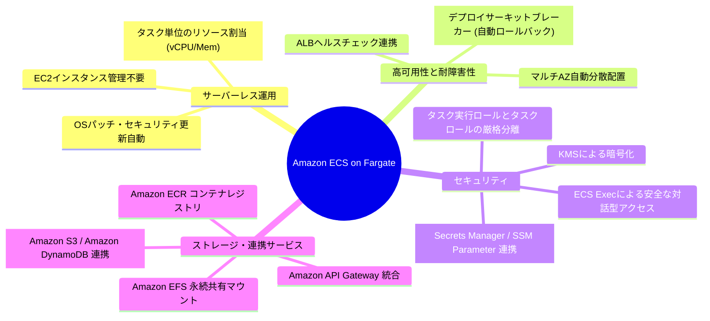

---

### 1.2 全体アーキテクチャ概要図

本システムは、セキュアなマルチ VPC 構成を採用しています。
- **インバウンド通信**: インターネット $\rightarrow$ CloudFront + AWS WAF $\rightarrow$ VPC-A の内部 ALB $\rightarrow$ ECS Fargate
- **アウトバウンド通信**: ECS Fargate $\rightarrow$ Transit Gateway $\rightarrow$ VPC-B (Network Firewall $\rightarrow$ NAT Gateway $\rightarrow$ Internet Gateway) $\rightarrow$ 外部API/SaaS
- **AWSサービス連携**: VPC エンドポイント（Interface / Gateway）経由で VPC 内部から直接 ECR, S3, DynamoDB, Secrets Manager, CloudWatch Logs, EFS, API Gateway へアクセス
- **デプロイ環境**: VPC-A 内の EC2 (Ubuntu LTS Docker) から ECR へイメージをプッシュし、ECS サービスを更新

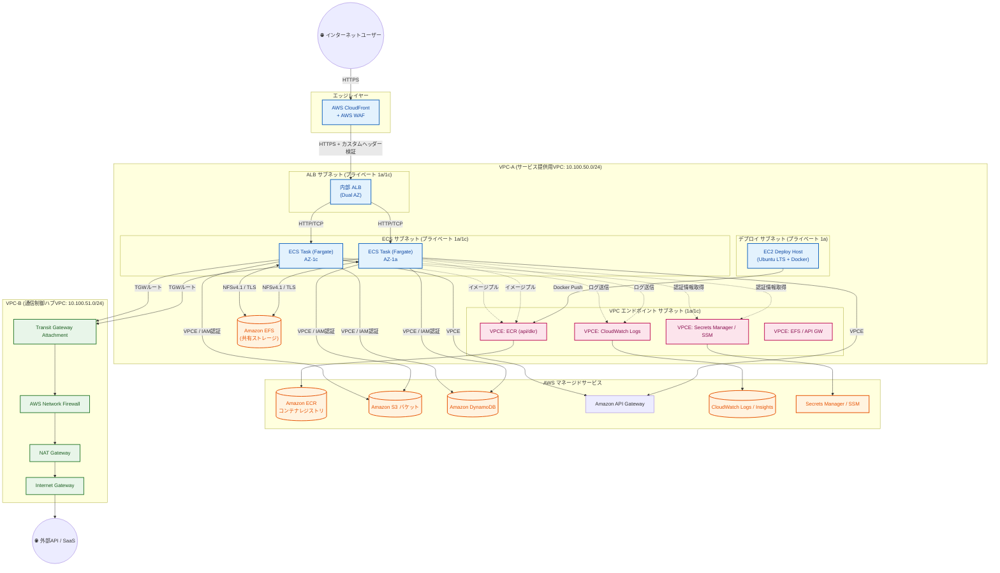

---

### 1.3 ネットワーク通信フロー詳細

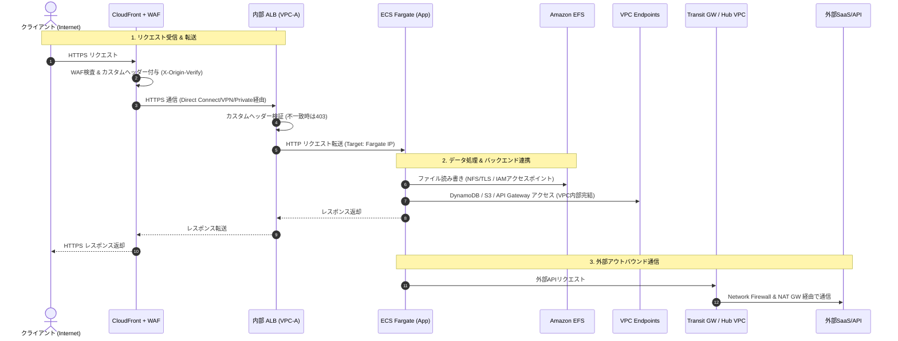

---

### 1.4 前提条件と設計パラメータ一覧

| 項目 | 設定値 / 前提条件 | 備考 |
| :--- | :--- | :--- |
| **AWS リージョン** | `ap-northeast-1` (東京リージョン) | マルチAZ (1a: `ap-northeast-1a`, 1c: `ap-northeast-1c`) |
| **VPC-A (サービス用)** | CIDR: `10.100.50.0/24` | 内部ALB, ECS Fargate, EFS, VPCエンドポイント, EC2デプロイホスト |
| **VPC-B (通信制御ハブ)** | CIDR: `10.100.51.0/24` | **構築済み扱い**（Network Firewall, NAT Gateway, IGW 稼働中） |
| **Transit Gateway (TGW)** | TGW 経由で VPC-A と VPC-B がルーティング接続済み | デフォルトルート `0.0.0.0/0` を TGW に転送 |
| **外部ストレージ・DB** | Amazon EFS, Amazon S3, Amazon DynamoDB, API Gateway | **構築済み扱い**（VPC-A 内部またはリージョナルで稼働中） |
| **コンテナ実行基盤** | Amazon ECS (Launch Type: Fargate, プラットフォーム: 1.4.0 / 最新) | サーバーレス運用 |
| **コンテナイメージ** | Amazon ECR (Private Repository, 暗号化: AWS KMS) | Linux/amd64 (または arm64) |
| **デプロイホスト** | EC2 (Ubuntu 22.04 LTS または 24.04 LTS, Docker Engine導入) | VPC-A 内に配置、ECR push用 |

---

## 2. ネットワーク・サブネット・VPCエンドポイント設計

### 2.1 サブネット設計（東京 1a / 1c マルチAZ）

高可用性を確保するため、すべてのレイヤーを `ap-northeast-1a` と `ap-northeast-1c` の 2 つのアベイラビリティゾーン（AZ）に分散配置します。

| サブネット名 | CIDR ブロック | AZ | 主な用途 |
| :--- | :--- | :--- | :--- |
| `subnet-vpca-alb-1a` | `10.100.50.0/28` | `ap-northeast-1a` | 内部 ALB (プライベート) |
| `subnet-vpca-alb-1c` | `10.100.50.16/28` | `ap-northeast-1c` | 内部 ALB (プライベート) |
| `subnet-vpca-ecs-1a` | `10.100.50.128/26` | `ap-northeast-1a` | ECS Fargate タスク用 |
| `subnet-vpca-ecs-1c` | `10.100.50.192/26` | `ap-northeast-1c` | ECS Fargate タスク用 |
| `subnet-vpca-vpce-1a` | `10.100.50.64/27` | `ap-northeast-1a` | VPC エンドポイント (Interface) |
| `subnet-vpca-vpce-1c` | `10.100.50.96/27` | `ap-northeast-1c` | VPC エンドポイント (Interface) |
| `subnet-vpca-deploy-1a` | `10.100.50.32/27` | `ap-northeast-1a` | EC2 デプロイホスト |

---

### 2.2 ルートテーブルと Transit Gateway ルーティング設計

ECS サブネットおよび EC2 デプロイサブネットからのインターネット向けトラフィック（外部 API 等）は、Transit Gateway (TGW) 経由で VPC-B の Network Firewall / NAT Gateway へ転送されます。

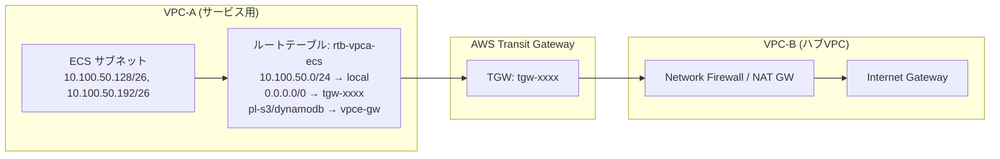

---

### 2.3 VPCエンドポイントの設計と作成

ECS Fargate タスクがプライベートサブネットから AWS サービスへ安全・高速・低コストで通信するために、以下の VPC エンドポイントを配置します。

| サービス名 | エンドポイント種別 | サービス名 (エンドポイント) | 用途 |
| :--- | :--- | :--- | :--- |
| **Amazon ECR (API)** | Interface | `com.amazonaws.ap-northeast-1.ecr.api` | ECR API コール (認証・メタデータ取得) |
| **Amazon ECR (DKR)** | Interface | `com.amazonaws.ap-northeast-1.ecr.dkr` | コンテナイメージレイヤーの Pull |
| **Amazon S3** | Gateway | `com.amazonaws.ap-northeast-1.s3` | ECR レイヤーダウンロード (無料) / S3直接読み書き |
| **CloudWatch Logs** | Interface | `com.amazonaws.ap-northeast-1.logs` | コンテナ標準出力ログ (awslogs) 送信 |
| **Secrets Manager** | Interface | `com.amazonaws.ap-northeast-1.secretsmanager` | DB パスワード等の機密情報取得 |
| **SSM Parameter** | Interface | `com.amazonaws.ap-northeast-1.ssm` | 環境変数・パラメータ取得 |
| **SSM Messages** | Interface | `com.amazonaws.ap-northeast-1.ssmmessages` | **ECS Exec** による対話型シェル接続 |
| **Amazon DynamoDB** | Gateway | `com.amazonaws.ap-northeast-1.dynamodb` | DynamoDB テーブルへの直接高速アクセス (無料) |
| **API Gateway** | Interface | `com.amazonaws.ap-northeast-1.execute-api` | プライベート API Gateway 呼び出し |

---

#### 💡 Interface型VPCエンドポイントのプライベートIP固定化（静的割り当て）設計

AWS のインターフェイス型 VPC エンドポイント（AWS PrivateLink）では、作成時に各サブネット内の **プライベート IP アドレスを明示的に指定して固定化（静的割り当て）** することが可能です。

##### 1. IP 固定化の主なメリットとユースケース
- **ファイアウォール / セキュリティ機器のルール固定化**:
  - オンプレミス環境や他 VPC のファイアウォール、UTM、サードパーティ監視ツール等で特定の送信元・宛先 IP アドレスを静的に許可（ホワイトリスト登録）する必要がある場合。
- **IP アドレス台帳（IPAM）の管理性向上**:
  - エンドポイント用サブネット内の IP アドレスを体系的に採番・管理し、予期せぬ IP の枯渇や重複を防止。
- **エンドポイント再作成時の同一性維持**:
  - 設定変更や再構築に伴いエンドポイントを再作成する場合でも、同一のプライベート IP アドレスを維持可能。

##### 2. IP 割り当て設計例（東京 1a / 1c）
| エンドポイント | サブネット (1a: `10.100.50.64/27`) | サブネット (1c: `10.100.50.96/27`) |
| :--- | :--- | :--- |
| `com.amazonaws.ap-northeast-1.ecr.api` | `10.100.50.70` | `10.100.50.100` |
| `com.amazonaws.ap-northeast-1.ecr.dkr` | `10.100.50.71` | `10.100.50.101` |
| `com.amazonaws.ap-northeast-1.logs` | `10.100.50.72` | `10.100.50.102` |
| `com.amazonaws.ap-northeast-1.secretsmanager` | `10.100.50.73` | `10.100.50.103` |
| `com.amazonaws.ap-northeast-1.ssm` | `10.100.50.74` | `10.100.50.104` |
| `com.amazonaws.ap-northeast-1.ssmmessages` | `10.100.50.75` | `10.100.50.105` |
| `com.amazonaws.ap-northeast-1.execute-api` | `10.100.50.76` | `10.100.50.106` |

> [!IMPORTANT]
> **IP アドレス指定時の注意事項**
> 1. **AWS 予約 IP の除外**: 各サブネットの最初の 4 つ（例: `10.100.50.64`〜`10.100.50.67`）および最後の 1 つ（`10.100.50.95`）は AWS の内部予約 IP のため指定できません。`10.100.50.68` 〜 `10.100.50.94` の範囲から未使用の IP を指定してください。
> 2. **IP の変更**: 作成後にプライベート IP を変更したい場合は、エンドポイントを再作成するか、サブネット構成の再割り当て（サブネットの削除・追加）が必要となります。

---

#### VPCエンドポイント作成手順 (GUI)
1. AWS マネジメントコンソールで **[VPC]** $\rightarrow$ **[エンドポイント]** $\rightarrow$ **[エンドポイントを作成]** をクリックします。
2. **Gateway 型 (S3, DynamoDB)**:
   - サービスカテゴリ: **AWS のサービス**
   - サービス: `com.amazonaws.ap-northeast-1.s3` (または `dynamodb`) を選択
   - VPC: `vpc-vpca` を選択
   - ルートテーブル: ECS 用ルートテーブル (`rtb-vpca-ecs`) にチェック
   - ポリシー: **フルアクセス** (または最小権限)
   - **[エンドポイントを作成]** をクリック
3. **Interface 型（プライベート IP 自動割り当て）**:
   - サービスカテゴリ: **AWS のサービス**
   - サービス: 対象のサービス名（例: `com.amazonaws.ap-northeast-1.ecr.dkr`）を選択
   - VPC: `vpc-vpca` を選択
   - サブネット: `subnet-vpca-vpce-1a` および `subnet-vpca-vpce-1c` を選択
   - セキュリティグループ: `sg-vpce` (後述: 443ポート許可) を選択
   - **[プライベート DNS 名を有効にする]** に必ずチェックを入れる
   - **[エンドポイントを作成]** をクリック
4. **Interface 型（プライベート IP 固定割り当て）**:
   - サービスカテゴリ: **AWS のサービス**
   - サービス: 対象のサービス名（例: `com.amazonaws.ap-northeast-1.ecr.dkr`）を選択
   - VPC: `vpc-vpca` を選択
   - サブネット設定:
     - **アベイラビリティゾーン 1 (`ap-northeast-1a`)**: サブネット `subnet-vpca-vpce-1a` を選択し、**「IPv4 アドレス」** で **「カスタム IPv4 アドレス」** を選択 $\rightarrow$ `10.100.50.71` を入力
     - **アベイラビリティゾーン 2 (`ap-northeast-1c`)**: サブネット `subnet-vpca-vpce-1c` を選択し、**「IPv4 アドレス」** で **「カスタム IPv4 アドレス」** を選択 $\rightarrow$ `10.100.50.101` を入力
   - セキュリティグループ: `sg-vpce` を選択
   - **[プライベート DNS 名を有効にする]** にチェックを入れる
   - **[エンドポイントを作成]** をクリック

---

#### VPCエンドポイント作成手順 (CLI)

##### 1. Gateway型 (S3 / DynamoDB) の作成
```bash
# 1. Gateway型 (S3) の作成
aws ec2 create-vpc-endpoint \
    --vpc-id vpc-0123456789abcdef0 \
    --service-name com.amazonaws.ap-northeast-1.s3 \
    --route-table-ids rtb-0123456789abcdef0 \
    --tag-specifications "ResourceType=vpc-endpoint,Tags=[{Key=Name,Value=vpce-s3-gateway}]"

# 2. Gateway型 (DynamoDB) の作成
aws ec2 create-vpc-endpoint \
    --vpc-id vpc-0123456789abcdef0 \
    --service-name com.amazonaws.ap-northeast-1.dynamodb \
    --route-table-ids rtb-0123456789abcdef0 \
    --tag-specifications "ResourceType=vpc-endpoint,Tags=[{Key=Name,Value=vpce-dynamodb-gateway}]"
```

##### 2. Interface型 (動的IP割り当て) の作成例
```bash
for SERVICE in ecr.api ecr.dkr logs secretsmanager ssmmessages execute-api; do
  aws ec2 create-vpc-endpoint \
      --vpc-id vpc-0123456789abcdef0 \
      --vpc-endpoint-type Interface \
      --service-name com.amazonaws.ap-northeast-1.${SERVICE} \
      --subnet-ids subnet-0111111111111111a subnet-0222222222222222c \
      --security-group-ids sg-0333333333333333e \
      --private-dns-enabled \
      --tag-specifications "ResourceType=vpc-endpoint,Tags=[{Key=Name,Value=vpce-${SERVICE}}]"
done
```

##### 3. Interface型 (プライベートIP固定割り当て) の作成例
Interface 型エンドポイント作成時に `--subnet-configurations` オプションを使用して、各サブネット ID と割り当てるプライベート IPv4 アドレスをペアで明示指定します。

```bash
# 単体作成例: ECR DKR エンドポイント（1a: 10.100.50.71, 1c: 10.100.50.101 で固定）
aws ec2 create-vpc-endpoint \
    --vpc-id vpc-0123456789abcdef0 \
    --vpc-endpoint-type Interface \
    --service-name com.amazonaws.ap-northeast-1.ecr.dkr \
    --subnet-configurations \
        SubnetId=subnet-0111111111111111a,Ipv4=10.100.50.71 \
        SubnetId=subnet-0222222222222222c,Ipv4=10.100.50.101 \
    --security-group-ids sg-0333333333333333e \
    --private-dns-enabled \
    --tag-specifications "ResourceType=vpc-endpoint,Tags=[{Key=Name,Value=vpce-ecr-dkr}]"

# 一括作成例: 各Interfaceエンドポイントを固定IPで作成
VPC_ID="vpc-0123456789abcdef0"
SG_ID="sg-0333333333333333e"
SUBNET_1A="subnet-0111111111111111a"
SUBNET_1C="subnet-0222222222222222c"

# サービス名と固定IPのリスト (サービス名:1a末尾IP:1c末尾IP)
ENDPOINTS=(
  "ecr.api:10.100.50.70:10.100.50.100"
  "ecr.dkr:10.100.50.71:10.100.50.101"
  "logs:10.100.50.72:10.100.50.102"
  "secretsmanager:10.100.50.73:10.100.50.103"
  "ssm:10.100.50.74:10.100.50.104"
  "ssmmessages:10.100.50.75:10.100.50.105"
  "execute-api:10.100.50.76:10.100.50.106"
)

for item in "${ENDPOINTS[@]}"; do
  IFS=":" read -r SVC IP_1A IP_1C <<< "$item"
  echo "Creating VPC Endpoint: com.amazonaws.ap-northeast-1.${SVC} (1a: ${IP_1A}, 1c: ${IP_1C})..."
  aws ec2 create-vpc-endpoint \
      --vpc-id "${VPC_ID}" \
      --vpc-endpoint-type Interface \
      --service-name "com.amazonaws.ap-northeast-1.${SVC}" \
      --subnet-configurations \
          SubnetId="${SUBNET_1A}",Ipv4="${IP_1A}" \
          SubnetId="${SUBNET_1C}",Ipv4="${IP_1C}" \
      --security-group-ids "${SG_ID}" \
      --private-dns-enabled \
      --tag-specifications "ResourceType=vpc-endpoint,Tags=[{Key=Name,Value=vpce-${SVC}}]"
done
```

---

## 3. ECR（Amazon Elastic Container Registry）の作成と設定

### 3.1 ECRリポジトリ設計（暗号化・タグ不変性・ライフサイクル）

本番運用における ECR のベストプラクティス設計：
1. **タグの不変性 (Tag Immutability)**:
   - `TAG_MUTABLE` ではなく `TAG_IMMUTABLE` を有効化します。同一タグ（例: `v1.0.0`）の上書きを禁止し、予期せぬイメージ差し替えやサプライチェーン攻撃を防止します。
2. **保管時暗号化 (KMS)**:
   - デフォルトの AES-256 ではなく、AWS KMS カスタマーマネージドキー（CMK）による暗号化を適用し、鍵のローテーションとアクセス制御を厳格化します。
3. **ライフサイクルポリシー (Lifecycle Policy)**:
   - 未タグ付けイメージ（タグなし）を 1 日で自動削除し、世代タグ付きイメージを最新 30 世代のみ保持してストレージコストを削減します。
4. **脆弱性スキャン (Image Scanning)**:
   - `SCAN_ON_PUSH` を有効化し、プッシュ時に自動的に脆弱性 (CVE) を検知します。

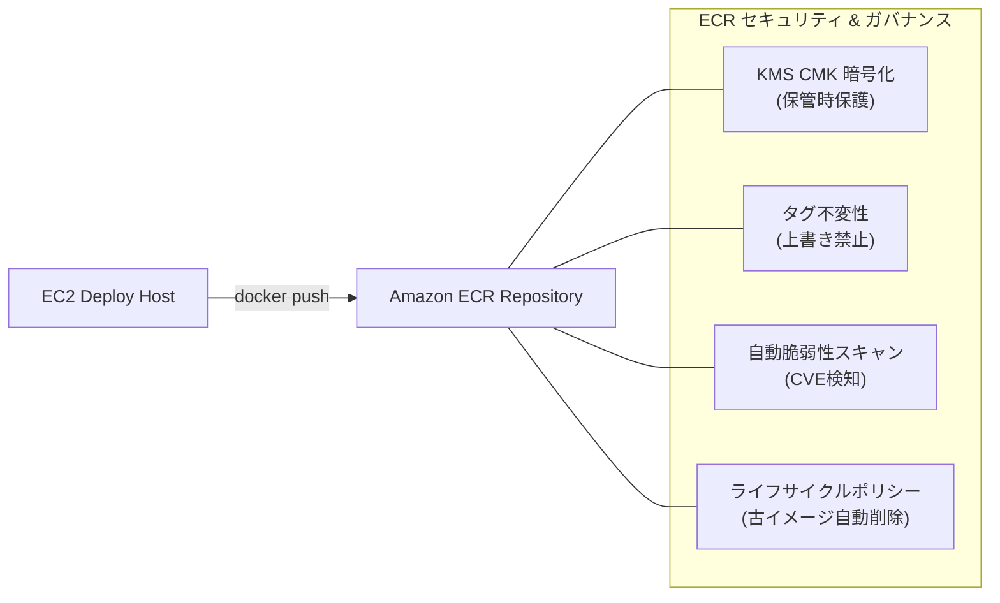

---

### 3.2 ECRリポジトリの作成手順

#### ECRリポジトリ作成手順 (GUI)
1. AWS マネジメントコンソールで **[Amazon ECR]** $\rightarrow$ **[リポジトリ]** $\rightarrow$ **[リポジトリを作成]** をクリックします。
2. **基本設定**:
   - 可視性設定: **プライベート**
   - リポジトリ名: `app-production-repo`
3. **タグの不変性**: **有効** に設定
4. **暗号化設定**:
   - 暗号化タイプ: **KMS**
   - KMS キー: `arn:aws:kms:ap-northeast-1:123456789012:key/xxxx` (または `alias/aws/ecr`)
5. **イメージスキャンの設定**:
   - プッシュ時にスキャン: **有効**
6. **[リポジトリを作成]** をクリックします。

#### ECRリポジトリ作成手順 (CLI)
```bash
# ECR リポジトリの作成（KMS暗号化・タグ不変性・プッシュ時スキャン有効）
aws ecr create-repository \
    --repository-name app-production-repo \
    --image-tag-mutability IMMUTABLE \
    --image-scanning-configuration scanOnPush=true \
    --encryption-configuration encryptionType=KMS,kmsKey=arn:aws:kms:ap-northeast-1:123456789012:alias/app-ecr-key \
    --tags Key=Environment,Value=Production Key=Project,Value=ECS-Service
```

---

### 3.3 脆弱性スキャンとライフサイクルポリシーの設定

#### ライフサイクルポリシー定義 (`ecr-lifecycle-policy.json`)
```json
{
  "rules": [
    {
      "rulePriority": 1,
      "description": "未タグ付け（untagged）の古いイメージを1日で削除",
      "selection": {
        "tagStatus": "untagged",
        "countType": "sinceImagePushed",
        "countUnit": "days",
        "countNumber": 1
      },
      "action": {
        "type": "expire"
      }
    },
    {
      "rulePriority": 2,
      "description": "リリースバージョンイメージを最新30世代のみ保持",
      "selection": {
        "tagStatus": "tagged",
        "tagPrefixList": ["v", "release", "prod"],
        "countType": "imageCountMoreThan",
        "countNumber": 30
      },
      "action": {
        "type": "expire"
      }
    }
  ]
}
```

#### ライフサイクルポリシー適用 (CLI)
```bash
aws ecr put-lifecycle-policy \
    --repository-name app-production-repo \
    --lifecycle-policy-text file://ecr-lifecycle-policy.json
```

---

## 4. 内部ALB（Application Load Balancer）の作成とCloudFrontセキュア連携

### 4.1 内部ALBのネットワーク・セキュリティ設計

内部 ALB はプライベートサブネットに配置され、**CloudFront からのリクエストのみを安全に受け入れる** 構成をとります。  
直接の不正アクセスや CloudFront をバイパスしたアクセスを防止するため、以下の 2 重の防御策を講じます：
1. **CloudFront オリジンカスタムヘッダー検証**:
   - CloudFront からオリジンリクエスト送信時に秘密のカスタムヘッダー（例: `X-Origin-Verify: <ランダムUUID>`）を付与。
   - 内部 ALB のリスナールールでこのヘッダー値が一致しない通信は即座に `HTTP 403 Forbidden` を返却。
2. **セキュリティグループ制限**:
   - CloudFront 用の AWS マネージドプレフィックスリスト (`pl-58a04531` 等) または VPC 内部 CIDR のみからの HTTPS 通信を許可。

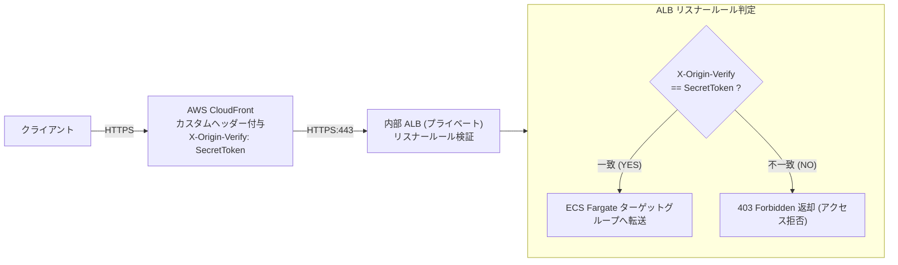

---

### 4.2 ターゲットグループの作成（IPターゲット）

ECS Fargate は `awsvpc` ネットワークモードを使用するため、ターゲットグループのターゲットタイプは **`ip`** を選択します。

#### ターゲットグループ作成手順 (GUI)
1. **[EC2]** $\rightarrow$ **[ロードバランサー]** $\rightarrow$ **[ターゲットグループ]** $\rightarrow$ **[ターゲットグループの作成]** をクリック。
2. **基本設定**:
   - ターゲットタイプの選択: **IP アドレス**
   - ターゲットグループ名: `tg-ecs-fargate-app`
   - プロトコル: `HTTP`, ポート: `80` (またはコンテナ待機ポート: `8080`)
   - VPC: `vpc-vpca`
3. **ヘルスチェック**:
   - ヘルスチェックプロトコル: `HTTP`
   - ヘルスチェックパス: `/health` (または `/api/health`)
   - 正常のしきい値: `2`, 非正常のしきい値: `3`, タイムアウト: `5秒`, 間隔: `15秒`, 成功コード: `200`
4. **[次へ]** $\rightarrow$ (IP の登録は ECS サービス作成時に自動で行われるため空のまま) $\rightarrow$ **[ターゲットグループの作成]** をクリック。

#### ターゲットグループ作成手順 (CLI)
```bash
aws elbv2 create-target-group \
    --name tg-ecs-fargate-app \
    --protocol HTTP \
    --port 8080 \
    --target-type ip \
    --vpc-id vpc-0123456789abcdef0 \
    --health-check-protocol HTTP \
    --health-check-port 8080 \
    --health-check-path /health \
    --health-check-interval-seconds 15 \
    --health-check-timeout-seconds 5 \
    --healthy-threshold-count 2 \
    --unhealthy-threshold-count 3 \
    --matcher HttpCode=200 \
    --tags Key=Environment,Value=Production
```

---

### 4.3 内部ALBの作成とリスナー設定

#### 内部ALB作成手順 (GUI)
1. **[EC2]** $\rightarrow$ **[ロードバランサー]** $\rightarrow$ **[ロードバランサーの作成]** $\rightarrow$ **Application Load Balancer** を選択。
2. **基本構成**:
   - ロードバランサー名: `alb-internal-vpca`
   - スキーム: **内部 (Internal)**
   - IP アドレスタイプ: **IPv4**
3. **ネットワークマッピング**:
   - VPC: `vpc-vpca`
   - マッピング: `subnet-vpca-alb-1a` および `subnet-vpca-alb-1c` を選択
4. **セキュリティグループ**: `sg-alb-internal` (443ポート許可) を選択
5. **リスナーとルーティング**:
   - プロトコル: `HTTPS`, ポート: `443`
   - 証明書: ACM (AWS Certificate Manager) のプライベート証明書またはパブリック証明書を選択
   - デフォルトアクション: 固定レスポンス `403 Forbidden`（不正アクセス遮断）
6. **[ロードバランサーの作成]** をクリック。

#### 内部ALB作成手順 (CLI)
```bash
aws elbv2 create-load-balancer \
    --name alb-internal-vpca \
    --scheme internal \
    --type application \
    --subnets subnet-0111111111111111a subnet-0222222222222222c \
    --security-groups sg-0aaaa1111bbbb2222 \
    --ip-address-type ipv4 \
    --tags Key=Name,Value=alb-internal-vpca Key=Environment,Value=Production
```

---

### 4.4 CloudFrontカスタムヘッダー検証によるアクセス制限

#### リスナールール作成 (CLI)
```bash
# 1. リスナー ARN の取得
LISTENER_ARN=$(aws elbv2 describe-listeners \
    --load-balancer-arn arn:aws:elasticloadbalancing:ap-northeast-1:123456789012:loadbalancer/app/alb-internal-vpca/xxxx \
    --query "Listeners[?Port==\`443\`].ListenerArn" --output text)

# 2. カスタムヘッダー (X-Origin-Verify) が一致する場合に ECS ターゲットグループへ転送するルールを追加
aws elbv2 create-rule \
    --listener-arn ${LISTENER_ARN} \
    --priority 10 \
    --conditions '[
      {
        "Field": "http-header",
        "HttpHeaderConfig": {
          "HttpHeaderName": "X-Origin-Verify",
          "Values": ["MySuperSecretTokenValue2026!"]
        }
      }
    ]' \
    --actions Type=forward,TargetGroupArn=arn:aws:elasticloadbalancing:ap-northeast-1:123456789012:targetgroup/tg-ecs-fargate-app/xxxx
```

---

## 5. IAMロール・ポリシーの設計と作成

### 5.1 ECSにおけるIAMロールの分離原則

ECS では、**2 種類の異なる IAM ロール** を明確に使い分ける必要があります。さらに、本番運用では **EC2 デプロイマシン用ロール** も厳格に分離します。

```mermaid
flowchart TD
    subgraph Roles ["ECS / デプロイ IAM ロール体系"]
        ExecRole["1. ECS タスク実行ロール<br>(Task Execution Role)"]
        TaskRole["2. ECS タスクロール<br>(Task Role)"]
        DeployRole["3. EC2 デプロイロール<br>(Deploy Host Role)"]
    end

    subgraph AWS_ControlPlane ["AWS 基盤・エージェント層"]
        ECR_Pull["ECR イメージ Pull"]
        CW_Logs["CloudWatch ログストリーム作成・書込"]
        SM_SSM["Secrets Manager / SSM パラメータ復号"]
    end

    subgraph App_DataPlane ["コンテナアプリケーション層"]
        EFS_Mount["EFS 読み書き (ClientMount/Write)"]
        S3_Access["S3 バケット読み書き"]
        DDB_Access["DynamoDB 読み書き"]
        APIGW_Call["API Gateway execute-api 呼出"]
        SSM_Exec["ECS Exec (ssmmessages)"]
    end

    subgraph Build_Pipeline ["デプロイパイプライン"]
        ECR_Push["ECR 認証 & docker push"]
        ECS_Update["ECS Task定義登録 & サービス更新"]
    end

    ExecRole --> ECR_Pull
    ExecRole --> CW_Logs
    ExecRole --> SM_SSM

    TaskRole --> EFS_Mount
    TaskRole --> S3_Access
    TaskRole --> DDB_Access
    TaskRole --> APIGW_Call
    TaskRole --> SSM_Exec

    DeployRole --> ECR_Push
    DeployRole --> ECS_Update

    classDef exec fill:#e3f2fd,stroke:#1565c0,stroke-width:2px;
    classDef task fill:#e8f5e9,stroke:#2e7d32,stroke-width:2px;
    classDef deploy fill:#fff3e0,stroke:#e65100,stroke-width:2px;
    class ExecRole exec;
    class TaskRole task;
    class DeployRole deploy;
```

---

### 5.2 ECSタスク実行ロール（Task Execution Role）の作成

コンテナ起動前に **ECS エージェント / Fargate 基盤** が使用するロールです。

#### 信頼ポリシー (`ecs-tasks-trust-policy.json`)
```json
{
  "Version": "2012-10-17",
  "Statement": [
    {
      "Effect": "Allow",
      "Principal": {
        "Service": "ecs-tasks.amazonaws.com"
      },
      "Action": "sts:AssumeRole"
    }
  ]
}
```

#### カスタム実行ポリシー (`ecs-task-execution-policy.json`)
```json
{
  "Version": "2012-10-17",
  "Statement": [
    {
      "Sid": "AllowECRAndLogs",
      "Effect": "Allow",
      "Action": [
        "ecr:GetAuthorizationToken",
        "ecr:BatchCheckLayerAvailability",
        "ecr:GetDownloadUrlForLayer",
        "ecr:BatchGetImage",
        "logs:CreateLogStream",
        "logs:PutLogEvents"
      ],
      "Resource": "*"
    },
    {
      "Sid": "AllowSecretsAndKMS",
      "Effect": "Allow",
      "Action": [
        "secretsmanager:GetSecretValue",
        "ssm:GetParameters",
        "kms:Decrypt"
      ],
      "Resource": [
        "arn:aws:secretsmanager:ap-northeast-1:123456789012:secret:app/production/*",
        "arn:aws:ssm:ap-northeast-1:123456789012:parameter/app/production/*",
        "arn:aws:kms:ap-northeast-1:123456789012:key/xxxx"
      ]
    }
  ]
}
```

#### 作成コマンド (CLI)
```bash
aws iam create-role \
    --role-name ecsTaskExecutionRole-App \
    --assume-role-policy-document file://ecs-tasks-trust-policy.json

aws iam put-role-policy \
    --role-name ecsTaskExecutionRole-App \
    --policy-name ecsTaskExecutionPolicy \
    --policy-document file://ecs-task-execution-policy.json
```

---

### 5.3 ECSタスクロール（Task Role）の作成

起動した **コンテナ内のアプリケーション** が各 AWS サービス（EFS, S3, DynamoDB, API Gateway, ECS Exec）にアクセスするためのロールです。

#### タスクポリシー (`ecs-task-app-policy.json`)
```json
{
  "Version": "2012-10-17",
  "Statement": [
    {
      "Sid": "EFSAccess",
      "Effect": "Allow",
      "Action": [
        "elasticfilesystem:ClientMount",
        "elasticfilesystem:ClientWrite",
        "elasticfilesystem:ClientRootAccess"
      ],
      "Resource": "arn:aws:elasticfilesystem:ap-northeast-1:123456789012:file-system/fs-0123456789abcdef0",
      "Condition": {
        "StringEquals": {
          "elasticfilesystem:AccessPointArn": "arn:aws:elasticfilesystem:ap-northeast-1:123456789012:access-point/fsap-0123456789abcdef0"
        }
      }
    },
    {
      "Sid": "S3BucketAccess",
      "Effect": "Allow",
      "Action": [
        "s3:GetObject",
        "s3:PutObject",
        "s3:ListBucket",
        "s3:DeleteObject"
      ],
      "Resource": [
        "arn:aws:s3:::app-production-data-bucket-12345",
        "arn:aws:s3:::app-production-data-bucket-12345/*"
      ]
    },
    {
      "Sid": "DynamoDBAccess",
      "Effect": "Allow",
      "Action": [
        "dynamodb:GetItem",
        "dynamodb:PutItem",
        "dynamodb:UpdateItem",
        "dynamodb:DeleteItem",
        "dynamodb:Query",
        "dynamodb:Scan"
      ],
      "Resource": "arn:aws:dynamodb:ap-northeast-1:123456789012:table/AppProductionTable"
    },
    {
      "Sid": "APIGatewayInvoke",
      "Effect": "Allow",
      "Action": [
        "execute-api:Invoke"
      ],
      "Resource": "arn:aws:execute-api:ap-northeast-1:123456789012:*/*/*/*"
    },
    {
      "Sid": "ECSExecSupport",
      "Effect": "Allow",
      "Action": [
        "ssmmessages:CreateControlChannel",
        "ssmmessages:CreateDataChannel",
        "ssmmessages:OpenControlChannel",
        "ssmmessages:OpenDataChannel"
      ],
      "Resource": "*"
    }
  ]
}
```

#### 作成コマンド (CLI)
```bash
aws iam create-role \
    --role-name ecsTaskRole-App \
    --assume-role-policy-document file://ecs-tasks-trust-policy.json

aws iam put-role-policy \
    --role-name ecsTaskRole-App \
    --policy-name ecsTaskAppPolicy \
    --policy-document file://ecs-task-app-policy.json
```

---

### 5.4 EC2デプロイマシン用IAMロールの作成

VPC-A 内のデプロイ用 EC2 が ECR への push と ECS サービスの更新を行うためのロールです。

#### 信頼ポリシー (`ec2-trust-policy.json`)
```json
{
  "Version": "2012-10-17",
  "Statement": [
    {
      "Effect": "Allow",
      "Principal": {
        "Service": "ec2.amazonaws.com"
      },
      "Action": "sts:AssumeRole"
    }
  ]
}
```

#### デプロイポリシー (`ec2-deploy-policy.json`)
```json
{
  "Version": "2012-10-17",
  "Statement": [
    {
      "Sid": "ECRAuthAndPush",
      "Effect": "Allow",
      "Action": [
        "ecr:GetAuthorizationToken",
        "ecr:BatchCheckLayerAvailability",
        "ecr:GetDownloadUrlForLayer",
        "ecr:BatchGetImage",
        "ecr:PutImage",
        "ecr:InitiateLayerUpload",
        "ecr:UploadLayerPart",
        "ecr:CompleteLayerUpload"
      ],
      "Resource": "*"
    },
    {
      "Sid": "ECSDeployPermissions",
      "Effect": "Allow",
      "Action": [
        "ecs:DescribeServices",
        "ecs:UpdateService",
        "ecs:DescribeTaskDefinition",
        "ecs:RegisterTaskDefinition",
        "iam:PassRole"
      ],
      "Resource": "*"
    }
  ]
}
```

#### 作成とEC2へのアタッチ (CLI)
```bash
aws iam create-role \
    --role-name ec2DeployHostRole \
    --assume-role-policy-document file://ec2-trust-policy.json

aws iam put-role-policy \
    --role-name ec2DeployHostRole \
    --policy-name ec2DeployPolicy \
    --policy-document file://ec2-deploy-policy.json

# インスタンスプロファイルの作成とEC2への紐付け
aws iam create-instance-profile --instance-profile-name ec2DeployHostProfile
aws iam add-role-to-instance-profile --instance-profile-name ec2DeployHostProfile --role-name ec2DeployHostRole
aws ec2 associate-iam-instance-profile --instance-id i-0123456789abcdef0 --iam-instance-profile Name=ec2DeployHostProfile
```

---

## 6. セキュリティグループの設計と設定

### 6.1 セキュリティグループ設計マトリクス（最小権限設計）

各層間の通信をセキュリティグループ ID の相互参照（SG-to-SG）で厳格に制御します。

| セキュリティグループ名 | インバウンド許可 (送信元) | ポート / プロトコル | アウトバウンド許可 (宛先) | 備考 |
| :--- | :--- | :--- | :--- | :--- |
| **`sg-alb-internal`** | CloudFront プレフィックスリスト または VPC-A CIDR | `HTTPS (443)` | `sg-ecs-fargate` (`HTTP 8080`) | 内部 ALB 用 |
| **`sg-ecs-fargate`** | `sg-alb-internal` | `HTTP (8080)` | `sg-vpce` (`HTTPS 443`)<br>`sg-efs` (`NFS 2049`)<br>`0.0.0.0/0` (TGW経由外部通信) | ECS タスク用 |
| **`sg-vpce`** | `sg-ecs-fargate`, `sg-ec2-deploy` | `HTTPS (443)` | なし (ステートフル) | Interface VPCエンドポイント用 |
| **`sg-efs`** | `sg-ecs-fargate` | `NFS (2049)` | なし (ステートフル) | EFS マウントターゲット用 |
| **`sg-ec2-deploy`** | 管理用踏み台 / SSM Session Manager | なし (SSM接続) | `sg-vpce` (`HTTPS 443`)<br>`0.0.0.0/0` (TGW経由外部通信) | EC2 デプロイマシン用 |

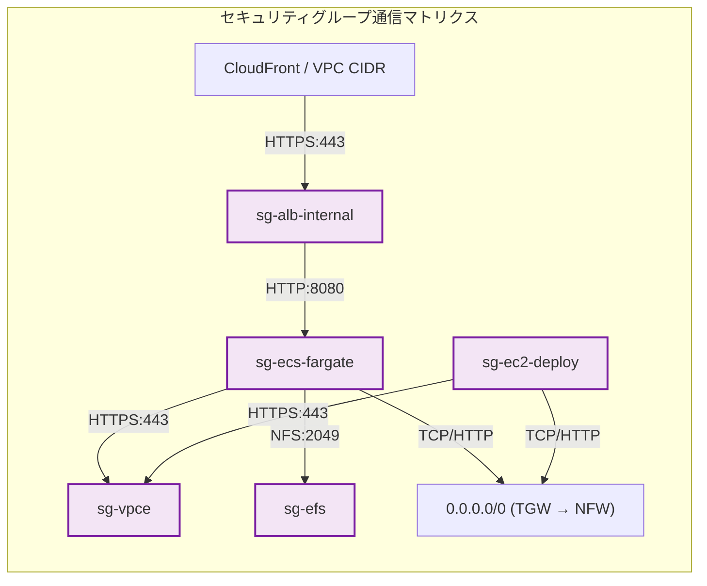

---

### 6.2 各セキュリティグループの作成とルール設定

#### CLI による作成とルール設定
```bash
# 1. セキュリティグループの作成
SG_ALB=$(aws ec2 create-security-group --group-name sg-alb-internal --description "SG for Internal ALB" --vpc-id vpc-0123456789abcdef0 --query "GroupId" --output text)
SG_ECS=$(aws ec2 create-security-group --group-name sg-ecs-fargate --description "SG for ECS Fargate Tasks" --vpc-id vpc-0123456789abcdef0 --query "GroupId" --output text)
SG_VPCE=$(aws ec2 create-security-group --group-name sg-vpce --description "SG for VPC Endpoints" --vpc-id vpc-0123456789abcdef0 --query "GroupId" --output text)
SG_EFS=$(aws ec2 create-security-group --group-name sg-efs --description "SG for EFS Mount Targets" --vpc-id vpc-0123456789abcdef0 --query "GroupId" --output text)
SG_EC2=$(aws ec2 create-security-group --group-name sg-ec2-deploy --description "SG for EC2 Deploy Host" --vpc-id vpc-0123456789abcdef0 --query "GroupId" --output text)

# 2. ALB SG ルール (443 インバウンド)
aws ec2 authorize-security-group-ingress --group-id ${SG_ALB} --protocol tcp --port 443 --cidr 10.100.50.0/24

# 3. ECS SG ルール (ALB からの 8080 インバウンド)
aws ec2 authorize-security-group-ingress --group-id ${SG_ECS} --protocol tcp --port 8080 --source-group ${SG_ALB}

# 4. VPC Endpoint SG ルール (ECS および EC2 からの 443 インバウンド)
aws ec2 authorize-security-group-ingress --group-id ${SG_VPCE} --protocol tcp --port 443 --source-group ${SG_ECS}
aws ec2 authorize-security-group-ingress --group-id ${SG_VPCE} --protocol tcp --port 443 --source-group ${SG_EC2}

# 5. EFS SG ルール (ECS からの 2049 インバウンド)
aws ec2 authorize-security-group-ingress --group-id ${SG_EFS} --protocol tcp --port 2049 --source-group ${SG_ECS}
```

---

## 7. ECS Fargate クラスター・タスク定義・サービスの作成

### 7.1 ECSクラスターの作成とContainer Insights有効化

#### GUI 手順
1. **[Amazon ECS]** $\rightarrow$ **[クラスター]** $\rightarrow$ **[クラスターの作成]** をクリック。
2. クラスター名: `ecs-cluster-production`
3. インフラストラクチャ: **AWS Fargate (サーバーレス)** にチェック。
4. **モニタリング**: **Container Insights の使用** を **オン** に設定。
5. **[作成]** をクリック。

#### CLI コマンド
```bash
aws ecs create-cluster \
    --cluster-name ecs-cluster-production \
    --settings name=containerInsights,value=enabled \
    --tags Key=Environment,Value=Production
```

---

### 7.2 タスク定義の作成（EFSマウント・Secrets注入・ログ設定）

以下の要件を満たすタスク定義を作成します：
- EFS ボリュームマウント（アクセスポイント使用）
- Secrets Manager および SSM Parameter Store からの環境変数注入
- `awslogs` ログドライバによる CloudWatch Logs 出力
- CPU: `0.5 vCPU (512)`, メモリ: `1 GB (1024)`

#### タスク定義 JSON (`task-definition.json`)
```json
{
  "family": "app-production-task",
  "networkMode": "awsvpc",
  "requiresCompatibilities": ["FARGATE"],
  "cpu": "512",
  "memory": "1024",
  "executionRoleArn": "arn:aws:iam::123456789012:role/ecsTaskExecutionRole-App",
  "taskRoleArn": "arn:aws:iam::123456789012:role/ecsTaskRole-App",
  "volumes": [
    {
      "name": "efs-app-volume",
      "efsVolumeConfiguration": {
        "fileSystemId": "fs-0123456789abcdef0",
        "transitEncryption": "ENABLED",
        "authorizationConfig": {
          "accessPointId": "fsap-0123456789abcdef0",
          "iam": "ENABLED"
        }
      }
    }
  ],
  "containerDefinitions": [
    {
      "name": "app-container",
      "image": "123456789012.dkr.ecr.ap-northeast-1.amazonaws.com/app-production-repo:v1.0.0",
      "essential": true,
      "portMappings": [
        {
          "containerPort": 8080,
          "hostPort": 8080,
          "protocol": "tcp"
        }
      ],
      "mountPoints": [
        {
          "sourceVolume": "efs-app-volume",
          "containerPath": "/mnt/shared-data",
          "readOnly": false
        }
      ],
      "environment": [
        { "name": "APP_ENV", "value": "production" },
        { "name": "AWS_REGION", "value": "ap-northeast-1" },
        { "name": "DYNAMODB_TABLE", "value": "AppProductionTable" },
        { "name": "S3_BUCKET_NAME", "value": "app-production-data-bucket-12345" }
      ],
      "secrets": [
        {
          "name": "DB_PASSWORD",
          "valueFrom": "arn:aws:secretsmanager:ap-northeast-1:123456789012:secret:app/production/db-password:password::"
        },
        {
          "name": "API_KEY",
          "valueFrom": "arn:aws:ssm:ap-northeast-1:123456789012:parameter/app/production/api-key"
        }
      ],
      "logConfiguration": {
        "logDriver": "awslogs",
        "options": {
          "awslogs-group": "/ecs/app-production",
          "awslogs-region": "ap-northeast-1",
          "awslogs-stream-prefix": "app",
          "awslogs-create-group": "true"
        }
      },
      "healthCheck": {
        "command": ["CMD-SHELL", "curl -f http://localhost:8080/health || exit 1"],
        "interval": 30,
        "timeout": 5,
        "retries": 3,
        "startPeriod": 60
      }
    }
  ]
}
```

#### タスク定義登録 (CLI)
```bash
aws ecs register-task-definition --cli-input-json file://task-definition.json
```

---

### 7.3 ECS Fargate サービスの作成（ALB連携・サーキットブレーカー・ECS Exec）

#### ECS サービス作成 (CLI)
```bash
aws ecs create-service \
    --cluster ecs-cluster-production \
    --service-name app-production-service \
    --task-definition app-production-task \
    --desired-count 2 \
    --launch-type FARGATE \
    --platform-version LATEST \
    --enable-execute-command \
    --deployment-configuration "maximumPercent=200,minimumHealthyPercent=100,deploymentCircuitBreaker={enable=true,rollback=true}" \
    --network-configuration "awsvpcConfiguration={subnets=[subnet-0111111111111111a,subnet-0222222222222222c],securityGroups=[sg-0444444444444444e],assignPublicIp=DISABLED}" \
    --load-balancers "targetGroupArn=arn:aws:elasticloadbalancing:ap-northeast-1:123456789012:targetgroup/tg-ecs-fargate-app/xxxx,containerName=app-container,containerPort=8080" \
    --tags Key=Environment,Value=Production
```

> [!IMPORTANT]
> **デプロイサーキットブレーカー（Circuit Breaker）**:  
> `deploymentCircuitBreaker={enable=true,rollback=true}` を有効にすることで、新しいタスクの起動失敗やヘルスチェック失敗時にデプロイを自動中断し、正常だった直前のタスクリビジョンへ自動ロールバックします。

---

## 8. アプリケーションのデプロイ手順とパイプライン

### 8.1 EC2（Ubuntu LTS）デプロイ環境のセットアップ

VPC-A 内の Ubuntu EC2 で Docker および AWS CLI v2 をセットアップします。

```bash
# 1. パッケージ更新と Docker のインストール
sudo apt-get update -y
sudo apt-get install -y ca-certificates curl gnupg lsb-release

# Docker 公式 GPG キーとリポジトリ追加
sudo mkdir -p /etc/apt/keyrings
curl -fsSL https://download.docker.com/linux/ubuntu/gpg | sudo gpg --dearmor -o /etc/apt/keyrings/docker.gpg
echo "deb [arch=$(dpkg --print-architecture) signed-by=/etc/apt/keyrings/docker.gpg] https://download.docker.com/linux/ubuntu $(lsb_release -cs) stable" | sudo tee /etc/apt/sources.list.d/docker.list > /dev/null

sudo apt-get update -y
sudo apt-get install -y docker-ce docker-ce-cli containerd.io docker-buildx-plugin docker-compose-plugin

# ubuntu ユーザーを docker グループに追加
sudo usermod -aG docker ubuntu
newgrp docker

# 2. AWS CLI v2 のインストール
curl "https://awscli.amazonaws.com/awscli-exe-linux-x86_64.zip" -o "awscliv2.zip"
sudo apt-get install -y unzip
unzip awscliv2.zip
sudo ./aws/install
```

---

### 8.2 DockerイメージのビルドとECRプッシュ

EC2 にアタッチした IAM ロール（`ec2DeployHostRole`）により、アクセスキー不要で一時認証トークンを取得します。

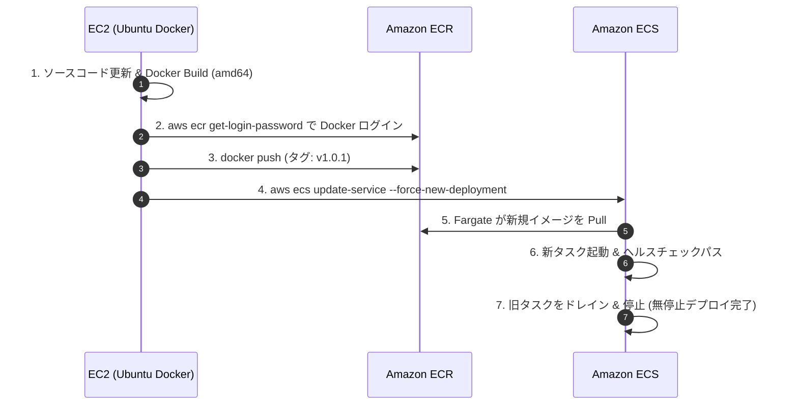

```bash
# 変数定義
AWS_ACCOUNT_ID="123456789012"
AWS_REGION="ap-northeast-1"
REPO_NAME="app-production-repo"
IMAGE_TAG="v1.0.1"
ECR_URI="${AWS_ACCOUNT_ID}.dkr.ecr.${AWS_REGION}.amazonaws.com/${REPO_NAME}"

# 1. Docker ビルド (プラットフォームを明示)
docker build --platform linux/amd64 -t ${REPO_NAME}:${IMAGE_TAG} .

# 2. ECR ログイン
aws ecr get-login-password --region ${AWS_REGION} | docker login --username AWS --password-stdin ${AWS_ACCOUNT_ID}.dkr.ecr.${AWS_REGION}.amazonaws.com

# 3. タグ付けとプッシュ
docker tag ${REPO_NAME}:${IMAGE_TAG} ${ECR_URI}:${IMAGE_TAG}
docker push ${ECR_URI}:${IMAGE_TAG}
```

---

### 8.3 ECSサービスのローリングアップデート手順

#### 新タスク定義の登録とサービス更新 (CLI)
```bash
# 1. 新しいイメージタグでタスク定義を登録（jqでコンテナイメージを置換）
NEW_TASK_DEF=$(aws ecs describe-task-definition --task-definition app-production-task \
    | jq --arg IMAGE "${ECR_URI}:${IMAGE_TAG}" '.taskDefinition | .containerDefinitions[0].image = $IMAGE | del(.taskDefinitionArn, .revision, .status, .requiresAttributes, .compatibilities, .registeredAt, .registeredBy)')

aws ecs register-task-definition --cli-input-json "${NEW_TASK_DEF}"

# 2. ECS サービスの更新（ローリングアップデートのトリガー）
aws ecs update-service \
    --cluster ecs-cluster-production \
    --service app-production-service \
    --task-definition app-production-task \
    --force-new-deployment
```

#### デプロイ完了の待機と確認 (CLI)
```bash
# デプロイが安定するまで待機
aws ecs wait services-stable \
    --cluster ecs-cluster-production \
    --services app-production-service

echo "ECS Service Deployment Completed Successfully!"
```

---

### 8.4 デプロイロールバックと動作確認

万一、新しいバージョンに問題が発生した場合の手動即時ロールバック手順：

```bash
# 直前の安定リビジョン（例: リビジョン 5）に戻す
aws ecs update-service \
    --cluster ecs-cluster-production \
    --service app-production-service \
    --task-definition app-production-task:5 \
    --force-new-deployment
```

---

## 9. メンテナンス・バックアップ・災害復旧（DR）設計

### 9.1 ECSにおけるメンテナンス・可用性の考え方（ステートレス分離）

> [!NOTE]
> **ECS Fargate は「ステートレス」設計が基本**:  
> コンテナインスタンス自体に永続データを保持しないため、ECS Fargate 単体のディスクスナップショットを作成・復元するという概念はありません。  
> 障害発生時やメンテナンス時は、**「コンテナを破棄して新しいタスクを再起動・再デプロイする」** ことが基本方針となります。

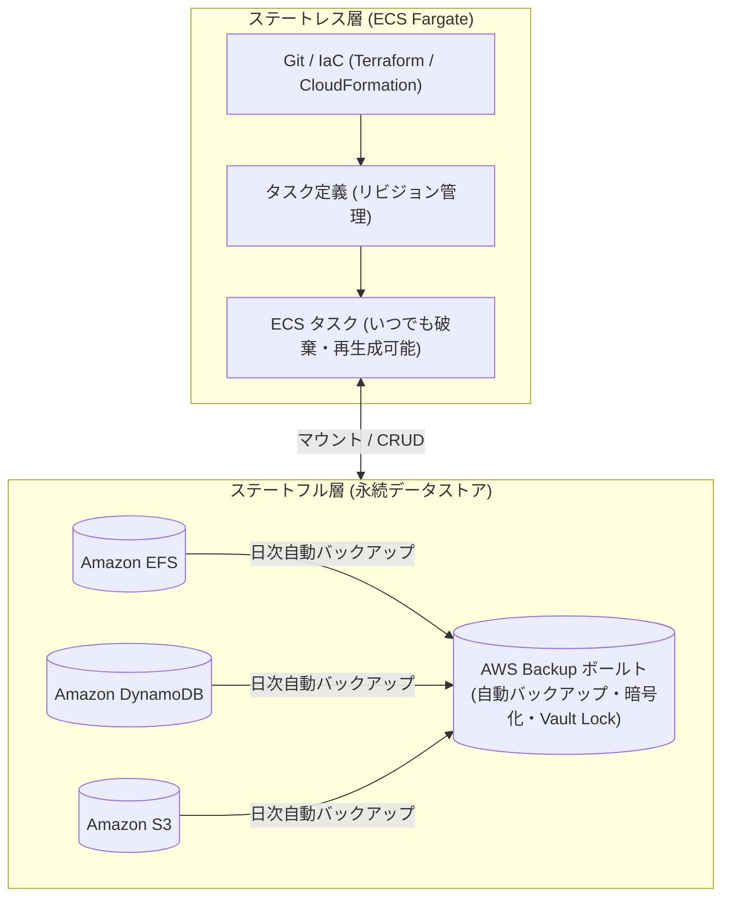

---

### 9.2 タスク定義・インフラの構成管理（IaC・リビジョン管理）

1. **タスク定義の不変性とリビジョン管理**:
   - ECS タスク定義は登録ごとに自動でリビジョン番号（例: `:1`, `:2`, `:3`）が付与され、過去のリビジョンは保持されます。
2. **インフラのコード化 (IaC)**:
   - クラスター、サービス、タスク定義、セキュリティグループ、ALB の設定はすべて Git 上の Terraform または AWS CDK / CloudFormation で管理し、別リージョンへの DR 再構築を数分で可能にします。

---

### 9.3 永続データ層（EFS / DynamoDB / S3）のAWS Backup連携

コンテナが接続する永続ストレージは、**AWS Backup** を用いて一元的にバックアップを管理します。

```bash
# AWS Backup プランの作成（日次バックアップ・35日間保持）
aws backup create-backup-plan \
    --backup-plan '{
      "BackupPlanName": "Plan-ECS-Stateful-Storage",
      "Rules": [
        {
          "RuleName": "DailyBackupRule",
          "TargetBackupVaultName": "Default",
          "ScheduleExpression": "cron(0 18 * * ? *)",
          "StartWindowMinutes": 60,
          "CompletionWindowMinutes": 180,
          "Lifecycle": {
            "DeleteAfterDays": 35
          }
        }
      ]
    }'
```

---

## 10. 削除保護・誤操作防止設計

本番環境のクリティカルなリソースを誤操作やスクリプトのバグによる削除から多層防御します。

### 10.1 内部ALBの削除保護設定

#### GUI 手順
1. **[EC2]** $\rightarrow$ **[ロードバランサー]** $\rightarrow$ `alb-internal-vpca` を選択。
2. **[属性]** タブ $\rightarrow$ **[属性の編集]** をクリック。
3. **[削除保護]** を **オン** に設定して保存。

#### CLI コマンド
```bash
aws elbv2 modify-load-balancer-attributes \
    --load-balancer-arn arn:aws:elasticloadbalancing:ap-northeast-1:123456789012:loadbalancer/app/alb-internal-vpca/xxxx \
    --attributes Key=deletion_protection.enabled,Value=true
```

---

### 10.2 ECRリポジトリの削除保護・タグ保護

```bash
# ECR タグ不変性を有効化（既存イメージの上書き・削除を防止）
aws ecr put-image-tag-mutability \
    --repository-name app-production-repo \
    --image-tag-mutability IMMUTABLE
```

---

### 10.3 ECSサービス・クラスターの誤削除防止ガードレール（IAM/SCP）

IAM ポリシーまたは AWS Organizations の SCP (Service Control Policy) により、本番 ECS サービスやクラスターの削除 API を明示的に拒否します。

```json
{
  "Version": "2012-10-17",
  "Statement": [
    {
      "Sid": "DenyDeleteProductionECS",
      "Effect": "Deny",
      "Action": [
        "ecs:DeleteCluster",
        "ecs:DeleteService"
      ],
      "Resource": [
        "arn:aws:ecs:ap-northeast-1:123456789012:cluster/ecs-cluster-production",
        "arn:aws:ecs:ap-northeast-1:123456789012:service/ecs-cluster-production/app-production-service"
      ],
      "Condition": {
        "StringNotEquals": {
          "aws:PrincipalArn": "arn:aws:iam::123456789012:role/EmergencyAdminRole"
        }
      }
    }
  ]
}
```

---

## 11. アクティビティログ・監査ログ（CloudTrail）

### 11.1 CloudTrailによるECS/ECR/ALB管理イベントの記録

AWS アカウント全体の操作ログ（誰が、いつ、どこから、どのリソースを変更したか）を CloudTrail で漏れなく記録します。

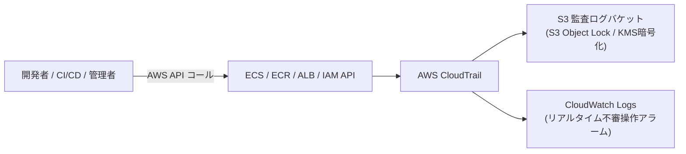

#### CLI による証跡作成と S3・CloudWatch Logs 連携
```bash
aws cloudtrail create-trail \
    --name trail-production-audit \
    --s3-bucket-name audit-log-bucket-12345 \
    --include-global-service-events \
    --is-multi-region-trail \
    --enable-log-file-validation \
    --cloud-watch-logs-log-group-arn "arn:aws:logs:ap-northeast-1:123456789012:log-group:/aws/cloudtrail/audit:*" \
    --cloud-watch-logs-role-arn "arn:aws:iam::123456789012:role/CloudTrailToCloudWatchLogsRole"

aws cloudtrail start-logging --name trail-production-audit
```

---

## 12. アプリケーションログの保存・監視

### 12.1 awslogsログドライバとCloudWatch Logsロググループ設定

タスク定義で設定した `awslogs` ドライバにより、コンテナの標準出力（`stdout`）および標準エラー出力（`stderr`）がリアルタイムに CloudWatch Logs に転送されます。

#### ロググループの作成と保持期間設定 (CLI)
```bash
# ロググループの作成
aws logs create-log-group --log-group-name /ecs/app-production

# ログ保持期間を 90 日に設定
aws logs put-retention-policy \
    --log-group-name /ecs/app-production \
    --retention-in-days 90
```

---

### 12.2 CloudWatch Logsの保持期間設定・S3長期保存エクスポート

90 日以上経過したログをコンプライアンス要件に基づき S3 へ長期アーカイブ保存します。

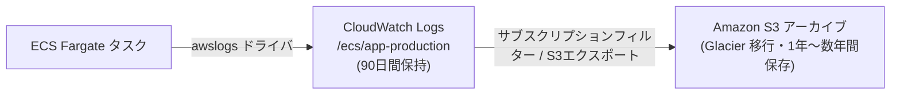

#### S3 エクスポートタスク実行 (CLI)
```bash
aws logs create-export-task \
    --task-name "Export-ECS-Logs-$(date +%Y%m%d)" \
    --log-group-name "/ecs/app-production" \
    --from $(date -d '30 days ago' +%s000) \
    --to $(date +%s000) \
    --destination "app-production-log-archive-bucket-12345" \
    --destination-prefix "ecs-logs"
```

---

## 13. 障害監視・パフォーマンス監視・アラート通知

### 13.1 CloudWatch Container Insights によるコンテナ監視

Container Insights を有効化することで、以下の詳細メトリクスが自動収集されます：
- `CpuUtilized` / `CpuReserved`
- `MemoryUtilized` / `MemoryReserved`
- `NetworkRxBytes` / `NetworkTxBytes`
- `StorageReadBytes` / `StorageWriteBytes`

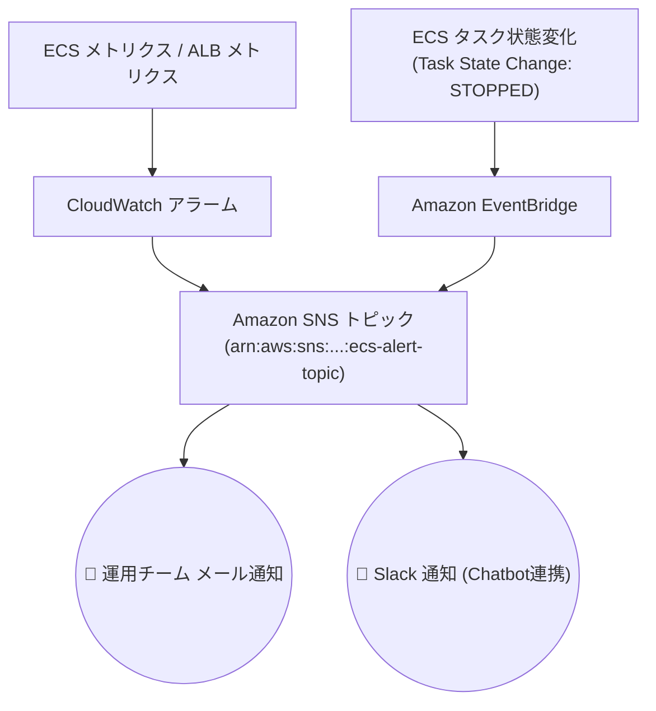

---

### 13.2 ALBメトリクス監視（5XXエラー、TargetResponseTime、UnHealthyHost）

#### 1. ALB 5XX エラー率アラーム作成 (CLI)
```bash
aws cloudwatch put-metric-alarm \
    --alarm-name "alarm-alb-http-5xx-rate-high" \
    --alarm-description "ALB 5XX error count exceeds threshold" \
    --metric-name HTTPCode_Target_5XX_Count \
    --namespace AWS/ApplicationELB \
    --statistic Sum \
    --period 60 \
    --threshold 5 \
    --comparison-operator GreaterThanOrEqualToThreshold \
    --evaluation-periods 2 \
    --dimensions Name=LoadBalancer,Value=app/alb-internal-vpca/xxxx \
    --alarm-actions arn:aws:sns:ap-northeast-1:123456789012:ecs-alert-topic
```

#### 2. 非正常ホスト数（UnHealthyHostCount）アラーム作成 (CLI)
```bash
aws cloudwatch put-metric-alarm \
    --alarm-name "alarm-alb-unhealthy-hosts" \
    --alarm-description "UnHealthy host detected in ECS Target Group" \
    --metric-name UnHealthyHostCount \
    --namespace AWS/ApplicationELB \
    --statistic Maximum \
    --period 60 \
    --threshold 1 \
    --comparison-operator GreaterThanOrEqualToThreshold \
    --evaluation-periods 2 \
    --dimensions Name=TargetGroup,Value=targetgroup/tg-ecs-fargate-app/xxxx Name=LoadBalancer,Value=app/alb-internal-vpca/xxxx \
    --alarm-actions arn:aws:sns:ap-northeast-1:123456789012:ecs-alert-topic
```

---

### 13.3 EventBridge + SNS によるタスク異常停止検知・メール通知

タスクが異常終了（`EssentialContainerExited`, `OutOfMemory`, `CannotPullContainerError` 等）した場合に即時通知する EventBridge ルールを作成します。

#### EventBridge イベントパターン (`ecs-stopped-rule.json`)
```json
{
  "source": ["aws.ecs"],
  "detail-type": ["ECS Task State Change"],
  "detail": {
    "clusterArn": ["arn:aws:ecs:ap-northeast-1:123456789012:cluster/ecs-cluster-production"],
    "lastStatus": ["STOPPED"],
    "stopCode": ["EssentialContainerExited", "TaskFailedToStart", "OutOfMemory"]
  }
}
```

#### EventBridge ルール作成と SNS ターゲット設定 (CLI)
```bash
# 1. EventBridge ルールの作成
aws events put-rule \
    --name rule-ecs-task-stopped-abnormal \
    --event-pattern file://ecs-stopped-rule.json \
    --state ENABLED

# 2. SNS トピックをターゲットとして登録
aws events put-targets \
    --rule rule-ecs-task-stopped-abnormal \
    --targets "Id"="1","Arn"="arn:aws:sns:ap-northeast-1:123456789012:ecs-alert-topic"
```

---

## 14. トラブルシューティングガイド

### 14.1 タスクが起動しない（CannotPullContainerError / ResourceInitializationError 等）

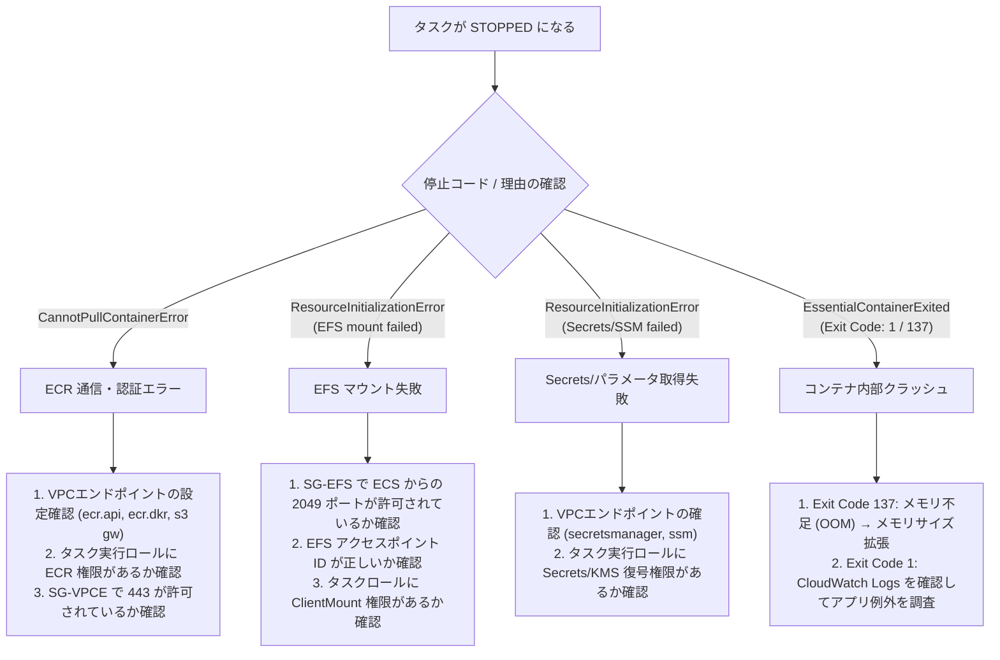

---

### 14.2 ALBヘルスチェック失敗（502 Bad Gateway / Connection Refused）

| 原因 | 調査項目 | 解決策 |
| :--- | :--- | :--- |
| **コンテナポート不一致** | ターゲットグループのポートとタスク定義の `containerPort` が一致しているか | タスク定義の `portMappings` (例: 8080) と TG のポートを統一する |
| **ヘルスチェックパスの応答** | アプリが `/health` に対して 200 OK を返しているか | コンテナ内エンドポイントの実装を確認、起動遅延がある場合は `startPeriod` (例: 60秒) を設定 |
| **セキュリティグループ遮断** | `sg-ecs-fargate` が `sg-alb-internal` からのポート (8080) 通信を許可しているか | セキュリティグループのインバウンドルールに `sg-alb-internal` を追加 |
| **CloudFront ヘッダー不一致** | CloudFront と ALB ルールのカスタムヘッダー値が一致しているか | ALB リスナールールの `X-Origin-Verify` 値と CloudFront オリジンヘッダー設定を再照合 |

---

### 14.3 ECS Exec によるコンテナ内部対話型デバッグ手順

コンテナ内部に安全にログインして環境変数、ファイルマウント、通信状況をリアルタイムに診断します。

```bash
# 1. 稼働中のタスク ID を取得
TASK_ID=$(aws ecs list-tasks \
    --cluster ecs-cluster-production \
    --service-name app-production-service \
    --query "taskArns[0]" --output text | awk -F/ '{print $NF}')

# 2. ECS Exec によるコンテナへの対話型シェルログイン
aws ecs execute-command \
    --cluster ecs-cluster-production \
    --task ${TASK_ID} \
    --container app-container \
    --interactive \
    --command "/bin/sh"

# (コンテナ内での診断例)
# df -h                # EFS マウント確認 (/mnt/shared-data)
# env                  # 注入された環境変数の確認
# curl -I http://localhost:8080/health  # アプリケーション正常性確認
```
