# 🚀 AWS：EFS（Amazon Elastic File System）構築・運用設計ガイド

本ドキュメントは、AWS 上で **Amazon Elastic File System (Amazon EFS)** をエンタープライズグレードで安全、高可用、高性能、かつ最適なコストで構築・運用するための総合設計ガイドです。  
ネットワーク設計、KMS 暗号化、アクセスポイントおよび IAM によるアクセス制御、AWS Backup による自動バックアップ・世代管理、削除保護、CloudTrail 監査ログ、CloudWatch による障害・パフォーマンス監視、EC2 / ECS Fargate / EKS / Lambda からの実践的なマウント手順、コスト最適化手法を網羅し、各設定手順を **AWS マネジメントコンソール（GUI）** と **AWS CLI** の双方で解説します。

---

## 📑 目次

- [1. はじめに（基本概念と全体アーキテクチャ）](#1-はじめに基本概念と全体アーキテクチャ)
  - [1.1 Amazon EFS の基本概念と特徴](#11-amazon-efs-の基本概念と特徴)
  - [1.2 ストレージクラスとライフサイクル管理](#12-ストレージクラスとライフサイクル管理)
  - [1.3 スループットモードとパフォーマンスモードの選定基準](#13-スループットモードとパフォーマンスモードの選定基準)
  - [1.4 全体アーキテクチャ概要図](#14-全体アーキテクチャ概要図)
- [2. EFS ファイルシステムの作成とネットワーク・アクセス制御](#2-efs-ファイルシステムの作成とネットワークアクセス制御)
  - [2.1 ファイルシステム設計パラメータ一覧](#21-ファイルシステム設計パラメータ一覧)
  - [2.2 VPC・サブネット・マウントターゲット設計](#22-vpcサブネットマウントターゲット設計)
  - [2.3 セキュリティグループの設計と設定（GUI / CLI）](#23-セキュリティグループの設計と設定gui--cli)
  - [2.4 EFS ファイルシステムの作成手順（GUI / CLI）](#24-efs-ファイルシステムの作成手順gui--cli)
  - [2.5 EFS ファイルシステムポリシー（IAM認証・TLS強制・ルート制限）（GUI / CLI）](#25-efs-ファイルシステムポリシーiam認証tls強制ルート制限gui--cli)
  - [2.6 EFS アクセスポイント（Access Point）の作成と設定（GUI / CLI）](#26-efs-アクセスポイントaccess-pointの作成と設定gui--cli)
  - [2.7 VPC エンドポイント（AWS PrivateLink）の設計と作成（完全閉域網・IAM認証対応）](#27-vpc-エンドポイントaws-privatelinkの設計と作成完全閉域網iam認証対応)
- [3. 暗号化の設定と鍵管理](#3-暗号化の設定と鍵管理)
  - [3.1 暗号化方式の全体像（保管時・転送時）](#31-暗号化方式の全体像保管時転送時)
  - [3.2 AWS KMS カスタマーマネージドキー（CMK）の作成とキーポリシー](#32-aws-kms-カスタマーマネージドキーcmkの作成とキーポリシー)
  - [3.3 保管時暗号化（KMS）の有効化手順（GUI / CLI）](#33-保管時暗号化kmsの有効化手順gui--cli)
  - [3.4 転送時暗号化（TLS 1.2+）の強制設定手順（GUI / CLI）](#34-転送時暗号化tls-12の強制設定手順gui--cli)
- [4. メンテナンス・バックアップ・リストア設計](#4-メンテナンスバックアップリストア設計)
  - [4.1 EFS におけるメンテナンス・可用性の考え方](#41-efs-におけるメンテナンス可用性の考え方)
  - [4.2 バックアップ方式の比較（デフォルト自動バックアップ vs AWS Backup）](#42-バックアップ方式の比較デフォルト自動バックアップ-vs-aws-backup)
  - [4.3 AWS Backup によるバックアップ計画・時間枠・保持期間の設定（GUI / CLI）](#43-aws-backup-によるバックアップ計画時間枠保持期間の設定gui--cli)
  - [4.4 バックアップボールトのアクセス制御と改ざん防止（Vault Lock）（GUI / CLI）](#44-バックアップボールトのアクセス制御と改ざん防止vault-lockgui--cli)
  - [4.5 EFS バックアップからのリストア手順（GUI / CLI）](#45-efs-バックアップからのリストア手順gui--cli)
  - [4.6 バックアップ障害検知とアラート通知（EventBridge + SNS）（GUI / CLI）](#46-バックアップ障害検知とアラート通知eventbridge--snsgui--cli)
- [5. 削除保護・誤操作防止設計](#5-削除保護誤操作防止設計)
  - [5.1 削除保護機能の概要](#51-削除保護機能の概要)
  - [5.2 EFS 削除保護の有効化手順（GUI / CLI）](#52-efs-削除保護の有効化手順gui--cli)
  - [5.3 IAM ポリシーおよび SCP による削除防止ガードレール](#53-iam-ポリシーおよび-scp-による削除防止ガードレール)
- [6. アクティビティログ・監査ログ（CloudTrail）](#6-アクティビティログ監査ログcloudtrail)
  - [6.1 EFS 監査ログの全体像](#61-efs-監査ログの全体像)
  - [6.2 CloudTrail による EFS 管理イベントの記録（GUI / CLI）](#62-cloudtrail-による-efs-管理イベントの記録gui--cli)
  - [6.3 CloudTrail ログの S3 保存・改ざん防止・CloudWatch Logs 転送（GUI / CLI）](#63-cloudtrail-ログの-s3-保存改ざん防止cloudwatch-logs-転送gui--cli)
- [7. 監視・障害検知・パフォーマンス監視・アラート通知](#7-監視障害検知パフォーマンス監視アラート通知)
  - [7.1 監視すべき主要 CloudWatch メトリクス一覧](#71-監視すべき主要-cloudwatch-メトリクス一覧)
  - [7.2 CloudWatch アラームの設計と作成（GUI / CLI）](#72-cloudwatch-アラームの設計と作成gui--cli)
  - [7.3 AWS Health / EventBridge による障害イベント検知・メール通知（GUI / CLI）](#73-aws-health--eventbridge-による障害イベント検知メール通知gui--cli)
- [8. クライアントからのマウント手順・実践](#8-クライアントからのマウント手順実践)
  - [8.1 EFS クライアント（amazon-efs-utils）の概要と導入](#81-efs-クライアントamazon-efs-utilsの概要と導入)
  - [8.2 Amazon EC2（Linux）へのマウント手順（手動 / fstab自動マウント）（GUI / CLI）](#82-amazon-ec2linuxへのマウント手順手動--fstab自動マウントgui--cli)
  - [8.3 Amazon ECS Fargate からのマウント手順（タスク定義・アクセスポイント）（GUI / CLI）](#83-amazon-ecs-fargate-からのマウント手順タスク定義アクセスポイントgui--cli)
  - [8.4 AWS Lambda / Amazon EKS でのマウント概要](#84-aws-lambda--amazon-eks-でのマウント概要)
- [9. コスト最適化と運用ベストプラクティス](#9-コスト最適化と運用ベストプラクティス)
  - [9.1 ライフサイクル管理によるストレージコスト削減](#91-ライフサイクル管理によるストレージコスト削減)
  - [9.2 Elastic スループットの活用による最適化](#92-elastic-スループットの活用による最適化)
  - [9.3 AZ 間データ転送コストの抑制（同一 AZ マウントターゲット）](#93-az-間データ転送コストの抑制同一-az-マウントターゲット)
- [10. トラブルシューティングガイド](#10-トラブルシューティングガイド)
  - [10.1 マウント時の接続タイムアウト](#101-マウント時の接続タイムアウト)
  - [10.2 権限エラー（Permission Denied / IAM認証失敗）](#102-権限エラーpermission-denied--iam認証失敗)
  - [10.3 パフォーマンス低下・I/O上限到達](#103-パフォーマンス低下io上限到達)

---

## 1. はじめに（基本概念と全体アーキテクチャ）

### 1.1 Amazon EFS の基本概念と特徴

**Amazon Elastic File System (Amazon EFS)** は、AWS クラウドサービスおよびオンプレミスリソースから利用できる、シンプルでスケーラブルな完全マネージド型の **共有ファイルストレージ（NFSv4.1 / NFSv4.0 互換）** です。

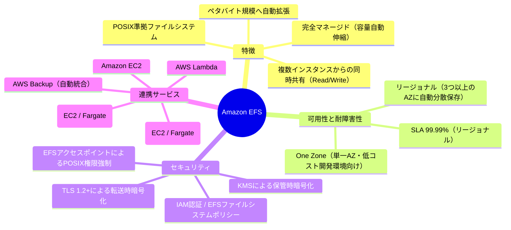

#### EFS の主な特性
1. **エラスティックな自動拡張・縮小**：ストレージ容量の事前プロビジョニングが不要。ファイルを追加・削除するだけで自動的に容量と課金額が増減します。
2. **強力な一貫性（Strong Consistency）**：POSIX 互換の読み書き一貫性（Read-After-Write Consistency）を提供します。
3. **高可用性・耐久性**：標準の「リージョナル（Regional）」ファイルシステムは、同一リージョン内の **複数のアベイラビリティゾーン（AZ）** にデータを自動複製し、99.999999999% (11 9's) の耐久性を提供します。
4. **ネイティブなコンテナ連携**：ECS Fargate や EKS、Lambda からサーバーレスで永続共有ストレージとしてマウント可能です。

---

### 1.2 ストレージクラスとライフサイクル管理

EFS は、アクセスパターンに応じて自動的に最適な階層へファイルを移行し、最大 90% 以上のストレージコストを削減できる **ライフサイクル管理（Lifecycle Management）** を提供しています。

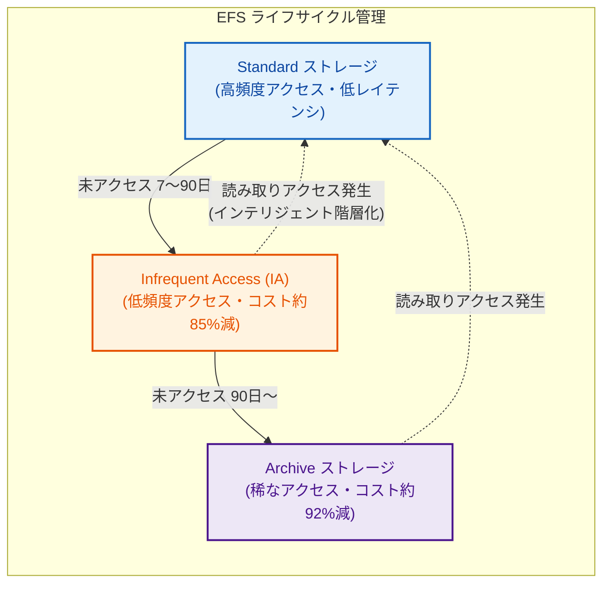

| ストレージクラス | 主な用途 | 特徴とコスト | 移行トリガー |
| :--- | :--- | :--- | :--- |
| **Standard / One Zone** | アクティブなデータ、高頻度アクセス | サブミリ秒の低レイテンシ。標準ストレージ料金が適用。 | 作成時の初期階層 |
| **Infrequent Access (IA)** | 数週間に1回程度アクセスされるデータ | ストレージ単価が非常に安価（Standard の約 15%）。アクセス時にデータ読み出し料金が発生。 | 7/14/30/60/90日間アクセスがない場合 |
| **Archive** | 年に数回アクセスされる長期保存データ | 最安価なストレージ単価（Standard の約 8%）。アクセス頻度が極めて低いデータ向け。 | 90/180/270/365日間アクセスがない場合 |

> [!TIP]
> **取り戻しポリシー（Transition into Standard）**:  
> IA や Archive に移動したファイルに再度アクセスがあった際、自動的に Standard 階層へ戻す「インテリジェント階層化（`On first access`）」を有効にしておくことで、反復アクセスによる読み出し課金の増大を防ぐことができます。

---

### 1.3 スループットモードとパフォーマンスモードの選定基準

EFS はアプリケーションのワークロード特性に応じて、スループットとパフォーマンスモードを選択できます。

#### 1. スループットモードの選定

| モード | 推奨用途 | 動作仕様 | コスト特性 |
| :--- | :--- | :--- | :--- |
| **Elastic**<br>*(推奨)* | 大半のWebアプリ、コンテナ、CI/CD、変動の激しいワークロード | 読み取り最大 3 GiB/s、書き込み最大 1 GiB/s までワークロードに応じて **自動即時スケール**。管理不要。 | 使用したデータ読み書き量に応じた従量課金 |
| **Provisioned** | ストレージ容量は小さいが、常時一定以上の高いスループットが必要な場合 | ストレージ容量に関係なく、指定したスループット（MiB/s）を固定確保。 | プロビジョニングした帯域幅に応じた時間課金 |
| **Bursting**<br>*(旧世代)* | ストレージ容量が大きく、容量比例のスループットで十分な場合 | ストレージ容量（1 TiBあたり 50 MiB/s ベース）と蓄積クレジットでバースト。 | ストレージ料金に含まれる（追加料金なし） |

> [!IMPORTANT]
> 特別な理由がない限り、最新のベストプラクティスでは **Elastic モード** の採用を強く推奨します。バーストクレジットの枯渇リスクがなく、キャパシティプランニングの手間を削減できます。

#### 2. パフォーマンスモードの選定

| モード | 推奨用途 | 特徴 |
| :--- | :--- | :--- |
| **General Purpose（汎用）**<br>*(推奨)* | Webサーバ、CMS (WordPress等)、ホームディレクトリ、一般的なアプリ | 1回のファイル操作あたりのレイテンシが最も低く、一般的なワークロードに最適。 |
| **Max I/O** | ビッグデータ解析、ゲノム解析、数百〜数千台のクライアントからの並行バッチ | 高い IOPS と集約スループットにスケール可能だが、各操作のレイテンシは若干高くなる。 |

---

### 1.4 全体アーキテクチャ概要図

以下の図は、VPC 内のマルチ AZ 構成における Amazon EFS、マウントターゲット（データプレーン）、Interface VPC エンドポイント（コントロールプレーン / AWS PrivateLink）、セキュリティグループ、アクセスポイント、および各種クライアント（EC2, ECS Fargate, Lambda）とのセキュアな接続とバックアップ体制を示しています。

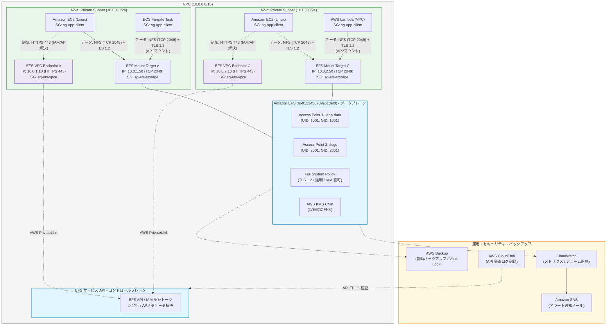

---

## 2. EFS ファイルシステムの作成とネットワーク・アクセス制御

### 2.1 ファイルシステム設計パラメータ一覧

| 設計項目 | 推奨パラメータ値 | 設計理由・考慮点 |
| :--- | :--- | :--- |
| **ファイルシステム名** | `prj-prod-efs-shared` | 環境・用途を明記した命名規則 |
| **ストレージクラス** | リージョナル (Regional) | マルチ AZ による高可用性・耐久性の担保 |
| **パフォーマンスモード** | General Purpose（汎用） | 通常のWeb/アプリワークロードで低レイテンシを実現 |
| **スループットモード** | Elastic | トラフィック変動に応じた自動スケールと管理工数削減 |
| **暗号化（保管時）** | 有効（KMS CMK） | セキュリティ要件および暗号化鍵のライフサイクル管理 |
| **暗号化（転送時）** | TLS 1.2+ 強制（ポリシー設定） | 通信路上の盗聴・中間者攻撃防止 |
| **ライフサイクル管理** | IA: 30日 / Archive: 90日 / 取り戻し: On access | アクセス頻度低下データの自動階層化による大幅なコスト削減 |
| **バックアップ** | AWS Backup（自動有効化） | 世代管理、ボールトロック、クロスリージョン保護 |
| **削除保護** | 有効 (Enabled) | 誤操作や悪意によるファイルシステム削除の防止 |

---

### 2.2 VPC・サブネット・マウントターゲット設計

EFS は、クライアントが存在する VPC 内の各サブネット（AZ）に **マウントターゲット（Mount Target）** と呼ばれる Elastic Network Interface (ENI) を作成し、クライアントは同一 AZ 内のマウントターゲットの IP / DNS 名に接続します。

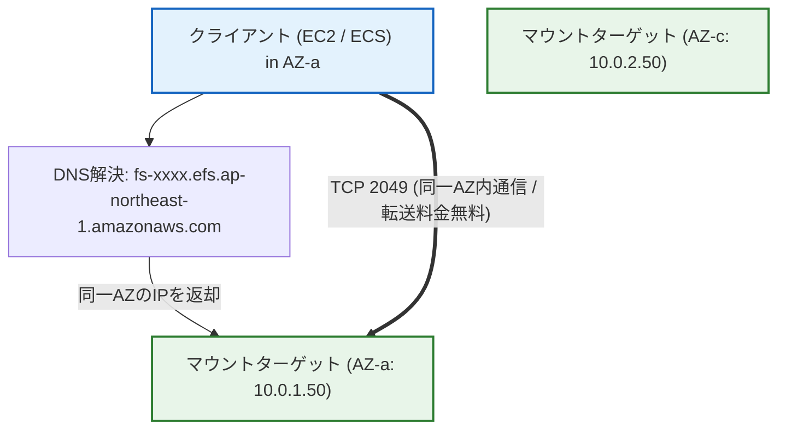

> [!IMPORTANT]
> **同一 AZ アクセスの原則**:  
> クライアントが別 AZ のマウントターゲットと通信すると、**AZ 間データ転送コスト（クロス AZ 料金）** が発生し、レイテンシも増加します。必ずクライアントが存在するすべての AZ にマウントターゲットを作成してください。

---

### 2.3 セキュリティグループの設計と設定（GUI / CLI）

EFS の通信には **NFS プロトコル（TCP ポート 2049）** を使用します。セキュリティグループは「クライアント用」と「EFS マウントターゲット用」に分離し、最小権限を設定します。

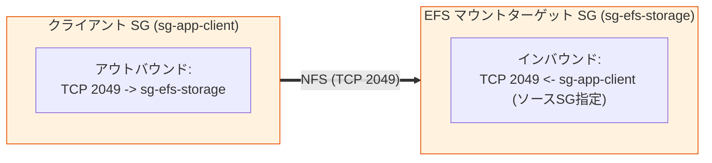

#### セキュリティグループ設定値一覧

| セキュリティグループ名 | 種別 | プロトコル | ポート範囲 | 送信元 / 送信先 | 説明 |
| :--- | :--- | :--- | :--- | :--- | :--- |
| **`sg-efs-storage`** (EFS用) | インバウンド | TCP | 2049 | `sg-app-client` (SG-ID) | クライアントからの NFS アクセスを許可 |
| **`sg-app-client`** (クライアント用) | アウトバウンド | TCP | 2049 | `sg-efs-storage` (SG-ID) | EFS への NFS 通信を許可 |

#### CLI によるセキュリティグループの作成とルール設定

```bash
# 1. 変数の設定
VPC_ID="vpc-0123456789abcdef0"

# 2. EFS用セキュリティグループの作成
EFS_SG_ID=$(aws ec2 create-security-group \
  --group-name "prj-prod-efs-storage-sg" \
  --description "Security Group for EFS Mount Targets" \
  --vpc-id "${VPC_ID}" \
  --query 'GroupId' \
  --output text)

echo "Created EFS SG: ${EFS_SG_ID}"

# 3. クライアント用セキュリティグループの作成（既存の場合はそのIDを使用）
CLIENT_SG_ID=$(aws ec2 create-security-group \
  --group-name "prj-prod-app-client-sg" \
  --description "Security Group for EFS Clients" \
  --vpc-id "${VPC_ID}" \
  --query 'GroupId' \
  --output text)

echo "Created Client SG: ${CLIENT_SG_ID}"

# 4. EFS SG に クライアント SG からの TCP 2049 インバウンドルールを追加
aws ec2 authorize-security-group-ingress \
  --group-id "${EFS_SG_ID}" \
  --protocol tcp \
  --port 2049 \
  --source-group "${CLIENT_SG_ID}" \
  --description "Allow NFS from App Clients"

# 5. タグの付与
aws ec2 create-tags --resources "${EFS_SG_ID}" "${CLIENT_SG_ID}" \
  --tags Key=Environment,Value=Production Key=Project,Value=SharedStorage
```

---

### 2.4 EFS ファイルシステムの作成手順（GUI / CLI）

#### 1. マネジメントコンソール（GUI）での作成手順
1. **EFS コンソール**（`https://console.aws.amazon.com/efs/`）を開きます。
2. **[ファイルシステムの作成]** をクリックし、**[カスタマイズ]** を選択します。
3. **ファイル設定**:
   - **名前**: `prj-prod-efs-shared`
   - **ファイルシステムのタイプ**: `リージョナル (Regional)`
   - **自動バックアップ**: `有効`（AWS Backup による保護）
   - **ライフサイクル管理**:
     - *IA への移行*: `30 日間経過後`
     - *Archive への移行*: `90 日間経過後`
     - *プライマリへの移行 (取り戻し)*: `最初のアクセス時 (On first access)`
   - **暗号化**: `保管時のデータの暗号化を有効化` にチェックを入れ、作成済みの **KMS CMK** を選択。
   - **パフォーマンス設定**:
     - *スループットモード*: `Elastic`
     - *パフォーマンスモード*: `General Purpose (汎用)`
   - **追加設定**:
     - *削除保護*: `有効`
4. **ネットワークアクセス設定**:
   - **VPC**: 対象の VPC を選択。
   - 各アベイラビリティゾーン（例: `ap-northeast-1a`, `ap-northeast-1c`）について:
     - **サブネット**: プライベートサブネットを選択。
     - **セキュリティグループ**: デフォルト SG を削除し、作成した `sg-efs-storage` を選択。
5. **確認と作成**: 設定内容を確認し、**[作成]** をクリックします。

---

#### 2. AWS CLI での作成手順

```bash
# 1. 変数定義
KMS_KEY_ARN="arn:aws:kms:ap-northeast-1:123456789012:key/your-kms-key-id"
SUBNET_AZ_A="subnet-0111111111111111a"
SUBNET_AZ_C="subnet-0333333333333333c"
EFS_SG_ID="sg-0efs123456789abcd"

# 2. EFS ファイルシステムの作成
FS_ID=$(aws efs create-file-system \
  --creation-token "efs-token-$(date +%s)" \
  --performance-mode "generalPurpose" \
  --throughput-mode "elastic" \
  --encrypted \
  --kms-key-id "${KMS_KEY_ARN}" \
  --backup \
  --tags Key=Name,Value=prj-prod-efs-shared Key=Environment,Value=Production \
  --query 'FileSystemId' \
  --output text)

echo "Created EFS File System ID: ${FS_ID}"

# 3. ライフサイクルポリシー（IA / Archive / 取り戻し）の設定
aws efs put-lifecycle-configuration \
  --file-system-id "${FS_ID}" \
  --lifecycle-policies \
    TransitionToIA=AFTER_30_DAYS \
    TransitionToArchive=AFTER_90_DAYS \
    TransitionToPrimaryStorageClass=AFTER_1_ACCESS

# 4. マウントターゲットの作成 (AZ-a)
MT_A=$(aws efs create-mount-target \
  --file-system-id "${FS_ID}" \
  --subnet-id "${SUBNET_AZ_A}" \
  --security-groups "${EFS_SG_ID}" \
  --query 'MountTargetId' \
  --output text)

# 5. マウントターゲットの作成 (AZ-c)
MT_C=$(aws efs create-mount-target \
  --file-system-id "${FS_ID}" \
  --subnet-id "${SUBNET_AZ_C}" \
  --security-groups "${EFS_SG_ID}" \
  --query 'MountTargetId' \
  --output text)

echo "Mount Target A: ${MT_A}, Mount Target C: ${MT_C}"

# 6. 削除保護の有効化
aws efs update-file-system-protection \
  --file-system-id "${FS_ID}" \
  --protection ReplicationOverwriteProtection=ENABLED
```

---

### 2.5 EFS ファイルシステムポリシー（IAM認証・TLS強制・ルート制限）（GUI / CLI）

EFS リソースベースポリシーを設定することで、**TLS 暗号化通信の強制**、**匿名ルートアクセスの禁止**、**特定の IAM ロールのみへのアクセス制限** をファイルシステムレベルで一元的に強制できます。

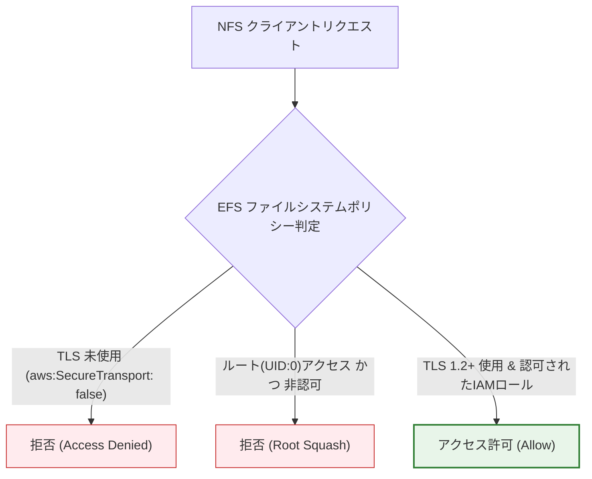

#### 推奨ファイルシステムポリシー (JSON)

```json
{
  "Version": "2012-10-17",
  "Id": "EFS-Security-Policy",
  "Statement": [
    {
      "Sid": "EnforceTLSCommunication",
      "Effect": "Deny",
      "Principal": {
        "AWS": "*"
      },
      "Action": "*",
      "Resource": "arn:aws:elasticfilesystem:ap-northeast-1:123456789012:file-system/fs-0123456789abcdef0",
      "Condition": {
        "Bool": {
          "aws:SecureTransport": "false"
        }
      }
    },
    {
      "Sid": "PreventRootAccessUnlessIAMAuthorized",
      "Effect": "Deny",
      "Principal": {
        "AWS": "*"
      },
      "Action": [
        "elasticfilesystem:ClientRootAccess"
      ],
      "Resource": "arn:aws:elasticfilesystem:ap-northeast-1:123456789012:file-system/fs-0123456789abcdef0",
      "Condition": {
        "Bool": {
          "elasticfilesystem:AccessedViaMountTarget": "true"
        }
      }
    }
  ]
}
```

#### CLI によるファイルシステムポリシーの適用

```bash
# ポリシー JSON ファイルの作成
cat << 'EOF' > efs-policy.json
{
  "Version": "2012-10-17",
  "Id": "EFS-Security-Policy",
  "Statement": [
    {
      "Sid": "EnforceTLSCommunication",
      "Effect": "Deny",
      "Principal": { "AWS": "*" },
      "Action": "*",
      "Resource": "*",
      "Condition": {
        "Bool": {
          "aws:SecureTransport": "false"
        }
      }
    }
  ]
}
EOF

# ファイルシステムポリシーの適用
aws efs put-file-system-policy \
  --file-system-id "${FS_ID}" \
  --policy file://efs-policy.json

# ポリシーの確認
aws efs describe-file-system-policy --file-system-id "${FS_ID}"
```

---

### 2.6 EFS アクセスポイント（Access Point）の作成と設定（GUI / CLI）

**EFS アクセスポイント** は、EFS ファイルシステム内の共有ディレクトリへのアプリケーション固有のエントリポイントです。  
コンテナ（ECS/EKS/Lambda）やマルチテナント環境において、以下の絶大なメリットをもたらします。

1. **POSIX ID（UID/GID）の強制**: クライアントが root 権限でマウントしても、アクセスポイント側で指定した UID/GID（例: 1001:1001）として強制的にファイル操作を実行。
2. **ルートディレクトリの仮想化**: クライアントに見せるルートディレクトリを特定のサブディレクトリ（例: `/app-data`）に制限し、他のディレクトリへのアクセスを物理的に遮断。
3. **ディレクトリの自動作成**: 初回アクセス時に指定の所有者・権限パーミッション（例: `0755`）でディレクトリを自動生成。

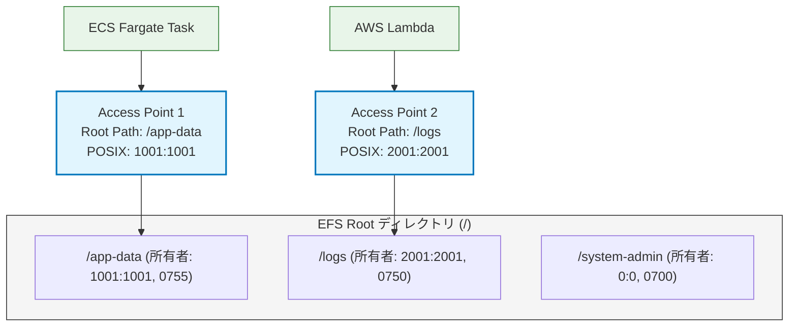

#### 1. GUI でのアクセスポイント作成手順
1. EFS コンソールで対象ファイルシステムを開き、**[アクセスポイント]** タブを選択。
2. **[アクセスポイントを作成]** をクリック。
3. **詳細設定**:
   - **名前**: `prj-prod-app-ap`
   - **ルートディレクトリパス**: `/app-data`
4. **POSIX ユーザー**:
   - **ユーザー ID (UID)**: `1001`
   - **グループ ID (GID)**: `1001`
5. **ルートディレクトリ作成権限**:
   - **所有者 UID**: `1001`
   - **所有者 GID**: `1001`
   - **権限**: `0755`
6. **[アクセスポイントの作成]** をクリック。

#### 2. CLI でのアクセスポイント作成手順

```bash
AP_ID=$(aws efs create-access-point \
  --file-system-id "${FS_ID}" \
  --client-token "ap-token-$(date +%s)" \
  --posix-user Uid=1001,Gid=1001 \
  --root-directory "Path=/app-data,CreationInfo={OwnerUid=1001,OwnerGid=1001,Permissions=0755}" \
  --tags Key=Name,Value=prj-prod-app-ap Key=Environment,Value=Production \
  --query 'AccessPointId' \
  --output text)

echo "Created Access Point ID: ${AP_ID}"
```

---

### 2.7 VPC エンドポイント（AWS PrivateLink）の設計と作成（完全閉域網・IAM認証対応）

#### 2.7.1 EFS における VPC エンドポイントの役割とマウントターゲットとの相違

EFS のネットワーク通信には、実際のファイル読み書きを行う **データプレーン（Data Plane）** と、認証や設定管理を行う **コントロールプレーン（Control Plane）** の 2 つの系統が存在します。

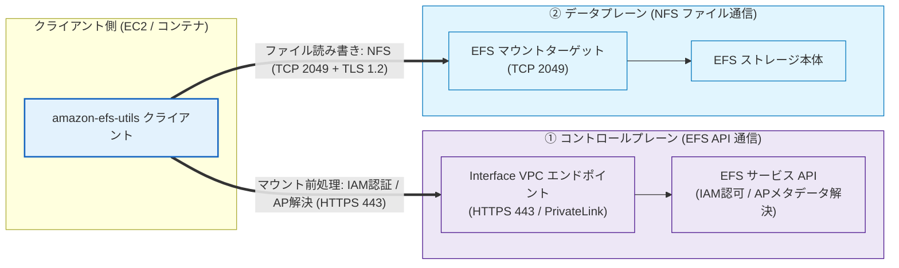

1. **データプレーン（マウントターゲット）**:
   - VPC 内の各サブネットに作成された ENI（マウントターゲット）を介して、NFS プロトコル（TCP 2049）でファイルデータの送受信を行います。
2. **コントロールプレーン（VPC エンドポイント / AWS PrivateLink）**:
   - `amazon-efs-utils` で **IAM 認証（`-o iam`）** や **アクセスポイント指定（`-o accesspoint=...`）** を行う場合、マウントヘルパーはマウント開始前に EFS サービス API（`elasticfilesystem.<region>.amazonaws.com`）に対して HTTPS（TCP 443）通信を行い、IAM 認証トークンの取得やアクセスポイントのメタデータを解決します。
   - インターネットゲートウェイ（IGW）や NAT ゲートウェイが存在しない **完全閉域網 VPC** では、EFS API 用の Interface VPC エンドポイント（AWS PrivateLink）を作成しておかないと、DNS 解決失敗またはタイムアウトが発生してマウントに失敗します。
   - また、VPC 内の EC2 や CI/CD ランナーから AWS CLI / SDK で EFS リソース（ファイルシステム作成・設定変更・アクセスポイント管理等）を操作する場合にも必要です。

#### マウントターゲット vs VPC エンドポイント比較表

| 比較項目 | マウントターゲット (Mount Target) | VPC エンドポイント (Interface VPC Endpoint) |
| :--- | :--- | :--- |
| **種別** | EFS 専用ネットワークインターフェイス (ENI) | AWS PrivateLink (Interface エンドポイント) |
| **AWS サービス名** | なし（EFS 作成時に各サブネットに配置） | `com.amazonaws.<region>.elasticfilesystem` |
| **通信プレーン** | **データプレーン (Data Plane)** | **コントロールプレーン (Control Plane)** |
| **通信プロトコル / ポート** | NFSv4 (TCP 2049) | HTTPS (TCP 443) |
| **トラフィック内容** | ファイルの読み書き・ディレクトリ走査 | EFS API 操作、IAM 認証トークン取得、アクセスポイント解決 |
| **必須となる場面** | EFS ファイルシステムをマウントするすべての環境 | **インターネット非接続（閉域網）環境での IAM 認証マウント / AP マウント / API 管理操作** |

---

#### 2.7.2 Interface VPC エンドポイントの設計パラメータ一覧

| 設計項目 | 推奨パラメータ値 | 説明・考慮点 |
| :--- | :--- | :--- |
| **サービス名** | `com.amazonaws.ap-northeast-1.elasticfilesystem` | 東京リージョンの EFS API サービス |
| **エンドポイントタイプ** | Interface | AWS PrivateLink による ENI 型エンドポイント |
| **VPC** | `vpc-0123456789abcdef0` | クライアントが稼働する VPC |
| **サブネット** | プライベートサブネット（各 AZ: AZ-a, AZ-c） | マルチ AZ 構成により高可用性を担保 |
| **プライベート IP 割り当て** | **静的指定（固定化）** または 自動割り当て | オンプレミス DNS やファイアウォール連携で IP を固定したい場合にサブネット毎に指定 |
| **プライベート DNS 名の有効化** | **有効 (True)** | デフォルトの EFS API ドメイン（`elasticfilesystem.<region>.amazonaws.com`）をプライベート IP に自動解決 |
| **セキュリティグループ** | `sg-efs-vpce` | クライアント SG（`sg-app-client`）からの **TCP 443 (HTTPS)** を許可 |
| **エンドポイントポリシー** | フルアクセス または カスタム制限ポリシー | VPC 内からの EFS API 操作に対する認可制御 |

---

#### 2.7.3 VPC エンドポイントの作成手順（GUI / CLI）

##### 1. VPC エンドポイント用セキュリティグループの作成（CLI）

```bash
# 1. 変数定義
VPC_ID="vpc-0123456789abcdef0"
CLIENT_SG_ID="sg-0client123456789a"  # クライアント用SG

# 2. VPC エンドポイント用セキュリティグループの作成
VPCE_SG_ID=$(aws ec2 create-security-group \
  --group-name "prj-prod-efs-vpce-sg" \
  --description "Security Group for EFS Interface VPC Endpoint" \
  --vpc-id "${VPC_ID}" \
  --query 'GroupId' \
  --output text)

echo "Created EFS VPCE SG: ${VPCE_SG_ID}"

# 3. クライアント SG からの HTTPS (TCP 443) インバウンドを許可
aws ec2 authorize-security-group-ingress \
  --group-id "${VPCE_SG_ID}" \
  --protocol tcp \
  --port 443 \
  --source-group "${CLIENT_SG_ID}" \
  --description "Allow HTTPS from EFS Clients to EFS API Endpoint"
```

##### 2. マネジメントコンソール（GUI）での作成手順（プライベート IP の固定化対応）
1. **VPC コンソール**（`https://console.aws.amazon.com/vpc/`）を開きます。
2. 左側ナビゲーションから **[エンドポイント]** を選択し、**[エンドポイントを作成]** をクリック。
3. **エンドポイントの設定**:
   - **名前タグ**: `prj-prod-efs-vpce`
   - **サービスカテゴリ**: `AWS のサービス`
   - **サービス**: 検索バーに `elasticfilesystem` を入力し、`com.amazonaws.<region>.elasticfilesystem` を選択。
4. **VPC**: 対象の VPC を選択。
5. **サブネットおよび IP アドレス設定（プライベート IP の固定化）**:
   - クライアントが配置されている各 AZ のサブネットを選択。
   - **プライベート IP を固定する場合**:
     - 各サブネット設定を展開し、**[IPv4 アドレス]** で `カスタム IPv4 アドレスを指定`（または `サブネットの IPv4 アドレス範囲から手動で選択`）を選択。
     - 各サブネットの CIDR 内から固定したい IP アドレス（例: AZ-a 用に `10.0.1.10`、AZ-c 用に `10.0.2.10`）を入力。
   - **自動割り当ての場合**: `AWS による自動割り当て` のままにします。
6. **プライベート DNS 名**: `DNS 名を有効化` にチェック（デフォルト有効）。
7. **セキュリティグループ**: デフォルト SG を外し、作成した `sg-efs-vpce` を選択。
8. **ポリシー**: `フルアクセス`（または必要に応じてカスタムポリシーを選択）。
9. **[エンドポイントを作成]** をクリック。

##### 3. AWS CLI での Interface VPC エンドポイント作成

###### パターン A: プライベート IP アドレスを固定（静的割り当て）して作成する場合
`--subnet-ids` の代わりに `--subnet-configurations` オプションを使用し、サブネット ID と割り当てたいプライベート IPv4 アドレスのペアを指定します。

```bash
# プライベート IP を固定して Interface VPC エンドポイントを作成
VPCE_ID=$(aws ec2 create-vpc-endpoint \
  --vpc-id "${VPC_ID}" \
  --service-name "com.amazonaws.ap-northeast-1.elasticfilesystem" \
  --vpc-endpoint-type Interface \
  --subnet-configurations \
    "SubnetId=${SUBNET_AZ_A},Ipv4=10.0.1.10" \
    "SubnetId=${SUBNET_AZ_C},Ipv4=10.0.2.10" \
  --security-group-ids "${VPCE_SG_ID}" \
  --private-dns-enabled \
  --tag-specifications "ResourceType=vpc-endpoint,Tags=[{Key=Name,Value=prj-prod-efs-vpce},{Key=Environment,Value=Production}]" \
  --query 'VpcEndpoint.VpcEndpointId' \
  --output text)

echo "Created EFS Interface VPC Endpoint (Static IPs) ID: ${VPCE_ID}"
```

###### パターン B: プライベート IP アドレスを自動割り当てで作成する場合

```bash
# プライベート IP を自動割り当てで作成
VPCE_ID=$(aws ec2 create-vpc-endpoint \
  --vpc-id "${VPC_ID}" \
  --service-name "com.amazonaws.ap-northeast-1.elasticfilesystem" \
  --vpc-endpoint-type Interface \
  --subnet-ids "${SUBNET_AZ_A}" "${SUBNET_AZ_C}" \
  --security-group-ids "${VPCE_SG_ID}" \
  --private-dns-enabled \
  --tag-specifications "ResourceType=vpc-endpoint,Tags=[{Key=Name,Value=prj-prod-efs-vpce},{Key=Environment,Value=Production}]" \
  --query 'VpcEndpoint.VpcEndpointId' \
  --output text)

echo "Created EFS Interface VPC Endpoint (Dynamic IPs) ID: ${VPCE_ID}"
```

---

#### 2.7.4 VPC エンドポイントポリシーによるセキュリティ強化（ゼロトラスト制御）

VPC エンドポイントにエンドポイントポリシーを設定することで、「この VPC 内からは特定の本番用 EFS ファイルシステムに対する操作のみを許可し、外部や他アカウントの EFS へのアクセス・誤操作を遮断する」といった厳格な境界制御が可能です。

```json
{
  "Version": "2012-10-17",
  "Statement": [
    {
      "Sid": "AllowEFSAPIAccessOnlyToSpecificFileSystem",
      "Effect": "Allow",
      "Principal": "*",
      "Action": [
        "elasticfilesystem:Describe*",
        "elasticfilesystem:ClientMount",
        "elasticfilesystem:ClientWrite",
        "elasticfilesystem:ClientRootAccess"
      ],
      "Resource": [
        "arn:aws:elasticfilesystem:ap-northeast-1:123456789012:file-system/fs-0123456789abcdef0",
        "arn:aws:elasticfilesystem:ap-northeast-1:123456789012:access-point/*"
      ]
    }
  ]
}
```

---

## 3. 暗号化の設定と鍵管理

### 3.1 暗号化方式の全体像（保管時・転送時）

EFS では、データの機密性と業界コンプライアンス（PCI-DSS, HIPAA 等）を満たすため、2 つのレイヤーで暗号化を適用します。


| 暗号化レイヤー | 方式 / アルゴリズム | 鍵管理 / 認証 | 備考 |
| :--- | :--- | :--- | :--- |
| **保管時暗号化 (At Rest)** | AES-256 | AWS KMS (カスタマーマネージドキー CMK / AWS 管理キー) | **ファイルシステム作成時のみ有効化可能**（後から変更不可） |
| **転送時暗号化 (In Transit)** | TLS 1.2+ | TLS 証明書（AWS が自動管理） | `amazon-efs-utils` マウントヘルパーにより自動トンネル確立 |

---

### 3.2 AWS KMS カスタマーマネージドキー（CMK）の作成とキーポリシー

AWS マネージドキー（`aws/elasticfilesystem`）ではなく、**KMS カスタマーマネージドキー（CMK）** を使用することで、鍵のローテーション管理やアクセス権限の厳格な制御が可能になります。

#### KMS キーポリシーの定義 (JSON)

```json
{
  "Version": "2012-10-17",
  "Id": "efs-kms-key-policy",
  "Statement": [
    {
      "Sid": "Enable IAM User Permissions",
      "Effect": "Allow",
      "Principal": {
        "AWS": "arn:aws:iam::123456789012:root"
      },
      "Action": "kms:*",
      "Resource": "*"
    },
    {
      "Sid": "Allow EFS and Backup Service Integration",
      "Effect": "Allow",
      "Principal": {
        "Service": [
          "elasticfilesystem.amazonaws.com",
          "backup.amazonaws.com"
        ]
      },
      "Action": [
        "kms:Decrypt",
        "kms:GenerateDataKey*",
        "kms:CreateGrant",
        "kms:DescribeKey"
      ],
      "Resource": "*"
    }
  ]
}
```

#### CLI による KMS CMK の作成とエイリアス設定

```bash
# 1. KMS キーの作成
KMS_KEY_ID=$(aws kms create-key \
  --description "KMS Key for EFS File System prj-prod-efs-shared" \
  --key-usage ENCRYPT_DECRYPT \
  --origin AWS_KMS \
  --query 'KeyMetadata.KeyId' \
  --output text)

# 2. キーの自動ローテーションを有効化（年1回の自動更新）
aws kms enable-key-rotation --key-id "${KMS_KEY_ID}"

# 3. エイリアスの作成
aws kms create-alias \
  --alias-name "alias/prj-prod-efs-key" \
  --target-key-id "${KMS_KEY_ID}"

echo "KMS Key created: alias/prj-prod-efs-key (ID: ${KMS_KEY_ID})"
```

---

### 3.3 保管時暗号化（KMS）の有効化手順（GUI / CLI）

- **GUI**: ファイルシステム作成画面の [暗号化] セクションで「保管時のデータの暗号化を有効化」にチェックを入れ、KMS キーに `alias/prj-prod-efs-key` を選択。
- **CLI**: `aws efs create-file-system` 実行時に `--encrypted` および `--kms-key-id alias/prj-prod-efs-key` を指定。

> [!CAUTION]
> EFS では既存の暗号化されていないファイルシステムを後から暗号化することはできません。既存の非暗号化データを暗号化する場合は、新規に暗号化 EFS を作成し、`AWS DataSync` や `rsync` でデータ移行を行う必要があります。

---

### 3.4 転送時暗号化（TLS 1.2+）の強制設定手順（GUI / CLI）

クライアントからのマウント時に TLS 暗号化を必須化し、平文 NFS 通信を完全に拒否します。

1. **ファイルシステム側**: セクション 2.5 のファイルシステムポリシーで `aws:SecureTransport: "false"` に対する明示的 Deny を設定。
2. **クライアント側**: マウントコマンド実行時に `-o tls` オプションを指定（詳細は第8章参照）。

---

## 4. メンテナンス・バックアップ・リストア設計

### 4.1 EFS におけるメンテナンス・可用性の考え方

Amazon EFS は完全マネージド型の分散ストレージサービスであるため、**ユーザー側で定期的な停止や再起動を伴うメンテナンスウィンドウ枠を設定する必要はありません**。  
ハードウェア障害や内部ソフトウェアの更新は、マルチ AZ の可用性機構により無停止でバックグラウンド実行されます。

---

### 4.2 バックアップ方式の比較（デフォルト自動バックアップ vs AWS Backup）

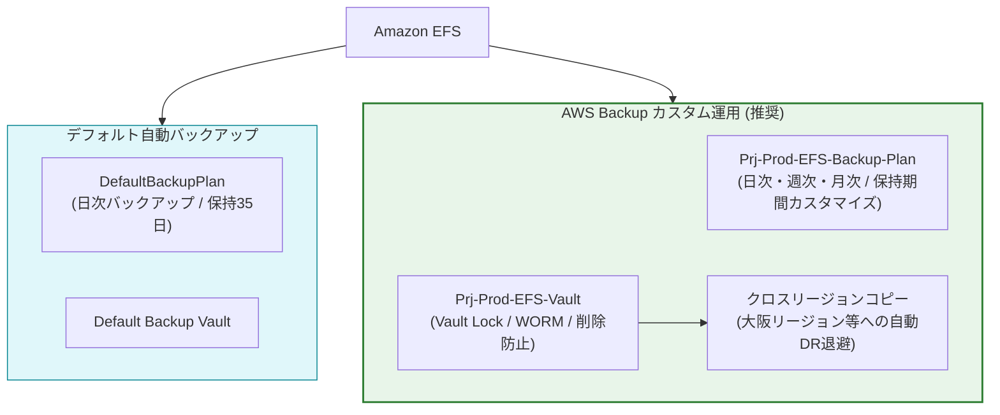

| 項目 | デフォルト自動バックアップ | AWS Backup カスタムプラン (推奨) |
| :--- | :--- | :--- |
| **設定方法** | EFS 作成時のチェックボックス 1 つ | AWS Backup でバックアップ計画を作成 |
| **バックアップ頻度** | 日次（毎日1回） | 日次、毎時、週次、月次など柔軟に設定可能 |
| **バックアップ時間枠** | 自動割り当て | 開始時間・開始猶予枠（ウィンドウ）を指定可能 |
| **保持期間** | 35 日間固定 | 任意の保持期間（例: 90日、1年、無期限） |
| **クロスリージョンコピー** | 非対応 | 対応（別リージョンへの DR バックアップ） |
| **Vault Lock（改ざん防止）**| 非対応 | 対応（管理者でも削除不可能な WORM 保護） |

---

### 4.3 AWS Backup によるバックアップ計画・時間枠・保持期間の設定（GUI / CLI）

エンタープライズ本番環境では、保持期間の制御とクロスリージョン DR を実現するため **AWS Backup カスタムプラン** の利用を推奨します。

#### 1. CLI による Backup Vault（ボールト）の作成

```bash
# バックアップボールトの作成
aws backup create-backup-vault \
  --backup-vault-name "prj-prod-efs-vault" \
  --encryption-key-arn "${KMS_KEY_ARN}" \
  --tags Key=Environment,Value=Production
```

#### 2. CLI によるバックアッププランの作成

```bash
cat << 'EOF' > backup-plan.json
{
  "BackupPlanName": "prj-prod-efs-backup-plan",
  "Rules": [
    {
      "RuleName": "Daily-Backup-Rule",
      "TargetBackupVaultName": "prj-prod-efs-vault",
      "ScheduleExpression": "cron(0 18 * * ? *)",
      "StartWindowMinutes": 60,
      "CompletionWindowMinutes": 180,
      "Lifecycle": {
        "DeleteAfterDays": 90
      },
      "CopyActions": [
        {
          "Lifecycle": {
            "DeleteAfterDays": 90
          },
          "DestinationBackupVaultArn": "arn:aws:backup:ap-northeast-3:123456789012:backup-vault:prj-dr-backup-vault"
        }
      ]
    }
  ]
}
EOF

# バックアッププランの作成
PLAN_ID=$(aws backup create-backup-plan \
  --backup-plan file://backup-plan.json \
  --query 'BackupPlanId' \
  --output text)

echo "Created Backup Plan ID: ${PLAN_ID}"
```

#### 3. EFS リソースのバックアップ割り当て

```bash
# EFS ファイルシステムの ARN
EFS_ARN="arn:aws:elasticfilesystem:ap-northeast-1:123456789012:file-system/${FS_ID}"
BACKUP_ROLE_ARN="arn:aws:iam::123456789012:role/service-role/AWSBackupDefaultServiceRole"

cat << EOF > selection.json
{
  "SelectionName": "prj-prod-efs-selection",
  "IamRoleArn": "${BACKUP_ROLE_ARN}",
  "Resources": [
    "${EFS_ARN}"
  ]
}
EOF

# セレクションの登録
aws backup create-backup-selection \
  --backup-plan-id "${PLAN_ID}" \
  --backup-selection file://selection.json
```

---

### 4.4 バックアップボールトのアクセス制御と改ざん防止（Vault Lock）（GUI / CLI）

ランサムウェア攻撃や特権ユーザーの誤操作・悪意によるバックアップ削除を防止するため、**AWS Backup Vault Lock（WORM 機能）** を設定します。

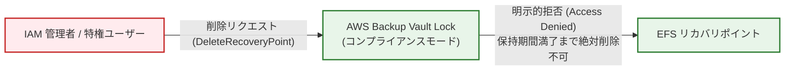

#### CLI による Vault Lock の設定

```bash
# ボールトロックの設定（最小保持期間 30 日、最大保持期間 365 日）
aws backup put-backup-vault-lock-configuration \
  --backup-vault-name "prj-prod-efs-vault" \
  --min-retention-days 30 \
  --max-retention-days 365 \
  --changeable-for-days 3
```

---

### 4.5 EFS バックアップからのリストア手順（GUI / CLI）

EFS のバックアップは以下の 2 通りのリストア方式を選択できます。
1. **新規 EFS ファイルシステムとしての復元**: ディザスタリカバリ時や環境複製時。
2. **既存 EFS 内のディレクトリ（例: `/aws-backup-restore_xxx`）への復元**: 特定ファイルの誤削除復元時。

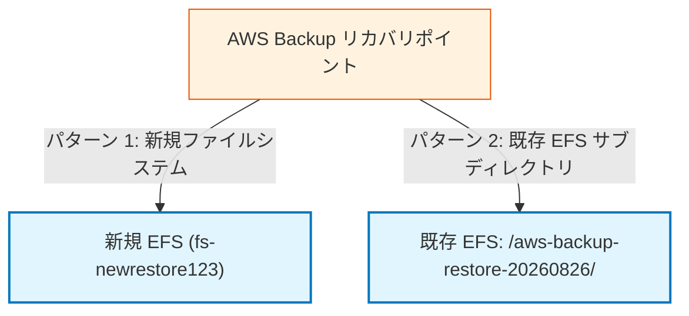

#### CLI によるリストアジョブの実行例（既存 EFS のサブディレクトリへの復元）

```bash
# 1. リカバリポイント ARN の取得
RECOVERY_POINT_ARN=$(aws backup list-recovery-points-by-backup-vault \
  --backup-vault-name "prj-prod-efs-vault" \
  --query 'RecoveryPoints[0].RecoveryPointArn' \
  --output text)

# 2. リストアメタデータの作成
cat << EOF > restore-metadata.json
{
  "file-system-id": "${FS_ID}",
  "Encrypted": "true",
  "KmsKeyId": "${KMS_KEY_ARN}",
  "PerformanceMode": "generalPurpose",
  "ThroughputMode": "elastic",
  "newFileSystem": "false"
}
EOF

# 3. リストアジョブの開始
RESTORE_JOB_ID=$(aws backup start-restore-job \
  --recovery-point-arn "${RECOVERY_POINT_ARN}" \
  --metadata file://restore-metadata.json \
  --iam-role-arn "${BACKUP_ROLE_ARN}" \
  --resource-type "EFS" \
  --query 'RestoreJobId' \
  --output text)

echo "Started Restore Job ID: ${RESTORE_JOB_ID}"
```

---

### 4.6 バックアップ障害検知とアラート通知（EventBridge + SNS）（GUI / CLI）

バックアップジョブが失敗した場合に即座に検知し、運用管理者にメール通知するパイプラインを構築します。

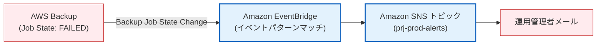

#### CLI による EventBridge ルールおよび SNS 通知の設定

```bash
# 1. SNS トピックの作成とメールサブスクリプション
SNS_TOPIC_ARN=$(aws sns create-topic \
  --name "prj-prod-backup-alerts" \
  --query 'TopicArn' \
  --output text)

aws sns subscribe \
  --topic-arn "${SNS_TOPIC_ARN}" \
  --protocol email \
  --notification-endpoint "sysadmin@example.com"

# 2. EventBridge ルールのイベントパターン定義
cat << 'EOF' > backup-event-pattern.json
{
  "source": ["aws.backup"],
  "detail-type": ["Backup Job State Change"],
  "detail": {
    "state": ["FAILED", "ABORTED", "EXPIRED"]
  }
}
EOF

# 3. ルールの作成
aws events put-rule \
  --name "prj-prod-backup-failure-rule" \
  --event-pattern file://backup-event-pattern.json \
  --state ENABLED

# 4. ターゲットに SNS トピックを登録
aws events put-targets \
  --rule "prj-prod-backup-failure-rule" \
  --targets "Id=1,Arn=${SNS_TOPIC_ARN}"
```

---

## 5. 削除保護・誤操作防止設計

### 5.1 削除保護機能の概要

EFS は、管理者の操作ミスや CLI スクリプトの暴走、悪意ある API コールによるファイルシステムの即時削除を防ぐため、**削除保護（Deletion Protection）** 機能をサポートしています。  
削除保護が有効になっているファイルシステムに対して `DeleteFileSystem` API を呼び出しても、リクエストは即座に拒否されます。

---

### 5.2 EFS 削除保護の有効化手順（GUI / CLI）

- **GUI**: EFS コンソールの対象ファイルシステム画面から [設定を編集] を開き、[削除保護] を「有効」に変更して保存。
- **CLI**:

```bash
# 削除保護の有効化
aws efs update-file-system-protection \
  --file-system-id "${FS_ID}" \
  --protection ReplicationOverwriteProtection=ENABLED

# 状態確認
aws efs describe-file-systems \
  --file-system-id "${FS_ID}" \
  --query 'FileSystems[0].FileSystemProtection'
```

---

### 5.3 IAM ポリシーおよび SCP による削除防止ガードレール

AWS Organizations の **サービスコントロールポリシー (SCP)** または IAM 権限境界（Permission Boundary）を設定し、本番環境 EFS の削除およびマウントターゲット削除を強制的に禁止します。

```json
{
  "Version": "2012-10-17",
  "Statement": [
    {
      "Sid": "DenyEFSDeletion",
      "Effect": "Deny",
      "Action": [
        "elasticfilesystem:DeleteFileSystem",
        "elasticfilesystem:DeleteMountTarget",
        "elasticfilesystem:DeleteAccessPoint"
      ],
      "Resource": "arn:aws:elasticfilesystem:ap-northeast-1:123456789012:file-system/*",
      "Condition": {
        "StringNotLike": {
          "aws:PrincipalArn": [
            "arn:aws:iam::123456789012:role/EmergencyAdminRole"
          ]
        }
      }
    }
  ]
}
```

---

## 6. アクティビティログ・監査ログ（CloudTrail）

### 6.1 EFS 監査ログの全体像

EFS に対するすべての管理・設定変更操作（ファイルシステム作成、削除、ポリシー変更、マウントターゲット変更など）は **AWS CloudTrail** によって自動的に記録されます。  
セキュリティ監査およびコンプライアンス対応のため、ログを長期保管用 S3 バケットおよび即時監視用 CloudWatch Logs に配信します。

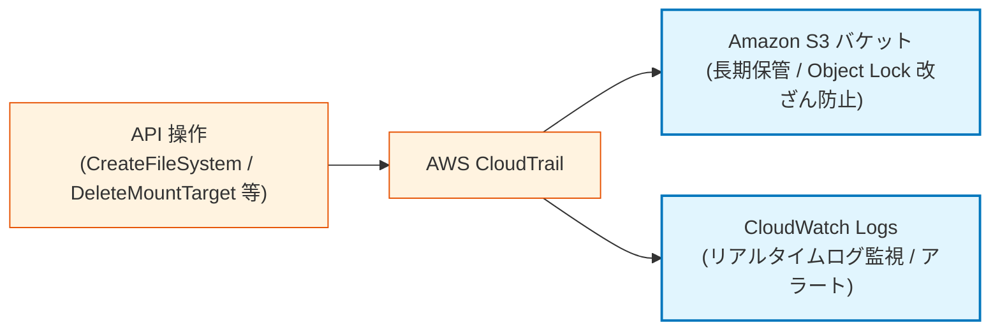

---

### 6.2 CloudTrail による EFS 管理イベントの記録（GUI / CLI）

```bash
# 1. 監査ログ用 S3 バケットの作成
AUDIT_BUCKET="prj-prod-cloudtrail-audit-logs-$(date +%s)"
aws s3 mb "s3://${AUDIT_BUCKET}" --region ap-northeast-1

# 2. S3 バケットの暗号化とパブリックアクセスブロック
aws s3api put-bucket-encryption \
  --bucket "${AUDIT_BUCKET}" \
  --server-side-encryption-configuration '{"Rules":[{"ApplyServerSideEncryptionByDefault":{"SSEAlgorithm":"AES256"}}]}'

aws s3api put-public-access-block \
  --bucket "${AUDIT_BUCKET}" \
  --public-access-block-configuration "BlockPublicAcls=true,IgnorePublicAcls=true,BlockPublicPolicy=true,RestrictPublicBuckets=true"

# 3. バケットポリシーの設定 (CloudTrail 配信許可)
cat << EOF > trail-bucket-policy.json
{
  "Version": "2012-10-17",
  "Statement": [
    {
      "Sid": "AWSCloudTrailAclCheck",
      "Effect": "Allow",
      "Principal": { "Service": "cloudtrail.amazonaws.com" },
      "Action": "s3:GetBucketAcl",
      "Resource": "arn:aws:s3:::${AUDIT_BUCKET}"
    },
    {
      "Sid": "AWSCloudTrailWrite",
      "Effect": "Allow",
      "Principal": { "Service": "cloudtrail.amazonaws.com" },
      "Action": "s3:PutObject",
      "Resource": "arn:aws:s3:::${AUDIT_BUCKET}/AWSLogs/123456789012/*",
      "Condition": {
        "StringEquals": { "s3:x-amz-acl": "bucket-owner-full-control" }
      }
    }
  ]
}
EOF

aws s3api put-bucket-policy --bucket "${AUDIT_BUCKET}" --policy file://trail-bucket-policy.json

# 4. CloudTrail Trail の作成とログ記録開始
aws cloudtrail create-trail \
  --name "prj-prod-efs-audit-trail" \
  --s3-bucket-name "${AUDIT_BUCKET}" \
  --include-global-service-events \
  --is-multi-region-trail \
  --enable-log-file-validation

aws cloudtrail start-logging --name "prj-prod-efs-audit-trail"
```

---

### 6.3 CloudTrail ログの S3 保存・改ざん防止・CloudWatch Logs 転送（GUI / CLI）

S3 バケットで **S3 Object Lock（コンプライアンスモード）** またはバージョニングを有効化することで、保存された監査ログの削除や改ざんを不可能にします。

```bash
# バージョニングの有効化
aws s3api put-bucket-versioning \
  --bucket "${AUDIT_BUCKET}" \
  --versioning-configuration Status=Enabled
```

---

## 7. 監視・障害検知・パフォーマンス監視・アラート通知

### 7.1 監視すべき主要 CloudWatch メトリクス一覧

EFS の安定稼働とパフォーマンスボトルネックの早期発見のため、以下の CloudWatch メトリクスを常時監視します。

| メトリクス名 | 単位 | 監視の目的・説明 | アラーム推奨閾値 |
| :--- | :--- | :--- | :--- |
| **`PercentIOLimit`** | % | ファイルシステムの許容 I/O 上限に対する使用率（General Purpose モード時に重要） | `>= 90%` (継続5分) |
| **`BurstCreditBalance`** | Bytes | バーストスループットクレジットの残量（Bursting モード時） | 枯渇傾向（急激な低下） |
| **`ClientConnections`** | Count | EFS に接続しているクライアント（マウント接続）数 | 異常な急増またはゼロへの急落 |
| **`PermittedThroughput`** | Bytes/s | 現在許可されている最大スループット | - |
| **`DataReadIOBytes` / `DataWriteIOBytes`** | Bytes | 読み取り/書き込みのデータ転送量 | スループット分析 |
| **`StorageBytes`** | Bytes | 各ストレージクラス（Standard / IA / Archive）のデータ容量 | コスト分析・容量監視 |

---

### 7.2 CloudWatch アラームの設計と作成（GUI / CLI）

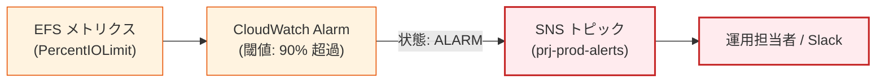

#### CLI による I/O リミット監視アラームの作成

```bash
aws cloudwatch put-metric-alarm \
  --alarm-name "prj-prod-efs-HighPercentIOLimit" \
  --alarm-description "Alarm when EFS PercentIOLimit exceeds 90%" \
  --metric-name "PercentIOLimit" \
  --namespace "AWS/EFS" \
  --statistic "Average" \
  --period 300 \
  --threshold 90.0 \
  --comparison-operator "GreaterThanOrEqualToThreshold" \
  --dimensions Name=FileSystemId,Value="${FS_ID}" \
  --evaluation-periods 2 \
  --alarm-actions "${SNS_TOPIC_ARN}" \
  --ok-actions "${SNS_TOPIC_ARN}"
```

---

### 7.3 AWS Health / EventBridge による障害イベント検知・メール通知（GUI / CLI）

AWS サービスインフラ側の EFS 障害やメンテナンス通知を AWS Health イベントからリアルタイムに検知します。

```bash
# EventBridge による AWS Health イベント監視
cat << 'EOF' > health-event-pattern.json
{
  "source": ["aws.health"],
  "detail-type": ["AWS Health Event"],
  "detail": {
    "service": ["EFS"]
  }
}
EOF

aws events put-rule \
  --name "prj-prod-efs-health-alert-rule" \
  --event-pattern file://health-event-pattern.json \
  --state ENABLED

aws events put-targets \
  --rule "prj-prod-efs-health-alert-rule" \
  --targets "Id=1,Arn=${SNS_TOPIC_ARN}"
```

---

## 8. クライアントからのマウント手順・実践

### 8.1 EFS クライアント（amazon-efs-utils）の概要と導入

EFS のマウントには、標準の NFSv4 クライアントではなく、AWS 公式の **`amazon-efs-utils` (EFS マウントヘルパー)** を使用します。
- **メリット**: TLS トンネルの自動構築（転送時暗号化）、IAM ロール認証、アクセスポイントによる簡潔なマウント指定、CloudWatch ログ連携。

> [!IMPORTANT]
> **完全閉域網（プライベートサブネット）での IAM 認証 / アクセスポイント利用時の注意**:  
> `amazon-efs-utils` を用いて IAM 認証（`-o iam`）やアクセスポイント指定（`-o accesspoint=...`）を行う場合、マウント処理の開始時に EFS コントロールプレーン API（`elasticfilesystem.<region>.amazonaws.com:443`）へのアクセスが発生します。インターネット接続（IGW / NAT Gateway）のない閉域網 VPC では、事前に第 2.7 節で解説した **EFS Interface VPC エンドポイント（`com.amazonaws.<region>.elasticfilesystem`）** を作成し、Private DNS を有効化しておく必要があります。

#### 各 OS でのインストール手順

```bash
# Amazon Linux 2023 / Amazon Linux 2
sudo dnf install -y amazon-efs-utils  # AL2023
# または sudo yum install -y amazon-efs-utils  # AL2

# Ubuntu / Debian
sudo apt-get update
sudo apt-get install -y binutils
git clone https://github.com/aws/efs-utils
cd efs-utils
./build-deb.sh
sudo apt-get install -y ./build/amazon-efs-utils*deb

# RHEL / CentOS 8+
sudo dnf install -y git rpm-build make
git clone https://github.com/aws/efs-utils
cd efs-utils
make rpm
sudo dnf install -y ./build/amazon-efs-utils*rpm
```

---

### 8.2 Amazon EC2（Linux）へのマウント手順（手動 / fstab自動マウント）（GUI / CLI）

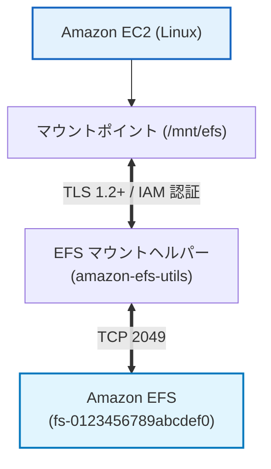

#### 1. 手動マウントコマンド（TLS 暗号化 + IAM 認可）

```bash
# マウントポイントディレクトリの作成
sudo mkdir -p /mnt/efs

# TLS 暗号化と IAM 認証を有効にしてマウント
sudo mount -t efs -o tls,iam ${FS_ID}:/ /mnt/efs

# アクセスポイントを指定してマウントする場合
sudo mount -t efs -o tls,iam,accesspoint=${AP_ID} ${FS_ID}:/ /mnt/efs

# マウント確認
df -hT /mnt/efs
```

#### 2. `/etc/fstab` によるインスタンス起動時自動マウント設定

サーバー再起動時にも自動的に EFS が安全にマウントされるよう、`/etc/fstab` に設定を追加します。

```bash
# /etc/fstab への追記（ルートディレクトリマウント）
echo "${FS_ID}:/ /mnt/efs efs _netdev,tls,iam 0 0" | sudo tee -a /etc/fstab

# アクセスポイントを使用する場合の /etc/fstab 設定
# echo "${FS_ID}:/ /mnt/efs efs _netdev,tls,iam,accesspoint=${AP_ID} 0 0" | sudo tee -a /etc/fstab

# fstab のテスト（エラーが出ないことを確認）
sudo mount -a
```

> [!IMPORTANT]
> **`_netdev` オプションの必須性**:  
> `_netdev` を指定することで、OS 起動シーケンスにおいて「ネットワークが完全に起動した後にマウントを実行する」よう制御され、起動時のハングアップを防止できます。

---

### 8.3 Amazon ECS Fargate からのマウント手順（タスク定義・アクセスポイント）（GUI / CLI）

Amazon ECS Fargate では、タスク定義に EFS ボリュームとアクセスポイントを設定するだけで、コンテナ内に安全に共有ストレージをマウントできます。

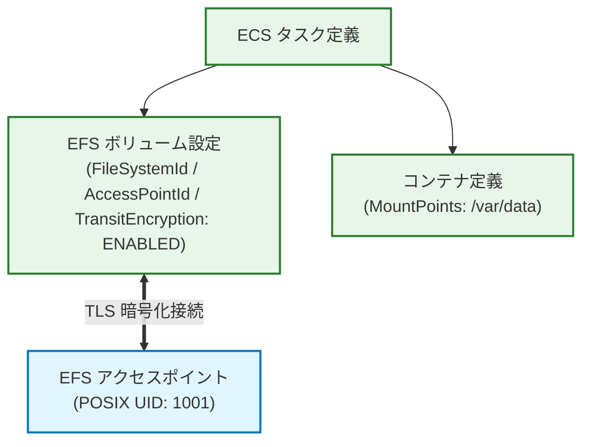

#### ECS タスク定義 JSON 設定例 (`task-definition.json`)

```json
{
  "family": "prj-prod-app-task",
  "networkMode": "awsvpc",
  "requiresCompatibilities": ["FARGATE"],
  "cpu": "512",
  "memory": "1024",
  "executionRoleArn": "arn:aws:iam::123456789012:role/ecsTaskExecutionRole",
  "taskRoleArn": "arn:aws:iam::123456789012:role/prj-prod-ecs-task-role",
  "containerDefinitions": [
    {
      "name": "app-container",
      "image": "123456789012.dkr.ecr.ap-northeast-1.amazonaws.com/my-app:latest",
      "essential": true,
      "mountPoints": [
        {
          "sourceVolume": "efs-shared-volume",
          "containerPath": "/var/app-data",
          "readOnly": false
        }
      ],
      "logConfiguration": {
        "logDriver": "awslogs",
        "options": {
          "awslogs-group": "/ecs/prj-prod-app",
          "awslogs-region": "ap-northeast-1",
          "awslogs-stream-prefix": "ecs"
        }
      }
    }
  ],
  "volumes": [
    {
      "name": "efs-shared-volume",
      "efsVolumeConfiguration": {
        "fileSystemId": "fs-0123456789abcdef0",
        "rootDirectory": "/",
        "transitEncryption": "ENABLED",
        "transitEncryptionPort": 2049,
        "authorizationConfig": {
          "accessPointId": "fsap-0123456789abcdef0",
          "iam": "ENABLED"
        }
      }
    }
  ]
}
```

#### タスク定義の登録 CLI

```bash
aws ecs register-task-definition --cli-input-json file://task-definition.json
```

---

### 8.4 AWS Lambda / Amazon EKS でのマウント概要

1. **AWS Lambda**:
   - Lambda 関数を VPC に配置し、ファイルシステム設定で EFS アクセスポイント ARN とローカルマウントパス（`/mnt/efs`）を指定。
   - 大規模な機械学習モデルのロードや、512 MB〜10 GB の一時領域を超える大容量ファイル処理に活用可能。
2. **Amazon EKS**:
   - `aws-efs-csi-driver` をクラスターにデプロイし、`StorageClass` および `PersistentVolumeClaim (PVC)` を作成して Pod に共有ボリュームをアタッチ。

---

## 9. コスト最適化と運用ベストプラクティス

### 9.1 ライフサイクル管理によるストレージコスト削減

| ストレージ階層 | 東京リージョン単価 (参考) | コスト削減率 |
| :--- | :--- | :--- |
| **Standard** | 約 $0.36 / GB・月 | 基準（0%） |
| **Standard-IA** | 約 $0.054 / GB・月（+読取課金） | **約 85% 削減** |
| **Standard-Archive** | 約 $0.028 / GB・月（+読取課金） | **約 92% 削減** |

- **推奨設定**: 30 日未アクセスのファイルを IA へ、90 日未アクセスのファイルを Archive へ移行。
- **インテリジェント階層化**: 再アクセス時に Standard へ自動昇格させることで、IA/Archive 読み出しコストの累積を防止。

---

### 9.2 Elastic スループットの活用による最適化

- 過去の Provisioned スループットでは、ピーク時に合わせて高めの帯域（例: 50 MiB/s = 約 $330/月）を常時プロビジョニングする必要がありました。
- **Elastic スループット** では、アクセスした実データ量（読み取り $0.036/GB、書き込み $0.18/GB 等）のみ課金されるため、**夜間やアイドル時の固定コストを完全ゼロ化** できます。

---

### 9.3 AZ 間データ転送コストの抑制（同一 AZ マウントターゲット）

- クライアントが存在する各 AZ に必ず EFS マウントターゲットを配置してください。
- DNS 名（`fs-xxxx.efs.ap-northeast-1.amazonaws.com`）でマウントすれば、クライアントと同一 AZ のマウントターゲット IP が自動的に名前解決され、**AZ 間データ転送コスト（$0.01/GB）を回避** できます。

---

## 10. トラブルシューティングガイド

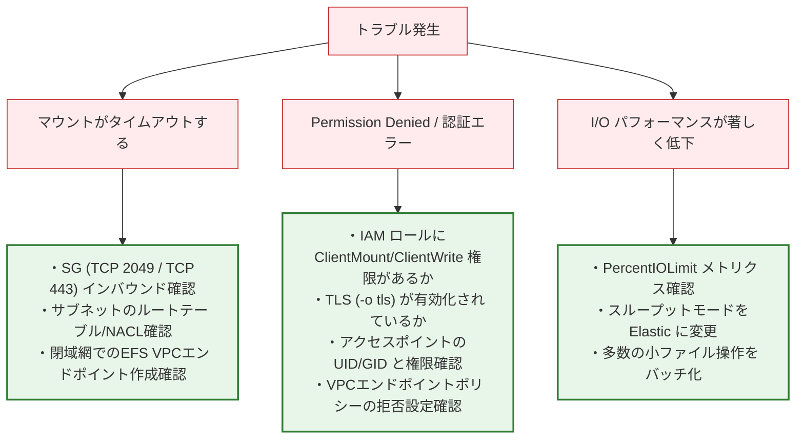

### 10.1 マウント時の接続タイムアウト

- **現象**: `mount.nfs4: Connection timed out` またはマウントコマンドが応答しない。
- **原因と対処**:
  1. **セキュリティグループ**: EFS マウントターゲットの SG で、クライアントからの **TCP ポート 2049** が許可されているか確認。
  2. **ルーティング**: クライアントサブネットと EFS マウントターゲットサブネットが疎通可能か確認。
  3. **ネットワーク ACL**: サブネットの NACL でポート 2049 およびエフェメラルポートが拒否されていないか確認。
  4. **閉域網における IAM 認証 / AP マウント時のタイムアウト**: インターネット接続のない VPC で `-o iam` または `-o accesspoint` を指定している場合、EFS API への通信が遮断されている可能性があります。第 2.7 節を参照し、**EFS Interface VPC エンドポイント（TCP 443）** の作成およびセキュリティグループ設定を確認してください。

---

### 10.2 権限エラー（Permission Denied / IAM認証失敗）

- **現象**: `mount.nfs4: access denied by server while mounting` またはファイル書き込み時の `Permission denied`。
- **原因と対処**:
  1. **TLS 強制ポリシー**: ファイルシステムポリシーで TLS が強制されている場合、マウント時に `-o tls` オプションが必須。
  2. **IAM 認可**: ポリシーで IAM 認証が要求されている場合、クライアントの IAM ロールに `elasticfilesystem:ClientMount`, `elasticfilesystem:ClientWrite` が付与されているか、`-o iam` オプションが付いているか確認。
  3. **POSIX 所有権**: アクセスポイント経由でマウントしている場合、対象ディレクトリの所有者 UID/GID とアクセスポイントの UID/GID が一致しているか確認。
  4. **VPC エンドポイントポリシーの制限**: VPC エンドポイントポリシーで対象ファイルシステム ARN やアクションが許可されているか、また VPC の Private DNS が有効になっているか確認。

---

### 10.3 パフォーマンス低下・I/O上限到達

- **現象**: ファイル読み書きが極端に遅くなる、またはアプリの応答が停止する。
- **原因と対処**:
  1. **I/O リミット到達**: CloudWatch で `PercentIOLimit` が 100% に達していないか確認。小規模ファイルの大量ランダムアクセス時は、操作をまとめてシーケンシャルアクセスにするか、パフォーマンスモードを検討。
  2. **スループットモードの選定**: スループットモードが `Bursting` の場合、クレジット枯渇の可能性があるため **`Elastic` モード** に切り替える。
