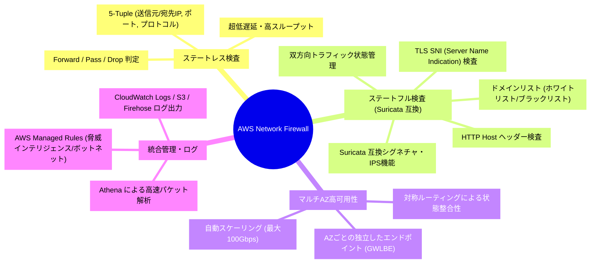
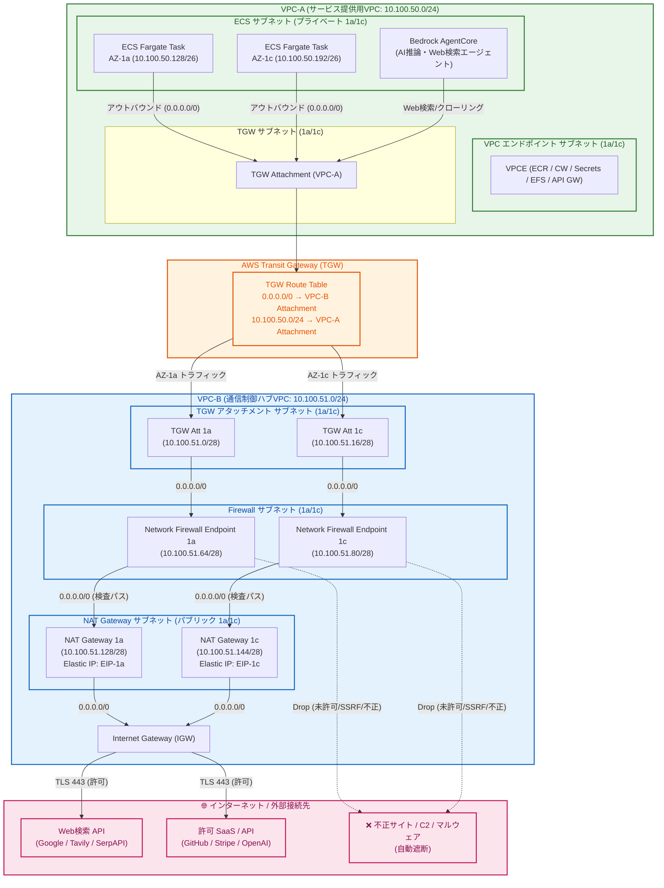
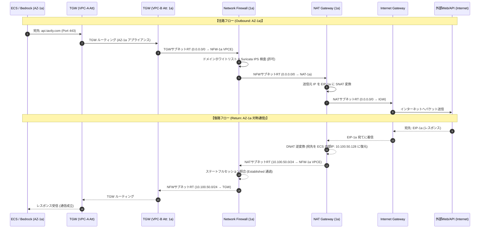
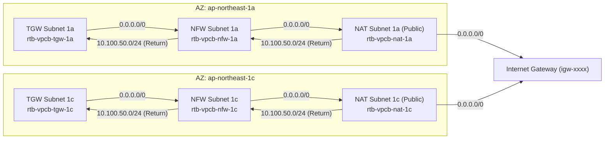
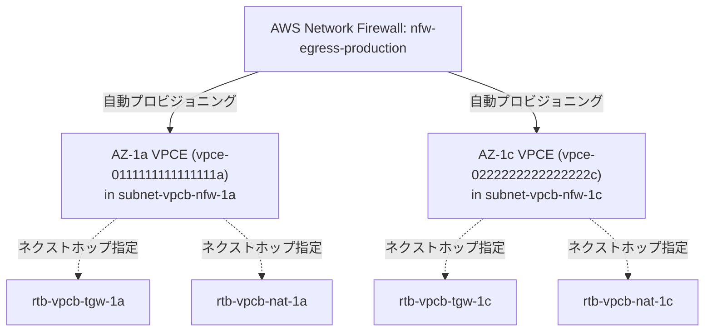
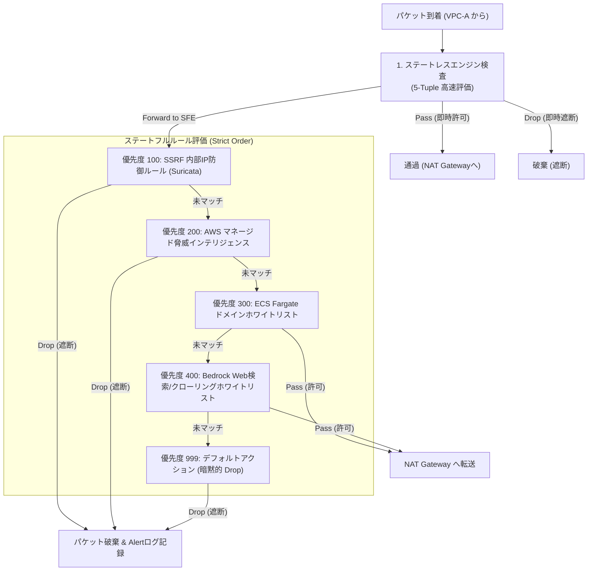
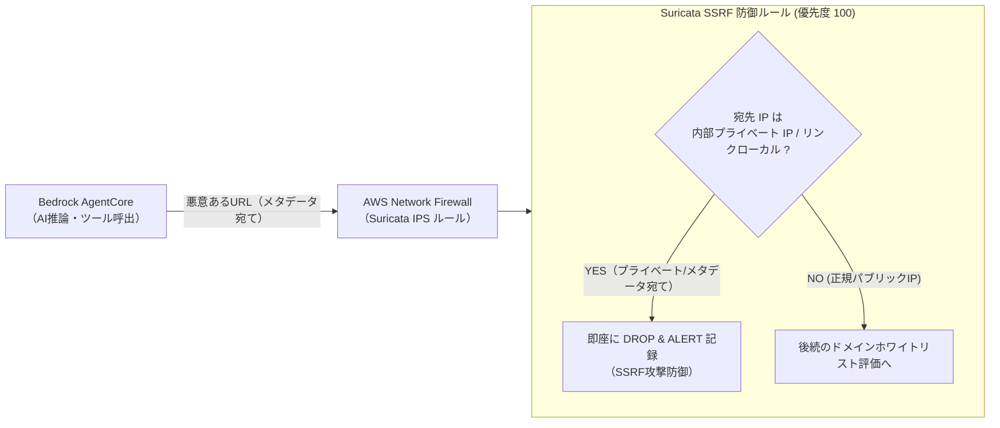
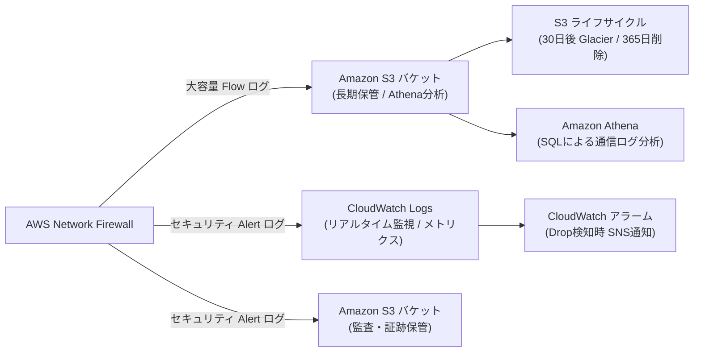
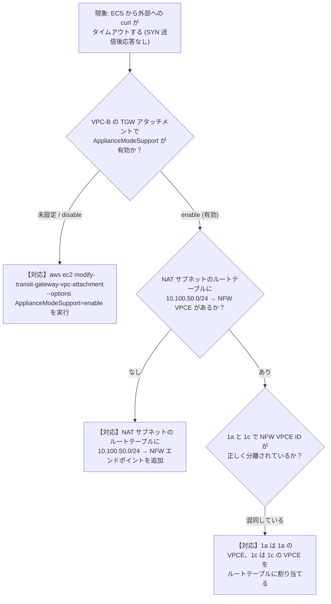

# 🚀 AWS：Network Firewall / NAT Gateway / Transit Gateway 構築・運用設計ガイド

本ドキュメントは、AWS 上で **Amazon ECS on AWS Fargate** および **Amazon Bedrock AgentCore（AIエージェント）** を安全に運用するための、ネットワーク通信制御ハブ（VPC-B）における **AWS Network Firewall / NAT Gateway / Transit Gateway** の総合設計・構築・運用ガイドです。

既存の [AWS：ECS Fargate ガイド](file:///D:/Github/markdown/aws/markdown/AWS%EF%BC%9AECS.md) および [AWS：API Gateway / Step Functions ガイド](file:///D:/Github/markdown/aws/markdown/AWS%EF%BC%9AApiGateway.md) と完全に整合し、サービス提供用 VPC（VPC-A）から送信されるすべてのアウトバウンド通信（外部 API 連携、Web 検索、クローリング、パッチ取得等）に対して、**TLS SNI / HTTP Host 検査、Suricata 互換ステートフル IPS ルール、SSRF（内部不正アクセス）防御、マルチAZ対称ルーティング** を適用して厳格に制御・監査します。  
すべての構築・運用手順を **AWS マネジメントコンソール（GUI）** と **AWS CLI (v2)** の双方で詳細に解説します。

---

## 📑 目次

- [1. はじめに（全体アーキテクチャと基本設計）](#1-はじめに全体アーキテクチャと基本設計)
  - [1.1 AWS Network Firewall の基本概念と特長](#11-aws-network-firewall-の基本概念と特長)
  - [1.2 全体アーキテクチャ概要図](#12-全体アーキテクチャ概要図)
  - [1.3 マルチAZ 対称ルーティング詳細フロー（1a / 1c 完全分離）](#13-マルチaz-対称ルーティング詳細フロー1a--1c-完全分離)
  - [1.4 前提条件と設計パラメータ一覧](#14-前提条件と設計パラメータ一覧)
- [2. VPC-B（ハブVPC）ネットワーク・サブネット設計](#2-vpc-bハブvpcネットワークサブネット設計)
  - [2.1 サブネット設計（東京 1a / 1c マルチAZ）](#21-サブネット設計東京-1a--1c-マルチaz)
  - [2.2 マルチAZ ルーティングマトリクス（往路・復路の対称性担保）](#22-マルチaz-ルーティングマトリクス往路復路の対称性担保)
  - [2.3 サブネットの作成手順（GUI / CLI）](#23-サブネットの作成手順gui--cli)
- [3. Internet Gateway（IGW）の作成とアタッチ](#3-internet-gatewayigwの作成とアタッチ)
  - [3.1 IGW の作成と VPC-B へのアタッチ（GUI / CLI）](#31-igw-の作成と-vpc-b-へのアタッチgui--cli)
  - [3.2 IGW Ingress（エッジ）ルーティングの考え方と適用手順（GUI / CLI）](#32-igw-ingressエッジルーティングの考え方と適用手順gui--cli)
- [4. NAT Gateway の作成と Elastic IP 割り当て](#4-nat-gateway-の作成と-elastic-ip-割り当て)
  - [4.1 NAT Gateway マルチAZ 冗長設計（1a / 1c）](#41-nat-gateway-マルチaz-冗長設計1a--1c)
  - [4.2 Elastic IP の確保とタグ設定（GUI / CLI）](#42-elastic-ip-の確保とタグ設定gui--cli)
  - [4.3 NAT Gateway の作成手順（GUI / CLI）](#43-nat-gateway-の作成手順gui--cli)
- [5. Transit Gateway（TGW）連携とルートテーブル設定](#5-transit-gatewaytgw連携とルートテーブル設定)
  - [5.1 TGW VPC アタッチメントの作成（VPC-A / VPC-B）（GUI / CLI）](#51-tgw-vpc-アタッチメントの作成vpc-a--vpc-bgui--cli)
  - [5.2 TGW ルートテーブルの設計と関連付け（GUI / CLI）](#52-tgw-ルートテーブルの設計と関連付けgui--cli)
  - [5.3 VPC-A（ECS側）および VPC-B（ハブ側）ルートテーブルの設定（GUI / CLI）](#53-vpc-aecs側および-vpc-bハブ側ルートテーブルの設定gui--cli)
- [6. AWS Network Firewall の作成とエンドポイント配置](#6-aws-network-firewall-の作成とエンドポイント配置)
  - [6.1 ファイアウォールエンドポイントの仕組み（AZ別 VPCE ID の取得）](#61-ファイアウォールエンドポイントの仕組みaz別-vpce-id-の取得)
  - [6.2 Network Firewall の作成手順（GUI / CLI）](#62-network-firewall-の作成手順gui--cli)
- [7. Firewall ポリシーとルールグループの詳細設計](#7-firewall-ポリシーとルールグループの詳細設計)
  - [7.1 ルール評価エンジンと評価順序（Strict Order 推奨）](#71-ルール評価エンジンと評価順序strict-order-推奨)
  - [7.2 ステートレスルールグループの設計と作成（GUI / CLI）](#72-ステートレスルールグループの設計と作成gui--cli)
  - [7.3 ステートフルルールグループの設計と作成（GUI / CLI）](#73-ステートフルルールグループの設計と作成gui--cli)
  - [7.4 Firewall ポリシーの作成とルールグループ紐付け（GUI / CLI）](#74-firewall-ポリシーの作成とルールグループ紐付けgui--cli)
- [8. セキュリティグループとネットワーク ACL（NACL）設計](#8-セキュリティグループとネットワーク-aclnacl設計)
  - [8.1 セキュリティグループ設計マトリクス（VPC-B 内各リソース）](#81-セキュリティグループ設計マトリクスvpc-b-内各リソース)
  - [8.2 ネットワーク ACL（NACL）による多層防御設定（GUI / CLI）](#82-ネットワーク-aclnaclによる多層防御設定gui--cli)
- [9. IAM ロール・ポリシーの設計と作成](#9-iam-ロールポリシーの設計と作成)
  - [9.1 Network Firewall 管理者ロール（最小権限設計）（GUI / CLI）](#91-network-firewall-管理者ロール最小権限設計gui--cli)
  - [9.2 ログ配信・CloudWatch 連携用 IAM 権限（GUI / CLI）](#92-ログ配信cloudwatch-連携用-iam-権限gui--cli)
- [10. ECS Fargate 通信制御ポリシー設計・実装](#10-ecs-fargate-通信制御ポリシー設計実装)
  - [10.1 コンテナ外部通信用ドメインホワイトリスト（FQDN / TLS SNI）（GUI / CLI）](#101-コンテナ外部通信用ドメインホワイトリストfqdn--tls-snigui--cli)
  - [10.2 マルウェア・ボットネット C2 遮断ルール（Suricata / AWS マネージド）（GUI / CLI）](#102-マルウェアボットネット-c2-遮断ルールsuricata--aws-マネージドgui--cli)
- [11. Bedrock AgentCore 通信制御ポリシー設計・実装](#11-bedrock-agentcore-通信制御ポリシー設計実装)
  - [11.1 Web 検索 / クローリング用ドメインホワイトリスト設計（GUI / CLI）](#111-web-検索--クローリング用ドメインホワイトリスト設計gui--cli)
  - [11.2 SSRF（内部ネットワーク不正アクセス）防御ルール（Suricata）（GUI / CLI）](#112-ssrf内部ネットワーク不正アクセス防御ルールsuricatagui--cli)
  - [11.3 悪意あるスクリプト・データ流出防止ルール（Suricata）（GUI / CLI）](#113-悪意あるスクリプトデータ流出防止ルールsuricatagui--cli)
- [12. メンテナンス・バックアップ・構成管理（IaC）設計](#12-メンテナンスバックアップ構成管理iac設計)
  - [12.1 ルール定義のエクスポートと Git / IaC バージョン管理（CLI）](#121-ルール定義のエクスポートと-git--iac-バージョン管理cli)
  - [12.2 ファイアウォールルールの安全な変更手順（ステージング検証とゼロダウンタイム更新）（GUI / CLI）](#122-ファイアウォールルールの安全な変更手順ステージング検証とゼロダウンタイム更新gui--cli)
- [13. 削除保護・誤操作防止設計](#13-削除保護誤操作防止設計)
  - [13.1 Network Firewall 削除保護およびサブネット変更保護（GUI / CLI）](#131-network-firewall-削除保護およびサブネット変更保護gui--cli)
  - [13.2 NAT Gateway / Elastic IP / ルートテーブルの誤削除防止ガードレール（IAM / SCP）](#132-nat-gateway--elastic-ip--ルートテーブルの誤削除防止ガードレールiam--scp)
- [14. アクティビティログ・監査ログ（CloudTrail / AWS Config）](#14-アクティビティログ監査ログcloudtrail--aws-config)
  - [14.1 CloudTrail によるファイアウォール管理イベント記録（GUI / CLI）](#141-cloudtrail-によるファイアウォール管理イベント記録gui--cli)
  - [14.2 ルール変更のリアルタイム検知と EventBridge アラート（GUI / CLI）](#142-ルール変更のリアルタイム検知と-eventbridge-アラートgui--cli)
- [15. Network Firewall ログ（Flow / Alert）の保存とコスト最適化](#15-network-firewall-ログflow--alertの保存とコスト最適化)
  - [15.1 Flow ログ・Alert ログの出力設定（S3 / CloudWatch Logs）（GUI / CLI）](#151-flow-ログalert-ログの出力設定s3--cloudwatch-logsgui--cli)
  - [15.2 S3 階層化・ライフサイクル設定（コスト削減）（GUI / CLI）](#152-s3-階層化ライフサイクル設定コスト削減gui--cli)
  - [15.3 Amazon Athena によるログ検索・分析クエリ例（SQL）](#153-amazon-athena-によるログ検索分析クエリ例sql)
- [16. 障害監視・パフォーマンス監視・アラート通知](#16-障害監視パフォーマンス監視アラート通知)
  - [16.1 重要監視メトリクス一覧（DroppedPackets, PassedPackets, ReceivedPackets 等）](#161-重要監視メトリクス一覧droppedpackets-passedpackets-receivedpackets-等)
  - [16.2 CloudWatch アラームの作成手順（GUI / CLI）](#162-cloudwatch-アラームの作成手順gui--cli)
  - [16.3 EventBridge + SNS によるリアルタイム障害メール通知（GUI / CLI）](#163-eventbridge--sns-によるリアルタイム障害メール通知gui--cli)
- [17. エンドツーエンド動作確認・疎通テスト・Suricata ルール検証手順](#17-エンドツーエンド動作確認疎通テストsuricata-ルール検証手順)
  - [17.1 ECS Fargate（ECS Exec）からのアウトバウンド疎通テスト（CLI）](#171-ecs-fargateecs-execからのアウトバウンド疎通テストcli)
  - [17.2 ドメインホワイトリストおよび遮断動作の検証（CLI）](#172-ドメインホワイトリストおよび遮断動作の検証cli)
  - [17.3 Alert ログおよび Flow ログの確認手順（CLI）](#173-alert-ログおよび-flow-ログの確認手順cli)
- [18. トラブルシューティングガイド](#18-トラブルシューティングガイド)
  - [18.1 非対称ルーティングによる TCP 接続タイムアウト（AZ跨ぎ・戻りルート不正）](#181-非対称ルーティングによる-tcp-接続タイムアウトaz跨ぎ戻りルート不正)
  - [18.2 TLS SNI 不一致または HTTP Host ヘッダー欠落による遮断](#182-tls-sni-不一致または-http-host-ヘッダー欠落による遮断)
  - [18.3 NAT Gateway ポート枯渇（ErrorPortAllocation）](#183-nat-gateway-ポート枯渇errorportallocation)
  - [18.4 ルールグループのキャパシティ超過エラー（Capacity Limit Reached）](#184-ルールグループのキャパシティ超過エラーcapacity-limit-reached)

---

## 1. はじめに（全体アーキテクチャと基本設計）

### 1.1 AWS Network Firewall の基本概念と特長

**AWS Network Firewall** は、すべての Amazon VPC に不可欠なネットワーク保護を簡単に導入できるようにする、フルマネージド型のステートフル・ネットワーク脅威保護サービスです。  
最大 100 Gbps のトラフィックを処理可能で、可用性・スケーリングは AWS が自動管理します。



#### 本ガイドにおけるコアセキュリティ要件
1. **ECS Fargate からのアウトバウンド通信制御**:
   - AWS 内部通信（ECR, S3, DynamoDB, CloudWatch 等）は VPC-A 内の **VPC エンドポイント** を通過し、外部に出さない。
   - 外部 SaaS（GitHub, 決済 Gateway, サードパーティ API 等）への通信のみを **FQDN / TLS SNI ホワイトリスト** で許可。
2. **Bedrock AgentCore のインターネット通信制御**:
   - AI エージェントが実行する Web 検索（Google Search API, Tavily, SerpAPI 等）および指定 Web サイトへのクローリング通信を許可。
   - **SSRF（Server-Side Request Forgery）防御**: AI エージェントが悪意あるプロンプト注入等により、社内内部 IP（`10.0.0.0/8`, `172.16.0.0/12`, `192.168.0.0/16`）やメタデータエンドポイント（`169.254.169.254`）へアクセスすることをファイアウォール層で強制 Drop。
   - 悪意ある C2（Command & Control）サーバやマルウェア配布元への通信を AWS マネージド脅威インテリジェンスルールで自動遮断。

---

### 1.2 全体アーキテクチャ概要図

本システムは、サービス提供用 VPC（**VPC-A**）と通信制御ハブ VPC（**VPC-B**）を **AWS Transit Gateway (TGW)** で接続する「集中型アウトバウンド検査（Centralized Outbound Egress Inspection）」アーキテクチャを採用しています。



---

### 1.3 マルチAZ 対称ルーティング詳細フロー（1a / 1c 完全分離）

AWS Network Firewall はステートフル（状態保持）なパケット検査を行うため、**「往路（Outbound）」と「復路（Inbound / Return）」で必ず同一 AZ のファイアウォールエンドポイントを通過する（対称ルーティング）** 必要があります。  
AZ を跨ぐ非対称ルーティングが発生すると、TCP 3-way ハンドシェイクが不成立となりパケットが破棄されます。



---

### 1.4 前提条件と設計パラメータ一覧

| 項目 | 設計値 / パラメータ | 備考 |
| :--- | :--- | :--- |
| **AWS リージョン** | `ap-northeast-1` (東京リージョン) | マルチ AZ 構成（1a: `ap-northeast-1a`, 1c: `ap-northeast-1c`） |
| **VPC-A (サービス用)** | CIDR: `10.100.50.0/24` | `AWS：ECS.md` と共通（ECS Fargate, Bedrock, 内部ALB, VPCE） |
| **VPC-B (ハブVPC)** | CIDR: `10.100.51.0/24` | **通信制御ハブ（Network Firewall, NAT GW, IGW, TGW Att）** |
| **Transit Gateway (TGW)** | TGW ID: `tgw-0123456789abcdef0` | アプライアンスモード（Appliance Mode）有効化 |
| **Network Firewall 名** | `nfw-egress-production` | VPC-B の Firewall サブネット（1a/1c）に配置 |
| **Firewall ポリシー名** | `nfw-policy-production` | Strict Order（厳格順序）ルール評価 |
| **NAT Gateway 配置** | AZ-1a: `nat-0111111111111111a`<br>AZ-1c: `nat-0222222222222222c` | パブリックサブネットに AZ 別に 2 台冗長配置 |
| **Elastic IP** | 1a: `eipalloc-0111111111111111a`<br>1c: `eipalloc-0222222222222222c` | NAT Gateway 紐付け用固定パブリック IP |
| **ログ保存先** | S3: `s3://prod-nfw-logs-123456789012/`<br>CW: `/aws/network-firewall/prod-egress` | Flow ログおよび Alert ログのデュアル保存 |

---

## 2. VPC-B（ハブVPC）ネットワーク・サブネット設計

### 2.1 サブネット設計（東京 1a / 1c マルチAZ）

VPC-B（CIDR: `10.100.51.0/24`）内に、機能と AZ ごとに厳格に分離された **合計 6 つのサブネット** を設計します。

| サブネット名 | CIDR ブロック | AZ | 種別 | 主な用途 |
| :--- | :--- | :--- | :--- | :--- |
| `subnet-vpcb-tgw-1a` | `10.100.51.0/28` | `ap-northeast-1a` | プライベート | TGW VPC アタッチメント用 (1a) |
| `subnet-vpcb-tgw-1c` | `10.100.51.16/28` | `ap-northeast-1c` | プライベート | TGW VPC アタッチメント用 (1c) |
| `subnet-vpcb-nfw-1a` | `10.100.51.64/28` | `ap-northeast-1a` | プライベート | Network Firewall エンドポイント (1a) |
| `subnet-vpcb-nfw-1c` | `10.100.51.80/28` | `ap-northeast-1c` | プライベート | Network Firewall エンドポイント (1c) |
| `subnet-vpcb-nat-1a` | `10.100.51.128/28` | `ap-northeast-1a` | **パブリック** | NAT Gateway (1a) + EIP |
| `subnet-vpcb-nat-1c` | `10.100.51.144/28` | `ap-northeast-1c` | **パブリック** | NAT Gateway (1c) + EIP |

---

### 2.2 マルチAZ ルーティングマトリクス（往路・復路の対称性担保）

各サブネットに関連付けるルートテーブルを AZ ごとに完全に分離し、対称ルーティングを実現します。



| ルートテーブル名 | 関連付けサブネット | 宛先 CIDR | ターゲット | 設計意図 |
| :--- | :--- | :--- | :--- | :--- |
| **`rtb-vpcb-tgw-1a`** | `subnet-vpcb-tgw-1a` | `0.0.0.0/0`<br>`10.100.51.0/24` | `vpce-nfw-1a`<br>`local` | VPC-A からの 1a トラフィックを NFW-1a エンドポイントへ転送 |
| **`rtb-vpcb-tgw-1c`** | `subnet-vpcb-tgw-1c` | `0.0.0.0/0`<br>`10.100.51.0/24` | `vpce-nfw-1c`<br>`local` | VPC-A からの 1c トラフィックを NFW-1c エンドポイントへ転送 |
| **`rtb-vpcb-nfw-1a`** | `subnet-vpcb-nfw-1a` | `0.0.0.0/0`<br>`10.100.50.0/24` | `nat-0111111111111111a`<br>`tgw-0123456789abcdef0` | NFW 検査通過後の外部宛てを NAT-1a へ転送、戻りを TGW へ転送 |
| **`rtb-vpcb-nfw-1c`** | `subnet-vpcb-nfw-1c` | `0.0.0.0/0`<br>`10.100.50.0/24` | `nat-0222222222222222c`<br>`tgw-0123456789abcdef0` | NFW 検査通過後の外部宛てを NAT-1c へ転送、戻りを TGW へ転送 |
| **`rtb-vpcb-nat-1a`** | `subnet-vpcb-nat-1a` | `0.0.0.0/0`<br>`10.100.50.0/24` | `igw-0123456789abcdef0`<br>`vpce-nfw-1a` | 外部宛てを IGW へ転送、インターネットからの戻りを NFW-1a へ転送 |
| **`rtb-vpcb-nat-1c`** | `subnet-vpcb-nat-1c` | `0.0.0.0/0`<br>`10.100.50.0/24` | `igw-0123456789abcdef0`<br>`vpce-nfw-1c` | 外部宛てを IGW へ転送、インターネットからの戻りを NFW-1c へ転送 |

---

### 2.3 サブネットの作成手順

#### サブネット作成手順 (GUI)
1. **[VPC]** $\rightarrow$ **[サブネット]** $\rightarrow$ **[サブネットを作成]** をクリック。
2. **VPC ID**: `vpc-vpcb` (CIDR: `10.100.51.0/24`) を選択。
3. 表「2.1 サブネット設計」に従い、6 つのサブネット（`subnet-vpcb-tgw-1a/1c`, `subnet-vpcb-nfw-1a/1c`, `subnet-vpcb-nat-1a/1c`）を順次作成します。
4. **[サブネットを作成]** をクリック。

#### サブネット作成手順 (CLI)
```bash
VPC_B_ID="vpc-0b22222222222222b"

# 1. TGW サブネット (1a / 1c)
SUBNET_TGW_1A=$(aws ec2 create-subnet --vpc-id "${VPC_B_ID}" --cidr-block 10.100.51.0/28 --availability-zone ap-northeast-1a --tag-specifications "ResourceType=subnet,Tags=[{Key=Name,Value=subnet-vpcb-tgw-1a}]" --query "Subnet.SubnetId" --output text)
SUBNET_TGW_1C=$(aws ec2 create-subnet --vpc-id "${VPC_B_ID}" --cidr-block 10.100.51.16/28 --availability-zone ap-northeast-1c --tag-specifications "ResourceType=subnet,Tags=[{Key=Name,Value=subnet-vpcb-tgw-1c}]" --query "Subnet.SubnetId" --output text)

# 2. Firewall サブネット (1a / 1c)
SUBNET_NFW_1A=$(aws ec2 create-subnet --vpc-id "${VPC_B_ID}" --cidr-block 10.100.51.64/28 --availability-zone ap-northeast-1a --tag-specifications "ResourceType=subnet,Tags=[{Key=Name,Value=subnet-vpcb-nfw-1a}]" --query "Subnet.SubnetId" --output text)
SUBNET_NFW_1C=$(aws ec2 create-subnet --vpc-id "${VPC_B_ID}" --cidr-block 10.100.51.80/28 --availability-zone ap-northeast-1c --tag-specifications "ResourceType=subnet,Tags=[{Key=Name,Value=subnet-vpcb-nfw-1c}]" --query "Subnet.SubnetId" --output text)

# 3. NAT Gateway パブリックサブネット (1a / 1c)
SUBNET_NAT_1A=$(aws ec2 create-subnet --vpc-id "${VPC_B_ID}" --cidr-block 10.100.51.128/28 --availability-zone ap-northeast-1a --tag-specifications "ResourceType=subnet,Tags=[{Key=Name,Value=subnet-vpcb-nat-1a}]" --query "Subnet.SubnetId" --output text)
SUBNET_NAT_1C=$(aws ec2 create-subnet --vpc-id "${VPC_B_ID}" --cidr-block 10.100.51.144/28 --availability-zone ap-northeast-1c --tag-specifications "ResourceType=subnet,Tags=[{Key=Name,Value=subnet-vpcb-nat-1c}]" --query "Subnet.SubnetId" --output text)

echo "Subnets created successfully."
```

---

## 3. Internet Gateway（IGW）の作成とアタッチ

### 3.1 IGW の作成と VPC-B へのアタッチ

#### IGW 作成・アタッチ手順 (GUI)
1. **[VPC]** $\rightarrow$ **[インターネットゲートウェイ]** $\rightarrow$ **[インターネットゲートウェイの作成]** をクリック。
2. **名前タグ**: `igw-vpcb-hub` を入力 $\rightarrow$ **[インターネットゲートウェイの作成]**。
3. 作成した IGW を選択し、**[アクション]** $\rightarrow$ **[VPC にアタッチ]** をクリック。
4. **利用可能な VPC**: `vpc-vpcb` を選択 $\rightarrow$ **[インターネットゲートウェイのアタッチ]** をクリック。

#### IGW 作成・アタッチ手順 (CLI)
```bash
# 1. IGW の作成
IGW_ID=$(aws ec2 create-internet-gateway \
    --tag-specifications "ResourceType=internet-gateway,Tags=[{Key=Name,Value=igw-vpcb-hub}]" \
    --query "InternetGateway.InternetGatewayId" --output text)

# 2. VPC-B へのアタッチ
aws ec2 attach-internet-gateway \
    --internet-gateway-id "${IGW_ID}" \
    --vpc-id "${VPC_B_ID}"

echo "Attached IGW: ${IGW_ID} to VPC: ${VPC_B_ID}"
```

---

### 3.2 IGW Ingress（エッジ）ルーティングの考え方と適用手順

本設計では、インターネットとの通信は **NAT Gateway を介したアウトバウンド通信のみ（SNAT）** であり、インターネットから直接 VPC-B 内部へのインバウンド接続（パブリック ALB や直接 SSH 等）は存在しません。  
そのため、インターネットからのレスポンスパケットは各 NAT Gateway の Elastic IP 宛てに着信します。NAT Gateway が受信したパケットは NAT サブネットのルートテーブル（`10.100.50.0/24` $\to$ `vpce-nfw-1a/1c`）に従って各 AZ のファイアウォールエンドポイントへ戻るため、**IGW へのエッジ関連付けルートテーブル（Ingress Routing）は不要** です。これにより構成がシンプルかつ堅牢に保たれます。

---

## 4. NAT Gateway の作成と Elastic IP 割り当て

### 4.1 NAT Gateway マルチAZ 冗長設計（1a / 1c）

単一 AZ の障害がシステム全体のアウトバウンド通信停止につながらないよう、`ap-northeast-1a` と `ap-northeast-1c` のパブリックサブネットにそれぞれ 1 台ずつ、合計 2 台の NAT Gateway を独立して配置します。

---

### 4.2 Elastic IP の確保とタグ設定

#### EIP 確保手順 (CLI)
```bash
# AZ-1a 用 EIP
EIP_1A=$(aws ec2 allocate-address \
    --domain vpc \
    --tag-specifications "ResourceType=elastic-ip,Tags=[{Key=Name,Value=eip-natgw-vpcb-1a},{Key=Environment,Value=Production}]" \
    --query "AllocationId" --output text)

# AZ-1c 用 EIP
EIP_1C=$(aws ec2 allocate-address \
    --domain vpc \
    --tag-specifications "ResourceType=elastic-ip,Tags=[{Key=Name,Value=eip-natgw-vpcb-1c},{Key=Environment,Value=Production}]" \
    --query "AllocationId" --output text)

echo "Allocated EIP 1a: ${EIP_1A}, EIP 1c: ${EIP_1C}"
```

---

### 4.3 NAT Gateway の作成手順

#### NAT Gateway 作成手順 (GUI)
1. **[VPC]** $\rightarrow$ **[NAT ゲートウェイ]** $\rightarrow$ **[NAT ゲートウェイを作成]** をクリック。
2. **NAT Gateway 1a**:
   - 名前: `natgw-vpcb-1a`
   - サブネット: `subnet-vpcb-nat-1a`
   - 接続タイプ: **パブリック**
   - Elastic IP 割り当て ID: `eip-natgw-vpcb-1a` を選択
   - **[NAT ゲートウェイを作成]** をクリック。
3. **NAT Gateway 1c**:
   - 名前: `natgw-vpcb-1c`
   - サブネット: `subnet-vpcb-nat-1c`
   - 接続タイプ: **パブリック**
   - Elastic IP 割り当て ID: `eip-natgw-vpcb-1c` を選択
   - **[NAT ゲートウェイを作成]** をクリック。

#### NAT Gateway 作成手順 (CLI)
```bash
# 1. NAT Gateway 1a 作成
NATGW_1A_ID=$(aws ec2 create-nat-gateway \
    --subnet-id "${SUBNET_NAT_1A}" \
    --allocation-id "${EIP_1A}" \
    --tag-specifications "ResourceType=natgateway,Tags=[{Key=Name,Value=natgw-vpcb-1a}]" \
    --query "NatGateway.NatGatewayId" --output text)

# 2. NAT Gateway 1c 作成
NATGW_1C_ID=$(aws ec2 create-nat-gateway \
    --subnet-id "${SUBNET_NAT_1C}" \
    --allocation-id "${EIP_1C}" \
    --tag-specifications "ResourceType=natgateway,Tags=[{Key=Name,Value=natgw-vpcb-1c}]" \
    --query "NatGateway.NatGatewayId" --output text)

echo "Waiting for NAT Gateways to become available..."
aws ec2 wait nat-gateway-available --nat-gateway-ids "${NATGW_1A_ID}" "${NATGW_1C_ID}"
echo "NAT Gateways are available: 1a=${NATGW_1A_ID}, 1c=${NATGW_1C_ID}"
```

---

## 5. Transit Gateway（TGW）連携とルートテーブル設定

### 5.1 TGW VPC アタッチメントの作成（VPC-A / VPC-B）

VPC-A（サービス VPC）および VPC-B（ハブ VPC）を Transit Gateway に接続します。  
> [!IMPORTANT]
> **アプライアンスモード（Appliance Mode）の有効化**:
> ステートフルファイアウォールを通過するトラフィックで AZ 間を跨ぐ非対称ルーティングを防ぐため、VPC-B の TGW アタッチメントでは **`ApplianceModeSupport=enable`** を必ず有効化します。

#### TGW アタッチメント作成手順 (CLI)
```bash
TGW_ID="tgw-0123456789abcdef0"
VPC_A_ID="vpc-0a11111111111111a"
SUBNET_A_TGW_1A="subnet-0a111111111111111"
SUBNET_A_TGW_1C="subnet-0a222222222222222"

# 1. VPC-A アタッチメント作成
TGW_ATT_A=$(aws ec2 create-transit-gateway-vpc-attachment \
    --transit-gateway-id "${TGW_ID}" \
    --vpc-id "${VPC_A_ID}" \
    --subnet-ids "${SUBNET_A_TGW_1A}" "${SUBNET_A_TGW_1C}" \
    --tag-specifications "ResourceType=transit-gateway-attachment,Tags=[{Key=Name,Value=tgw-att-vpca-service}]" \
    --query "TransitGatewayVpcAttachment.TransitGatewayAttachmentId" --output text)

# 2. VPC-B アタッチメント作成 (アプライアンスモード有効化)
TGW_ATT_B=$(aws ec2 create-transit-gateway-vpc-attachment \
    --transit-gateway-id "${TGW_ID}" \
    --vpc-id "${VPC_B_ID}" \
    --subnet-ids "${SUBNET_TGW_1A}" "${SUBNET_TGW_1C}" \
    --options ApplianceModeSupport=enable \
    --tag-specifications "ResourceType=transit-gateway-attachment,Tags=[{Key=Name,Value=tgw-att-vpcb-hub}]" \
    --query "TransitGatewayVpcAttachment.TransitGatewayAttachmentId" --output text)

echo "Created TGW Attachments: VPC-A=${TGW_ATT_A}, VPC-B=${TGW_ATT_B}"
```

---

### 5.2 TGW ルートテーブルの設計と関連付け

Transit Gateway 上で VPC-A からの通信を VPC-B へ転送し、VPC-B からの戻り通信を VPC-A へ転送するルートを設定します。

```bash
# TGW ルートテーブル ID
TGW_RT_ID=$(aws ec2 describe-transit-gateways --transit-gateway-ids "${TGW_ID}" --query "TransitGateways[0].Options.AssociationDefaultRouteTableId" --output text)

# 1. デフォルトルート (0.0.0.0/0) を VPC-B アタッチメントへ向ける
aws ec2 create-transit-gateway-route \
    --destination-cidr-block "0.0.0.0/0" \
    --transit-gateway-route-table-id "${TGW_RT_ID}" \
    --transit-gateway-attachment-id "${TGW_ATT_B}"

# 2. VPC-A 宛てルート (10.100.50.0/24) を VPC-A アタッチメントへ向ける
aws ec2 create-transit-gateway-route \
    --destination-cidr-block "10.100.50.0/24" \
    --transit-gateway-route-table-id "${TGW_RT_ID}" \
    --transit-gateway-attachment-id "${TGW_ATT_A}"
```

---

### 5.3 VPC-A（ECS側）および VPC-B（ハブ側）ルートテーブルの設定

#### 1. VPC-A ECS ルートテーブル設定
```bash
RTB_VPCA_ECS="rtb-0a11111111111111e"

# VPC-A の ECS サブネットからインターネット向けを TGW へ転送
aws ec2 create-route \
    --route-table-id "${RTB_VPCA_ECS}" \
    --destination-cidr-block "0.0.0.0/0" \
    --transit-gateway-id "${TGW_ID}"
```

#### 2. VPC-B NAT サブネットルートテーブル作成と設定
```bash
# 1. NAT サブネット用ルートテーブル (1a / 1c)
RTB_NAT_1A=$(aws ec2 create-route-table --vpc-id "${VPC_B_ID}" --tag-specifications "ResourceType=route-table,Tags=[{Key=Name,Value=rtb-vpcb-nat-1a}]" --query "RouteTable.RouteTableId" --output text)
RTB_NAT_1C=$(aws ec2 create-route-table --vpc-id "${VPC_B_ID}" --tag-specifications "ResourceType=route-table,Tags=[{Key=Name,Value=rtb-vpcb-nat-1c}]" --query "RouteTable.RouteTableId" --output text)

aws ec2 associate-route-table --route-table-id "${RTB_NAT_1A}" --subnet-id "${SUBNET_NAT_1A}"
aws ec2 associate-route-table --route-table-id "${RTB_NAT_1C}" --subnet-id "${SUBNET_NAT_1C}"

# 2. IGW 宛てルート追加 (0.0.0.0/0 → IGW)
aws ec2 create-route --route-table-id "${RTB_NAT_1A}" --destination-cidr-block "0.0.0.0/0" --gateway-id "${IGW_ID}"
aws ec2 create-route --route-table-id "${RTB_NAT_1C}" --destination-cidr-block "0.0.0.0/0" --gateway-id "${IGW_ID}"
```

---

## 6. AWS Network Firewall の作成とエンドポイント配置

### 6.1 ファイアウォールエンドポイントの仕組み（AZ別 VPCE ID の取得）

Network Firewall を作成すると、指定した Firewall サブネット（`subnet-vpcb-nfw-1a`, `subnet-vpcb-nfw-1c`）ごとに **Gateway Load Balancer エンドポイント（GWLB エンドポイント: `vpce-xxxx`）** が自動生成されます。  
ルートテーブルのネクストホップには、この AZ ごとの `vpce-xxxx` ID を指定します。



---

### 6.2 Network Firewall の作成手順

#### Network Firewall 作成手順 (GUI)
1. **[VPC]** $\rightarrow$ **[ネットワークファイアウォール]** $\rightarrow$ **[ファイアウォール]** $\rightarrow$ **[ファイアウォールの作成]** をクリック。
2. **基本設定**:
   - 名前: `nfw-egress-production`
   - VPC: `vpc-vpcb`
   - ファイアウォールポリシー: 「新しい空のファイアウォールポリシーを作成して関連付ける」を選択 $\rightarrow$ ポリシー名: `nfw-policy-production`
3. **サブネットマッピング**:
   - **AZ 1 (`ap-northeast-1a`)**: サブネット `subnet-vpcb-nfw-1a` を選択
   - **AZ 2 (`ap-northeast-1c`)**: サブネット `subnet-vpcb-nfw-1c` を選択
4. **高度な設定**:
   - 削除保護: **有効**
   - サブネット変更保護: **有効**
5. **[ファイアウォールの作成]** をクリック。

#### Network Firewall 作成手順 (CLI)
```bash
# 1. 空の Firewall ポリシーの作成 (Strict Order)
POLICY_ARN=$(aws network-firewall create-firewall-policy \
    --firewall-policy-name "nfw-policy-production" \
    --firewall-policy "StatelessDefaultActions=[\"aws:forward_to_sfe\"],StatelessFragmentDefaultActions=[\"aws:forward_to_sfe\"],StatefulEngineOptions={RuleOrder=STRICT_ORDER}" \
    --description "Production Egress Firewall Policy with Strict Order" \
    --query "FirewallPolicyResponse.FirewallPolicyArn" --output text)

# 2. Network Firewall の作成
FIREWALL_ARN=$(aws network-firewall create-firewall \
    --firewall-name "nfw-egress-production" \
    --firewall-policy-arn "${POLICY_ARN}" \
    --vpc-id "${VPC_B_ID}" \
    --subnet-mappings SubnetId="${SUBNET_NFW_1A}" SubnetId="${SUBNET_NFW_1C}" \
    --delete-protection \
    --subnet-change-protection \
    --tags Key=Environment,Value=Production Key=Project,Value=EgressControl \
    --query "Firewall.FirewallArn" --output text)

echo "Waiting for Network Firewall to be provisioned (STATUS=READY)..."
while true; do
  STATUS=$(aws network-firewall describe-firewall --firewall-arn "${FIREWALL_ARN}" --query "FirewallStatus.Status" --output text)
  echo "Current Status: ${STATUS}"
  if [ "${STATUS}" == "READY" ]; then
    break
  fi
  sleep 15
done

# 3. 生成された AZ 別 Firewall エンドポイント ID (VPCE ID) の取得
VPCE_NFW_1A=$(aws network-firewall describe-firewall --firewall-arn "${FIREWALL_ARN}" --query "FirewallStatus.SyncStates.\"ap-northeast-1a\".Attachment.EndpointId" --output text)
VPCE_NFW_1C=$(aws network-firewall describe-firewall --firewall-arn "${FIREWALL_ARN}" --query "FirewallStatus.SyncStates.\"ap-northeast-1c\".Attachment.EndpointId" --output text)

echo "Firewall Endpoints provisioned: 1a=${VPCE_NFW_1A}, 1c=${VPCE_NFW_1C}"
```

#### 4. Firewall 作成完了後の VPC-B ルートテーブル設定 (CLI)
エンドポイント ID 取得後、TGW サブネット、NFW サブネット、NAT サブネットの全ルートを確定させます。

```bash
# 1. TGW サブネット用ルートテーブル作成 & 設定
RTB_TGW_1A=$(aws ec2 create-route-table --vpc-id "${VPC_B_ID}" --tag-specifications "ResourceType=route-table,Tags=[{Key=Name,Value=rtb-vpcb-tgw-1a}]" --query "RouteTable.RouteTableId" --output text)
RTB_TGW_1C=$(aws ec2 create-route-table --vpc-id "${VPC_B_ID}" --tag-specifications "ResourceType=route-table,Tags=[{Key=Name,Value=rtb-vpcb-tgw-1c}]" --query "RouteTable.RouteTableId" --output text)

aws ec2 associate-route-table --route-table-id "${RTB_TGW_1A}" --subnet-id "${SUBNET_TGW_1A}"
aws ec2 associate-route-table --route-table-id "${RTB_TGW_1C}" --subnet-id "${SUBNET_TGW_1C}"

aws ec2 create-route --route-table-id "${RTB_TGW_1A}" --destination-cidr-block "0.0.0.0/0" --vpc-endpoint-id "${VPCE_NFW_1A}"
aws ec2 create-route --route-table-id "${RTB_TGW_1C}" --destination-cidr-block "0.0.0.0/0" --vpc-endpoint-id "${VPCE_NFW_1C}"

# 2. NFW サブネット用ルートテーブル作成 & 設定
RTB_NFW_1A=$(aws ec2 create-route-table --vpc-id "${VPC_B_ID}" --tag-specifications "ResourceType=route-table,Tags=[{Key=Name,Value=rtb-vpcb-nfw-1a}]" --query "RouteTable.RouteTableId" --output text)
RTB_NFW_1C=$(aws ec2 create-route-table --vpc-id "${VPC_B_ID}" --tag-specifications "ResourceType=route-table,Tags=[{Key=Name,Value=rtb-vpcb-nfw-1c}]" --query "RouteTable.RouteTableId" --output text)

aws ec2 associate-route-table --route-table-id "${RTB_NFW_1A}" --subnet-id "${SUBNET_NFW_1A}"
aws ec2 associate-route-table --route-table-id "${RTB_NFW_1C}" --subnet-id "${SUBNET_NFW_1C}"

# 0.0.0.0/0 を各 AZ の NAT Gateway へ転送
aws ec2 create-route --route-table-id "${RTB_NFW_1A}" --destination-cidr-block "0.0.0.0/0" --nat-gateway-id "${NATGW_1A_ID}"
aws ec2 create-route --route-table-id "${RTB_NFW_1C}" --destination-cidr-block "0.0.0.0/0" --nat-gateway-id "${NATGW_1C_ID}"

# 戻りルート: 10.100.50.0/24 (VPC-A宛て) を TGW へ転送
aws ec2 create-route --route-table-id "${RTB_NFW_1A}" --destination-cidr-block "10.100.50.0/24" --transit-gateway-id "${TGW_ID}"
aws ec2 create-route --route-table-id "${RTB_NFW_1C}" --destination-cidr-block "10.100.50.0/24" --transit-gateway-id "${TGW_ID}"

# 3. NAT サブネット用ルートテーブルに戻りルートを追加 (10.100.50.0/24 → NFW VPCE)
aws ec2 create-route --route-table-id "${RTB_NAT_1A}" --destination-cidr-block "10.100.50.0/24" --vpc-endpoint-id "${VPCE_NFW_1A}"
aws ec2 create-route --route-table-id "${RTB_NAT_1C}" --destination-cidr-block "10.100.50.0/24" --vpc-endpoint-id "${VPCE_NFW_1C}"

echo "All routing configuration for VPC-B completed successfully."
```

---

## 7. Firewall ポリシーとルールグループの詳細設計

### 7.1 ルール評価エンジンと評価順序（Strict Order 推奨）

Network Firewall には **ステートレスエンジン** と **ステートフルエンジン** の 2 つの検査レイヤーがあります。



> [!TIP]
> **Strict Order（厳格順序）のメリット**
> ルールに 1〜65535 の優先度（Priority）を割り当て、数値の小さい順に上から順次評価されます。Suricata 標準と同じ直感的な評価挙動（最初に一致したアクションを適用）となり、設計・テストの確実性が劇的に向上します。

---

### 7.2 ステートレスルールグループの設計と作成

VPC-A（`10.100.50.0/24`）からの正規トラフィックをステートフルエンジンへ転送し、明らかな不正フラグメントパケット等を即時破棄します。

#### ステートレスルールグループ定義 (`stateless-rules.json`)
```json
{
  "RulesSource": {
    "StatelessRulesAndCustomActions": {
      "StatelessRules": [
        {
          "Priority": 10,
          "RuleDefinition": {
            "MatchAttributes": {
              "Sources": [
                {
                  "AddressDefinition": "10.100.50.0/24"
                }
              ]
            },
            "Actions": [
              "aws:forward_to_sfe"
            ]
          }
        }
      ]
    }
  }
}
```

#### ステートレスルールグループ作成 (CLI)
```bash
STATELESS_GROUP_ARN=$(aws network-firewall create-rule-group \
    --rule-group-name "rg-stateless-forward-sfe" \
    --type STATELESS \
    --capacity 100 \
    --rule-group file://stateless-rules.json \
    --description "Stateless rule group to forward VPC-A traffic to Stateful Engine" \
    --query "RuleGroupResponse.RuleGroupArn" --output text)

echo "Created Stateless Rule Group: ${STATELESS_GROUP_ARN}"
```

---

### 7.3 ステートフルルールグループの設計と作成

本システムでは、以下の 4 つのステートフルルールグループを組み合わせて多層防御を構築します。

1. **`rg-stateful-ssrf-prevention` (優先度 100)**: SSRF 攻撃防止（Suricata ルール）
2. **`AWSManagedRulesThreatIntelDomainsActionOrder` (優先度 200)**: AWS マネージド脅威インテリジェンス
3. **`rg-stateful-ecs-allowlist` (優先度 300)**: ECS Fargate 用ドメインホワイトリスト
4. **`rg-stateful-bedrock-allowlist` (優先度 400)**: Bedrock AgentCore 用ドメインホワイトリスト

---

### 7.4 Firewall ポリシーの作成とルールグループ紐付け

#### Firewall ポリシー更新 (CLI)
```bash
aws network-firewall update-firewall-policy \
    --firewall-policy-arn "${POLICY_ARN}" \
    --firewall-policy '{
      "StatelessDefaultActions": ["aws:forward_to_sfe"],
      "StatelessFragmentDefaultActions": ["aws:drop"],
      "StatelessRuleGroupReferences": [
        {
          "ResourceArn": "'"${STATELESS_GROUP_ARN}"'",
          "Priority": 10
        }
      ],
      "StatefulDefaultActions": ["aws:drop_strict", "aws:alert_strict"],
      "StatefulEngineOptions": {
        "RuleOrder": "STRICT_ORDER"
      }
    }'
```

---

## 8. セキュリティグループとネットワーク ACL（NACL）設計

### 8.1 セキュリティグループ設計マトリクス（VPC-B 内各リソース）

AWS Network Firewall エンドポイントおよび NAT Gateway は、AWS マネージドな VPC インフラコンポーネントであるため、**セキュリティグループを直接アタッチすることはできません（アタッチ不要）**。通信制御はすべて Network Firewall ルールおよびサブネットルーティングで制御されます。

---

### 8.2 ネットワーク ACL（NACL）による多層防御設定

VPC-B のサブネットには、デフォルトの「全許可」NACL を適用するか、エフェメラルポートおよび許可プロトコル（TCP 80/443）に絞った多層防御用 NACL を適用します。

| ルール番号 | 送信元 / 宛先 | プロトコル | ポート範囲 | 許可 / 拒否 | 備考 |
| :--- | :--- | :--- | :--- | :--- | :--- |
| **インバウンド 100** | `10.100.50.0/24` | TCP | `80, 443` | **ALLOW** | VPC-A からの HTTP/HTTPS 許可 |
| **インバウンド 200** | `0.0.0.0/0` | TCP | `1024-65535` | **ALLOW** | インターネットからの戻りパケット（エフェメラルポート） |
| **インバウンド * ** | `0.0.0.0/0` | ALL | ALL | **DENY** | デフォルト拒否 |
| **アウトバウンド 100** | `0.0.0.0/0` | TCP | `80, 443` | **ALLOW** | 外部インターネット向け HTTP/HTTPS |
| **アウトバウンド 200** | `10.100.50.0/24` | TCP | `1024-65535` | **ALLOW** | VPC-A 宛ての戻りパケット |
| **アウトバウンド * ** | `0.0.0.0/0` | ALL | ALL | **DENY** | デフォルト拒否 |

---

## 9. IAM ロール・ポリシーの設計と作成

### 9.1 Network Firewall 管理者ロール（最小権限設計）

ファイアウォール設定の変更を特定の管理者または CI/CD パイプラインのみに限定するためのカスタム IAM ポリシーです。

#### 管理者用 IAM ポリシー (`nfw-admin-policy.json`)
```json
{
  "Version": "2012-10-17",
  "Statement": [
    {
      "Sid": "AllowNetworkFirewallManagement",
      "Effect": "Allow",
      "Action": [
        "network-firewall:Describe*",
        "network-firewall:List*",
        "network-firewall:CreateRuleGroup",
        "network-firewall:UpdateRuleGroup",
        "network-firewall:UpdateFirewallPolicy",
        "network-firewall:UpdateLoggingConfiguration",
        "network-firewall:TagResource",
        "network-firewall:UntagResource"
      ],
      "Resource": [
        "arn:aws:network-firewall:ap-northeast-1:123456789012:firewall/nfw-egress-production",
        "arn:aws:network-firewall:ap-northeast-1:123456789012:firewall-policy/nfw-policy-production",
        "arn:aws:network-firewall:ap-northeast-1:123456789012:stateful-rulegroup/*",
        "arn:aws:network-firewall:ap-northeast-1:123456789012:stateless-rulegroup/*"
      ]
    },
    {
      "Sid": "DenyFirewallDeletionExceptSuperAdmin",
      "Effect": "Deny",
      "Action": [
        "network-firewall:DeleteFirewall",
        "network-firewall:DeleteFirewallPolicy"
      ],
      "Resource": "*"
    }
  ]
}
```

---

### 9.2 ログ配信・CloudWatch 連携用 IAM 権限

Network Firewall から CloudWatch Logs および S3 へログを配信する権限を設定します。

```bash
# ログ配信用リソースポリシー (CloudWatch Logs)
aws logs put-resource-policy \
    --policy-name "AWSNetworkFirewallLoggingPolicy" \
    --policy-document '{
      "Version": "2012-10-17",
      "Statement": [
        {
          "Sid": "AllowNFWToWriteLogs",
          "Effect": "Allow",
          "Principal": {
            "Service": "delivery.logs.amazonaws.com"
          },
          "Action": [
            "logs:CreateLogStream",
            "logs:PutLogEvents"
          ],
          "Resource": "arn:aws:logs:ap-northeast-1:123456789012:log-group:/aws/network-firewall/*"
        }
      ]
    }'
```

---

## 10. ECS Fargate 通信制御ポリシー設計・実装

### 10.1 コンテナ外部通信用ドメインホワイトリスト（FQDN / TLS SNI）

ECS Fargate タスクが外部 SaaS や API と連携する際に必要なドメインのみを許可します。TLS SNI（Server Name Indication）および HTTP Host ヘッダーを厳格に照合します。

#### 許可対象ドメイン設計例
- `github.com`, `*.github.com`（ソースコード取得・Actions連携）
- `registry-1.docker.io`, `*.docker.com`（外部パブリックベースイメージ参照時）
- `api.stripe.com`（決済処理連携）
- `*.sendgrid.net`, `api.sendgrid.com`（メール送信連携）
- `api.openai.com`（外部 AI モデル連携時）

#### ドメインホワイトリストルールグループ作成 (CLI)
```bash
# 1. ルール定義ファイル作成
cat << 'EOF' > ecs-domain-rules.json
{
  "RulesSource": {
    "RulesSourceList": {
      "Targets": [
        "github.com",
        ".github.com",
        "registry-1.docker.io",
        ".docker.com",
        "api.stripe.com",
        ".sendgrid.net",
        "api.openai.com"
      ],
      "TargetTypes": [
        "TLS_SNI",
        "HTTP_HOST"
      ],
      "GeneratedRulesType": "ALLOWLIST"
    }
  },
  "StatefulRuleOptions": {
    "RuleOrder": "STRICT_ORDER"
  }
}
EOF

# 2. ステートフルルールグループの作成 (キャパシティ: 200)
ECS_RG_ARN=$(aws network-firewall create-rule-group \
    --rule-group-name "rg-stateful-ecs-allowlist" \
    --type STATEFUL \
    --capacity 200 \
    --rule-group file://ecs-domain-rules.json \
    --description "Domain allowlist for ECS Fargate outbound traffic" \
    --query "RuleGroupResponse.RuleGroupArn" --output text)

echo "Created ECS Domain Rule Group: ${ECS_RG_ARN}"
```

---

### 10.2 マルウェア・ボットネット C2 遮断ルール（Suricata / AWS マネージド）

AWS が脅威インテリジェンスに基づき自動更新するマネージドルールグループをファイアウォールポリシーに組み込みます。

- **`AWSManagedRulesBotnetCommandAndControlDomainsActionOrder`**: ボットネット C2 サーバとの通信を自動 Drop
- **`AWSManagedRulesThreatIntelDomainsActionOrder`**: 既知の不正ドメインとの通信を自動 Drop
- **`AWSManagedRulesMalwareDomainsActionOrder`**: マルウェア配布サイトとの通信を自動 Drop

---

## 11. Bedrock AgentCore 通信制御ポリシー設計・実装

### 11.1 Web 検索 / クローリング用ドメインホワイトリスト設計

AI エージェント（Bedrock AgentCore）が外部 Web 検索や指定 Web サイトのクローリングを実行する際の通信先をホワイトリスト制御します。

#### 許可対象 Web 検索 API および情報ソース例
- **Web 検索プロバイダー**:
  - `*.googleapis.com`（Google Custom Search API）
  - `api.tavily.com`（Tavily AI 検索エンジン）
  - `api.serpapi.com`（SerpAPI 検索）
  - `api.bing.microsoft.com`（Bing Web Search API）
- **クローリング・調査対象ドメイン**:
  - `.wikipedia.org`, `.gov`, `.edu`, `.ac.jp`, `.go.jp`（公的機関・学術・百科事典情報）

#### Bedrock 用ドメインホワイトリスト作成 (CLI)
```bash
cat << 'EOF' > bedrock-domain-rules.json
{
  "RulesSource": {
    "RulesSourceList": {
      "Targets": [
        ".googleapis.com",
        "api.tavily.com",
        "api.serpapi.com",
        "api.bing.microsoft.com",
        ".wikipedia.org",
        ".gov",
        ".edu",
        ".ac.jp",
        ".go.jp"
      ],
      "TargetTypes": [
        "TLS_SNI",
        "HTTP_HOST"
      ],
      "GeneratedRulesType": "ALLOWLIST"
    }
  },
  "StatefulRuleOptions": {
    "RuleOrder": "STRICT_ORDER"
  }
}
EOF

BEDROCK_RG_ARN=$(aws network-firewall create-rule-group \
    --rule-group-name "rg-stateful-bedrock-allowlist" \
    --type STATEFUL \
    --capacity 300 \
    --rule-group file://bedrock-domain-rules.json \
    --description "Domain allowlist for Bedrock AgentCore search and crawling" \
    --query "RuleGroupResponse.RuleGroupArn" --output text)

echo "Created Bedrock Domain Rule Group: ${BEDROCK_RG_ARN}"
```

---

### 11.2 SSRF（内部ネットワーク不正アクセス）防御ルール（Suricata）

AI エージェントがプロンプトインジェクション等により悪意ある URL を渡された際、**社内 VPC プライベート IP や EC2/ECS メタデータエンドポイント（`169.254.169.254`）へアクセスする SSRF（Server-Side Request Forgery）攻撃** を Suricata IPS ルールで確実に遮断（Drop & Alert）します。



#### Suricata SSRF 防御ルール定義 (`ssrf-prevention-rules.suricata`)
```suricata
# 1. リンクローカル / インスタンスメタデータ宛てアクセスの強制遮断
drop ip any any -> 169.254.169.254 any (msg:"[SECURITY] Blocked SSRF attempt to AWS Metadata Service"; sid:2000001; rev:1;)

# 2. 社内プライベート IPv4 宛てアクセスの強制遮断 (RFC 1918)
drop ip any any -> 10.0.0.0/8 any (msg:"[SECURITY] Blocked SSRF attempt to RFC1918 Class A (10.0.0.0/8)"; sid:2000002; rev:1;)
drop ip any any -> 172.16.0.0/12 any (msg:"[SECURITY] Blocked SSRF attempt to RFC1918 Class B (172.16.0.0/12)"; sid:2000003; rev:1;)
drop ip any any -> 192.168.0.0/16 any (msg:"[SECURITY] Blocked SSRF attempt to RFC1918 Class C (192.168.0.0/16)"; sid:2000004; rev:1;)

# 3. ループバック宛てアクセスの強制遮断
drop ip any any -> 127.0.0.0/8 any (msg:"[SECURITY] Blocked SSRF attempt to Loopback IP"; sid:2000005; rev:1;)
```

#### SSRF 防御ルールグループ作成 (CLI)
```bash
cat << 'EOF' > ssrf-rules.json
{
  "RulesSource": {
    "RulesString": "drop ip any any -> 169.254.169.254 any (msg:\"[SECURITY] Blocked SSRF attempt to AWS Metadata Service\"; sid:2000001; rev:1;)\ndrop ip any any -> 10.0.0.0/8 any (msg:\"[SECURITY] Blocked SSRF attempt to RFC1918 Class A\"; sid:2000002; rev:1;)\ndrop ip any any -> 172.16.0.0/12 any (msg:\"[SECURITY] Blocked SSRF attempt to RFC1918 Class B\"; sid:2000003; rev:1;)\ndrop ip any any -> 192.168.0.0/16 any (msg:\"[SECURITY] Blocked SSRF attempt to RFC1918 Class C\"; sid:2000004; rev:1;)\ndrop ip any any -> 127.0.0.0/8 any (msg:\"[SECURITY] Blocked SSRF attempt to Loopback IP\"; sid:2000005; rev:1;)"
  },
  "StatefulRuleOptions": {
    "RuleOrder": "STRICT_ORDER"
  }
}
EOF

SSRF_RG_ARN=$(aws network-firewall create-rule-group \
    --rule-group-name "rg-stateful-ssrf-prevention" \
    --type STATEFUL \
    --capacity 100 \
    --rule-group file://ssrf-rules.json \
    --description "Suricata rules to block SSRF and internal access" \
    --query "RuleGroupResponse.RuleGroupArn" --output text)

echo "Created SSRF Prevention Rule Group: ${SSRF_RG_ARN}"
```

---

### 11.3 悪意あるスクリプト・データ流出防止ルール（Suricata）

AI エージェントがクローリングした Web サイトに埋め込まれた悪意あるペイロードや、不審なバイナリダウンロードを Suricata シグネチャで検知・遮断します。

```suricata
# 実行可能バイナリ (.exe, .dll, .sh, .elf) のダウンロード検知・遮断
drop http any any -> any any (msg:"[SECURITY] Blocked executable download during Web Crawl"; flow:established,to_client; file_data; content:"MZ"; startswith; sid:2000010; rev:1;)
drop http any any -> any any (msg:"[SECURITY] Blocked ELF binary download during Web Crawl"; flow:established,to_client; file_data; content:"|7f 45 4c 46|"; startswith; sid:2000011; rev:1;)
```

---

#### 💡 Firewall ポリシーへの全ステートフルルールグループの組み込み (CLI)
優先度（Priority）を指定してポリシーを更新します。

```bash
aws network-firewall update-firewall-policy \
    --firewall-policy-arn "${POLICY_ARN}" \
    --firewall-policy '{
      "StatelessDefaultActions": ["aws:forward_to_sfe"],
      "StatelessFragmentDefaultActions": ["aws:drop"],
      "StatelessRuleGroupReferences": [
        {
          "ResourceArn": "'"${STATELESS_GROUP_ARN}"'",
          "Priority": 10
        }
      ],
      "StatefulRuleGroupReferences": [
        {
          "ResourceArn": "'"${SSRF_RG_ARN}"'",
          "Priority": 100
        },
        {
          "ResourceArn": "'"${ECS_RG_ARN}"'",
          "Priority": 300
        },
        {
          "ResourceArn": "'"${BEDROCK_RG_ARN}"'",
          "Priority": 400
        }
      ],
      "StatefulDefaultActions": ["aws:drop_strict", "aws:alert_strict"],
      "StatefulEngineOptions": {
        "RuleOrder": "STRICT_ORDER"
      }
    }'

echo "Updated Firewall Policy with all Rule Groups in Strict Order."
```

---

## 12. メンテナンス・バックアップ・構成管理（IaC）設計

### 12.1 ルール定義のエクスポートと Git / IaC バージョン管理

すべてのルールグループおよびポリシー定義は JSON 形式でエクスポートし、Git リポジトリでバージョン管理します。

```bash
# 1. ルールグループ定義のエクスポート
aws network-firewall describe-rule-group \
    --rule-group-arn "${SSRF_RG_ARN}" \
    --output json > ./firewall-rules/rg-stateful-ssrf-prevention.json

aws network-firewall describe-rule-group \
    --rule-group-arn "${BEDROCK_RG_ARN}" \
    --output json > ./firewall-rules/rg-stateful-bedrock-allowlist.json

# 2. ポリシー定義のエクスポート
aws network-firewall describe-firewall-policy \
    --firewall-policy-arn "${POLICY_ARN}" \
    --output json > ./firewall-rules/nfw-policy-production.json
```

---

### 12.2 ファイアウォールルールの安全な変更手順（ステージング検証とゼロダウンタイム更新）

Network Firewall のルール変更は **完全なインプレース（無停止・ゼロダウンタイム）** で適用されます。ただし、誤ったルールによる通信断を防止するため、以下の安全手順を踏みます：

1. **ステージング環境での事前テスト**:
   - ステージング VPC に同一の Suricata ルールを適用し、ECS Exec から `curl` 等で通信可否を検証。
2. **本番適用前のドライラン（Alert アクションでの確認）**:
   - 新規ルール追加時は、最初 `drop` ではなく `alert` アクションで適用し、想定外の正規通信が検知されないか CloudWatch Logs で確認。
3. **本番適用とコミット**:
   - 問題がないことを確認後、`drop` アクションに切り替えて本番適用。

---

## 13. 削除保護・誤操作防止設計

### 13.1 Network Firewall 削除保護およびサブネット変更保護

意図しないファイアウォールの削除や、ルーティングが壊れるサブネットの変更を防止するため、2 重の保護フラグを有効化します。

#### 削除保護・サブネット変更保護の有効化 (CLI)
```bash
# 1. 削除保護の有効化
aws network-firewall update-firewall-delete-protection \
    --firewall-arn "${FIREWALL_ARN}" \
    --delete-protection

# 2. サブネット変更保護の有効化
aws network-firewall update-subnet-change-protection \
    --firewall-arn "${FIREWALL_ARN}" \
    --subnet-change-protection

echo "Delete Protection and Subnet Change Protection enabled."
```

---

### 13.2 NAT Gateway / Elastic IP / ルートテーブルの誤削除防止ガードレール

AWS Organizations の SCP（サービスコントロールポリシー）または IAM 拒否ポリシーを用いて、本番 VPC-B の重要インフラ削除を防止します。

```json
{
  "Version": "2012-10-17",
  "Statement": [
    {
      "Sid": "PreventDeletionOfCoreNetworkInfrastructure",
      "Effect": "Deny",
      "Action": [
        "ec2:DeleteNatGateway",
        "ec2:ReleaseAddress",
        "ec2:DeleteRouteTable",
        "ec2:DeleteRoute",
        "ec2:DetachInternetGateway",
        "ec2:DeleteInternetGateway"
      ],
      "Resource": "*",
      "Condition": {
        "StringEquals": {
          "aws:ResourceTag/Environment": "Production"
        },
        "StringNotLike": {
          "aws:PrincipalArn": "arn:aws:iam::123456789012:role/SuperAdminEmergencyRole"
        }
      }
    }
  ]
}
```

---

## 14. アクティビティログ・監査ログ（CloudTrail / AWS Config）

### 14.1 CloudTrail によるファイアウォール管理イベント記録

すべての Network Firewall 変更操作（ルール追加、ポリシー変更、ルーティング変更等）は **AWS CloudTrail** に記録され、S3 バケットへ保存されます。

---

### 14.2 ルール変更のリアルタイム検知と EventBridge アラート

ファイアウォールポリシーやルールグループが変更された際、EventBridge ルールで即座に検知し、セキュリティ管理者へ SNS メール通知を送信します。

#### EventBridge イベントパターン (`nfw-change-event-pattern.json`)
```json
{
  "source": ["aws.network-firewall"],
  "detail-type": ["AWS API Call via CloudTrail"],
  "detail": {
    "eventSource": ["network-firewall.amazonaws.com"],
    "eventName": [
      "UpdateFirewallPolicy",
      "UpdateRuleGroup",
      "DeleteRuleGroup",
      "AssociateFirewallPolicy"
    ]
  }
}
```

#### EventBridge ルール作成 (CLI)
```bash
aws events put-rule \
    --name "rule-nfw-config-change-alert" \
    --event-pattern file://nfw-change-event-pattern.json \
    --state ENABLED \
    --description "Alert on Network Firewall rule or policy changes"

# SNS トピックへのターゲット紐付け
aws events put-targets \
    --rule "rule-nfw-config-change-alert" \
    --targets "Id=1,Arn=arn:aws:sns:ap-northeast-1:123456789012:SecurityAlertsTopic"
```

---

## 15. Network Firewall ログ（Flow / Alert）の保存とコスト最適化

### 15.1 Flow ログ・Alert ログの出力設定（S3 / CloudWatch Logs）

Network Firewall は 2 種類のログを出力できます：
1. **Flow ログ (FLOW)**: 通過したすべての TCP/UDP/ICMP トラフィックの 5-Tuple 統計ログ。大容量のため **Amazon S3** に保存。
2. **Alert ログ (ALERT)**: Suricata ルールやドメインフィルタリングによって遮断（Drop）または検知（Alert）されたセキュリティログ。リアルタイム監視のため **CloudWatch Logs** および **S3** にデュアル保存。



#### ログ出力設定 (CLI)
```bash
# 1. CloudWatch Logs ロググループの作成
aws logs create-log-group --log-group-name "/aws/network-firewall/prod-egress-alert"
aws logs put-retention-policy --log-group-name "/aws/network-firewall/prod-egress-alert" --retention-in-days 30

# 2. Network Firewall ログ設定の適用
aws network-firewall update-logging-configuration \
    --firewall-arn "${FIREWALL_ARN}" \
    --logging-configuration '{
      "LogDestinationConfigs": [
        {
          "LogType": "ALERT",
          "LogDestinationType": "CloudWatchLogs",
          "LogDestination": {
            "logGroup": "/aws/network-firewall/prod-egress-alert"
          }
        },
        {
          "LogType": "ALERT",
          "LogDestinationType": "S3",
          "LogDestination": {
            "bucketName": "prod-nfw-logs-123456789012",
            "prefix": "alerts/"
          }
        },
        {
          "LogType": "FLOW",
          "LogDestinationType": "S3",
          "LogDestination": {
            "bucketName": "prod-nfw-logs-123456789012",
            "prefix": "flows/"
          }
        }
      ]
    }'

echo "Configured FLOW and ALERT logging for Network Firewall."
```

---

### 15.2 S3 階層化・ライフサイクル設定（コスト削減）

Flow ログは膨大なデータ量となるため、S3 ライフサイクルルールを設定してストレージコストを 90% 以上削減します。

#### ライフサイクル設定定義 (`nfw-log-lifecycle.json`)
```json
{
  "Rules": [
    {
      "ID": "MoveFlowLogsToGlacierAndExpire",
      "Status": "Enabled",
      "Filter": {
        "Prefix": "flows/"
      },
      "Transitions": [
        {
          "Days": 30,
          "StorageClass": "GLACIER_IR"
        },
        {
          "Days": 90,
          "StorageClass": "DEEP_ARCHIVE"
        }
      ],
      "Expiration": {
        "Days": 365
      }
    },
    {
      "ID": "RetainAlertLogsForCompliance",
      "Status": "Enabled",
      "Filter": {
        "Prefix": "alerts/"
      },
      "Transitions": [
        {
          "Days": 90,
          "StorageClass": "GLACIER_IR"
        }
      ],
      "Expiration": {
        "Days": 2555
      }
    }
  ]
}
```

```bash
aws s3api put-bucket-lifecycle-configuration \
    --bucket prod-nfw-logs-123456789012 \
    --lifecycle-configuration file://nfw-log-lifecycle.json
```

---

### 15.3 Amazon Athena によるログ検索・分析クエリ例

S3 に保存された Network Firewall ログを Amazon Athena で即座にクエリ分析できます。

#### 1. Athena テーブル作成クエリ (Alert ログ)
```sql
CREATE EXTERNAL TABLE IF NOT EXISTS nfw_alert_logs (
  firewall_name string,
  availability_zone string,
  event_timestamp string,
  event struct<
    timestamp: string,
    src_ip: string,
    src_port: int,
    dest_ip: string,
    dest_port: int,
    proto: string,
    alert: struct<
      action: string,
      signature_id: int,
      rev: int,
      signature: string,
      category: string,
      severity: int
    >,
    tls: struct<
      sni: string,
      version: string
    >,
    http: struct<
      hostname: string,
      url: string,
      http_user_agent: string,
      http_method: string
    >
  >
)
ROW FORMAT SERDE 'org.openx.data.jsonserde.JsonSerDe'
LOCATION 's3://prod-nfw-logs-123456789012/alerts/AWSLogs/123456789012/network-firewall/ap-northeast-1/';
```

#### 2. 遮断された通信 Top 20 の集計クエリ
```sql
SELECT 
  event.src_ip,
  COALESCE(event.tls.sni, event.http.hostname, event.dest_ip) AS destination,
  event.alert.signature,
  event.alert.action,
  COUNT(*) as block_count
FROM nfw_alert_logs
WHERE event.alert.action = 'drop'
GROUP BY 1, 2, 3, 4
ORDER BY block_count DESC
LIMIT 20;
```

---

## 16. 障害監視・パフォーマンス監視・アラート通知

### 16.1 重要監視メトリクス一覧

| メトリクス名 | 名前空間 (Namespace) | ディメンション | 推奨しきい値 | 監視目的・障害内容 |
| :--- | :--- | :--- | :--- | :--- |
| **`DroppedPackets`** | `AWS/NetworkFirewall` | `FirewallName`, `AvailabilityZone` | **> 100 パケット / 5分** | 不正通信またはホワイトリスト設定漏れによる遮断の急増検知 |
| **`PassedPackets`** | `AWS/NetworkFirewall` | `FirewallName`, `AvailabilityZone` | 変動トレンド監視 | トラフィック急増・異常アクセスの検知 |
| **`ReceivedPackets`** | `AWS/NetworkFirewall` | `FirewallName`, `AvailabilityZone` | 変動トレンド監視 | 全体スループット監視 |
| **`ErrorPortAllocation`** | `AWS/NATGateway` | `NatGatewayId` | **> 0** | NAT Gateway の送信元ポート枯渇（通信失敗） |
| **`PacketsDropCount`** | `AWS/NATGateway` | `NatGatewayId` | **> 0** | NAT Gateway でのパケットドロップ検知 |

---

### 16.2 CloudWatch アラームの作成手順

#### 1. DroppedPackets 異常検知アラーム作成 (CLI)
```bash
aws cloudwatch put-metric-alarm \
    --alarm-name "nfw-dropped-packets-high-alert" \
    --alarm-description "Network Firewall DroppedPackets exceeded threshold" \
    --metric-name DroppedPackets \
    --namespace AWS/NetworkFirewall \
    --statistic Sum \
    --period 300 \
    --threshold 100 \
    --comparison-operator GreaterThanThreshold \
    --evaluation-periods 1 \
    --dimensions Name=FirewallName,Value=nfw-egress-production \
    --alarm-actions "arn:aws:sns:ap-northeast-1:123456789012:SecurityAlertsTopic" \
    --treat-missing-data notBreaching
```

#### 2. NAT Gateway ポート枯渇アラーム作成 (CLI)
```bash
for NAT_ID in "${NATGW_1A_ID}" "${NATGW_1C_ID}"; do
  aws cloudwatch put-metric-alarm \
      --alarm-name "natgw-port-allocation-error-${NAT_ID}" \
      --metric-name ErrorPortAllocation \
      --namespace AWS/NATGateway \
      --statistic Sum \
      --period 60 \
      --threshold 1 \
      --comparison-operator GreaterThanOrEqualToThreshold \
      --evaluation-periods 1 \
      --dimensions Name=NatGatewayId,Value="${NAT_ID}" \
      --alarm-actions "arn:aws:sns:ap-northeast-1:123456789012:SystemAlertsTopic" \
      --treat-missing-data notBreaching
done
```

---

### 16.3 EventBridge + SNS によるリアルタイム障害メール通知

CloudWatch アラーム発火時に、担当者宛てに整形されたアラートメールを送信します。

---

## 17. エンドツーエンド動作確認・疎通テスト・Suricata ルール検証手順

### 17.1 ECS Fargate（ECS Exec）からのアウトバウンド疎通テスト

VPC-A 内の ECS Fargate タスク内部に `aws ecs execute-command` で接続し、通信テストを実施します。

```bash
# 1. 起動中の ECS タスク ID 取得
TASK_ID=$(aws ecs list-tasks \
    --cluster app-production-cluster \
    --service-name app-production-service \
    --query "taskArns[0]" --output text)

# 2. ECS Exec による対話型シェル接続
aws ecs execute-command \
    --cluster app-production-cluster \
    --task "${TASK_ID}" \
    --container app-container \
    --interactive \
    --command "/bin/sh"
```

---

### 17.2 ドメインホワイトリストおよび遮断動作の検証

コンテナシェル内部から、許可ドメインおよび未許可ドメインへの HTTP/HTTPS 通信を実行します。

```bash
# --- 正常系テスト (許可ドメイン) ---
# 1. GitHub API への疎通テスト (HTTP 200 OK)
curl -Iv https://api.github.com

# 2. Bedrock 検索 API (Tavily) への疎通テスト (TLS 疎通確認)
curl -Iv https://api.tavily.com

# --- 異常系・セキュリティテスト (遮断確認) ---
# 3. 未許可ドメインへの接続 (タイムアウトまたは接続拒否)
curl -Iv --connect-timeout 5 https://www.example.com
# 結果: Operation timed out / Connection reset (Network Firewall により Drop)

# 4. SSRF 攻撃シミュレーション (内部メタデータ IP 宛て)
curl -Iv --connect-timeout 5 http://169.254.169.254/latest/meta-data/
# 結果: Operation timed out (Suricata ルールにより即座に Drop)

# 5. SSRF 攻撃シミュレーション (VPC 内部別プライベート IP 宛て)
curl -Iv --connect-timeout 5 http://10.100.50.1/
# 結果: Operation timed out (Suricata ルールにより即座に Drop)
```

---

### 17.3 Alert ログおよび Flow ログの確認手順

テスト実行後、CloudWatch Logs で遮断ログが正しく記録されているか確認します。

```bash
# CloudWatch Logs から直近の Drop ログを検索
aws logs filter-log-events \
    --log-group-name "/aws/network-firewall/prod-egress-alert" \
    --filter-pattern '{ $.event.alert.action = "drop" }' \
    --limit 5
```

---

## 18. トラブルシューティングガイド

### 18.1 非対称ルーティングによる TCP 接続タイムアウト



---

### 18.2 TLS SNI 不一致または HTTP Host ヘッダー欠落による遮断

- **原因**:
  - Network Firewall のドメインルールは TLS Client Hello の **SNI（Server Name Indication）** または HTTP リクエストの **Host ヘッダー** を評価します。
  - IP アドレス直接指定でのアクセス（例: `https://93.184.216.34/`）や、古い HTTP/1.0 クライアントではドメイン名がパケットに含まれないため遮断されます。
- **解決策**:
  - クライアント側で必ず FQDN ドメイン名を指定して通信する。
  - 暗黙的 Drop ではなく、明示的な 5-Tuple ルールが必要な通信（特定 IP 宛ての NTP や DNS 等）は 5-Tuple ルールグループで許可する。

---

### 18.3 NAT Gateway ポート枯渇（ErrorPortAllocation）

- **原因**:
  - ECS Fargate や Bedrock AgentCore が大量の短時間接続（Keep-Alive なし）を同一宛先に連続送信すると、NAT Gateway のソースポート（約 55,000 ポート）が枯渇します。
- **解決策**:
  - アプリケーション側で HTTP Connection Pool / Keep-Alive を有効化し、コネクションを再利用する。
  - NAT Gateway にセカンダリ Elastic IP を追加割り当てしてポート数を拡張する（最大 8 個の EIP で約 440,000 ポート）。

---

### 18.4 ルールグループのキャパシティ超過エラー（Capacity Limit Reached）

- **原因**:
  - ルールグループ作成時に指定した `Capacity`（キャパシティ）の上限を超えてドメインや Suricata ルールを追加しようとするとエラーになります。
- **解決策**:
  - Network Firewall では作成後にルールグループの Capacity を変更できません。
  - 新規に大きな Capacity（例: 500 や 1000）を設定したルールグループを作成し、Firewall ポリシーの参照先を切り替えます。
