# 🚀 AWS：S3（Amazon Simple Storage Service）構築・運用設計ガイド

---

## 📑 目次
- [1. はじめに（全体アーキテクチャと基本概念）](#1-はじめに全体アーキテクチャと基本概念)
  - [1.1 Amazon S3 の基本概念とオブジェクトストレージの特徴](#11-amazon-s3-の基本概念とオブジェクトストレージの特徴)
  - [1.2 ストレージクラスの選定基準と特徴比較](#12-ストレージクラスの選定基準と特徴比較)
  - [1.3 S3 全体アーキテクチャ概要図](#13-s3-全体アーキテクチャ概要図)
- [2. S3 バケットの作成と基本設計](#2-s3-バケットの作成と基本設計)
  - [2.1 バケット設計パラメータ・命名規則](#21-バケット設計パラメータ命名規則)
  - [2.2 オブジェクト所有権（Object Ownership）と ACL の無効化](#22-オブジェクト所有権object-ownershipと-acl-の無効化)
  - [2.3 S3 バケット作成手順（GUI / CLI）](#23-s3-バケット作成手順gui--cli)
- [3. ネットワーク・アクセス制御・インターネットアクセス禁止設計](#3-ネットワークアクセス制御インターネットアクセス禁止設計)
  - [3.1 S3 におけるアクセス制御とセキュリティアーキテクチャ（セキュリティグループ疑問の解消）](#31-s3-におけるアクセス制御とセキュリティアーキテクチャセキュリティグループ疑問の解消)
  - [3.2 S3 ブロックパブリックアクセス（BPA）の設定（GUI / CLI）](#32-s3-ブロックパブリックアクセスbpaの設定gui--cli)
  - [3.3 VPC エンドポイント（Gateway 型 / Interface 型）の設計と構築（GUI / CLI）](#33-vpc-エンドポイントgateway-型--interface-型の設計と構築gui--cli)
  - [3.4 バケットポリシーによる閉域化・アクセス制限（特定 VPC / IP / TLS 強制）（GUI / CLI）](#34-バケットポリシーによる閉域化アクセス制限特定-vpc--ip--tls-強制gui--cli)
  - [3.5 IAM ポリシーによるアクセス権限設計（最小権限の原則）](#35-iam-ポリシーによるアクセス権限設計最小権限の原則)
  - [3.6 CORS（Cross-Origin Resource Sharing）の設定（GUI / CLI）](#36-corscross-origin-resource-sharingの設定gui--cli)
- [4. 暗号化の設定と鍵管理](#4-暗号化の設定と鍵管理)
  - [4.1 暗号化方式の比較（SSE-S3 / SSE-KMS / SSE-C / DSSE-KMS）](#41-暗号化方式の比較sse-s3--sse-kms--sse-c--dsse-kms)
  - [4.2 S3 Bucket Keys の活用による KMS コスト削減](#42-s3-bucket-keys-の活用による-kms-コスト削減)
  - [4.3 AWS KMS カスタマーマネージドキー（CMK）の作成とキーポリシー](#43-aws-kms-カスタマーマネージドキーcmkの作成とキーポリシー)
  - [4.4 暗号化の設定手順（GUI / CLI）](#44-暗号化の設定手順gui--cli)
  - [4.5 転送時暗号化（TLS 1.2+）の強制設定](#45-転送時暗号化tls-12の強制設定)
- [5. メンテナンス・バックアップ・レプリケーション設計](#5-メンテナンスバックアップレプリケーション設計)
  - [5.1 S3 における運用・メンテナンスの考え方](#51-s3-における運用メンテナンスの考え方)
  - [5.2 S3 バージョニングの有効化（GUI / CLI）](#52-s3-バージョニングの有効化gui--cli)
  - [5.3 S3 レプリケーション（CRR / SRR）の設定（GUI / CLI）](#53-s3-レプリケーションcrr--srrの設定gui--cli)
  - [5.4 AWS Backup for S3 によるバックアップ運用（GUI / CLI）](#54-aws-backup-for-s3-によるバックアップ運用gui--cli)
  - [5.5 レプリケーション・バックアップ障害の検知と通知](#55-レプリケーションバックアップ障害の検知と通知)
- [6. 削除保護・改ざん防止設計](#6-削除保護改ざん防止設計)
  - [6.1 削除保護機能の全体像](#61-削除保護機能の全体像)
  - [6.2 バケット削除防止設定（バケットポリシー / SCP）（GUI / CLI）](#62-バケット削除防止設定バケットポリシー--scpgui--cli)
  - [6.3 S3 Object Lock（WORM：Compliance / Governance / リーガルホールド）（GUI / CLI）](#63-s3-object-lockwormcompliance--governance--リーガルホールドgui--cli)
  - [6.4 MFA Delete（多要素認証削除）の設定](#64-mfa-delete多要素認証削除の設定)
- [7. 保管コスト最適化設計](#7-保管コスト最適化設計)
  - [7.1 ライフサイクルルールの設計（現行・非現行バージョンの階層移行と削除）](#71-ライフサイクルルールの設計現行非現行バージョンの階層移行と削除)
  - [7.2 S3 Intelligent-Tiering による自動コスト最適化](#72-s3-intelligent-tiering-による自動コスト最適化)
  - [7.3 不完全なマルチパートアップロードの自動破棄設定（GUI / CLI）](#73-不完全なマルチパートアップロードの自動破棄設定gui--cli)
  - [7.4 ライフサイクルルールの設定手順（GUI / CLI）](#74-ライフサイクルルールの設定手順gui--cli)
- [8. アクティビティログ・監査ログ・可視化](#8-アクティビティログ監査ログ可視化)
  - [8.1 ログ・監査機能の全体像](#81-ログ監査機能の全体像)
  - [8.2 S3 サーバーアクセスログ（Server Access Logging）の設定（GUI / CLI）](#82-s3-サーバーアクセスログserver-access-loggingの設定gui--cli)
  - [8.3 AWS CloudTrail データイベントの記録と分析（GUI / CLI）](#83-aws-cloudtrail-データイベントの記録と分析gui--cli)
  - [8.4 S3 Storage Lens による利用状況とセキュリティの可視化](#84-s3-storage-lens-による利用状況とセキュリティの可視化)
- [9. 監視・障害検知・アラート通知](#9-監視障害検知アラート通知)
  - [9.1 監視すべき主要 CloudWatch メトリクス一覧](#91-監視すべき主要-cloudwatch-メトリクス一覧)
  - [9.2 CloudWatch アラームによるメトリクス監視・SNS 通知（GUI / CLI）](#92-cloudwatch-アラームによるメトリクス監視sns-通知gui--cli)
  - [9.3 Amazon EventBridge による S3 イベント検知とメール通知（GUI / CLI）](#93-amazon-eventbridge-による-s3-イベント検知とメール通知gui--cli)
- [10. 各種クライアント・AWS サービスからのアクセス実践](#10-各種クライアントaws-サービスからのアクセス実践)
  - [10.1 Amazon EC2 からのアクセス手順（IAM ロール / AWS CLI / SDK）](#101-amazon-ec2-からのアクセス手順iam-ロール--aws-cli--sdk)
  - [10.2 Amazon ECS Fargate からのアクセス手順（タスクロール / アプリケーション）](#102-amazon-ecs-fargate-からのアクセス手順タスクロール--アプリケーション)
  - [10.3 AWS Lambda からのアクセス手順（実行ロール / Python Boto3）](#103-aws-lambda-からのアクセス手順実行ロール--python-boto3)
  - [10.4 署名付き URL（Pre-signed URL）による安全な一時的アクセス](#104-署名付き-urlpre-signed-urlによる安全な一時的アクセス)
- [11. トラブルシューティングガイド](#11-トラブルシューティングガイド)
  - [11.1 403 Access Denied（権限エラー・閉域化エラーの切り分けフロー）](#111-403-access-denied権限エラー閉域化エラーの切り分けフロー)
  - [11.2 404 Not Found / 400 Bad Request](#112-404-not-found--400-bad-request)
  - [11.3 503 SlowDown / スループット制限の回避](#113-503-slowdown--スループット制限の回避)
  - [11.4 CORS エラーの解消](#114-cors-エラーの解消)

---

## 1. はじめに（全体アーキテクチャと基本概念）

### 1.1 Amazon S3 の基本概念とオブジェクトストレージの特徴
**Amazon Simple Storage Service (Amazon S3)** は、業界をリードするスケーラビリティ、データ可用性、セキュリティ、およびパフォーマンスを提供するオブジェクトストレージサービスです。

| 概念 | 説明 |
| :--- | :--- |
| **オブジェクト (Object)** | S3 に保存される基本単位。データ本体（0バイト〜最大5TB）とメタデータ（システム定義・ユーザー定義）で構成されます。 |
| **キー (Key)** | バケット内でオブジェクトを一意に識別する名前（パス名に相当。例: `images/2026/report.pdf`）。 |
| **バケット (Bucket)** | オブジェクトの格納コンテナ。全世界（全AWSアカウント）で一意の名前が必要です。 |
| **強整合性 (Strong Consistency)** | S3 はすべての PUT, POST, LIST, DELETE 操作に対して**強力な書き込み後読み取り整合性 (Read-After-Write Consistency)** を追加コストなしで提供します。 |

---

### 1.2 ストレージクラスの選定基準と特徴比較

S3 にはアクセス頻度や耐久性要件に応じた複数のストレージクラスが用意されています。

| ストレージクラス | 耐久性 | 可用性 | 最小保持期間 | 取り出し料金 | 主な用途 |
| :--- | :---: | :---: | :---: | :---: | :--- |
| **S3 Standard** | 99.999999999% (11 9s) | 99.99% | なし | なし | 頻繁にアクセスされるアクティブデータ、Web配信 |
| **S3 Intelligent-Tiering** | 11 9s | 99.9% | なし※ | なし | アクセスパターンが不明・変化するデータ（自動最適化） |
| **S3 Standard-IA** | 11 9s | 99.9% | 30日 | あり (GBあたり) | 月数回程度の低頻度アクセスデータ、バックアップ一次保管 |
| **S3 One Zone-IA** | 11 9s (単一AZ) | 99.5% | 30日 | あり (GBあたり) | 再作成可能な低頻度データ、セカンダリバックアップ |
| **S3 Glacier Instant Retrieval** | 11 9s | 99.9% | 90日 | あり (高め) | 四半期に1回程度アクセス、即時ミリ秒取り出しが必要なアーカイブ |
| **S3 Glacier Flexible Retrieval** | 11 9s | 99.99% | 90日 | あり (中程度) | 年数回アクセス、取り出しに分〜数時間許容できるアーカイブ |
| **S3 Glacier Deep Archive** | 11 9s | 99.99% | 180日 | あり (最安保管) | 規制対応等で年1回未満アクセス、取り出しに12〜48時間許容 |
| **S3 Express One Zone** | 11 9s (単一AZ) | 99.95% | なし | なし | 一桁ミリ秒の超低レイテンシが必要なAI/ML、データ分析 |

---

### 1.3 S3 全体アーキテクチャ概要図

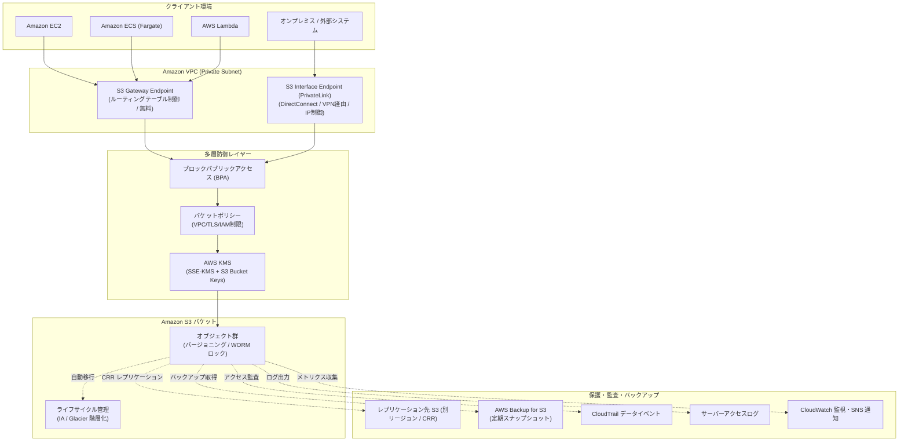

---

## 2. S3 バケットの作成と基本設計

### 2.1 バケット設計パラメータ・命名規則

S3 バケット名は**全 AWS アカウントでグローバルに一意**である必要があります。

| 項目 | 命名規則・推奨値 | 例 / 注意事項 |
| :--- | :--- | :--- |
| **バケット名** | 3〜63文字の小文字英数字、ハイフン(`-`)、ピリオド(`.`) | `prd-app-media-bucket-123456789012-apne1`<br>※DNS準拠のため、アンダースコア(`_`)は大文字は使用不可。IPアドレス形式も不可。 |
| **プレフィックス設計** | `環境-システム名-用途-AWSアカウントID-リージョン` | アカウントIDやリージョンをサフィックスに含めることで重複を回避。 |
| **リージョン選定** | システムに最も近いリージョン | 東京: `ap-northeast-1`, 大阪: `ap-northeast-3` |
| **オブジェクト所有権** | **Bucket owner enforced (推奨)** | ACL を完全無効化し、IAM とバケットポリシーのみでアクセス制御を一元化。 |

---

### 2.2 オブジェクト所有権（Object Ownership）と ACL の無効化

過去の AWS では Access Control List (ACL) が利用されていましたが、現代の AWS ベストプラクティスでは **ACL を無効化 (Bucket owner enforced)** します。これにより、他アカウントからアップロードされたオブジェクトもすべてバケット所有者が所有し、バケットポリシーで一元管理できるようになります。

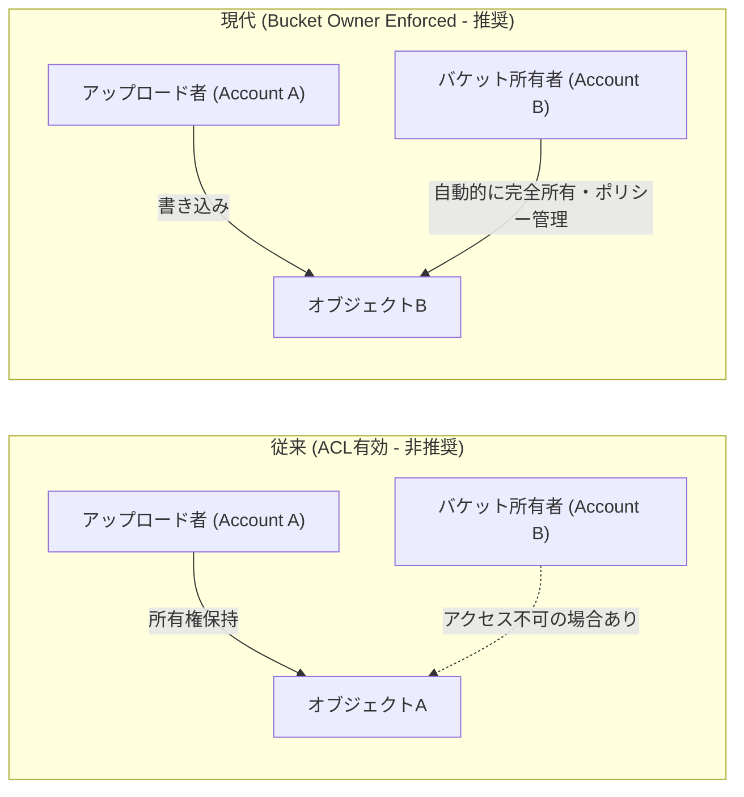

---

### 2.3 S3 バケット作成手順（GUI / CLI）

#### 🖥️ マネジメントコンソール (GUI) 手順
1. **AWSマネジメントコンソール** にログインし、**S3** サービス画面を開きます。
2. **[バケットを作成]** をクリックします。
3. **一般的な設定**:
   - **バケットタイプ**: `汎用` を選択
   - **バケット名**: `prd-sample-app-storage-apne1` 等の一意な名前を入力
   - **AWS リージョン**: `アジアパシフィック (東京) ap-northeast-1` を選択
4. **オブジェクト所有者**:
   - `ACL 無効 (推奨)` を選択（Bucket owner enforced）
5. **このバケットのブロックパブリックアクセス設定**:
   - `パブリックアクセスをすべてブロック` に **チェックを入れる**（4項目すべてオン）
6. **バケットのバージョニング**:
   - `有効にする` を選択
7. **デフォルトの暗号化**:
   - 暗号化タイプ: `Amazon S3 マネージドキーを使用したサーバー側の暗号化 (SSE-S3)` または `AWS Key Management Service キーを使用したサーバー側の暗号化 (SSE-KMS)`
   - バケットキー: `有効にする`（KMS コスト削減のため必須推奨）
8. **[バケットを作成]** をクリックして作成を完了します。

#### ⌨️ AWS CLI 手順

```bash
# 1. 変数定義
BUCKET_NAME="prd-sample-app-storage-$(aws sts get-caller-identity --query "Account" --output text)-apne1"
REGION="ap-northeast-1"

# 2. バケットの作成 (東京リージョン)
aws s3api create-bucket \
    --bucket "${BUCKET_NAME}" \
    --region "${REGION}" \
    --create-bucket-configuration LocationConstraint="${REGION}"

# 3. オブジェクト所有権の設定 (ACL無効化)
aws s3api put-bucket-ownership-controls \
    --bucket "${BUCKET_NAME}" \
    --ownership-controls="Rules=[{ObjectOwnership=BucketOwnerEnforced}]"

# 4. ブロックパブリックアクセスの完全有効化
aws s3api put-public-access-block \
    --bucket "${BUCKET_NAME}" \
    --public-access-block-configuration \
        "BlockPublicAcls=true,IgnorePublicAcls=true,BlockPublicPolicy=true,RestrictPublicBuckets=true"

# 5. バージョニングの有効化
aws s3api put-bucket-versioning \
    --bucket "${BUCKET_NAME}" \
    --versioning-configuration Status=Enabled

# 6. デフォルト暗号化 (SSE-S3 + Bucket Key) の設定
aws s3api put-bucket-encryption \
    --bucket "${BUCKET_NAME}" \
    --server-side-encryption-configuration '{
        "Rules": [
            {
                "ApplyServerSideEncryptionByDefault": {
                    "SSEAlgorithm": "AES256"
                },
                "BucketKeyEnabled": true
            }
        ]
    }'
```

---

## 3. ネットワーク・アクセス制御・インターネットアクセス禁止設計

### 3.1 S3 におけるアクセス制御とセキュリティアーキテクチャ（セキュリティグループ疑問の解消）

> [!IMPORTANT]
> **「S3 にセキュリティグループを設定できますか？」という疑問への回答**
> 
> **S3 はマネージドなオブジェクトストレージサービスであり、ENI（ネットワークインターフェース）を直接バケットに持たないため、S3 バケット自身にセキュリティグループ（SG）をアタッチすることはできません。**
> 
> S3 のアクセス制御・ネットワーク制限は以下の **4つのレイヤー** を組み合わせて実現します：
> 1. **S3 Block Public Access (BPA)**: インターネット公開を根本から遮断
> 2. **VPC エンドポイント (Gateway / Interface)**: VPC からの通信を AWS 内部網に閉域化
> 3. **S3 バケットポリシー**: リソースベースで特定 VPC / IP / TLS / IAM を強制
> 4. **IAM ポリシー / SCP**: クライアント側のアクセス認可および組織ガードレール

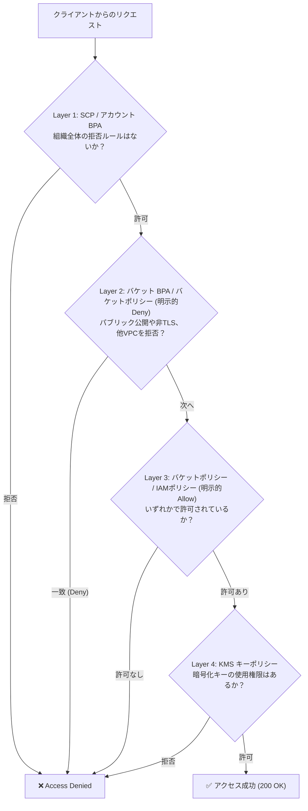

---

### 3.2 S3 ブロックパブリックアクセス（BPA）の設定（GUI / CLI）

S3 Block Public Access はバケットレベルおよびアカウントレベルで設定でき、設定ミスによる偶発的なインターネット公開を遮断します。

| 設定項目 | 説明 |
| :--- | :--- |
| **BlockPublicAcls** | パブリックアクセスを許可する新しい ACL の登録を拒否 |
| **IgnorePublicAcls** | 既存のすべてのパブリック ACL を無視 |
| **BlockPublicPolicy** | パブリックアクセスを許可する新しいバケットポリシーの登録を拒否 |
| **RestrictPublicBuckets** | パブリックポリシーが設定されていても、パブリック/クロスアカウントアクセスをブロック |

#### 🖥️ マネジメントコンソール (GUI) 手順
1. 対象の S3 バケットを選択し、**[アクセス許可]** タブを開きます。
2. **[ブロックパブリックアクセス (バケット設定)]** の **[編集]** をクリックします。
3. **[パブリックアクセスをすべてブロック]** のチェックボックスをオンにします（4項目すべてオンになります）。
4. **[変更の保存]** をクリックし、確認ダイアログに `確認` と入力して保存します。

#### ⌨️ AWS CLI 手順
```bash
# バケットレベルでのパブリックアクセスブロック
aws s3api put-public-access-block \
    --bucket "${BUCKET_NAME}" \
    --public-access-block-configuration \
        "BlockPublicAcls=true,IgnorePublicAcls=true,BlockPublicPolicy=true,RestrictPublicBuckets=true"

# (推奨) アカウントレベルでのパブリックアクセスブロック
aws s3control put-public-access-block \
    --account-id "$(aws sts get-caller-identity --query "Account" --output text)" \
    --public-access-block-configuration \
        "BlockPublicAcls=true,IgnorePublicAcls=true,BlockPublicPolicy=true,RestrictPublicBuckets=true"
```

---

### 3.3 VPC エンドポイント（Gateway 型 / Interface 型）の設計と構築（GUI / CLI）

VPC 内の EC2 や ECS、Lambda から S3 に通信する際、インターネットゲートウェイや NAT ゲートウェイを通さず、**AWS プライベートネットワーク内で通信を完結** させます。

| 項目 | Gateway 型エンドポイント (推奨・基本) | Interface 型エンドポイント (PrivateLink) |
| :--- | :--- | :--- |
| **費用** | **完全無料** (時間料金・データ転送量ともに 0 円) | 時間料金 + データ処理料金が発生 |
| **ルーティング** | VPC ルートテーブルに S3 の Prefix List を追加 | サブネット内にプライベート IP (ENI) を作成 |
| **接続元** | VPC 内部のリソース (EC2, ECS, Lambda等) | VPC 内部、および **オンプレミス (VPN/Direct Connect)**、別 VPC (Transit Gateway 経由) |
| **セキュリティグループ** | アタッチ不可 (ルートテーブル & エンドポイントポリシーで制御) | **ENI にセキュリティグループをアタッチ可能** |

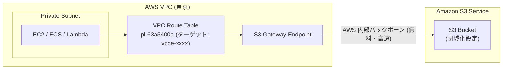

#### 🖥️ マネジメントコンソール (GUI) 手順 (Gateway 型エンドポイントの作成)
1. **VPC** コンソールを開き、左メニューの **[エンドポイント]** を選択します。
2. **[エンドポイントを作成]** をクリックします。
3. **名前タグ**: `vpce-s3-gateway`
4. **サービスカテゴリ**: `AWS のサービス`
5. **サービス**: `com.amazonaws.ap-northeast-1.s3` を検索し、**タイプが `Gateway`** のものを選択します。
6. **VPC**: 接続元の VPC を選択します。
7. **ルートテーブル**: S3 にアクセスするプライベートサブネットのルートテーブルにチェックを入れます。
8. **ポリシー**: `フルアクセス` (または特定バケットに限定するカスタムポリシー)
9. **[エンドポイントを作成]** をクリックします。

#### ⌨️ AWS CLI 手順 (Gateway 型エンドポイント作成)
```bash
VPC_ID="vpc-0123456789abcdef0"
ROUTE_TABLE_ID="rtb-0123456789abcdef0"

aws ec2 create-vpc-endpoint \
    --vpc-id "${VPC_ID}" \
    --service-name "com.amazonaws.ap-northeast-1.s3" \
    --route-table-ids "${ROUTE_TABLE_ID}" \
    --vpc-endpoint-type Gateway
```

---

### 3.4 バケットポリシーによる閉域化・アクセス制限（特定 VPC / IP / TLS 強制）（GUI / CLI）

バケットポリシーを用いて、**「指定した VPC エンドポイント経由以外のアクセスをすべて拒否」** および **「非暗号化 (HTTP) 通信を拒否」** する設定を行います。

#### 🔒 推奨バケットポリシー（特定 VPC エンドポイント限定 + TLS 1.2+ 強制）

```json
{
  "Version": "2012-10-17",
  "Statement": [
    {
      "Sid": "EnforceTLSRequestsOnly",
      "Effect": "Deny",
      "Principal": "*",
      "Action": "s3:*",
      "Resource": [
        "arn:aws:s3:::BUCKET_NAME",
        "arn:aws:s3:::BUCKET_NAME/*"
      ],
      "Condition": {
        "Bool": {
          "aws:SecureTransport": "false"
        }
      }
    },
    {
      "Sid": "DenyAccessExceptSpecificVPCEndpoint",
      "Effect": "Deny",
      "Principal": "*",
      "Action": "s3:*",
      "Resource": [
        "arn:aws:s3:::BUCKET_NAME",
        "arn:aws:s3:::BUCKET_NAME/*"
      ],
      "Condition": {
        "StringNotEquals": {
          "aws:sourceVpce": "vpce-0123456789abcdef0"
        }
      }
    }
  ]
}
```

> [!CAUTION]
> **バケットポリシー設定時のロックアウト注意**
> `aws:sourceVpce` や `aws:sourceVpc` の Deny 条件を設定する際は、現在操作しているコンソール（作業用端末）からの通信も遮断される可能性があります。締め出しを防ぐため、特定 IAM ロールを `StringNotLike` の `aws:PrincipalArn` 条件で除外するか、設定前に VPC 内の EC2 から動作検証を行ってください。

#### 🖥️ マネジメントコンソール (GUI) 手順
1. S3 バケットの **[アクセス許可]** タブを開きます。
2. **[バケットポリシー]** セクションの **[編集]** をクリックします。
3. ポリシーエディタに上記 JSON を貼り付け（バケット名と VPC エンドポイント ID を置換）。
4. **[変更の保存]** をクリックします。

#### ⌨️ AWS CLI 手順
```bash
# ポリシーファイルの作成と適用
cat << 'EOF' > bucket-policy.json
{
  "Version": "2012-10-17",
  "Statement": [
    {
      "Sid": "EnforceTLSRequestsOnly",
      "Effect": "Deny",
      "Principal": "*",
      "Action": "s3:*",
      "Resource": [
        "arn:aws:s3:::prd-sample-app-storage-apne1",
        "arn:aws:s3:::prd-sample-app-storage-apne1/*"
      ],
      "Condition": {
        "Bool": {
          "aws:SecureTransport": "false"
        }
      }
    }
  ]
}
EOF

aws s3api put-bucket-policy \
    --bucket "${BUCKET_NAME}" \
    --policy file://bucket-policy.json
```

---

### 3.5 IAM ポリシーによるアクセス権限設計（最小権限の原則）

EC2、ECS、Lambda 等に付与する IAM ロールには、必要最小限の S3 権限のみを付与します。

#### 📋 読み書き専用 IAM ポリシー例（アプリケーション用）
```json
{
  "Version": "2012-10-17",
  "Statement": [
    {
      "Sid": "AllowBucketList",
      "Effect": "Allow",
      "Action": [
        "s3:ListBucket",
        "s3:GetBucketLocation"
      ],
      "Resource": "arn:aws:s3:::prd-sample-app-storage-apne1"
    },
    {
      "Sid": "AllowObjectReadWrite",
      "Effect": "Allow",
      "Action": [
        "s3:GetObject",
        "s3:PutObject",
        "s3:DeleteObject"
      ],
      "Resource": "arn:aws:s3:::prd-sample-app-storage-apne1/app-data/*"
    },
    {
      "Sid": "AllowKMSDecryptEncrypt",
      "Effect": "Allow",
      "Action": [
        "kms:Decrypt",
        "kms:GenerateDataKey"
      ],
      "Resource": "arn:aws:kms:ap-northeast-1:123456789012:key/your-s3-kms-key-id"
    }
  ]
}
```

---

### 3.6 CORS（Cross-Origin Resource Sharing）の設定（GUI / CLI）

Web ブラウザ（SPA やフロントエンド）から直接 S3 バケットの画像やファイルを fetch / XMLHttpRequest で取得・アップロードする場合に設定します。

#### 📋 CORS ルール設定例 (`cors.json`)
```json
[
  {
    "AllowedHeaders": [
      "*"
    ],
    "AllowedMethods": [
      "GET",
      "PUT",
      "POST",
      "HEAD"
    ],
    "AllowedOrigins": [
      "https://app.example.com",
      "https://admin.example.com"
    ],
    "ExposeHeaders": [
      "ETag",
      "x-amz-server-side-encryption"
    ],
    "MaxAgeSeconds": 3600
  }
]
```

#### ⌨️ AWS CLI 手順
```bash
aws s3api put-bucket-cors \
    --bucket "${BUCKET_NAME}" \
    --cors-configuration file://cors.json
```

---

## 4. 暗号化の設定と鍵管理

### 4.1 暗号化方式の比較（SSE-S3 / SSE-KMS / SSE-C / DSSE-KMS）

AWS S3 はすべての新しいオブジェクトをデフォルトで暗号化します。

| 暗号化方式 | 鍵の管理者 | 追加費用 | アクセス制御 | 推奨用途 |
| :--- | :--- | :---: | :--- | :--- |
| **SSE-S3 (AES-256)** | AWS が完全管理 | **無料** | バケットポリシー / IAM のみ | 一般的なデータ保管、コスト優先 |
| **SSE-KMS (aws/s3)** | AWS マネージド KMS 鍵 | KMS API 課金あり | KMS キーポリシーは編集不可 | シンプルに KMS ログを残したい場合 |
| **SSE-KMS (CMK)** | **自社（カスタマー）** | KMS 鍵維持費 + API課金 | **KMS キーポリシーで二重アクセス制御可能** | **コンプライアンス要件、機密データ（推奨）** |
| **DSSE-KMS (二重暗号化)** | 自社 (KMS CMK) | KMS 課金 x2 | 二重レイヤーの暗号化 | 極めて高いセキュリティ基準（防衛・金融等） |
| **SSE-C** | 顧客自身が鍵を送信 | なし | 鍵の保管責任は顧客 | 自前で暗号鍵を完全保持したい場合 |

---

### 4.2 S3 Bucket Keys の活用による KMS コスト削減

SSE-KMS を利用する場合、S3 Bucket Keys を有効化することで、S3 が KMS から短期バケットレベルキーを生成しキャッシュします。これにより、**KMS リクエスト回数と費用を最大 99% 削減** できます。

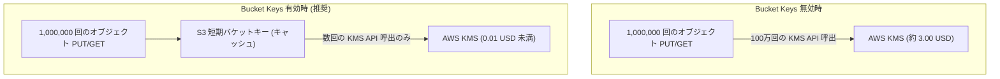

---

### 4.3 AWS KMS カスタマーマネージドキー（CMK）の作成とキーポリシー

#### 📋 KMS キーポリシー（S3 および IAM ロールへの許可）
```json
{
  "Version": "2012-10-17",
  "Id": "key-policy-s3",
  "Statement": [
    {
      "Sid": "EnableRootPermissions",
      "Effect": "Allow",
      "Principal": {
        "AWS": "arn:aws:iam::123456789012:root"
      },
      "Action": "kms:*",
      "Resource": "*"
    },
    {
      "Sid": "AllowS3ServiceOperations",
      "Effect": "Allow",
      "Principal": {
        "Service": "s3.amazonaws.com"
      },
      "Action": [
        "kms:Decrypt",
        "kms:GenerateDataKey*"
      ],
      "Resource": "*"
    },
    {
      "Sid": "AllowAppRoleToUseKey",
      "Effect": "Allow",
      "Principal": {
        "AWS": "arn:aws:iam::123456789012:role/prd-sample-app-role"
      },
      "Action": [
        "kms:Encrypt",
        "kms:Decrypt",
        "kms:ReEncrypt*",
        "kms:GenerateDataKey*",
        "kms:DescribeKey"
      ],
      "Resource": "*"
    }
  ]
}
```

---

### 4.4 暗号化の設定手順（GUI / CLI）

#### 🖥️ マネジメントコンソール (GUI) 手順
1. S3 バケットの **[プロパティ]** タブを開きます。
2. **[デフォルトの暗号化]** セクションで **[編集]** をクリックします。
3. **暗号化タイプ**: `AWS Key Management Service キーを使用したサーバー側の暗号化 (SSE-KMS)` を選択。
4. **AWS KMS キー**: `AWS KMS キーから選択` を選び、作成した CMK を指定。
5. **バケットキー**: `有効にする` を選択。
6. **[変更の保存]** をクリックします。

#### ⌨️ AWS CLI 手順
```bash
KMS_KEY_ARN="arn:aws:kms:ap-northeast-1:123456789012:key/xxxxxxxx-xxxx-xxxx-xxxx-xxxxxxxxxxxx"

aws s3api put-bucket-encryption \
    --bucket "${BUCKET_NAME}" \
    --server-side-encryption-configuration '{
        "Rules": [
            {
                "ApplyServerSideEncryptionByDefault": {
                    "SSEAlgorithm": "aws:kms",
                    "KMSMasterKeyId": "'"${KMS_KEY_ARN}"'"
                },
                "BucketKeyEnabled": true
            }
        ]
    }'
```

---

## 5. メンテナンス・バックアップ・レプリケーション設計

### 5.1 S3 における運用・メンテナンスの考え方

> [!NOTE]
> S3 は AWS の分散型フルマネージドサービスであり、EC2 や RDS のような**OSパッチ適用やデータベース再起動を伴う「定期メンテナンス時間枠」は存在しません**。
> したがって、S3 におけるバックアップ・メンテナンス運用とは、**「誤削除・データ破損からの保護（バージョニング）」「広域災害対策（クロスリージョンレプリケーション）」「定期的なスナップショット管理（AWS Backup）」** を指します。

---

### 5.2 S3 バージョニングの有効化（GUI / CLI）

バージョニングを有効にすると、同一キーでオブジェクトが上書きされたり削除されたりしても、過去のバージョンがすべて保持されます。

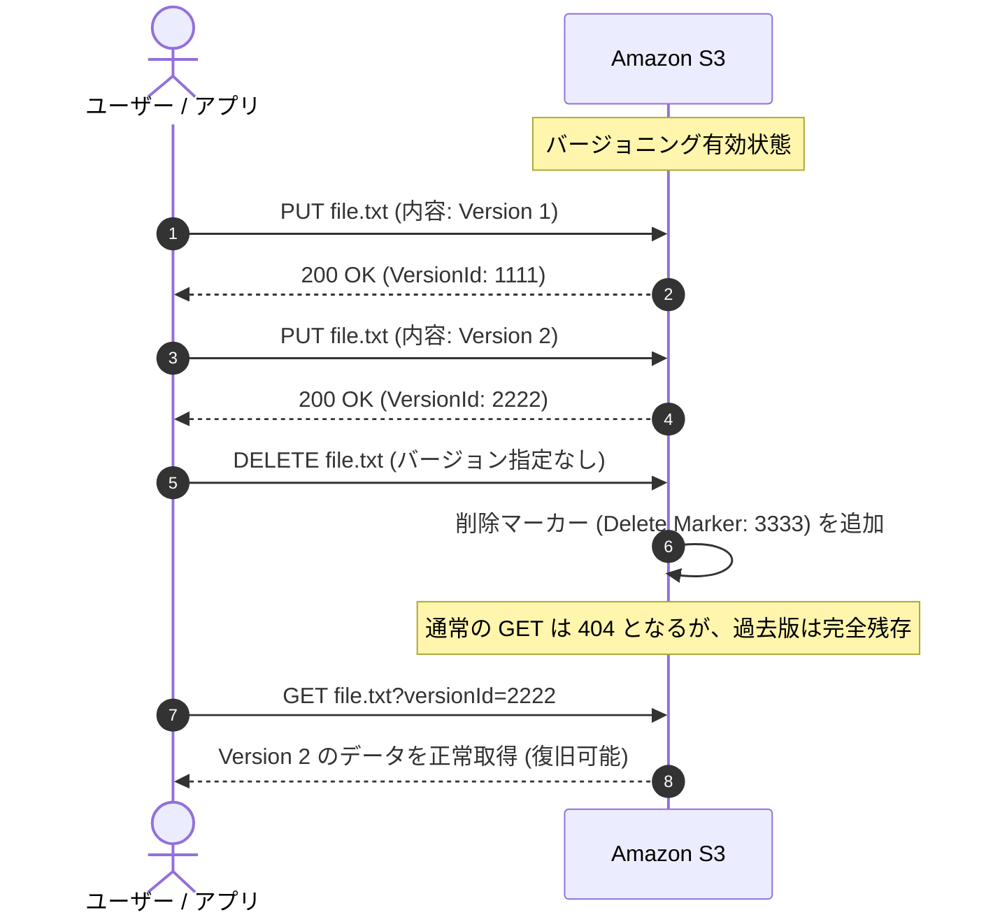

#### ⌨️ AWS CLI 手順
```bash
aws s3api put-bucket-versioning \
    --bucket "${BUCKET_NAME}" \
    --versioning-configuration Status=Enabled
```

---

### 5.3 S3 レプリケーション（CRR / SRR）の設定（GUI / CLI）

- **CRR (Cross-Region Replication)**: 地理的に離れた別リージョン（例: 東京 → 大阪、東京 → バージニア）へ自動非同期コピー（DR・災害対策）。
- **SRR (Same-Region Replication)**: 同一リージョン内の別アカウントバケットへコピー（ログ集約、本番/ステージング同期）。

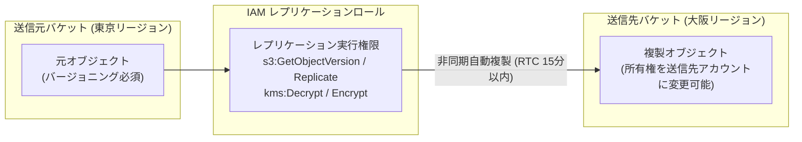

#### 📋 レプリケーション設定例 (`replication.json`)
```json
{
  "Role": "arn:aws:iam::123456789012:role/s3-replication-role",
  "Rules": [
    {
      "ID": "ReplicateAllObjectsToOsaka",
      "Status": "Enabled",
      "Priority": 1,
      "DeleteMarkerReplication": {
        "Status": "Disabled"
      },
      "Filter": {
        "Prefix": ""
      },
      "Destination": {
        "Bucket": "arn:aws:s3:::prd-sample-app-storage-backup-apne3",
        "ReplicationTime": {
          "Status": "Enabled",
          "Time": {
            "Minutes": 15
          }
        },
        "Metrics": {
          "Status": "Enabled",
          "EventThreshold": {
            "Minutes": 15
          }
        },
        "StorageClass": "STANDARD_IA"
      },
      "SourceSelectionCriteria": {
        "SseKmsEncryptedObjects": {
          "Status": "Enabled"
        }
      }
    }
  ]
}
```

#### ⌨️ AWS CLI 手順
```bash
aws s3api put-bucket-replication \
    --bucket "${BUCKET_NAME}" \
    --replication-configuration file://replication.json
```

---

### 5.4 AWS Backup for S3 によるバックアップ運用（GUI / CLI）

エンタープライズ環境では、AWS Backup を使用して S3 バケット全体の定期バックアップ（日次・週次スナップショット）や保持期間（Lifecycle）、および改ざん防止（Vault Lock）を一元管理します。

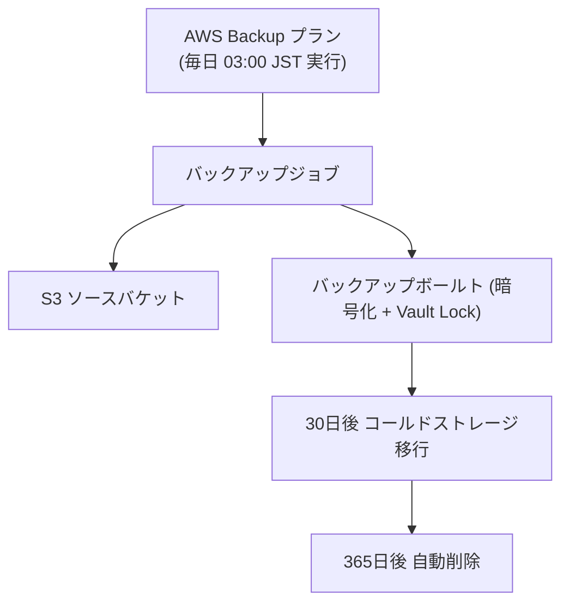

#### 🖥️ マネジメントコンソール (GUI) 手順
1. **AWS Backup** コンソールを開きます。
2. **[バックアッププラン]** → **[バックアッププランを作成]** をクリック。
3. **バックアップルール**:
   - バックアップ頻度: `毎日`
   - バックアップ時間枠 (Backup Window): `03:00 JST` (UTC 18:00) 開始
   - 保持期間: `30日` または `365日`
4. **リソースの割り当て**:
   - リソースタイプ: `S3`
   - 対象バケット: 作成した S3 バケット名を選択。
5. 作成を完了します。

---

### 5.5 レプリケーション・バックアップ障害の検知と通知

S3 レプリケーションの遅延や失敗、AWS Backup ジョブの失敗は Amazon EventBridge 経由で検知し、Amazon SNS でメール通知します。

#### 📋 EventBridge ルール例 (S3 レプリケーション失敗検知)
```json
{
  "source": ["aws.s3"],
  "detail-type": ["Object Replication Status Change"],
  "detail": {
    "bucket": {
      "name": ["prd-sample-app-storage-apne1"]
    },
    "replication-status": ["FAILED"]
  }
}
```

---

## 6. 削除保護・改ざん防止設計

### 6.1 削除保護機能の全体像

| 保護レベル | 対象 | 実装方式 | 特徴・効果 |
| :--- | :--- | :--- | :--- |
| **バケット削除防止** | バケット自体 | バケットポリシー / SCP | バケット全体の誤削除（`s3:DeleteBucket`）を拒否 |
| **オブジェクト改ざん防止** | オブジェクトデータ | **S3 Object Lock (WORM)** | 一度書き込んだオブジェクトを保持期間中上書き・削除不可にする |
| **特権削除防止** | バージョンデータ | **MFA Delete** | バージョン削除やバージョニング無効化にルートアカウント + MFA を強制 |

---

### 6.2 バケット削除防止設定（バケットポリシー / SCP）（GUI / CLI）

#### 📋 バケット削除を明示的に拒否するバケットポリシー
```json
{
  "Version": "2012-10-17",
  "Statement": [
    {
      "Sid": "PreventBucketDeletion",
      "Effect": "Deny",
      "Principal": "*",
      "Action": "s3:DeleteBucket",
      "Resource": "arn:aws:s3:::prd-sample-app-storage-apne1"
    }
  ]
}
```

---

### 6.3 S3 Object Lock（WORM：Compliance / Governance / リーガルホールド）（GUI / CLI）

S3 Object Lock は **WORM (Write Once, Read Many)** モデルを実現し、法的要件やランサムウェア対策として強力なデータ保護を提供します。※バケット作成時（またはサポート経由）に有効化が必要です。

| モード | 管理者（root）による削除 | 保持期間の短縮 | 主な用途 |
| :--- | :---: | :---: | :--- |
| **ガバナンスモード (Governance)** | 特定権限（`s3:BypassGovernanceRetention`）があれば可能 | 可能 | 誤削除防止、社内テスト |
| **コンプライアンスモード (Compliance)** | **root を含めいかなるユーザーも絶対に削除不可** | **短縮不可** | 金融・医療等の法規制コンプライアンス |
| **リーガルホールド (Legal Hold)** | 保持期限なし（解除されるまで削除不可） | いつでも設定/解除可能 | 訴訟・監査対応 |

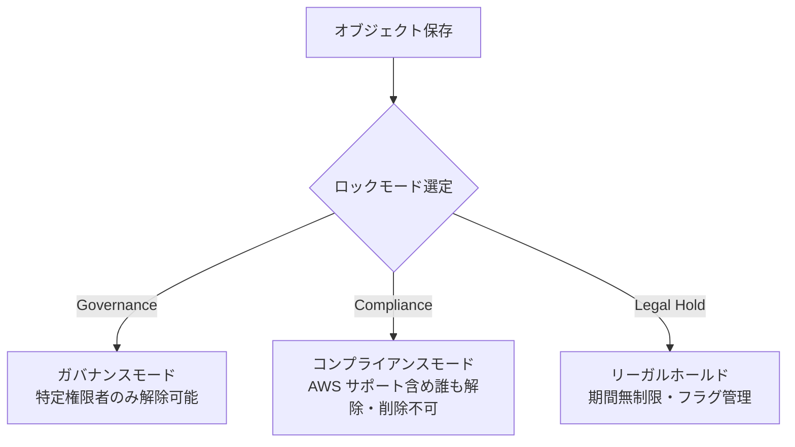

#### ⌨️ AWS CLI 手順 (ガバナンスモードでデフォルト保持期間30日を設定)
```bash
aws s3api put-object-lock-configuration \
    --bucket "${BUCKET_NAME}" \
    --object-lock-configuration '{
        "ObjectLockEnabled": "Enabled",
        "Rule": {
            "DefaultRetention": {
                "Mode": "GOVERNANCE",
                "Days": 30
            }
        }
    }'
```

---

### 6.4 MFA Delete（多要素認証削除）の設定

MFA Delete を有効にすると、オブジェクトのバージョン完全削除やバージョニング設定変更時に、物理 MFA デバイスの TOTP コード入力が必須になります。

> [!WARNING]
> MFA Delete の有効化・無効化は **AWS CLI (ルートアカウントの認証情報を使用)** からのみ実行可能です。

```bash
# ルート認証情報で実行
aws s3api put-bucket-versioning \
    --bucket "${BUCKET_NAME}" \
    --versioning-configuration Status=Enabled,MFADelete=Enabled \
    --mfa "arn:aws:iam::123456789012:mfa/root-mfa-device 123456"
```

---

## 7. 保管コスト最適化設計

### 7.1 ライフサイクルルールの設計（現行・非現行バージョンの階層移行と削除）

データの経過日数に応じて、低コストなストレージクラスへ自動移行し、不要になった過去バージョンを自動削除します。

```mermaid
gantt
    title オブジェクトライフサイクル移行タイムライン
    dateFormat X
    axisFormat %d日

    section 現行バージョン
    S3 Standard (高速アクセス)           :active, 0, 30
    S3 Standard-IA (低頻度アクセス)       :30, 90
    S3 Glacier Flexible (アーカイブ)     :90, 365
    オブジェクトの有効期限切れ (削除)      :milestone, 365, 365

    section 非現行バージョン (過去履歴)
    Standard (保持)                      :active, 0, 30
    Glacier Deep Archive (最安保管)      :30, 180
    完全物理削除                         :milestone, 180, 180
```

---

### 7.2 S3 Intelligent-Tiering による自動コスト最適化

アクセス頻度が予測できないデータの場合、S3 Intelligent-Tiering を利用すると、**取り出し料金なし** で自動的に階層が移行します。

- **Frequent Access Tier**: デフォルト（通常料金）
- **Infrequent Access Tier**: 30日間連続でアクセスがない場合（約40%安価）
- **Archive Instant Access Tier**: 90日間連続でアクセスがない場合（約68%安価）
- **Deep Archive Access Tier (オプション)**: 180日間連続アクセスなし（最安）

---

### 7.3 不完全なマルチパートアップロードの自動破棄設定（GUI / CLI）

大容量ファイルのアップロードが途中で中断・失敗した場合、破棄されない中間データが S3 内に残り続け、**見えないストレージ費用が課金され続けます**。これを防ぐため、**7日後に自動破棄するライフサイクルルール** を必ず設定します。

---

### 7.4 ライフサイクルルールの設定手順（GUI / CLI）

#### 📋 推奨ライフサイクル設定 JSON (`lifecycle.json`)
```json
{
  "Rules": [
    {
      "ID": "AutoTieringAndCleanupRule",
      "Status": "Enabled",
      "Filter": {
        "Prefix": ""
      },
      "Transitions": [
        {
          "Days": 30,
          "StorageClass": "STANDARD_IA"
        },
        {
          "Days": 90,
          "StorageClass": "GLACIER"
        }
      ],
      "NoncurrentVersionTransitions": [
        {
          "NoncurrentDays": 30,
          "StorageClass": "DEEP_ARCHIVE"
        }
      ],
      "NoncurrentVersionExpiration": {
        "NoncurrentDays": 180
      },
      "AbortIncompleteMultipartUpload": {
        "DaysAfterInitiation": 7
      }
    }
  ]
}
```

#### 🖥️ マネジメントコンソール (GUI) 手順
1. S3 バケットの **[管理]** タブを開きます。
2. **[ライフサイクルルール]** セクションで **[ライフサイクルルールを作成]** をクリック。
3. **ルール名**: `cost-optimization-rule`
4. **ルールのスコープ**: `バケット内のすべてのオブジェクトに適用`（確認チェックをオン）
5. **ライフサイクルルールのアクション**:
   - `オブジェクトの現行バージョンをストレージクラス間で移行する` にチェック
   - `オブジェクトの非現行バージョンをストレージクラス間で移行する` にチェック
   - `オブジェクトの非現行バージョンを永久に削除` にチェック
   - `不完全なマルチパートアップロードを削除` にチェック (7日)
6. 移行日数とストレージクラスを指定し、**[ルールの作成]** をクリックします。

#### ⌨️ AWS CLI 手順
```bash
aws s3api put-bucket-lifecycle-configuration \
    --bucket "${BUCKET_NAME}" \
    --lifecycle-configuration file://lifecycle.json
```

---

## 8. アクティビティログ・監査ログ・可視化

### 8.1 ログ・監査機能の全体像

| ログ種類 | 取得対象 | 出力先 | 記録内容 / 特徴 |
| :--- | :--- | :--- | :--- |
| **サーバーアクセスログ (Server Access Logs)** | S3 への全リクエスト (詳細) | 別 S3 バケット | リクエスタ IP、HTTP ステータス、レスポンス時間、エラーコード（ほぼリアルタイム・低コスト） |
| **CloudTrail データイベント** | オブジェクト単位の API 操作 | CloudTrail S3 / CloudWatch Logs | IAM ロール名、STS セッション、詳細な API 呼出コンテキスト（セキュリティ監査・Athena 分析向け） |
| **S3 Storage Lens** | バケット全体の利用状況・傾向 | S3 Storage Lens ダッシュボード | コスト効率、暗号化率、パブリック公開リスク等の可視化 |

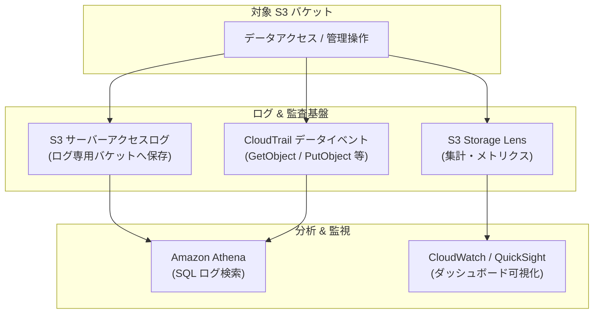

---

### 8.2 S3 サーバーアクセスログ（Server Access Logging）の設定（GUI / CLI）

> [!IMPORTANT]
> サーバーアクセスログの出力先バケット（ログ専用バケット）は、ループ（ログ書き込みに対してログが生成される現象）を防ぐため、**監視対象バケットとは別のバケット** を指定します。

#### 🖥️ マネジメントコンソール (GUI) 手順
1. 対象バケットの **[プロパティ]** タブを開きます。
2. **[サーバーアクセスのログ記録]** で **[編集]** をクリック。
3. `有効にする` を選択。
4. **ターゲットバケット**: `logging-bucket-apne1` を指定。
5. **ターゲットプレフィックス**: `s3-access-logs/prd-sample-app/` を入力。
6. **[変更の保存]** をクリック。

#### ⌨️ AWS CLI 手順
```bash
LOG_TARGET_BUCKET="prd-logging-bucket-123456789012-apne1"

aws s3api put-bucket-logging \
    --bucket "${BUCKET_NAME}" \
    --bucket-logging-status '{
        "LoggingEnabled": {
            "TargetBucket": "'"${LOG_TARGET_BUCKET}"'",
            "TargetPrefix": "s3-access-logs/'"${BUCKET_NAME}"'/"
        }
    }'
```

---

### 8.3 AWS CloudTrail データイベントの記録と分析（GUI / CLI）

#### ⌨️ AWS CLI 手順 (CloudTrail データイベントの追加)
```bash
TRAIL_NAME="management-trail"

aws cloudtrail put-event-selectors \
    --trail-name "${TRAIL_NAME}" \
    --event-selectors '[
        {
            "ReadWriteType": "All",
            "IncludeManagementEvents": true,
            "DataResources": [
                {
                    "Type": "AWS::S3::Object",
                    "Values": ["arn:aws:s3:::'"${BUCKET_NAME}"'/*"]
                }
            ]
        }
    ]'
```

---

### 8.4 S3 Storage Lens による利用状況とセキュリティの可視化

S3 Storage Lens は組織全体のストレージ使用状況、コスト最適化の機会、セキュリティ態勢を単一ダッシュボードで可視化します。デフォルトで無料のデフォルトダッシュボードが有効化されています。

---

## 9. 監視・障害検知・アラート通知

### 9.1 監視すべき主要 CloudWatch メトリクス一覧

| メトリクス名 | ディメンション | 説明 | 監視・アラームの基準 |
| :--- | :--- | :--- | :--- |
| **`4xxErrors`** | BucketName, FilterId | クライアントエラー (403 拒否, 404 未検出) の発生数 | 急増時にアラーム（権限設定不備や不正アクセスの兆候） |
| **`5xxErrors`** | BucketName, FilterId | サーバー側内部エラーの発生数 | 1件以上でアラーム（AWS障害や一時的エラー検知） |
| **`BucketSizeBytes`** | BucketName, StorageType | バケット内の合計データ容量 (バイト) | 想定外の容量急増を検知 |
| **`NumberOfObjects`** | BucketName, StorageType | バケット内のオブジェクト総数 | 異常なファイル生成を検知 |
| **`AllRequests`** | BucketName, FilterId | 総リクエスト数 (GET, PUT, LIST等) | トラフィック急増・DDoS検知 |

> [!NOTE]
> `4xxErrors`, `5xxErrors`, `AllRequests` 等のリクエストメトリクスを取得するには、S3 バケットの **[メトリクス]** タブで **「リクエストメトリクス（CloudWatch リクエストメトリクス）」** を有効化する必要があります。

---

### 9.2 CloudWatch アラームによるメトリクス監視・SNS 通知（GUI / CLI）

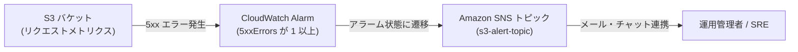

#### ⌨️ AWS CLI 手順 (5xx エラー監視アラームの作成)
```bash
SNS_TOPIC_ARN="arn:aws:sns:ap-northeast-1:123456789012:s3-alert-topic"

aws cloudwatch put-metric-alarm \
    --alarm-name "s3-${BUCKET_NAME}-5xx-errors" \
    --alarm-description "Alarm when S3 bucket returns 5xx server errors" \
    --metric-name "5xxErrors" \
    --namespace "AWS/S3" \
    --statistic "Sum" \
    --period 300 \
    --threshold 1 \
    --comparison-operator "GreaterThanOrEqualToThreshold" \
    --dimensions Name=BucketName,Value="${BUCKET_NAME}" Name=FilterId,Value="EntireBucket" \
    --evaluation-periods 1 \
    --alarm-actions "${SNS_TOPIC_ARN}"
```

---

### 9.3 Amazon EventBridge による S3 イベント検知とメール通知（GUI / CLI）

S3 バケットで EventBridge 通知を有効化し、重要なオブジェクトの削除やアップロード完了イベントを即座にメール送信します。

#### 1. S3 バケットの EventBridge 通知を有効化
```bash
aws s3api put-bucket-notification-configuration \
    --bucket "${BUCKET_NAME}" \
    --notification-configuration '{"EventBridgeConfiguration": {}}'
```

#### 2. EventBridge ルールの作成 (オブジェクト削除の検知)
```bash
aws events put-rule \
    --name "s3-${BUCKET_NAME}-object-deleted-rule" \
    --event-pattern '{
        "source": ["aws.s3"],
        "detail-type": ["Object Deleted"],
        "detail": {
            "bucket": {
                "name": ["'"${BUCKET_NAME}"'"]
            }
        }
    }'

# SNS をターゲットに追加
aws events put-targets \
    --rule "s3-${BUCKET_NAME}-object-deleted-rule" \
    --targets "Id"="1","Arn"="${SNS_TOPIC_ARN}"
```

---

## 10. 各種クライアント・AWS サービスからのアクセス実践

### 10.1 Amazon EC2 からのアクセス手順（IAM ロール / AWS CLI / SDK）

EC2 インスタンスにはハードコードされたアクセスキーを配置せず、**IAM インスタンスプロファイル (IAM ロール)** をアタッチしてアクセスします。

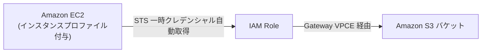

#### ⌨️ EC2 Linux 上での AWS CLI コマンド例

```bash
# 1. バケット内のファイル一覧取得 (ls)
aws s3 ls "s3://${BUCKET_NAME}/"

# 2. 特定ディレクトリ (プレフィックス) の一覧取得
aws s3 ls "s3://${BUCKET_NAME}/data/2026/" --recursive

# 3. 単一ファイルのアップロード (put / cp)
aws s3 cp ./sample.csv "s3://${BUCKET_NAME}/data/2026/sample.csv"

# 4. ディレクトリ配下の同期・一括アップロード (sync)
aws s3 sync ./local-folder/ "s3://${BUCKET_NAME}/backup/" --delete

# 5. 単一ファイルのダウンロード (get / cp)
aws s3 cp "s3://${BUCKET_NAME}/data/2026/sample.csv" ./downloaded.csv

# 6. オブジェクトの削除 (rm)
aws s3 rm "s3://${BUCKET_NAME}/data/2026/sample.csv"
```

---

### 10.2 Amazon ECS Fargate からのアクセス手順（タスクロール / アプリケーション）

ECS Fargate では、タスク定義の `taskRoleArn` に S3 読み書き権限を持つ IAM ロールを指定します。

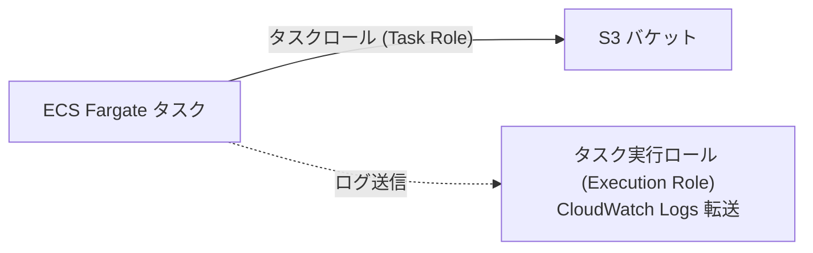

#### 📋 ECS タスク定義の抜粋 (`task-definition.json`)
```json
{
  "family": "sample-app-task",
  "taskRoleArn": "arn:aws:iam::123456789012:role/ecs-s3-access-task-role",
  "executionRoleArn": "arn:aws:iam::123456789012:role/ecs-task-execution-role",
  "networkMode": "awsvpc",
  "containerDefinitions": [
    {
      "name": "app",
      "image": "123456789012.dkr.ecr.ap-northeast-1.amazonaws.com/sample-app:latest",
      "essential": true,
      "environment": [
        {
          "name": "S3_BUCKET_NAME",
          "value": "prd-sample-app-storage-apne1"
        }
      ]
    }
  ]
}
```

---

### 10.3 AWS Lambda からのアクセス手順（実行ロール / Python Boto3）

Lambda 関数の実行ロールに S3 操作権限を付与し、標準 SDK (`boto3`) を用いて操作します。

#### 📋 Python (Boto3) 実装例 (`lambda_function.py`)
```python
import json
import boto3
import os
from botocore.exceptions import ClientError

s3_client = boto3.client('s3')
BUCKET_NAME = os.environ.get('S3_BUCKET_NAME')

def lambda_handler(event, context):
    try:
        # 1. オブジェクトの書き込み (PutObject)
        content = json.dumps({"status": "success", "message": "Processed data"})
        file_key = "output/result.json"
        
        s3_client.put_object(
            Bucket=BUCKET_NAME,
            Key=file_key,
            Body=content.encode('utf-8'),
            ContentType='application/json'
        )
        
        # 2. オブジェクトの読み込み (GetObject)
        response = s3_client.get_object(Bucket=BUCKET_NAME, Key=file_key)
        data = response['Body'].read().decode('utf-8')
        
        # 3. オブジェクト一覧取得 (ListObjectsV2)
        list_resp = s3_client.list_objects_v2(Bucket=BUCKET_NAME, Prefix="output/")
        keys = [item['Key'] for item in list_resp.get('Contents', [])]
        
        return {
            'statusCode': 200,
            'body': json.dumps({
                'message': 'S3 operation succeeded',
                'files': keys,
                'read_data': json.loads(data)
            })
        }
        
    except ClientError as e:
        print(f"Error accessing S3: {e}")
        return {
            'statusCode': 500,
            'body': json.dumps({'error': str(e)})
        }
```

---

### 10.4 署名付き URL（Pre-signed URL）による安全な一時的アクセス

外部ユーザーやクライアントアプリに対して、AWS 認証情報を渡すことなく、**有効期限付き（例: 15分）のダウンロード/アップロード専用 URL** を発行して安全にアクセスさせます。

#### ⌨️ AWS CLI による署名付き GET URL 生成 (有効期限 900 秒)
```bash
aws s3 presign "s3://${BUCKET_NAME}/reports/monthly.pdf" --expires-in 900
```

#### 📋 Python による署名付き PUT URL 生成 (クライアント直接アップロード用)
```python
import boto3

s3_client = boto3.client('s3')

presigned_url = s3_client.generate_presigned_url(
    ClientMethod='put_object',
    Params={
        'Bucket': 'prd-sample-app-storage-apne1',
        'Key': 'uploads/user-avatar.png',
        'ContentType': 'image/png'
    },
    ExpiresIn=600  # 10分間有効
)

print("Upload URL:", presigned_url)
```

---

## 11. トラブルシューティングガイド

### 11.1 403 Access Denied（権限エラー・閉域化エラーの切り分けフロー）

S3 で `403 Forbidden / Access Denied` が発生した場合、以下のフローチャートに沿って順に原因を特定します。

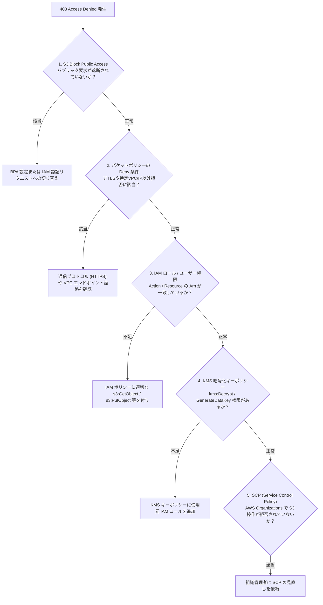

---

### 11.2 404 Not Found / 400 Bad Request

- **404 NoSuchKey**: 指定したキー（パス・ファイル名）が存在しない、または大文字小文字の不一致。
- **400 Bad Request / InvalidBucketName**: バケット名に不正な文字（大文字、アンダースコア等）が含まれている、またはリージョン指定の不一致。

---

### 11.3 503 SlowDown / スループット制限の回避

S3 は単一プレフィックスあたり **毎秒 3,500 回の PUT/POST/DELETE、毎秒 5,500 回の GET/HEAD** をサポートします。
この制限を超える超高トラフィックが発生して `503 SlowDown` が発生する場合は、プレフィックスを分散させます。

- **対策 1 (プレフィックス分散)**: `s3://bucket/data/2026-08-26/` に集中させず、ハッシュ値や UUID を前置する（例: `s3://bucket/data/a1f8-2026-08-26/`）。
- **対策 2 (指数バックオフ)**: SDK の自動リトライおよび指数バックオフ（Exponential Backoff）を有効にする。
- **対策 3 (超低レイテンシ・高I/O)**: **S3 Express One Zone** ストレージクラスの採用を検討する。

---

### 11.4 CORS エラーの解消

ブラウザコンソールで `Access to fetch at ... from origin 'https://...' has been blocked by CORS policy` が表示される場合：
1. S3 バケットの CORS 設定で `AllowedOrigins` にアクセス元ドメイン（プロトコル `https://` およびポート番号含む）が正確に登録されているか確認。
2. `AllowedMethods` に必要な HTTP メソッド (`GET`, `PUT`, `POST` 等) が含まれているか確認。
3. `AllowedHeaders` に `*` またはクライアントが送信するヘッダー (`Content-Type`, `Authorization` 等) が含まれているか確認。
