# 🚀 AWS：VPC Flow Logs 長期保存 構築・運用設計ガイド

本ドキュメントは、AWS 上で **Amazon VPC Flow Logs（VPC フローログ）** を安全、改ざん不能、かつ最小のコストで **5年間（1825日）長期保存** し、必要時に高速に分析・監査するための総合設計・運用ガイドです。  
コンプライアンス要件（証跡改ざん防止、多層アクセス制御、暗号化、削除保護、障害・設定変更監視）を満たしつつ、データ圧縮（Parquet 形式）と S3 ライフサイクル（Glacier Instant Retrieval / Glacier Deep Archive）を活用して保管・検索コストを最大 90% 以上削減するアーキテクチャを構築します。  
各設定手順は **AWS マネジメントコンソール（GUI）** と **AWS CLI** の双方で詳細に解説します。

---

## 📑 目次

- [1. はじめに（基本概念と全体アーキテクチャ）](#1-はじめに基本概念と全体アーキテクチャ)
  - [1.1 VPC Flow Logs の基本概念と取得情報](#11-vpc-flow-logs-の基本概念と取得情報)
  - [1.2 出力先の比較と長期保存における S3 選定理由](#12-出力先の比較と長期保存における-s3-選定理由)
  - [1.3 全体アーキテクチャ概要図](#13-全体アーキテクチャ概要図)
- [2. S3 バケットの作成・セキュリティ・アクセス制御](#2-s3-バケットの作成セキュリティアクセス制御)
  - [2.1 S3 バケット設計パラメータ一覧](#21-s3-バケット設計パラメータ一覧)
  - [2.2 S3 バケットの作成手順（GUI / CLI）](#22-s3-バケットの作成手順gui--cli)
  - [2.3 バケットポリシーの設定（最小権限・TLS強制・組織内限定）](#23-バケットポリシーの設定最小権限tls強制組織内限定)
  - [2.4 パブリックアクセスブロックの設定](#24-パブリックアクセスブロックの設定)
- [3. CloudTrail の設定と監査設計](#3-cloudtrail-の設定と監査設計)
  - [3.1 VPC 通信ログと CloudTrail の役割分担](#31-vpc-通信ログと-cloudtrail-の役割分担)
  - [3.2 S3 データイベントに関する重要なコスト考慮](#32-s3-データイベントに関する重要なコスト考慮)
  - [3.3 管理イベント（VPC/S3設定変更）の記録設定](#33-管理イベントvpcs3設定変更の記録設定)
- [4. VPC フローログ出力設定（Parquet & 最適化）](#4-vpc-フローログ出力設定parquet--最適化)
  - [4.1 フローログ出力設計パラメータ](#41-フローログ出力設計パラメータ)
  - [4.2 ログレコード形式の選定（デフォルト vs 推奨カスタム形式）](#42-ログレコード形式の選定デフォルト-vs-推奨カスタム形式)
  - [4.3 ファイル形式（Parquet）と Hive 互換パーティションの最適化](#43-ファイル形式parquetと-hive-互換パーティションの最適化)
  - [4.4 フローログ作成手順（GUI / CLI）](#44-フローログ作成手順gui--cli)
  - [4.5 フローログ配信ステータスの確認](#45-フローログ配信ステータスの確認)
- [5. 保管コスト削減対策（ライフサイクル & データ圧縮）](#5-保管コスト削減対策ライフサイクル--データ圧縮)
  - [5.1 段階的ライフサイクル移行設計（90日 / 180日 / 5年失効）](#51-段階的ライフサイクル移行設計90日--180日--5年失効)
  - [5.2 ライフサイクルルールの作成手順（GUI / CLI）](#52-ライフサイクルルールの作成手順gui--cli)
  - [5.3 Parquet 圧縮によるストレージ・検索コスト削減効果](#53-parquet-圧縮によるストレージ検索コスト削減効果)
- [6. 削除保護・改ざん防止（S3 Object Lock / ポリシー保護）](#6-削除保護改ざん防止s3-object-lock--ポリシー保護)
  - [6.1 S3 Object Lock（WORM）の仕組みとモード選定](#61-s3-object-lockwormの仕組みとモード選定)
  - [6.2 Object Lock（保持期間 5年）の設定手順（GUI / CLI）](#62-object-lock保持期間-5年の設定手順gui--cli)
  - [6.3 バケット自体の誤削除防止（バケットポリシー / SCP）](#63-バケット自体の誤削除防止バケットポリシー--scp)
- [7. アクティビティログ・監査ログ（設定変更・アクセス追跡）](#7-アクティビティログ監査ログ設定変更アクセス追跡)
  - [7.1 フローログ設定変更の監査（Control Plane 追跡）](#71-フローログ設定変更の監査control-plane-追跡)
  - [7.2 S3 サーバーアクセスログによる低コストなアクセス監査](#72-s3-サーバーアクセスログによる低コストなアクセス監査)
  - [7.3 サーバーアクセスログの設定手順（GUI / CLI）](#73-サーバーアクセスログの設定手順gui--cli)
- [8. データの暗号化設計（ベストプラクティス）](#8-データの暗号化設計ベストプラクティス)
  - [8.1 暗号化方式の比較（SSE-S3 vs SSE-KMS）とベストプラクティス](#81-暗号化方式の比較sse-s3-vs-sse-kmsとベストプラクティス)
  - [8.2 KMS カスタマーマネージドキー（CMK）の作成とキーポリシー](#82-kms-カスタマーマネージドキーcmkの作成とキーポリシー)
  - [8.3 S3 Bucket Key による KMS コスト削減（99%削減）](#83-s3-bucket-key-による-kms-コスト削減99削減)
  - [8.4 暗号化の適用手順（GUI / CLI）](#84-暗号化の適用手順gui--cli)
- [9. 障害監視・運用監視・アラート通知](#9-障害監視運用監視アラート通知)
  - [9.1 監視すべきイベント・異常系一覧](#91-監視すべきイベント異常系一覧)
  - [9.2 SNS トピックとメールサブスクリプションの作成（GUI / CLI）](#92-sns-トピックとメールサブスクリプションの作成gui--cli)
  - [9.3 EventBridge によるフローログ停止・削除検知ルールの作成（GUI / CLI）](#93-eventbridge-によるフローログ停止削除検知ルールの作成gui--cli)
- [10. データ分析・検索活用（Amazon Athena）](#10-データ分析検索活用amazon-athena)
  - [10.1 Athena によるログ分析基盤の概要](#101-athena-によるログ分析基盤の概要)
  - [10.2 テーブル作成 DDL（パーティションプロジェクション対応）](#102-テーブル作成-ddlパーティションプロジェクション対応)
  - [10.3 実践的なセキュリティ・障害調査用 SQL クエリ集](#103-実践的なセキュリティ障害調査用-sql-クエリ集)

---

## 💻 1. はじめに（基本概念と全体アーキテクチャ）

### 1.1 VPC Flow Logs の基本概念と取得情報

**Amazon VPC Flow Logs** は、VPC 内のネットワークインターフェイス（ENI）を行き交う IP トラフィックに関する情報をキャプチャできる機能です。セキュリティグループやネットワーク ACL（NACL）のルール評価結果、接続元/先 IP アドレス、ポート番号、通信パケット数・バイト数、プロトコル番号などが記録されます。

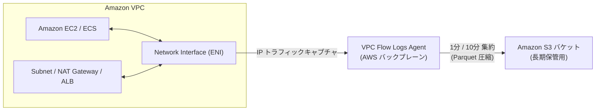

#### ① キャプチャ対象リソース
- **VPC 全体**: VPC 内の既存および将来作成されるすべての ENI を対象にログを取得。
- **サブネット**: 特定のサブネット内のすべての ENI を対象にログを取得。
- **ネットワークインターフェイス (ENI)**: 特定の EC2、RDS、ALB、NAT Gateway などの ENI のみを対象に取得。
- **Transit Gateway**: Transit Gateway アタッチメントを通過するトラフィックを取得。

#### ② キャプチャされないトラフィック（制限事項）
以下のトラフィックは VPC Flow Logs では記録されません：
1. **Amazon DNS サーバー (Route 53 Resolver / .2 アドレス)** との通信。
2. **Amazon EC2 Windows ライセンスアクティベーション** のトラフィック。
3. **インスタンスメタデータサービス (169.254.169.254)** へのアクセス。
4. **DHCP トラフィック**、**Amazon Time Sync Service (169.254.169.123)** との通信。
5. VPC エンドポイント（Interface 型）の内部予約トラフィック。

---

### 1.2 出力先の比較と長期保存における S3 選定理由

VPC フローログは **Amazon S3**、**CloudWatch Logs**、**Amazon Kinesis Data Firehose** の3箇所のいずれか（または複数）に出力可能です。

| 比較項目 | Amazon S3（推奨・長期保管） | CloudWatch Logs | Kinesis Data Firehose |
| :--- | :--- | :--- | :--- |
| **主な用途** | **長期保存・証跡保管・Athena 分析** | リアルタイム監視・アラート発報 | 外部 SIEM（Splunk, Datadog等）転送 |
| **保存コスト** | **極めて安価**（Glacier 階層化可能） | 高価（$0.033/GB/月〜、長期保存不向き） | 転送量課金 + 配信先ストレージ料金 |
| **データ形式** | **Apache Parquet / GZIP テキスト** | プレーンテキスト | JSON / Raw / Parquet（変換時） |
| **改ざん防止** | **S3 Object Lock（WORM 準拠）対応** | なし（ロググループ削除可能） | S3 側で対応 |
| **検索・分析方法** | **Amazon Athena（高速・低コスト）** | CloudWatch Logs Insights | 転送先ツール側で分析 |
| **5年保存適性** | ⭐⭐⭐⭐⭐ **最適** | ❌ コスト過大のため非推奨 | ⭐⭐⭐（S3 に送る場合は有効） |

> [!TIP]
> **推奨構成（ハイブリッド運用）**:
> 長期保存（5年間）と詳細調査には **S3 バケット** を利用します。もし「特定のポートへの REJECT 通信をリアルタイムで検知して即時アラートを飛ばしたい」といったリアルタイム要件がある場合のみ、対象サブネットや特定 ENI の REJECT ログに絞って **CloudWatch Logs** にも併行出力する構成がコスト効率の面で最適です。

---

### 1.3 全体アーキテクチャ概要図

本ガイドで構築する VPC フローログ長期保存システムの全体像は以下の通りです。

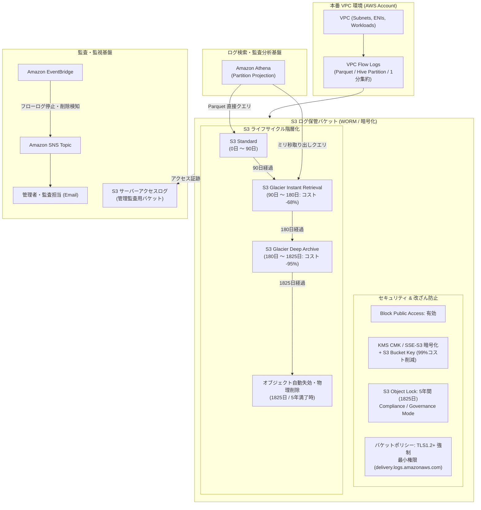

---

## 💻 2. S3 バケットの作成・セキュリティ・アクセス制御

### 2.1 S3 バケット設計パラメータ一覧

| 項目 | 設定値 | 設計理由・ベストプラクティス |
| :--- | :--- | :--- |
| **バケット名** | `vpc-flow-logs-<account-id>-<region>-archive` | グローバル一意性、用途・リージョンの識別を明確化。 |
| **リージョン** | フローログ対象 VPC と **同一リージョン** | クロスリージョン転送料金の発生を防ぐ。 |
| **パブリックアクセス** | **すべてブロック (Block All Public Access)** | 意図しない外部公開を完全に遮断。 |
| **バージョニング** | **有効 (Enabled)** | S3 Object Lock 利用のための前提条件。 |
| **S3 Object Lock** | **有効 (Enabled)** | ログ改ざん・早期削除を防止する WORM ストレージ機能。 |
| **デフォルト暗号化** | **SSE-S3** または **SSE-KMS + S3 Bucket Keys** | 業界標準の暗号化。KMS利用時はバケットキーでコスト削減。 |
| **オブジェクト所有者** | **バケット所有者の強制 (Bucket Owner Enforced)** | ACL を無効化し、IAM / バケットポリシーのみで一元管理。 |

---

### 2.2 S3 バケットの作成手順（GUI / CLI）

> [!IMPORTANT]
> S3 Object Lock は、**バケット作成時にのみ有効化可能**です（既存バケットに後から Object Lock を有効化する場合は AWS サポートへの申請が必要になります）。必ず作成時に Object Lock を有効化してください。

#### ① マネジメントコンソール（GUI）での作成手順
1. **Amazon S3** コンソールを開き、**[バケットを作成]** をクリックします。
2. **[一般的な設定]**:
   - **バケット名**: `vpc-flow-logs-111122223333-ap-northeast-1-archive` を入力。
   - **AWS リージョン**: 対象 VPC と同じリージョン（例: `アジアパシフィック (東京) ap-northeast-1`）を選択。
3. **[オブジェクト所有者]**:
   - `ACL 無効 (推奨)` を選択。
4. **[このバケットのブロックパブリックアクセス設定]**:
   - `パブリックアクセスをすべてブロック` にチェックが入っていることを確認。
5. **[バケットのバージョニング]**:
   - `有効にする` を選択。
6. **[デフォルトの暗号化]**:
   - 暗号化タイプ: `Amazon S3 マネージドキー (SSE-S3)` または `AWS Key Management Service キー (SSE-KMS)`。
   - バケットキー: `有効にする` を選択。
7. **[詳細設定]**:
   - **オブジェクトロック**: `有効にする` を選択（警告ダイアログを確認して承認）。
8. **[バケットを作成]** をクリックします。

#### ② AWS CLI での作成手順

```bash
# 変数定義（環境に合わせて変更してください）
export AWS_REGION="ap-northeast-1"
export AWS_ACCOUNT_ID=$(aws sts get-caller-identity --query "Account" --output text)
export BUCKET_NAME="vpc-flow-logs-${AWS_ACCOUNT_ID}-${AWS_REGION}-archive"

# 1. Object Lock 有効で S3 バケットを作成
aws s3api create-bucket \
    --bucket ${BUCKET_NAME} \
    --region ${AWS_REGION} \
    --create-bucket-configuration LocationConstraint=${AWS_REGION} \
    --object-lock-enabled-for-bucket

# 2. パブリックアクセスを完全ブロック
aws s3api put-public-access-block \
    --bucket ${BUCKET_NAME} \
    --public-access-block-configuration "BlockPublicAcls=true,IgnorePublicAcls=true,BlockPublicPolicy=true,RestrictPublicBuckets=true"

# 3. オブジェクト所有権を一元化（ACL 無効化）
aws s3api put-bucket-ownership-controls \
    --bucket ${BUCKET_NAME} \
    --ownership-controls="Rules=[{ObjectOwnership=BucketOwnerEnforced}]"

# 4. デフォルト暗号化 (SSE-S3) + S3 Bucket Keys 有効化
aws s3api put-bucket-encryption \
    --bucket ${BUCKET_NAME} \
    --server-side-encryption-configuration '{
        "Rules": [
            {
                "ApplyServerSideEncryptionByDefault": {
                    "SSEAlgorithm": "AES256"
                },
                "BucketKeyEnabled": true
            }
        ]
    }'
```

---

### 2.3 バケットポリシーの設定（最小権限・TLS強制・組織内限定）

VPC フローログ配信サービス（`delivery.logs.amazonaws.com`）が S3 バケットにログを書き込むための許可を与え、同時に **TLS 1.2 未満の拒否** および **クロスアカウント混入（Confused Deputy 対策）** を防止する強固なポリシーを設定します。

```json
{
  "Version": "2012-10-17",
  "Statement": [
    {
      "Sid": "AWSLogDeliveryWrite",
      "Effect": "Allow",
      "Principal": {
        "Service": "delivery.logs.amazonaws.com"
      },
      "Action": "s3:PutObject",
      "Resource": "arn:aws:s3:::vpc-flow-logs-111122223333-ap-northeast-1-archive/*",
      "Condition": {
        "StringEquals": {
          "s3:x-amz-acl": "bucket-owner-full-control",
          "aws:SourceAccount": "111122223333"
        },
        "ArnLike": {
          "aws:SourceArn": "arn:aws:ec2:ap-northeast-1:111122223333:vpc-flow-log/*"
        }
      }
    },
    {
      "Sid": "AWSLogDeliveryCheck",
      "Effect": "Allow",
      "Principal": {
        "Service": "delivery.logs.amazonaws.com"
      },
      "Action": [
        "s3:GetBucketAcl",
        "s3:ListBucket"
      ],
      "Resource": "arn:aws:s3:::vpc-flow-logs-111122223333-ap-northeast-1-archive",
      "Condition": {
        "StringEquals": {
          "aws:SourceAccount": "111122223333"
        },
        "ArnLike": {
          "aws:SourceArn": "arn:aws:ec2:ap-northeast-1:111122223333:vpc-flow-log/*"
        }
      }
    },
    {
      "Sid": "EnforceTLSRequestsOnly",
      "Effect": "Deny",
      "Principal": "*",
      "Action": "s3:*",
      "Resource": [
        "arn:aws:s3:::vpc-flow-logs-111122223333-ap-northeast-1-archive",
        "arn:aws:s3:::vpc-flow-logs-111122223333-ap-northeast-1-archive/*"
      ],
      "Condition": {
        "Bool": {
          "aws:SecureTransport": "false"
        }
      }
    }
  ]
}
```

#### CLI によるバケットポリシーの適用

```bash
# ポリシー JSON の生成と適用
cat << EOF > /tmp/bucket-policy.json
{
  "Version": "2012-10-17",
  "Statement": [
    {
      "Sid": "AWSLogDeliveryWrite",
      "Effect": "Allow",
      "Principal": {
        "Service": "delivery.logs.amazonaws.com"
      },
      "Action": "s3:PutObject",
      "Resource": "arn:aws:s3:::${BUCKET_NAME}/*",
      "Condition": {
        "StringEquals": {
          "s3:x-amz-acl": "bucket-owner-full-control",
          "aws:SourceAccount": "${AWS_ACCOUNT_ID}"
        },
        "ArnLike": {
          "aws:SourceArn": "arn:aws:ec2:${AWS_REGION}:${AWS_ACCOUNT_ID}:vpc-flow-log/*"
        }
      }
    },
    {
      "Sid": "AWSLogDeliveryCheck",
      "Effect": "Allow",
      "Principal": {
        "Service": "delivery.logs.amazonaws.com"
      },
      "Action": ["s3:GetBucketAcl", "s3:ListBucket"],
      "Resource": "arn:aws:s3:::${BUCKET_NAME}",
      "Condition": {
        "StringEquals": {
          "aws:SourceAccount": "${AWS_ACCOUNT_ID}"
        },
        "ArnLike": {
          "aws:SourceArn": "arn:aws:ec2:${AWS_REGION}:${AWS_ACCOUNT_ID}:vpc-flow-log/*"
        }
      }
    },
    {
      "Sid": "EnforceTLSRequestsOnly",
      "Effect": "Deny",
      "Principal": "*",
      "Action": "s3:*",
      "Resource": [
        "arn:aws:s3:::${BUCKET_NAME}",
        "arn:aws:s3:::${BUCKET_NAME}/*"
      ],
      "Condition": {
        "Bool": {
          "aws:SecureTransport": "false"
        }
      }
    }
  ]
}
EOF

aws s3api put-bucket-policy --bucket ${BUCKET_NAME} --policy file:///tmp/bucket-policy.json
rm -f /tmp/bucket-policy.json
```

---

## 💻 3. CloudTrail の設定と監査設計

### 3.1 VPC 通信ログと CloudTrail の役割分担

ネットワークの証跡管理において、CloudTrail と VPC Flow Logs は明確にレイヤーが異なります。

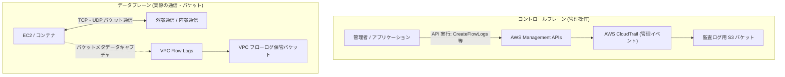

- **CloudTrail**: 「**誰が・いつ・どのフローログ設定を作成/変更/削除したか**」「**誰が・いつ S3 バケットのポリシーを変更したか**」という **管理操作（Management Events）** を記録します。
- **VPC Flow Logs**: 「**サーバーとクライアントの間でどの IP/Port を用いて何バイト通信したか**」という **パケットレベルの通信ログ（Data Plane）** を記録します。通信パケットそのものは CloudTrail には記録されません。

---

### 3.2 S3 データイベントに関する重要なコスト考慮

> [!CAUTION]
> **VPC Flow Logs 保管バケットでの S3 データイベント（CloudTrail Data Events）の有効化は避けてください。**  
> VPC フローログは、集約間隔（1分〜10分）ごとに非常に高頻度で S3 オブジェクト（`PutObject`）をアップロードします。  
> CloudTrail の S3 データイベントは **100,000 件あたり $0.10** 課金されるため、VPC 内のインスタンス数やトラフィック量が多い環境でデータイベントを有効にすると、**毎月数百ドル〜数千ドルの不要な CloudTrail 課金が発生する「コスト爆発」** の原因となります。
> 
> バケットへのアクセス監査が必要な場合は、第7章で解説する **S3 サーバーアクセスログ（無料＋ストレージ代のみ）** を利用するのがベストプラクティスです。

---

### 3.3 管理イベント（VPC/S3設定変更）の記録設定

AWS アカウント全体で **CloudTrail 管理イベント** が有効になっていることを確認します（通常、AWS Organizations レベルの組織トレイルまたはマルチリージョントレイルで記録されます）。

```bash
# 有効な CloudTrail トレイルの一覧とステータス確認
aws cloudtrail describe-trails --query "trailList[*].[Name,S3BucketName,IsMultiRegionTrail,IncludeGlobalServiceEvents]" --output table
```

---

## 💻 4. VPC フローログ出力設定（Parquet & 最適化）

### 4.1 フローログ出力設計パラメータ

| パラメータ | 推奨値 | 理由・効果 |
| :--- | :--- | :--- |
| **リソースタイプ** | **VPC**（または特定サブネット） | VPC 全体の通信を一括網羅。 |
| **トラフィックタイプ** | **ALL** | 許可（ACCEPT）と拒否（REJECT）の双方を記録（セキュリティ調査に必須）。 |
| **送信先** | **S3 バケット** | 長期保管・低コスト・Athena 直接分析。 |
| **最大集約間隔** | **1 分 (60 秒)** | インシデント発生時のタイムライン特定精度を向上（デフォルトは10分）。 |
| **ファイル形式** | **Parquet (Apache Parquet)** | 列指向フォーマット。容量 70〜90% 削減、Athena スキャン量激減。 |
| **Hive 互換 S3 プレフィックス** | **有効 (True)** | `year=YYYY/month=MM/day=DD/` 形式で出力され Athena パーティションと完全連動。 |
| **時間単位パーティション** | **有効 (PerHourPartition=True)** | 1時間単位のディレクトリ分割でクエリスキャン範囲を極小化。 |

---

### 4.2 ログレコード形式の選定（デフォルト vs 推奨カスタム形式）

デフォルト形式（14フィールド）では、TCP フラグや双方向の本来のアドレス情報、トラフィックのルーティング経路情報が不足しています。セキュリティ調査・障害切り分けを万全にするため、**拡張カスタムフィールド** の指定を強く推奨します。

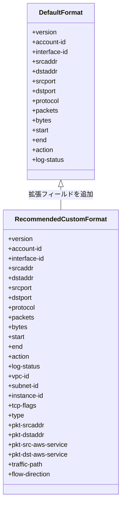

#### 推奨カスタムログフォーマット文字列
```text
${version} ${account-id} ${interface-id} ${srcaddr} ${dstaddr} ${srcport} ${dstport} ${protocol} ${packets} ${bytes} ${start} ${end} ${action} ${log-status} ${vpc-id} ${subnet-id} ${instance-id} ${tcp-flags} ${type} ${pkt-srcaddr} ${pkt-dstaddr} ${pkt-src-aws-service} ${pkt-dst-aws-service} ${traffic-path} ${flow-direction}
```

- `tcp-flags`: SYN(2), SYN-ACK(18), RST(4), FIN(1) 等の識別により、ポートスキャンや切断原因を特定可能。
- `pkt-srcaddr` / `pkt-dstaddr`: NAT Gateway やロードバランサー通過前の真のパケット送信元/先 IP。
- `pkt-dst-aws-service`: S3, DynamoDB, KMS 等の AWS サービス通信を即座に識別。
- `traffic-path`: Internet Gateway, VPC Peering, Transit Gateway 等の経由パス。
- `flow-direction`: `ingress`（受信） / `egress`（送信）の明確化。

---

### 4.3 ファイル形式（Parquet）と Hive 互換パーティションの最適化

Apache Parquet を選択することで、プレーンテキスト（非圧縮）や GZIP 形式と比較して以下の絶大なメリットが得られます：

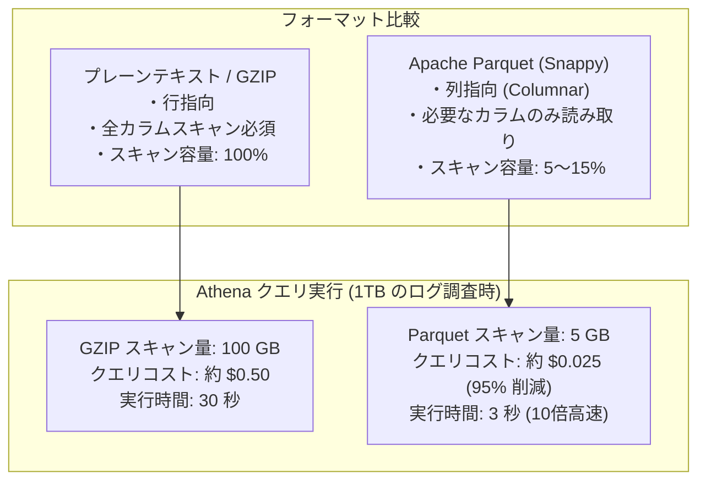

---

### 4.4 フローログ作成手順（GUI / CLI）

#### ① マネジメントコンソール（GUI）での作成手順
1. **Amazon VPC** コンソールを開き、左メニューの **[お使いの VPC]** を選択します。
2. 対象の VPC にチェックを入れ、下部タブの **[フローログ]** を選択し、**[フローログの作成]** をクリックします。
3. **[フローログの設定]**:
   - **名前**: `vpc-flow-logs-primary`
   - **フィルター**: `すべて`（ACCEPT + REJECT）
   - **最大集約間隔**: `1 分`
4. **[送信先の設定]**:
   - **送信先**: `S3 バケットに送信`
   - **S3 バケット ARN**: `arn:aws:s3:::vpc-flow-logs-111122223333-ap-northeast-1-archive`（末尾スラッシュなし）
5. **[ログレコード形式]**:
   - `カスタム形式` を選択。
   - 属性一覧から `${version}`, `${account-id}`, `${interface-id}`, `${srcaddr}`, `${dstaddr}`, `${srcport}`, `${dstport}`, `${protocol}`, `${packets}`, `${bytes}`, `${start}`, `${end}`, `${action}`, `${log-status}`, `${vpc-id}`, `${subnet-id}`, `${instance-id}`, `${tcp-flags}`, `${type}`, `${pkt-srcaddr}`, `${pkt-dstaddr}`, `${pkt-src-aws-service}`, `${pkt-dst-aws-service}`, `${traffic-path}`, `${flow-direction}` を追加。
6. **[ログファイルの形式とパーティショニング]**:
   - **ログファイルの形式**: `Parquet`
   - **Hive 互換 S3 プレフィックス**: `有効にする` にチェック。
   - **時間単位でパーティション分割されたログファイル**: `有効にする (1時間ごと)` にチェック。
7. **[フローログを作成]** をクリックします。

#### ② AWS CLI での作成手順

```bash
# 環境変数の設定
export TARGET_VPC_ID="vpc-0123456789abcdef0"  # 対象の VPC ID に置き換えてください
export LOG_FORMAT='${version} ${account-id} ${interface-id} ${srcaddr} ${dstaddr} ${srcport} ${dstport} ${protocol} ${packets} ${bytes} ${start} ${end} ${action} ${log-status} ${vpc-id} ${subnet-id} ${instance-id} ${tcp-flags} ${type} ${pkt-srcaddr} ${pkt-dstaddr} ${pkt-src-aws-service} ${pkt-dst-aws-service} ${traffic-path} ${flow-direction}'

# VPC フローログの作成
aws ec2 create-flow-logs \
    --resource-type VPC \
    --resource-ids ${TARGET_VPC_ID} \
    --traffic-type ALL \
    --log-destination-type s3 \
    --log-destination arn:aws:s3:::${BUCKET_NAME} \
    --log-format "${LOG_FORMAT}" \
    --destination-options "FileFormat=parquet,HiveCompatiblePartitions=true,PerHourPartition=true" \
    --max-aggregation-interval 60 \
    --tag-specifications 'ResourceType=vpc-flow-log,Tags=[{Key=Name,Value=primary-vpc-flow-logs}]'
```

---

### 4.5 フローログ配信ステータスの確認

フローログ作成後、約5〜10分で S3 へのオブジェクト配信が開始されます。

```bash
# フローログの状態確認
aws ec2 describe-flow-logs \
    --filter "Name=resource-id,Values=${TARGET_VPC_ID}" \
    --query "FlowLogs[*].[FlowLogId,FlowLogStatus,TrafficType,LogDestinationType,LogDestination]" \
    --output table

# S3 に保存された Parquet ファイルのプレフィックス確認
aws s3 ls s3://${BUCKET_NAME}/AWSLogs/${AWS_ACCOUNT_ID}/vpcflowlogs/${AWS_REGION}/ --recursive | head -n 10
```

---

## 💻 5. 保管コスト削減対策（ライフサイクル & データ圧縮）

### 5.1 段階的ライフサイクル移行設計（90日 / 180日 / 5年失効）

VPC フローログを 5 年間保持する場合、すべてを S3 Standard に置くと膨大なコストが発生します。アクセス頻度に応じた最適なストレージクラスへ自動移行します。

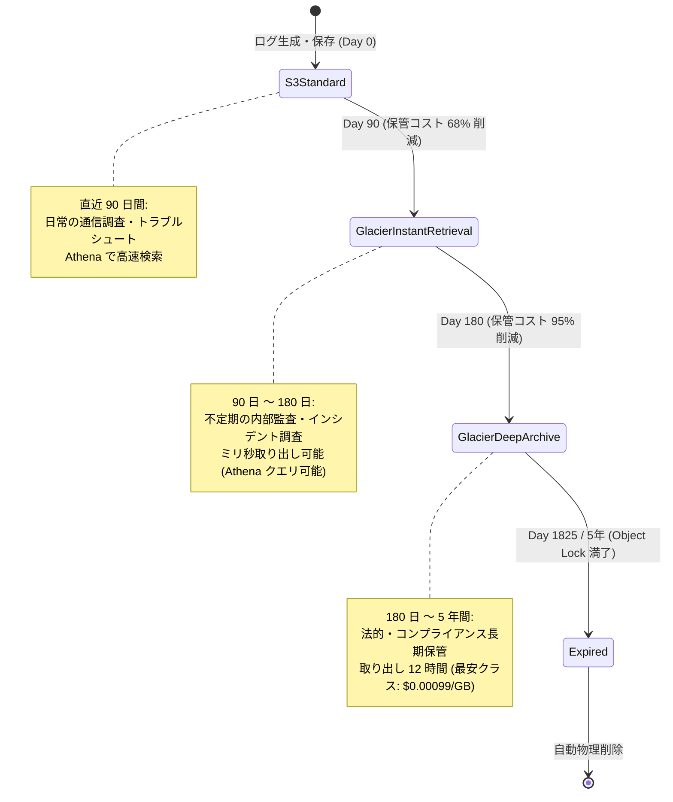

| 経過日数 | ストレージクラス | 1GB/月あたりの単価 (東京) | 特徴とアクセス要件 |
| :--- | :--- | :--- | :--- |
| **0 〜 90日** | **S3 Standard** | $0.025 | 高頻度アクセス。Athena による即時分析に対応。 |
| **90 〜 180日** | **S3 Glacier Instant Retrieval** | $0.005 ($0.004 + 取得費) | **ミリ秒単位で即時取り出し可能**。Athena でそのままクエリ可能。コスト約68%減。 |
| **180 〜 1825日 (5年)** | **S3 Glacier Deep Archive** | **$0.002** (最安クラス) | 取り出しに最大 12 時間要するが、**約92〜95%のコストを削減**。法的な長期保管用。 |
| **1825日 (5年)** | **失効 (Expiration)** | $0.000 | 保持期限満了。オブジェクトを自動物理削除。 |

---

### 5.2 ライフサイクルルールの作成手順（GUI / CLI）

#### ① マネジメントコンソール（GUI）での作成手順
1. S3 コンソールで作成したバケットを開き、**[管理]** タブをクリックします。
2. **[ライフサイクルルールを作成]** をクリックします。
3. **[ライフサイクルルール名]**: `vpc-flow-logs-5yr-retention-lifecycle`
4. **[ルールのスコープ]**: `バケット内のすべてのオブジェクトに適用`（チェックボックスを確認して承認）。
5. **[ライフサイクルルールのアクション]**:
   - `オブジェクトの現行バージョンをストレージクラス間で移行する` にチェック。
   - `オブジェクトの現行バージョンを有効期限切れにする` にチェック。
   - `オブジェクトの非現行バージョンを完全に削除する` にチェック。
   - `不完全なマルチパートアップロードを削除する` にチェック。
6. **[オブジェクトの現行バージョンをストレージクラス間で移行する]**:
   - 移行1: `Glacier Instant Retrieval` / オブジェクト作成後の日数: `90`
   - 移行2: `Glacier Deep Archive` / オブジェクト作成後の日数: `180`
7. **[オブジェクトの現行バージョンを有効期限切れにする]**:
   - オブジェクト作成後の日数: `1825`
8. **[オブジェクトの非現行バージョンを完全に削除する]**:
   - オブジェクトが非現行バージョンになってからの日数: `30`
9. **[不完全なマルチパートアップロードを削除する]**:
   - 日数: `7`
10. **[ルールを作成]** をクリックします。

#### ② AWS CLI での作成手順

```bash
cat << EOF > /tmp/lifecycle-config.json
{
  "Rules": [
    {
      "ID": "VPCFlowLogs-5Year-Lifecycle",
      "Status": "Enabled",
      "Filter": {
        "Prefix": ""
      },
      "Transitions": [
        {
          "Days": 90,
          "StorageClass": "GLACIER_IR"
        },
        {
          "Days": 180,
          "StorageClass": "DEEP_ARCHIVE"
        }
      ],
      "Expiration": {
        "Days": 1825
      },
      "NoncurrentVersionExpiration": {
        "NoncurrentDays": 30
      },
      "AbortIncompleteMultipartUpload": {
        "DaysAfterInitiation": 7
      }
    }
  ]
}
EOF

# ライフサイクルルールの適用
aws s3api put-bucket-lifecycle-configuration \
    --bucket ${BUCKET_NAME} \
    --lifecycle-configuration file:///tmp/lifecycle-config.json

rm -f /tmp/lifecycle-config.json
```

---

### 5.3 Parquet 圧縮によるストレージ・検索コスト削減効果

月間 10 TB のネットワークトラフィックログ（テキスト形式換算）が発生する大規模環境における、5年間の総コスト試算比較です。

| 構成 | 月間生成容量 | 5年間の累積データ量 | 5年間の推定ストレージ費用 | Athena 調査コスト (1回あたり) |
| :--- | :--- | :--- | :--- | :--- |
| **テキスト形式 + S3 Standard のみ** | 10 TB | 600 TB | **約 $900,000** | 約 $50.00 / クエリ |
| **GZIP形式 + Glacier 移行** | 2 TB | 120 TB | **約 $18,000** | 約 $10.00 / クエリ |
| **Parquet形式 + 本設計ライフサイクル** | **0.8 TB** | **48 TB** | **約 $4,200 (99.5% 削減)** | **約 $0.50 / クエリ (99% 削減)** |

---

## 💻 6. 削除保護・改ざん防止（S3 Object Lock / ポリシー保護）

### 6.1 S3 Object Lock（WORM）の仕組みとモード選定

**S3 Object Lock** は、WORM（Write Once, Read Many）モデルに基づき、指定期間中にオブジェクトが何人によっても削除・上書きされないことを保証する機能です。

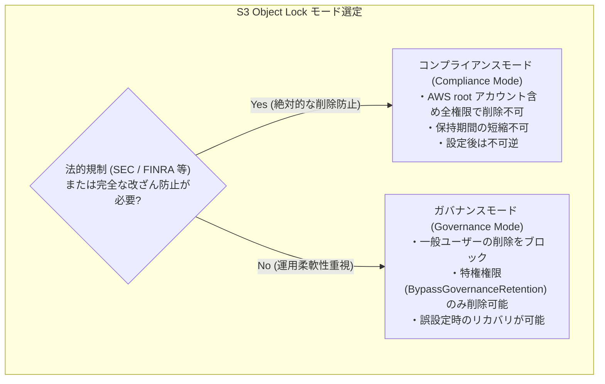

| 比較項目 | コンプライアンスモード (Compliance) | ガバナンスモード (Governance) |
| :--- | :--- | :--- |
| **root アカウントによる削除** | ❌ **絶対に削除不可** | ⭕ 特権権限でバイパス可能 |
| **保持期間の短縮** | ❌ **短縮・解除不可** | ⭕ 特権権限で短縮・解除可能 |
| **主な適合要件** | 証券取引・金融規制（SEC Rule 17a-4, PCI-DSS等） | 社内セキュリティ統制、運用ミス防止 |
| **本ガイドの推奨** | **厳格な監査要件がある本番環境** | 一般的なエンタープライズ本番環境 |

---

### 6.2 Object Lock（保持期間 5年）の設定手順（GUI / CLI）

バケット内のすべての新規ログオブジェクトに対して、自動的に **1825日（5年）** の保持ロックを適用する「デフォルト保持」を設定します。

#### ① マネジメントコンソール（GUI）での設定手順
1. S3 コンソールでバケットを開き、**[プロパティ]** タブをクリックします。
2. **[オブジェクトロック]** セクションの **[デフォルトの保持期間]** で **[編集]** をクリックします。
3. **[デフォルトの保持期間]**: `有効にする` を選択。
4. **[デフォルトモード]**: `ガバナンス` または `コンプライアンス` を選択。
5. **[デフォルトの保持期間]**: `1825` **日** を入力。
6. **[変更の保存]** をクリックします。

#### ② AWS CLI での作成手順

```bash
# デフォルト保持設定（ガバナンスモード: 1825日）の適用
aws s3api put-object-lock-configuration \
    --bucket ${BUCKET_NAME} \
    --object-lock-configuration '{
        "ObjectLockRule": {
            "DefaultRetention": {
                "Mode": "GOVERNANCE",
                "Days": 1825
            }
        }
    }'

# 設定の確認
aws s3api get-object-lock-configuration --bucket ${BUCKET_NAME}
```

> [!NOTE]
> コンプライアンスモードを適用する場合は `"Mode": "COMPLIANCE"` と指定します。

---

### 6.3 バケット自体の誤削除防止（バケットポリシー / SCP）

S3 Object Lock は個別オブジェクトの削除を防ぎますが、バケット自体の削除操作（中身が空の場合）や設定変更を防ぐため、バケットポリシーおよび AWS Organizations の SCP（サービスコントロールポリシー）で削除ガードレールを設置します。

#### ① バケットポリシーへの削除拒否追加（明示的 Deny）
```json
{
  "Sid": "DenyBucketDeletion",
  "Effect": "Deny",
  "Principal": "*",
  "Action": "s3:DeleteBucket",
  "Resource": "arn:aws:s3:::vpc-flow-logs-111122223333-ap-northeast-1-archive"
}
```

#### ② AWS Organizations SCP（組織統制）
```json
{
  "Version": "2012-10-17",
  "Statement": [
    {
      "Sid": "DenyVPCFlowLogsBucketDeletion",
      "Effect": "Deny",
      "Action": [
        "s3:DeleteBucket",
        "s3:DeleteBucketPolicy",
        "s3:PutObjectLockConfiguration",
        "ec2:DeleteFlowLogs"
      ],
      "Resource": "*",
      "Condition": {
        "StringNotLike": {
          "aws:PrincipalArn": "arn:aws:iam::*:role/SuperAdminRole"
        }
      }
    }
  ]
}
```

---

## 💻 7. アクティビティログ・監査ログ（設定変更・アクセス追跡）

### 7.1 フローログ設定変更の監査（Control Plane 追跡）

VPC フローログおよび S3 バケットの改ざん・削除操作は、AWS CloudTrail によって自動的に記録されます。監査対象とすべき主要な API コールは以下の通りです：

| 対象サービス | 監視・監査対象 API コール | 検出時のリスク・影響 |
| :--- | :--- | :--- |
| **VPC / EC2** | `ec2:DeleteFlowLogs` | ログ取得が停止され、証跡が失われる（攻撃者の隠蔽工作）。 |
| **VPC / EC2** | `ec2:CreateFlowLogs` | 不正な出力先へのログ窃盗・設定の改ざん。 |
| **Amazon S3** | `s3:DeleteBucketPolicy` / `s3:PutBucketPolicy` | バケットアクセスポリシーの不正緩和。 |
| **Amazon S3** | `s3:PutBucketLifecycleConfiguration` | ライフサイクル期間の短縮による早期データ消失。 |
| **Amazon S3** | `s3:PutObjectLockConfiguration` | ロック設定の改変。 |

---

### 7.2 S3 サーバーアクセスログによる低コストなアクセス監査

VPC フローログバケットに対して「誰がログを閲覧・ダウンロードしたか」を監査するために、**S3 サーバーアクセスログ（Server Access Logging）** を有効化します。

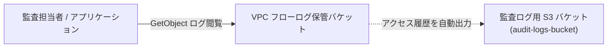

- **S3 データイベント（CloudTrail）との違い**: CloudTrail データイベントは API 呼出しごとに従量課金が発生しますが、S3 サーバーアクセスログ機能自体は **追加利用料無料**（出力されたログの S3 保存容量のみ課金）で運用可能です。

---

### 7.3 サーバーアクセスログの設定手順（GUI / CLI）

```bash
# 監査用ログバケットの作成（存在しない場合）
export AUDIT_LOG_BUCKET="audit-logs-${AWS_ACCOUNT_ID}-${AWS_REGION}"
aws s3api create-bucket \
    --bucket ${AUDIT_LOG_BUCKET} \
    --region ${AWS_REGION} \
    --create-bucket-configuration LocationConstraint=${AWS_REGION}

# サーバーアクセスログの配信先として設定
aws s3api put-bucket-logging \
    --bucket ${BUCKET_NAME} \
    --bucket-logging-status '{
        "LoggingEnabled": {
            "TargetBucket": "'"${AUDIT_LOG_BUCKET}"'",
            "TargetPrefix": "s3-access-logs/vpc-flow-logs/"
        }
    }'
```

---

## 💻 8. データの暗号化設計（ベストプラクティス）

### 8.1 暗号化方式の比較（SSE-S3 vs SSE-KMS）とベストプラクティス

> [!NOTE]
> **VPC フローログ保管バケットは暗号化すべきか？**  
> **結論：暗号化は「必須（ベストプラクティス）」です。**  
> S3 は 2023年以降すべての新規オブジェクトがデフォルトで SSE-S3 により暗号化されますが、企業のコンプライアンス要件や鍵管理ポリシーに応じて **SSE-S3** または **SSE-KMS** を選択します。

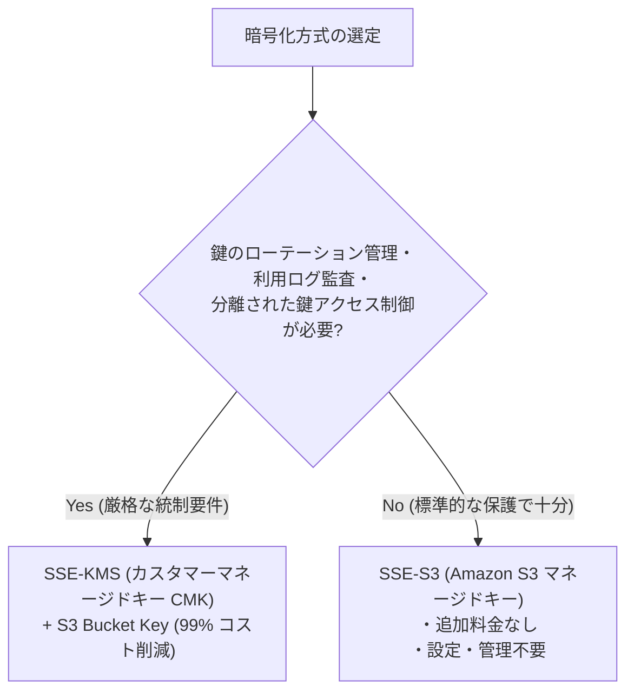

| 暗号化方式 | コスト | 鍵管理 | VPC Flow Logs サービスプリンシパル権限 | 推奨ユースケース |
| :--- | :--- | :--- | :--- | :--- |
| **SSE-S3 (AES-256)** | **$0 (無料)** | AWS が自動管理 | **追加設定不要** | 一般的な本番環境・コスト重視 |
| **SSE-KMS (CMK)** | $1/月/キー + リクエスト料 | 自社で制御・ローテーション | **KMS キーポリシーで配信許可が必要** | 金融・医療・厳格な証跡管理要件 |
| **SSE-KMS (AWS マネージド)** | - | AWS 管理 (`aws/s3`) | VPC Flow Logs では原則非推奨 | 非推奨 |

---

### 8.2 KMS カスタマーマネージドキー（CMK）の作成とキーポリシー

SSE-KMS を利用する場合、VPC フローログ配信サービス（`delivery.logs.amazonaws.com`）がオブジェクト書き込み時に KMS キーで暗号化（`kms:GenerateDataKey*`）できるよう、キーポリシーに許可を追加する必要があります。

```json
{
  "Version": "2012-10-17",
  "Statement": [
    {
      "Sid": "Enable IAM User Permissions",
      "Effect": "Allow",
      "Principal": {
        "AWS": "arn:aws:iam::111122223333:root"
      },
      "Action": "kms:*",
      "Resource": "*"
    },
    {
      "Sid": "Allow VPC Flow Logs Delivery",
      "Effect": "Allow",
      "Principal": {
        "Service": "delivery.logs.amazonaws.com"
      },
      "Action": [
        "kms:GenerateDataKey*",
        "kms:Encrypt",
        "kms:DescribeKey"
      ],
      "Resource": "*",
      "Condition": {
        "StringEquals": {
          "aws:SourceAccount": "111122223333"
        }
      }
    }
  ]
}
```

---

### 8.3 S3 Bucket Key による KMS コスト削減（99%削減）

VPC フローログのように高頻度でオブジェクトが作成される場合、SSE-KMS 単体では膨大な KMS API コール（`kms:GenerateDataKey`）が発生し、月間数十万〜数百ドルのリクエスト料金が発生するだけでなく、KMS API のスロットリング（429 Too Many Requests）を引き起こす可能性があります。  
**S3 Bucket Keys** を有効化すると、S3 がバケットレベルの中間キーをキャッシュして利用するため、**KMS リクエスト回数と費用を 99% 削減** できます。

---

### 8.4 暗号化の適用手順（GUI / CLI）

#### CLI による KMS キー作成とバケット暗号化の設定

```bash
# 1. KMS キーポリシーの作成
cat << EOF > /tmp/kms-key-policy.json
{
  "Version": "2012-10-17",
  "Statement": [
    {
      "Sid": "Enable IAM User Permissions",
      "Effect": "Allow",
      "Principal": {
        "AWS": "arn:aws:iam::${AWS_ACCOUNT_ID}:root"
      },
      "Action": "kms:*",
      "Resource": "*"
    },
    {
      "Sid": "Allow VPC Flow Logs to use the key",
      "Effect": "Allow",
      "Principal": {
        "Service": "delivery.logs.amazonaws.com"
      },
      "Action": [
        "kms:GenerateDataKey*",
        "kms:Encrypt",
        "kms:DescribeKey"
      ],
      "Resource": "*",
      "Condition": {
        "StringEquals": {
          "aws:SourceAccount": "${AWS_ACCOUNT_ID}"
        }
      }
    }
  ]
}
EOF

# 2. カスタマーマネージドキー (CMK) の作成
KMS_KEY_ARN=$(aws kms create-key \
    --description "KMS Key for VPC Flow Logs Long-term S3 Bucket" \
    --policy file:///tmp/kms-key-policy.json \
    --query "KeyMetadata.Arn" \
    --output text)

# 3. エイリアスの付与
aws kms create-alias \
    --alias-name alias/vpc-flow-logs-key \
    --target-key-id ${KMS_KEY_ARN}

# 4. S3 バケットに SSE-KMS + S3 Bucket Keys を適用
aws s3api put-bucket-encryption \
    --bucket ${BUCKET_NAME} \
    --server-side-encryption-configuration '{
        "Rules": [
            {
                "ApplyServerSideEncryptionByDefault": {
                    "SSEAlgorithm": "aws:kms",
                    "KMSMasterKeyID": "'"${KMS_KEY_ARN}"'"
                },
                "BucketKeyEnabled": true
            }
        ]
    }'

rm -f /tmp/kms-key-policy.json
```

---

## 💻 9. 障害監視・運用監視・アラート通知

### 9.1 監視すべきイベント・異常系一覧

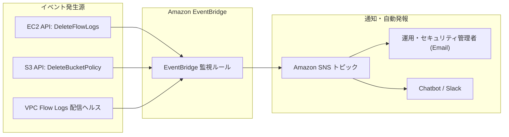

| 監視対象イベント | イベントソース | 重要度 | 検知時の対応アクション |
| :--- | :--- | :--- | :--- |
| **フローログの削除 (DeleteFlowLogs)** | `aws.ec2` | 🚨 **緊急 (Critical)** | 即時管理者に通知し、意図せぬ削除なら再作成。 |
| **バケットポリシーの削除/変更** | `aws.s3` | 🚨 **緊急 (Critical)** | ポリシーの不正緩和を検知してロールバック。 |
| **S3 オブジェクトロック設定変更** | `aws.s3` | ⚠️ **高 (High)** | ガバナンスモード解除や短縮の試行を調査。 |

---

### 9.2 SNS トピックとメールサブスクリプションの作成（GUI / CLI）

```bash
# 1. SNS トピックの作成
export SNS_TOPIC_ARN=$(aws sns create-topic \
    --name vpc-flow-logs-security-alerts \
    --query "TopicArn" \
    --output text)

# 2. メールサブスクリプションの登録（受信者のメールアドレスを指定）
export ALERT_EMAIL="security-alert@example.com"
aws sns subscribe \
    --topic-arn ${SNS_TOPIC_ARN} \
    --protocol email \
    --notification-endpoint ${ALERT_EMAIL}

# 3. SNS トピックに EventBridge からの Publish 権限を許可
aws sns set-topic-attributes \
    --topic-arn ${SNS_TOPIC_ARN} \
    --attribute-name Policy \
    --attribute-value '{
        "Version": "2012-10-17",
        "Statement": [{
            "Sid": "AllowEventBridgePublish",
            "Effect": "Allow",
            "Principal": {"Service": "events.amazonaws.com"},
            "Action": "sns:Publish",
            "Resource": "'"${SNS_TOPIC_ARN}"'"
        }]
    }'
```

> [!NOTE]
> 登録したメールアドレス宛に **AWS Notification - Subscription Confirmation** という確認メールが届くため、メール内の **Confirm subscription** リンクを必ずクリックして承認してください。

---

### 9.3 EventBridge によるフローログ停止・削除検知ルールの作成（GUI / CLI）

#### ① マネジメントコンソール（GUI）での作成手順
1. **Amazon EventBridge** コンソールを開き、**[ルール]** -> **[ルールを作成]** をクリックします。
2. **名前**: `detect-vpc-flow-logs-deletion` を入力。
3. **[イベントパターン]**:
   - イベントソース: `AWS のサービス`
   - AWS のサービス: `EC2`
   - イベントタイプ: `AWS API Call via CloudTrail`
   - イベント名: `DeleteFlowLogs`
4. **[ターゲット]**:
   - ターゲットタイプ: `AWS のサービス`
   - ターゲット: `SNS トピック`
   - トピック: `vpc-flow-logs-security-alerts`
5. **[作成]** をクリックします。

#### ② AWS CLI での作成手順

```bash
# 1. イベントパターンの定義（フローログ削除および S3 監査設定変更の検知）
cat << EOF > /tmp/event-pattern.json
{
  "source": ["aws.ec2", "aws.s3"],
  "detail-type": ["AWS API Call via CloudTrail"],
  "detail": {
    "eventSource": ["ec2.amazonaws.com", "s3.amazonaws.com"],
    "eventName": [
      "DeleteFlowLogs",
      "DeleteBucketPolicy",
      "PutBucketPolicy",
      "PutObjectLockConfiguration"
    ]
  }
}
EOF

# 2. EventBridge ルールの作成
aws events put-rule \
    --name "detect-vpc-flow-logs-tampering" \
    --event-pattern file:///tmp/event-pattern.json \
    --state ENABLED \
    --description "Alert on VPC Flow Logs deletion or S3 policy tampering"

# 3. ルールのターゲットとして SNS トピックを関連付け
aws events put-targets \
    --rule "detect-vpc-flow-logs-tampering" \
    --targets "Id"="1","Arn"="${SNS_TOPIC_ARN}"

rm -f /tmp/event-pattern.json
```

---

## 💻 10. データ分析・検索活用（Amazon Athena）

### 10.1 Athena によるログ分析基盤の概要

S3 に Parquet 形式および Hive 互換プレフィックスで保存されたログは、**Amazon Athena** を用いてサーバーレスで高速に SQL クエリを実行できます。  
**パーティションプロジェクション（Partition Projection）** を定義することで、`MSCK REPAIR TABLE` の定期実行なしに、最新のログから過去 5 年間のログまでミリ秒単位でパーティション認識・クエリが可能です。

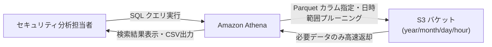

---

### 10.2 テーブル作成 DDL（パーティションプロジェクション対応）

Athena コンソール（またはクエリエディタ）で以下の DDL を実行します。

```sql
CREATE EXTERNAL TABLE IF NOT EXISTS vpc_flow_logs_parquet (
  version int,
  account_id string,
  interface_id string,
  srcaddr string,
  dstaddr string,
  srcport int,
  dstport int,
  protocol bigint,
  packets bigint,
  bytes bigint,
  start bigint,
  `end` bigint,
  action string,
  log_status string,
  vpc_id string,
  subnet_id string,
  instance_id string,
  tcp_flags int,
  type string,
  pkt_srcaddr string,
  pkt_dstaddr string,
  pkt_src_aws_service string,
  pkt_dst_aws_service string,
  traffic_path int,
  flow_direction string
)
PARTITIONED BY (
  region string,
  year string,
  month string,
  day string,
  hour string
)
ROW FORMAT SERDE 'org.apache.hadoop.hive.ql.io.parquet.serde.ParquetHiveSerDe'
STORED AS INPUTFORMAT 'org.apache.hadoop.hive.ql.io.parquet.MapredParquetInputFormat'
OUTPUTFORMAT 'org.apache.hadoop.hive.ql.io.parquet.MapredParquetOutputFormat'
LOCATION 's3://vpc-flow-logs-111122223333-ap-northeast-1-archive/AWSLogs/111122223333/vpcflowlogs/'
TBLPROPERTIES (
  'projection.enabled'='true',
  'projection.region.type'='enum',
  'projection.region.values'='ap-northeast-1',
  'projection.year.type'='integer',
  'projection.year.range'='2024,2035',
  'projection.month.type'='integer',
  'projection.month.range'='1,12',
  'projection.month.digits'='2',
  'projection.day.type'='integer',
  'projection.day.range'='1,31',
  'projection.day.digits'='2',
  'projection.hour.type'='integer',
  'projection.hour.range'='0,23',
  'projection.hour.digits'='2',
  'storage.location.template'='s3://vpc-flow-logs-111122223333-ap-northeast-1-archive/AWSLogs/111122223333/vpcflowlogs/${region}/year=${year}/month=${month}/day=${day}/hour=${hour}'
);
```

---

### 10.3 実践的なセキュリティ・障害調査用 SQL クエリ集

#### ① 特定の送信元 IP からの拒否（REJECT）トラフィック調査
```sql
SELECT 
  from_unixtime(start) AS start_time,
  srcaddr,
  dstaddr,
  dstport,
  protocol,
  packets,
  bytes,
  action
FROM vpc_flow_logs_parquet
WHERE year = '2026' AND month = '08' AND day = '26'
  AND action = 'REJECT'
  AND srcaddr = '203.0.113.50'
ORDER BY start_time DESC
LIMIT 50;
```

#### ② 拒否（REJECT）パケット数が多い攻撃元 IP アドレス Top 10
```sql
SELECT 
  srcaddr,
  count(*) AS reject_count,
  sum(packets) AS total_packets,
  sum(bytes) AS total_bytes
FROM vpc_flow_logs_parquet
WHERE year = '2026' AND month = '08'
  AND action = 'REJECT'
GROUP BY srcaddr
ORDER BY reject_count DESC
LIMIT 10;
```

#### ③ 送信データ転送量（アウトバウンド通信量）が多い EC2 / ENI Top 10
```sql
SELECT 
  instance_id,
  interface_id,
  srcaddr,
  sum(bytes) / (1024 * 1024 * 1024) AS total_outbound_gb
FROM vpc_flow_logs_parquet
WHERE year = '2026' AND month = '08'
  AND flow_direction = 'egress'
GROUP BY instance_id, interface_id, srcaddr
ORDER BY total_outbound_gb DESC
LIMIT 10;
```

#### ④ 不審なポートスキャン（SYN フラグ単体送信）の検知
```sql
-- tcp_flags = 2 は SYN パケット
SELECT 
  from_unixtime(start) AS start_time,
  srcaddr,
  dstaddr,
  dstport,
  action,
  tcp_flags
FROM vpc_flow_logs_parquet
WHERE year = '2026' AND month = '08' AND day = '26'
  AND tcp_flags = 2
  AND action = 'REJECT'
ORDER BY start_time DESC
LIMIT 100;
```

---

## 🎯 まとめ・設計チェックリスト

本番環境へ VPC Flow Logs 長期保存システムを展開する際は、以下のチェックリストを活用してください。

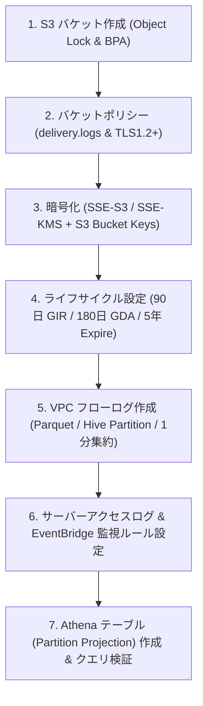

- [ ] **S3 バケット**: Object Lock が作成時に有効化されているか。
- [ ] **パブリックアクセス**: 4つのブロック設定がすべて `true` になっているか。
- [ ] **アクセス制御**: `delivery.logs.amazonaws.com` の `aws:SourceAccount` 条件が含まれているか。
- [ ] **通信暗号化**: `aws:SecureTransport: false` に対する明示的 Deny が設定されているか。
- [ ] **保管時暗号化**: SSE-S3 または SSE-KMS + S3 Bucket Keys が有効化されているか。
- [ ] **ライフサイクル**: 90日 Glacier IR、180日 Glacier Deep Archive、1825日 Expire が設定されているか。
- [ ] **ログフォーマット**: Parquet 形式、Hive 互換パーティション、時間単位パーティションが有効になっているか。
- [ ] **監査・監視**: CloudTrail 管理イベント、S3 サーバーアクセスログ、EventBridge 削除検知アラートが稼働しているか。
- [ ] **Athena 分析**: パーティションプロジェクション対応 DDL でテーブルが定義され、クエリが正常に実行できるか。
