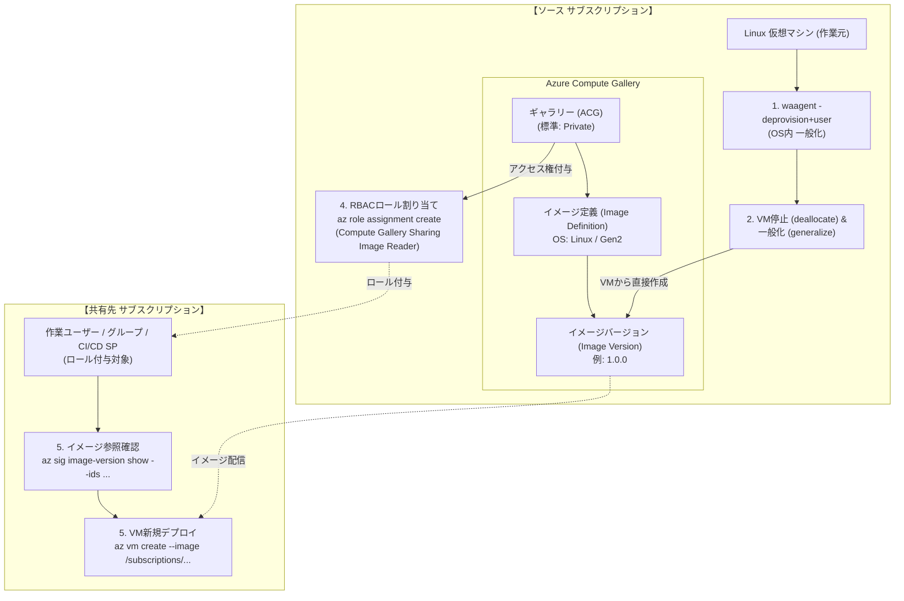

# AZURE：仮想マシンのイメージ化：Linux編 (Azure Compute Gallery & RBAC共有)

同一テナント内の複数サブスクリプション間で仮想マシン（VM）のカスタムイメージを安全・確実に共有する場合、一般提供（GA）されている標準機能である **「Azure Compute Gallery (ACG) ＋ RBAC（ロールベースアクセス制御）」** を利用するのが最も安定した推奨ベストプラクティスです。

直接共有（Direct Sharing / `az sig share add`）で必要な `Microsoft.Compute/SIGSharing` 機能はプレビュー段階であり、Microsoftへの利用申請承認待ち（PENDING状態）が発生することがあります。一方、**本ドキュメントで解説する「RBAC共有方式」はプレビュー申請が一切不要で、今すぐ本番環境を含めて即座に利用可能**です。

---

## 全体アーキテクチャ & ワークフロー



---

## 共有方式の比較: 「RBAC共有」 vs 「直接共有 (Direct Sharing)」

| 比較項目 | RBAC共有 (`az role assignment`) ★推奨 (GA標準) | 直接共有 (`az sig share add`) (プレビュー) |
| :--- | :--- | :--- |
| **プレビュー申請** | **不要（一般提供機能、今すぐ利用可能）** | **必要**（`SIGSharing` 機能の登録申請・承認待ち） |
| **共有単位** | **ユーザー、グループ、サービスプリンシパル (SP)** | サブスクリプション全体 または テナント全体 |
| **事前設定** | 不要（ギャラリーのデフォルト `Private` のまま利用可能） | ギャラリー作成時に `--permissions Groups` が必須 |
| **権限管理** | ロール割り当て（最小権限の原則を適用可能） | サブスクリプションID単位の一括許可 |
| **付与ロール** | `Compute Gallery Sharing Image Reader` または `Reader` | 個別ロール不要（サブスクリプション全体で共有） |
| **デプロイ時の参照パス** | 完全修飾リソースID (`/subscriptions/<ソースSubID>/...`) | 共有パス (`/SharedGalleries/<UniqueId>/...`) |
| **主なユースケース** | **プレビュー申請を待たずに即時共有したい場合**、特定の開発グループやCI/CDパイプラインのみに限定して配布したい場合 | 組織内の特定サブスクリプション全体に対して、ユーザー管理不要でイメージを一括公開したい場合 |

---

## 事前準備：パラメータシート

作業を実施する前に、以下の設計パラメータをあらかじめ検討・決定しておきます。後続のコマンド例では、このシートの値を変数として使用します（Windows PowerShell環境での実行を前提とします）。

| 分類 | 変数名 / 引数名 | 必須 | 解説および決定時の留意点 | 設定値の例 | 該当ステップ |
| :--- | :--- | :---: | :--- | :--- | :---: |
| **ソース環境** | `$SOURCE_SUB_ID` | ○ | イメージ作成元VMおよびギャラリーが存在するサブスクリプションID。 | `00000000-1111-2222-3333-444444444444` | ステップ 4, 5 |
| | `$SOURCE_RG` | ○ | イメージ作成元VMおよびギャラリーを配置するリソースグループ名。 | `rg-image-source` | ステップ 2, 3, 4, 5 |
| | `$VM_NAME` | ○ | イメージの元となる既存Linux仮想マシン名（作業対象）。 | `vm-source-linux` | ステップ 2, 3 |
| | `$LOCATION` | ○ | ソースVMが存在し、ギャラリーのプライマリリソースを作成するリージョン名。 | `japaneast` (東日本) | ステップ 2, 3, 5 |
| **ギャラリー設計** | `$GALLERY_NAME` | ○ | Azure Compute Gallery名（英数字・アンダースコア・ピリオド使用可、最大80文字）。 | `gal_shared_linux` | ステップ 3, 4, 5 |
| **イメージ定義** | `$IMAGE_DEF_NAME` | ○ | ギャラリー内でイメージの仕様を論理的にまとめる定義名（英数字・ハイフン・ピリオド）。 | `Ubuntu2204-GoldenImage` | ステップ 3, 5 |
| | `--publisher` | ○ | 発行組織や部門名。社名やチーム名などを指定。 | `MyCompany` | ステップ 3 |
| | `--offer` | ○ | イメージの製品名やOSディストリビューション名。 | `UbuntuServer` | ステップ 3 |
| | `--sku` | ○ | OSのバージョンやエディションなどの詳細識別子。 | `22_04-lts` | ステップ 3 |
| | `--os-type` | ○ | OSの種類（`Linux` または `Windows`）。 | `Linux` | ステップ 3 |
| | `--os-state` | ○ | OSの状態。一般化済みVMから作成する場合は `Generalized` を指定。 | `Generalized` | ステップ 3 |
| | `--hyper-v-generation` | ○ | VMの世代（`V1` または `V2`）。ソースVMの世代と必ず一致させる必要があります。 | `V2` | ステップ 3 |
| **イメージバージョン** | `$IMAGE_VERSION` | ○ | 作成するイメージのバージョン番号（`メジャー.マイナー.パッチ` 形式の3桁整数）。 | `1.0.0` | ステップ 3, 5 |
| | `--target-regions` | 任意 | レプリケーション先リージョン、レプリカ数、ストレージアカウントタイプ。 | `japaneast=1=Standard_LRS japanwest=1=Standard_LRS` | ステップ 3 |
| **RBAC権限設定** | `$ASSIGNEE` | ○ | 共有先でVM作成を行うユーザーのUPN（メールアドレス）、グループID、またはSPオブジェクトID。 | `dev-user@example.com` | ステップ 4 |
| | `--role` | ○ | 付与するRBACロール名。共有イメージ利用に最適な最小権限ロールを指定。 | `Compute Gallery Sharing Image Reader` | ステップ 4 |
| **共有先デプロイ** | `$TARGET_SUB_ID` | ○ | 新しくVMをデプロイする共有先サブスクリプションID。 | `11111111-2222-3333-4444-555555555555` | ステップ 5 |
| | `$TARGET_RG` | ○ | 共有先サブスクリプションで新しくVMを配置するリソースグループ名。 | `rg-production` | ステップ 5 |
| | `$NEW_VM_NAME` | ○ | 共有イメージから新しくプロビジョニングする仮想マシン名。 | `vm-app-from-shared-image` | ステップ 5 |
| | `--size` | ○ | 新規作成するVMのインスタンスサイズ（スペック要件に合わせて選定）。 | `Standard_D2s_v5` | ステップ 5 |
| | `--admin-username` | ○ | 新規Linux VMの管理者ユーザー名（初期ログインアカウント）。 | `azureuser` | ステップ 5 |

---

## ステップ 1: 仮想マシン内のプロビジョニング解除（一般化準備）

イメージ化を行うLinux VMにSSHログインし、ユーザー固有の情報、SSHホストキー、ネットワークキャッシュ等を消去して一般化（Generalize）します（※本ステップは対象Linux VM内部のシェルで実行します）。

> [!CAUTION]
> **取り消し不可能な操作です**  
> `waagent -deprovision+user -force` を実行すると、現在ログインしているユーザーアカウントや資格情報が即座に削除され、SSHセッションが切断されます。**以降、このVMには二度とログインできません**。  
> ※作業前に必ずAzure PortalやCLIから**OSディスクのスナップショット**を取得しておくことを強く推奨します。

```bash
# 個別ユーザー情報・資格情報・一時ファイルを削除してプロビジョニングを解除
sudo waagent -deprovision+user -force
exit
```

---

## ステップ 2: 仮想マシンの停止・割り当て解除と一般化

Windows端末のPowerShellプロンプトからAzure CLIを実行し、VMを確実に停止・割り当て解除して、Azure基盤側で「一般化済み」ステータスに変更します。

```powershell
# パラメータ設定（パラメータシートの値を設定）
$SOURCE_RG = "rg-image-source"
$VM_NAME = "vm-source-linux"
$LOCATION = "japaneast"

# 1. 仮想マシンの停止と割り当て解除 (deallocate)
az vm deallocate `
  --resource-group $SOURCE_RG `
  --name $VM_NAME

# 2. 仮想マシンを一般化 (generalize)
az vm generalize `
  --resource-group $SOURCE_RG `
  --name $VM_NAME
```

---

## ステップ 3: Azure Compute Gallery とイメージリソースの作成

Azure Compute Gallery では以下の3層構造でイメージを管理します：
1. **ギャラリー (Gallery)**: 共有設定やレプリケーション設定を持つコンテナ
2. **イメージ定義 (Image Definition)**: OS種類、世代 (Gen1/Gen2)、パブリッシャー情報等のメタデータ
3. **イメージバージョン (Image Version)**: 実際の仮想ハードディスク（VHD）のスナップショット

> [!TIP]
> **プロのベストプラクティス**  
> 従来の `az image create` による中間マネージドイメージの作成は**不要**です。停止・一般化した仮想マシン（VM）のリソースIDを直接指定してイメージバージョンを作成できます。また、RBAC共有ではプレビュー機能（`SIGSharing`）の登録は不要です。

### 1. ギャラリーの作成
RBAC共有では `--permissions Groups` の指定は不要です（標準のPrivate設定で作成します）。

```powershell
$GALLERY_NAME = "gal_shared_linux"

# ギャラリーを作成（標準構成）
az sig create `
  --resource-group $SOURCE_RG `
  --gallery-name $GALLERY_NAME `
  --location $LOCATION
```

### 2. イメージ定義の作成
OSの仕様（Linux、一般化済み、第2世代VMなど）を定義します。

```powershell
$IMAGE_DEF_NAME = "Ubuntu2204-GoldenImage"

az sig image-definition create `
  --resource-group $SOURCE_RG `
  --gallery-name $GALLERY_NAME `
  --gallery-image-definition $IMAGE_DEF_NAME `
  --publisher "MyCompany" `
  --offer "UbuntuServer" `
  --sku "22_04-lts" `
  --os-type Linux `
  --os-state Generalized `
  --hyper-v-generation V2 `
  --location $LOCATION
```

### 3. イメージバージョンの作成 (VMから直接作成)
停止・一般化したVMから直接イメージバージョン（例: `1.0.0`）を作成します。必要に応じて東日本・西日本などへの複数リージョンレプリケーションも同時に設定可能です。

```powershell
$IMAGE_VERSION = "1.0.0"

# VMのリソースIDを取得
$VM_ID = az vm show --resource-group $SOURCE_RG --name $VM_NAME --query id -o tsv

# イメージバージョンを作成 (japaneast, japanwest に分散配置する場合)
az sig image-version create `
  --resource-group $SOURCE_RG `
  --gallery-name $GALLERY_NAME `
  --gallery-image-definition $IMAGE_DEF_NAME `
  --gallery-image-version $IMAGE_VERSION `
  --managed-image $VM_ID `
  --target-regions "${LOCATION}=1=Standard_LRS" "japanwest=1=Standard_LRS"
```

---

## ステップ 4: RBACロールの割り当て（共有権限の付与）

共有先サブスクリプションで作業を行う担当者（ユーザー）、チーム（Microsoft Entra ID グループ）、またはCI/CDパイプライン（サービスプリンシパル）に対して、ギャラリーへの読み取り権限を付与します。

### 1. 推奨ロール: `Compute Gallery Sharing Image Reader`
Azure には Compute Gallery からのイメージ読み取りおよびVM作成に特化した組み込みロール **`Compute Gallery Sharing Image Reader`** が用意されています。
これにより、不要なリソース情報へのアクセスを遮断し、**最小権限の原則（PoLP）** に則った運用が可能です（※一般的な `Reader（閲覧者）` ロールでも利用可能です）。

### 2. ロール割り当ての実行

```powershell
$SOURCE_SUB_ID = "00000000-1111-2222-3333-444444444444"
$ASSIGNEE = "dev-user@example.com"  # ユーザーUPN、グループID、またはSPオブジェクトID

# ギャラリーのリソースIDを取得
$GALLERY_ID = az sig show `
  --resource-group $SOURCE_RG `
  --gallery-name $GALLERY_NAME `
  --query id -o tsv

# ギャラリーに対して共有イメージ閲覧者ロールを付与
az role assignment create `
  --assignee $ASSIGNEE `
  --role "Compute Gallery Sharing Image Reader" `
  --scope $GALLERY_ID
```

> [!NOTE]
> - **グループ単位での付与推奨**: 個別のユーザーアカウントに割り当てるのではなく、Microsoft Entra ID（旧Azure AD）のセキュリティグループに対してロールを割り当てておくと、将来的なメンバー追加・削除時にAzureリソース側の再設定が不要になります。
> - **スコープの範囲**: ギャラリー単位 (`$GALLERY_ID`) だけでなく、特定イメージ定義単位や、リソースグループ単位 (`/subscriptions/$SOURCE_SUB_ID/resourceGroups/$SOURCE_RG`) で付与することも可能です。

### 3. 権限付与状態の確認
割り当てられたロールが正しく登録されているか確認します。

```powershell
az role assignment list `
  --scope $GALLERY_ID `
  --output table
```

### 4. (参考) 共有権限の解除手順
共有を終了したい場合は、割り当てたロールを削除します。

```powershell
az role assignment delete `
  --assignee $ASSIGNEE `
  --role "Compute Gallery Sharing Image Reader" `
  --scope $GALLERY_ID
```

---

## ステップ 5: 共有先サブスクリプションでのVM作成

権限を付与されたユーザー／サービスプリンシパルでAzureにログインし、共有先サブスクリプションにおいて共有元の完全修飾リソースID（Full Resource ID）を指定してVMを作成します。

### 1. 共有先サブスクリプションへコンテキスト切り替え
```powershell
$TARGET_SUB_ID = "11111111-2222-3333-4444-555555555555"

az account set --subscription $TARGET_SUB_ID
```

### 2. 共有元イメージバージョンのアクセス確認
共有元のイメージバージョンが正常に参照できるか確認します。

```powershell
# 共有元イメージバージョンの完全修飾リソースIDを組み立て
$IMAGE_ID = "/subscriptions/$SOURCE_SUB_ID/resourceGroups/$SOURCE_RG/providers/Microsoft.Compute/galleries/$GALLERY_NAME/images/$IMAGE_DEF_NAME/versions/$IMAGE_VERSION"

# イメージバージョン情報の取得（アクセス権があれば詳細が表示されます）
az sig image-version show --ids $IMAGE_ID --output table
```

### 3. 仮想マシンのデプロイ
`--image` パラメータに完全修飾リソースIDを指定してVMを作成します。

```powershell
$TARGET_RG = "rg-production"
$NEW_VM_NAME = "vm-app-from-shared-image"

az vm create `
  --resource-group $TARGET_RG `
  --name $NEW_VM_NAME `
  --location $LOCATION `
  --image $IMAGE_ID `
  --admin-username azureuser `
  --generate-ssh-keys `
  --size Standard_D2s_v5
```

> [!TIP]
> - **最新バージョンの自動デプロイ**: バージョン番号 `1.0.0` の代わりに `latest` を指定すると、ギャラリー内で公開されている最新イメージバージョンが自動的に適用されます。
>   - `$IMAGE_ID_LATEST = "/subscriptions/$SOURCE_SUB_ID/resourceGroups/$SOURCE_RG/providers/Microsoft.Compute/galleries/$GALLERY_NAME/images/$IMAGE_DEF_NAME/versions/latest"`
>   - `az vm create ... --image $IMAGE_ID_LATEST`

---

## Azure プロフェッショナルの運用 Tips & ベストプラクティス

1. **`Compute Gallery Sharing Image Reader` の積極活用**
   - 従来の `Reader（閲覧者）` ロールはリソースグループやギャラリー内のメタデータ全般を広く閲覧できますが、VM作成に必要な最小権限に絞り込みたい場合は、ACG専用の組み込みロール `Compute Gallery Sharing Image Reader` を使用するのがセキュリティ監査上のベストプラクティスです。
2. **Microsoft Entra ID グループによるアクセス一元管理**
   - 個別のユーザーや開発者アカウントに直接ロールを付与するのではなく、「`grp-golden-image-users`」のようなセキュリティグループを作成し、そのグループに対してロールを付与します。メンバーの異動や退職時の権限管理がEntra ID側で完結し、運用負荷を大幅に削減できます。
3. **Hyper-V Generation (世代) の整合性**
   - 現在のAzure VMの主流は **Generation 2 (V2)** です。UEFIブートや大容量OSディスク、高速プロビジョニングに対応しています。イメージ定義の `--hyper-v-generation` はソースVMの世代と必ず一致させてください。
4. **クロスリージョンレプリケーションによる高可用性**
   - 本番環境で複数リージョン（例: 東日本と西日本）にVMを展開する場合、イメージバージョン作成時に `--target-regions` で両リージョンを指定します。これにより、同一リージョン内で高速にVMが作成され、リージョン間のネットワーク帯域コストやデプロイ遅延を防ぐことができます。
5. **ストレージアカウントタイプとコスト最適化**
   - `--target-regions` では、レプリカ数とストレージ層（`Standard_LRS` または `Premium_LRS`、ゾーン冗長の場合は `Standard_ZRS`）を指定できます。
   - 普段デプロイ頻度が低いイメージは `Standard_LRS` で保管し、大規模なスケールアウトが頻繁に発生する環境では `Standard_ZRS` や `Premium_LRS` を選択するのがコスト・パフォーマンスの最適解です。
6. **ソースVMの後始末**
   - 一般化（Generalize）したソースVMは、Azureの仕様上**二度と起動（Start）できません**。
   - 不要になったソースVMはリソース削除を行い、必要であればバックアップ（OSスナップショット）のみ保持することで、無駄なリソース残留を防止します。
