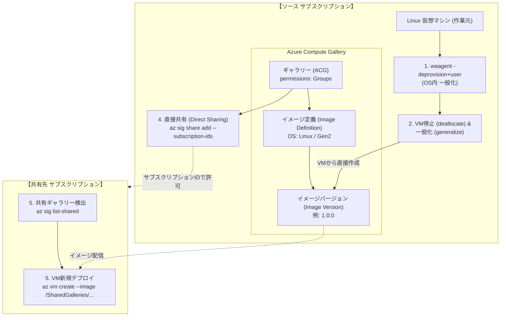
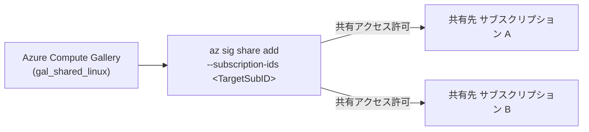

# AZURE：仮想マシンのイメージ化：Linux編 (Azure Compute Gallery & 直接共有)

同一テナント内（または複数サブスクリプション間）で仮想マシン（VM）のカスタムイメージを安全・効率的に共有する場合、従来のマネージドイメージ（`az image create`）ではなく、**「Azure Compute Gallery (ACG / 旧称: 共有イメージギャラリー)」**を使用するのが Microsoft 推奨のベストプラクティスです。

Azure Compute Gallery では、従来の **RBAC（ロールベースアクセス制御）** による共有に加え、**`az sig share add` コマンドを用いた「直接共有 (Direct Sharing / Groups)」** により、特定のサブスクリプションIDやテナントIDを指定してギャラリー全体を一括共有できます。

---

## 全体アーキテクチャ & ワークフロー



---

## 共有方式の比較: 「直接共有 (Direct Sharing)」 vs 「RBAC共有」

| 比較項目 | 直接共有 (`az sig share add`) ★推奨 | RBAC共有 (`az role assignment`) |
| :--- | :--- | :--- |
| **共有単位** | **サブスクリプション単位** または **テナント単位** | ユーザー、グループ、サービスプリンシパル (SP) |
| **事前設定** | ギャラリーの `sharing-permission` を `Groups` に設定 | 不要（デフォルトの `Private` のまま利用可能） |
| **権限管理** | サブスクリプションIDを登録するだけ（個別ユーザー管理不要） | 利用する個別IDに対して「閲覧者 (Reader)」等を付与 |
| **共有先での参照パス** | `/SharedGalleries/<UniqueId>/Images/...` | `/subscriptions/<ソースSubID>/.../galleries/...` |
| **テナント間共有** | 対応可能（別テナントのIDを指定して共有） | ゲスト招待 (B2B) やマルチテナントアプリ連携が必要 |
| **主なユースケース** | 開発・本番・共通インフラなど**組織内の複数サブスクリプション全体でイメージを標準化・共有**したい場合 | 特定の管理者やCI/CDパイプラインSPのみにアクセスを限定したい場合 |

---

## 事前準備：パラメータシート

作業を実施する前に、以下の設計パラメータをあらかじめ検討・決定しておきます。後続のコマンド例では、このシートの値を変数として使用します（Windows PowerShell環境での実行を前提とします）。

| 分類 | 変数名 / 引数名 | 必須 | 解説および決定時の留意点 | 設定値の例 | 該当ステップ |
| :--- | :--- | :---: | :--- | :--- | :---: |
| **ソース環境** | `$SOURCE_RG` | ○ | イメージ作成元VMおよびギャラリーを配置するリソースグループ名。 | `rg-image-source` | ステップ 2, 3, 4 |
| | `$VM_NAME` | ○ | イメージの元となる既存Linux仮想マシン名（作業対象）。 | `vm-source-linux` | ステップ 2, 3 |
| | `$LOCATION` | ○ | ソースVMが存在し、ギャラリーのプライマリリソースを作成するリージョン名。 | `japaneast` (東日本) | ステップ 2, 3, 5 |
| **ギャラリー設計** | `$GALLERY_NAME` | ○ | Azure Compute Gallery名（英数字・アンダースコア・ピリオド使用可、最大80文字）。 | `gal_shared_linux` | ステップ 3, 4 |
| | `--permissions` | ○ | ギャラリーの共有権限。直接共有（`az sig share add`）を行う場合は `Groups` が必須。 | `Groups` | ステップ 3 |
| **イメージ定義** | `$IMAGE_DEF_NAME` | ○ | ギャラリー内でイメージの仕様を論理的にまとめる定義名（英数字・ハイフン・ピリオド）。 | `Ubuntu2204-GoldenImage` | ステップ 3, 5 |
| | `--publisher` | ○ | 発行組織や部門名。社名やチーム名などを指定。 | `MyCompany` | ステップ 3 |
| | `--offer` | ○ | イメージの製品名やOSディストリビューション名。 | `UbuntuServer` | ステップ 3 |
| | `--sku` | ○ | OSのバージョンやエディションなどの詳細識別子。 | `22_04-lts` | ステップ 3 |
| | `--os-type` | ○ | OSの種類（`Linux` または `Windows`）。 | `Linux` | ステップ 3 |
| | `--os-state` | ○ | OSの状態。一般化済みVMから作成する場合は `Generalized` を指定。 | `Generalized` | ステップ 3 |
| | `--hyper-v-generation` | ○ | VMの世代（`V1` または `V2`）。ソースVMの世代と必ず一致させる必要があります。 | `V2` | ステップ 3 |
| **イメージバージョン** | `$IMAGE_VERSION` | ○ | 作成するイメージのバージョン番号（`メジャー.マイナー.パッチ` 形式の3桁整数）。 | `1.0.0` | ステップ 3, 5 |
| | `--virtual-machine` | ○ | イメージのソースとなる一般化済み仮想マシンの完全修飾リソースID。 | `/subscriptions/.../virtualMachines/vm-source-linux` | ステップ 3 |
| | `--target-regions` | 任意 | レプリケーション先リージョン、レプリカ数、ストレージアカウントタイプ（単一リージョン配置なら `--location` で代替可）。 | `japaneast=1=Standard_LRS japanwest=1=Standard_LRS` | ステップ 3 |
| **共有設定** | `$TARGET_SUB_ID` | ○ | ギャラリーを共有・公開する先のサブスクリプションID（UUID形式）。 | `11111111-2222-3333-4444-555555555555` | ステップ 4, 5 |
| **共有先デプロイ** | `$GALLERY_UNIQUE_ID` | ○ | 共有先で `az sig list-shared` を実行した際にシステムから返却される一意な識別子。 | `gal_shared_linux-a1b2c3d4-e5f6-7890-1234-56789abcdef0` | ステップ 5 |
| | `$TARGET_RG` | ○ | 共有先サブスクリプションで新しくVMを配置するリソースグループ名。 | `rg-production` | ステップ 5 |
| | `$NEW_VM_NAME` | ○ | 共有イメージから新しくプロビジョニングする仮想マシン名。 | `vm-app-from-shared-image` | ステップ 5 |
| | `--size` | ○ | 新規作成するVMのインスタンスサイズ（スペック要件に合わせて選定）。 | `Standard_D2s_v5` | ステップ 5 |
| | `--admin-username` | ○ | 新規Linux VMの管理者ユーザー名（初期ログインアカウント）。 | `azureuser` | ステップ 5 |

---

## ステップ 1: 仮想マシン内のプロビジョニング解除（一般化準備）

イメージ化を行うLinux VMにSSHログインし、ユーザー固有の情報、SSHホストキー、ネットワークキャッシュ等を消去して一般化（Generalize）します（※本ステップは対象Linux VM内部のシェルで実行します）。

> [!CAUTION]
> **取り消し不可能な操作です**  
> `waagent -deprovision+user -force` を実行すると、現在ログインしているユーザーアカウントや資格情報が即座に削除され、SSHセッションが切断されます。**以降、このVMには二度とログインできません**。  
> ※作業前に必ずAzure PortalやCLIから**OSディスクのスナップショット**を取得しておくことを強く推奨します。

```bash
# 個別ユーザー情報・資格情報・一時ファイルを削除してプロビジョニングを解除
sudo waagent -deprovision+user -force
exit
```

---

## ステップ 2: 仮想マシンの停止・割り当て解除と一般化

Windows端末のPowerShellプロンプトからAzure CLIを実行し、VMを確実に停止・割り当て解除して、Azure基盤側で「一般化済み」ステータスに変更します。

```powershell
# パラメータ設定（パラメータシートの値を設定）
$SOURCE_RG = "rg-image-source"
$VM_NAME = "vm-source-linux"
$LOCATION = "japaneast"

# 1. 仮想マシンの停止と割り当て解除 (deallocate)
az vm deallocate `
  --resource-group $SOURCE_RG `
  --name $VM_NAME

# 2. 仮想マシンを一般化 (generalize)
az vm generalize `
  --resource-group $SOURCE_RG `
  --name $VM_NAME
```

---

## ステップ 3: Azure Compute Gallery とイメージリソースの作成

Azure Compute Gallery では以下の3層構造でイメージを管理します：
1. **ギャラリー (Gallery)**: 共有設定やレプリケーション設定を持つコンテナ
2. **イメージ定義 (Image Definition)**: OS種類、世代 (Gen1/Gen2)、パブリッシャー情報等のメタデータ
3. **イメージバージョン (Image Version)**: 実際の仮想ハードディスク（VHD）のスナップショット

> [!TIP]
> **プロのベストプラクティス**  
> 従来の `az image create` による中間マネージドイメージの作成は**不要**です。停止・一般化した仮想マシン（VM）のリソースIDを直接指定してイメージバージョンを作成できます。これにより、不要なリソース管理の手間とストレージコストを削減できます。

### 1. 事前準備: SIGSharing 機能の登録と確認
直接共有（`--permissions Groups`）を利用するには、サブスクリプションで `Microsoft.Compute` リソースプロバイダーの `SIGSharing` 機能が登録されている必要があります。未登録のままギャラリーを作成しようとすると、`Subscription <Subscription-ID> is not registered for feature Microsoft.Compute/SIGSharing` というエラーが発生します。

```powershell
# 1. SIGSharing 機能の登録申請
az feature register --namespace Microsoft.Compute --name SIGSharing

# 2. 登録状態の確認 (RegistrationState が "Registered" になるまで確認)
az feature show --namespace Microsoft.Compute --name SIGSharing --query "properties.state" -o tsv

# 3. 状態が "Registered" になったら、プロバイダーを再登録してサブスクリプションに設定を反映
az provider register --namespace Microsoft.Compute
```

> [!NOTE]
> `az feature register` の登録処理はバックグラウンドで行われます。状態が `Pending` から `Registered` に変わるのを確認してから、必ず `az provider register` を実行してください。

> [!NOTE]
> ※現在、プレビュー機能のため、フォーム申請が必要（https://forms.cloud.microsoft/pages/responsepage.aspx?id=v4j5cvGGr0GRqy180BHbR_mNBWuIdjREixU93yX0U7tUMjRSNVRJT05VSlkyUzUyRTFBOTc5R0E1My4u&route=shorturl）

### 2. ギャラリーの作成 (`--permissions Groups` を指定)
直接共有 (`az sig share add`) を利用するため、`--permissions Groups` を指定して作成します。

```powershell
$GALLERY_NAME = "gal_shared_linux"

# 直接共有(Groups)を有効化したギャラリーを作成
az sig create `
  --resource-group $SOURCE_RG `
  --gallery-name $GALLERY_NAME `
  --location $LOCATION `
  --permissions Groups
```
*(※既存のギャラリーがある場合は、`az sig update -g $SOURCE_RG -r $GALLERY_NAME --permissions Groups` で後から変更可能です)*

### 3. イメージ定義の作成
OSの仕様（Linux、一般化済み、第2世代VMなど）を定義します。

```powershell
$IMAGE_DEF_NAME = "Ubuntu2204-GoldenImage"

az sig image-definition create `
  --resource-group $SOURCE_RG `
  --gallery-name $GALLERY_NAME `
  --gallery-image-definition $IMAGE_DEF_NAME `
  --publisher "MyCompany" `
  --offer "UbuntuServer" `
  --sku "22_04-lts" `
  --os-type Linux `
  --os-state Generalized `
  --hyper-v-generation V2 `
  --location $LOCATION
```

### 4. イメージバージョンの作成 (VMから直接作成)
停止・一般化したVMから直接イメージバージョン（例: `1.0.0`）を作成します。ソースVMのリソースIDを指定する際は **`--virtual-machine`** を使用します（※ `--managed-image` はマネージドイメージ用のためVM IDを指定するとエラーになります）。

```powershell
$IMAGE_VERSION = "1.0.0"

# VMのリソースIDを取得
$VM_ID = az vm show --resource-group $SOURCE_RG --name $VM_NAME --query id -o tsv

# 【パターンA】単一リージョン（ソースVMと同じリージョン）に作成する場合（推奨・シンプル）
az sig image-version create `
  --resource-group $SOURCE_RG `
  --gallery-name $GALLERY_NAME `
  --gallery-image-definition $IMAGE_DEF_NAME `
  --gallery-image-version $IMAGE_VERSION `
  --virtual-machine $VM_ID `
  --location $LOCATION

# 【パターンB】複数リージョン（japaneast, japanwest等）にレプリケーション配置する場合
az sig image-version create `
  --resource-group $SOURCE_RG `
  --gallery-name $GALLERY_NAME `
  --gallery-image-definition $IMAGE_DEF_NAME `
  --gallery-image-version $IMAGE_VERSION `
  --virtual-machine $VM_ID `
  --target-regions "${LOCATION}=1=Standard_LRS" "japanwest=1=Standard_LRS"
```

---

## ステップ 4: `az sig share add` を使った直接サブスクリプション共有

サブスクリプションIDを直接指定して、ギャラリー全体を共有先サブスクリプションへ公開します。



### 1. サブスクリプションIDを指定して直接共有を実行
`--subscription-ids` に共有先となるサブスクリプションのIDを指定します（複数指定可能）。

```powershell
$TARGET_SUB_ID = "11111111-2222-3333-4444-555555555555"

# 共有先サブスクリプションを追加
az sig share add `
  --resource-group $SOURCE_RG `
  --gallery-name $GALLERY_NAME `
  --subscription-ids $TARGET_SUB_ID
```
*(※別テナントへ共有したい場合は、`--tenant-ids <テナントID>` を指定して共有することも可能です)*

### 2. 共有状態の確認
ギャラリーの共有プロファイルを確認し、対象サブスクリプションが登録されているか検証します。

```powershell
# 共有プロファイルと共有先リストの確認
az sig show `
  --resource-group $SOURCE_RG `
  --gallery-name $GALLERY_NAME `
  --query "sharingProfile" `
  --output json
```

### 3. (参考) 共有の解除手順
共有を取り消したい場合は、以下のコマンドを使用します。

```powershell
# 特定のサブスクリプションの共有を解除
az sig share remove `
  --resource-group $SOURCE_RG `
  --gallery-name $GALLERY_NAME `
  --subscription-ids $TARGET_SUB_ID

# 直接共有を完全にリセットして非公開 (Private) に戻す
az sig share reset `
  --resource-group $SOURCE_RG `
  --gallery-name $GALLERY_NAME
```

---

## ステップ 5: 共有先サブスクリプションでのVM作成

共有先のサブスクリプションでは、共有されたギャラリーの一意な名前（Unique ID）を取得し、`/SharedGalleries/...` 形式のパスを指定してVMをプロビジョニングします。

### 1. 共有先サブスクリプションへコンテキスト切り替え
```powershell
az account set --subscription $TARGET_SUB_ID
```

### 2. 共有されたギャラリーの検出
共有されたギャラリーの一覧を取得し、`uniqueId` を確認します。

```powershell
# 共有されているギャラリーを検索
az sig list-shared `
  --location $LOCATION `
  --output table

# 出力例:
# Name              UniqueId                                              Location
# ----------------  ----------------------------------------------------  ---------
# gal_shared_linux  gal_shared_linux-a1b2c3d4-e5f6-7890-1234-56789abcdef0  japaneast
```

### 3. 共有ギャラリー内のイメージ定義を確認
```powershell
$GALLERY_UNIQUE_ID = "gal_shared_linux-a1b2c3d4-e5f6-7890-1234-56789abcdef0"

az sig image-definition list-shared `
  --gallery-unique-name $GALLERY_UNIQUE_ID `
  --location $LOCATION `
  --output table
```

### 4. 仮想マシンのデプロイ
`--image` パラメータに直接共有パス `/SharedGalleries/<UniqueId>/Images/<ImageDef>/Versions/<Version>` を指定してVMを作成します。

```powershell
$TARGET_RG = "rg-production"
$NEW_VM_NAME = "vm-app-from-shared-image"

az vm create `
  --resource-group $TARGET_RG `
  --name $NEW_VM_NAME `
  --location $LOCATION `
  --image "/SharedGalleries/$GALLERY_UNIQUE_ID/Images/$IMAGE_DEF_NAME/Versions/1.0.0" `
  --admin-username azureuser `
  --generate-ssh-keys `
  --size Standard_D2s_v5
```

> [!TIP]
> - **最新バージョンの自動デプロイ**: バージョン番号 `1.0.0` の代わりに `latest` を指定すると、ギャラリー内で公開されている最新イメージバージョンが自動的に適用されます。
>   - `--image "/SharedGalleries/$GALLERY_UNIQUE_ID/Images/$IMAGE_DEF_NAME/Versions/latest"`
> - **同一テナント内の完全修飾リソースID指定**: 同一テナント内であれば、ソース側のリソースID (`/subscriptions/<ソースSubID>/resourceGroups/...`) をそのまま指定して作成することも可能です。

---

## Azure プロフェッショナルの運用 Tips & ベストプラクティス

1. **Hyper-V Generation (世代) の整合性**
   - 現在のAzure VMの主流は **Generation 2 (V2)** です。UEFIブートや大容量OSディスク、高速プロビジョニングに対応しています。イメージ定義の `--hyper-v-generation` はソースVMの世代と必ず一致させてください。
2. **クロスリージョンレプリケーションによる高可用性**
   - 本番環境で複数リージョン（例: 東日本と西日本）にVMを展開する場合、イメージバージョン作成時に `--target-regions` で両リージョンを指定します。これにより、同一リージョン内で高速にVMが作成され、リージョン間のネットワーク帯域コストやデプロイ遅延を防ぐことができます。
3. **ストレージアカウントタイプとコスト最適化**
   - `--target-regions` では、レプリカ数とストレージ層（`Standard_LRS` または `Premium_LRS`、ゾーン冗長の場合は `Standard_ZRS`）を指定できます。
   - 普段デプロイ頻度が低いイメージは `Standard_LRS` で保管し、大規模なスケールアウトが頻繁に発生する環境では `Standard_ZRS` や `Premium_LRS` を選択するのがコスト・パフォーマンスの最適解です。
4. **ソースVMの後始末**
   - 一般化（Generalize）したソースVMは、Azureの仕様上**二度と起動（Start）できません**。
   - 不要になったソースVMはリソース削除を行い、必要であればバックアップ（OSスナップショット）のみ保持することで、無駄なリソース残留を防止します。
