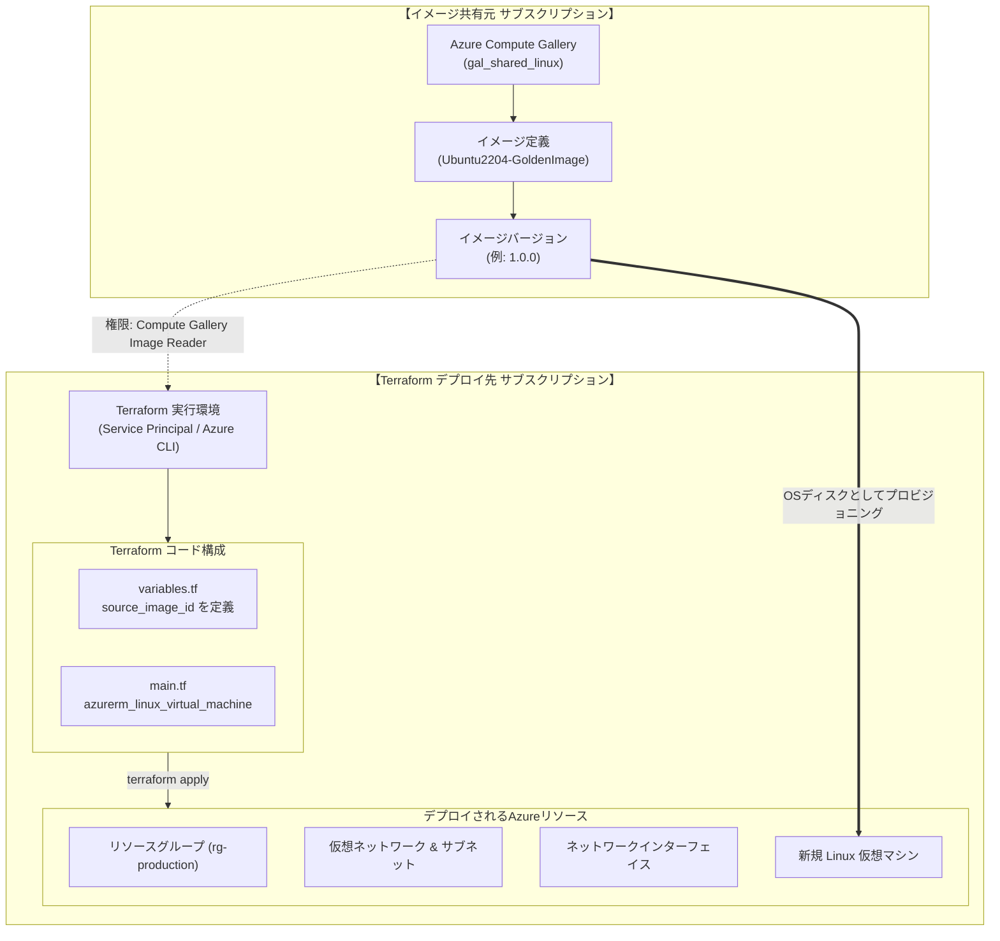

# AZURE：仮想マシンの作成：terraform（共有イメージ）編

Azure Compute Gallery (ACG) で一元管理・共有されているカスタムイメージ（ゴールデンイメージ）をもとに、**Terraform (`azurerm` プロバイダー)** を使用してLinux仮想マシンを自動構築・プロビジョニングする完全ガイドです。

通常のAzure Marketplaceパブリックイメージ（UbuntuやRHEL等）をTerraformで展開する場合と、共有カスタムイメージを展開する場合では、**イメージ指定の構文定義が根本的に異なります**。本ドキュメントでは、その違いと注意点、実務でそのまま利用できるコード構成を体系的に解説します。

---

## 全体アーキテクチャ & デプロイフロー



---

## 通常のMarketplaceイメージと共有イメージの指定方法の比較

Terraform の `azurerm_linux_virtual_machine`（または `azurerm_windows_virtual_machine`）リソースでは、イメージの指定方法として **2つの排他的なパラメータ** が用意されています。

| 比較項目 | Marketplace パブリックイメージ（通常） | Compute Gallery 共有イメージ（本手順） |
| :--- | :--- | :--- |
| **使用する引数 / ブロック** | **`source_image_reference`** ブロック | **`source_image_id`** 引数 |
| **指定内容** | `publisher`<br/>`offer`<br/>`sku`<br/>`version` | イメージバージョンまたはイメージ定義の<br/>**完全修飾リソースID** |
| **設定例** | ```hcl<br/>source_image_reference {<br/>  publisher = "Canonical"<br/>  offer     = "0001-com-ubuntu-server-jammy"<br/>  sku       = "22_04-lts"<br/>  version   = "latest"<br/>}<br/>``` | ```hcl<br/>source_image_id = "/subscriptions/00000000-.../resourceGroups/.../providers/Microsoft.Compute/galleries/.../images/.../versions/1.0.0"<br/>``` |
| **排他ルール** | `source_image_id` と同時に指定することは**不可**（エラーになります） | `source_image_reference` と同時に指定することは**不可**（エラーになります） |
| **主なユースケース** | OSベンダーが提供する標準初期OSを展開する場合 | 組織内で初期設定・セキュリティパッチ・共通ミドルウェアを導入済みのゴールデンイメージを展開する場合 |

> [!CAUTION]
> **排他設定エラー（`InvalidParameter`）に注意**  
> 共有イメージを利用する際は、既存のテンプレートにある **`source_image_reference` ブロックを完全に削除** し、代わりに **`source_image_id`** を指定してください。両方を同時に記述するとTerraformの検証時またはAzure API側で構文エラーとなります。

---

## 事前準備：パラメータシート

Terraformでデプロイを行う前に、以下の各パラメータを整理・決定しておきます。

| 分類 | 変数名（Terraform） | 必須 | 解説および決定時の留意点 | 設定値の例 |
| :--- | :--- | :---: | :--- | :--- |
| **共有イメージ情報** | `source_image_id` | ○ | 共有元ギャラリーのイメージバージョンの完全修飾リソースID。 | `/subscriptions/00000000-1111-2222-3333-444444444444/resourceGroups/rg-image-source/providers/Microsoft.Compute/galleries/gal_shared_linux/images/Ubuntu2204-GoldenImage/versions/1.0.0` |
| **デプロイ先環境** | `resource_group_name` | ○ | VMやVNetを作成するデプロイ先リソースグループ名。 | `rg-production` |
| | `location` | ○ | リソースを展開するAzureリージョン。 | `japaneast` (東日本) |
| **仮想マシン** | `vm_name` | ○ | 作成するLinux仮想マシン名。 | `vm-app-from-shared-image` |
| | `vm_size` | ○ | 仮想マシンのインスタンスサイズ（スペック）。 | `Standard_D2s_v5` |
| | `admin_username` | ○ | Linux VMの管理者ユーザー名。 | `azureuser` |
| | `ssh_public_key_path` | ○ | 初期ログイン用公開鍵ファイルのローカルパス。 | `~/.ssh/id_rsa.pub` |
| **ネットワーク** | `vnet_name` | ○ | 新規作成する仮想ネットワーク名。 | `vnet-production` |
| | `vnet_address_space` | ○ | VNetのアドレス空間CIDR。 | `["10.0.0.0/16"]` |
| | `subnet_name` | ○ | VMを配置するサブネット名。 | `snet-workload` |
| | `subnet_address_prefix` | ○ | サブネットのアドレスプレフィックス。 | `["10.0.1.0/24"]` |

---

## 推奨プロジェクト構成

実務におけるTerraformプロジェクトでは、関心事ごとにファイルを分割管理するのがベストプラクティスです。

```text
terraform-azure-vm/
├── providers.tf       # Terraform本体・AzureRMプロバイダー定義
├── variables.tf       # 入力変数の宣言
├── terraform.tfvars   # 変数の実値（環境固有設定）
├── main.tf            # ネットワーク・VM等の主リソース定義
└── outputs.tf         # 作成されたリソース情報の出力
```

---

## Terraform コード実装例

### 1. `providers.tf`
AzureRM プロバイダーを宣言します。

```hcl
terraform {
  required_version = ">= 1.5.0"
  required_providers {
    azurerm = {
      source  = "hashicorp/azurerm"
      version = "~> 3.90"
    }
  }
}

provider "azurerm" {
  features {}
}
```

### 2. `variables.tf`
パラメータシートに基づき、入力変数を定義します。

```hcl
variable "location" {
  type        = string
  description = "リソースを展開するAzureリージョン"
  default     = "japaneast"
}

variable "resource_group_name" {
  type        = string
  description = "リソースグループ名"
  default     = "rg-production"
}

variable "vm_name" {
  type        = string
  description = "仮想マシン名"
  default     = "vm-app-from-shared-image"
}

variable "vm_size" {
  type        = string
  description = "仮想マシンのインスタンスサイズ"
  default     = "Standard_D2s_v5"
}

variable "admin_username" {
  type        = string
  description = "Linux VM の管理者ユーザー名"
  default     = "azureuser"
}

variable "ssh_public_key_path" {
  type        = string
  description = "SSH公開鍵のファイルパス"
  default     = "~/.ssh/id_rsa.pub"
}

# ★ 共有イメージの完全修飾リソースID
variable "source_image_id" {
  type        = string
  description = "Azure Compute Gallery のイメージバージョン完全修飾リソースID"
}
```

### 3. `terraform.tfvars`
実際の環境固有の値を記述します（ソースサブスクリプションIDやリソース名に合わせて適宜変更します）。

```hcl
location            = "japaneast"
resource_group_name = "rg-production"
vm_name             = "vm-app-from-shared-image"
vm_size             = "Standard_D2s_v5"
admin_username      = "azureuser"
ssh_public_key_path = "~/.ssh/id_rsa.pub"

# 共有元 Compute Gallery のイメージバージョンIDを指定
source_image_id = "/subscriptions/00000000-1111-2222-3333-444444444444/resourceGroups/rg-image-source/providers/Microsoft.Compute/galleries/gal_shared_linux/images/Ubuntu2204-GoldenImage/versions/1.0.0"
```

### 4. `main.tf`
ネットワーク基盤および仮想マシンを作成します。`source_image_id` に変数を割り当てます。

```hcl
# 1. リソースグループの作成
resource "azurerm_resource_group" "rg" {
  name     = var.resource_group_name
  location = var.location
}

# 2. 仮想ネットワーク (VNet) の作成
resource "azurerm_virtual_network" "vnet" {
  name                = "vnet-production"
  address_space       = ["10.0.0.0/16"]
  location            = azurerm_resource_group.rg.location
  resource_group_name = azurerm_resource_group.rg.name
}

# 3. サブネットの作成
resource "azurerm_subnet" "subnet" {
  name                 = "snet-workload"
  resource_group_name  = azurerm_resource_group.rg.name
  virtual_network_name = azurerm_virtual_network.vnet.name
  address_prefixes     = ["10.0.1.0/24"]
}

# 4. パブリックIPアドレスの作成（SSH接続用・必要に応じて）
resource "azurerm_public_ip" "pip" {
  name                = "${var.vm_name}-pip"
  location            = azurerm_resource_group.rg.location
  resource_group_name = azurerm_resource_group.rg.name
  allocation_method   = "Static"
  sku                 = "Standard"
}

# 5. ネットワークインターフェイス (NIC) の作成
resource "azurerm_network_interface" "nic" {
  name                = "${var.vm_name}-nic"
  location            = azurerm_resource_group.rg.location
  resource_group_name = azurerm_resource_group.rg.name

  ip_configuration {
    name                          = "ipconfig1"
    subnet_id                     = azurerm_subnet.subnet.id
    private_ip_address_allocation = "Dynamic"
    public_ip_address_id          = azurerm_public_ip.pip.id
  }
}

# 6. Linux 仮想マシンの作成（共有イメージからプロビジョニング）
resource "azurerm_linux_virtual_machine" "vm" {
  name                = var.vm_name
  resource_group_name = azurerm_resource_group.rg.name
  location            = azurerm_resource_group.rg.location
  size                = var.vm_size
  admin_username      = var.admin_username
  network_interface_ids = [
    azurerm_network_interface.nic.id,
  ]

  admin_ssh_key {
    username   = var.admin_username
    public_key = file(var.ssh_public_key_path)
  }

  os_disk {
    caching              = "ReadWrite"
    storage_account_type = "Standard_LRS"
  }

  # ★★★ 共有イメージの指定 ★★★
  # source_image_reference ブロックは削除し、こちらを指定します
  source_image_id = var.source_image_id

  # 運用Tips: イメージバージョンの更新時にVMが意図せず再作成されるのを防止
  lifecycle {
    ignore_changes = [
      source_image_id,
    ]
  }
}
```

### 5. `outputs.tf`
デプロイ完了後に確認したい値（VMのIPアドレスなど）を出力します。

```hcl
output "vm_id" {
  description = "作成された仮想マシンのリソースID"
  value       = azurerm_linux_virtual_machine.vm.id
}

output "vm_private_ip" {
  description = "仮想マシンのプライベートIPアドレス"
  value       = azurerm_network_interface.nic.ip_configuration[0].private_ip_address
}

output "vm_public_ip" {
  description = "仮想マシンのパブリックIPアドレス"
  value       = azurerm_public_ip.pip.ip_address
}

output "ssh_connection_command" {
  description = "SSH接続コマンドの例"
  value       = "ssh ${var.admin_username}@${azurerm_public_ip.pip.ip_address}"
}
```

---

## 2つのイメージ指定アプローチ

実務における要件に合わせて、以下のいずれかのアプローチを選択できます。

### アプローチ1: リソースIDの直接指定／変数管理（★推奨・本番環境向け）
`1.0.0` のように特定のバージョン番号まで含めた完全修飾リソースIDを `terraform.tfvars` で指定します。

* **メリット**:
  * **完全な再現性と不変性**: どのバージョンから作成されたかがコード上で100%保証されます。
  * **意図せぬ再作成事故の防止**: ギャラリーに新しいバージョンが追加されても、既存のVMに影響を与えません。
* **適用先**: 本番（Production）環境、ステージング環境。

### アプローチ2: データソースを用いた動的最新バージョン取得
Terraform の `azurerm_shared_image_version` データソースを用いて、ギャラリー内の最新（latest）バージョンIDを自動取得します。

```hcl
# 共有元ギャラリー内の最新イメージバージョン情報を自動取得
data "azurerm_shared_image_version" "latest" {
  name                = "latest"
  image_name          = "Ubuntu2204-GoldenImage"
  gallery_name        = "gal_shared_linux"
  resource_group_name = "rg-image-source"
}

# VMの source_image_id に動的に割り当て
resource "azurerm_linux_virtual_machine" "vm" {
  # ...
  source_image_id = data.azurerm_shared_image_version.latest.id

  lifecycle {
    ignore_changes = [source_image_id] # 必須: 新バージョン登録時の再作成を防止
  }
}
```
*(※共有元ギャラリーが別サブスクリプションにある場合は、`azurerm` プロバイダーのエイリアス定義（マルチプロバイダー設定）が必要となります)*

---

## デプロイ実行手順

Windows PowerShell 環境での実行手順です。

```powershell
# 1. デプロイ先サブスクリプションへログイン・コンテキスト設定
az login
az account set --subscription "<デプロイ先サブスクリプションID>"

# 2. Terraform プロジェクトの初期化（プロバイダープラグインのダウンロード）
terraform init

# 3. 実行計画の確認（差分プレビュー）
terraform plan

# 4. リソースのプロビジョニング実行
terraform apply -auto-approve

# 5. 作成完了後、出力されたパブリックIPに対してSSHログインテスト
ssh azureuser@<出力されたパブリックIP>
```

---

## Azure & Terraform プロフェッショナルの運用 Tips & ベストプラクティス

1. **`lifecycle { ignore_changes = [source_image_id] }` の重要性**
   * Terraform の仕様上、`source_image_id` が変更されると **「VMの強制再作成（Destroy & Re-create）」** がトリガーされます。
   * データソースで `latest` を追従している場合や、誤ってバージョン変数を書き換えた際に本番VMが誤削除される大事故を防ぐため、`lifecycle { ignore_changes = [source_image_id] }` を必ず設定しておくのがインフラ運用のベストプラクティスです。
2. **クロスサブスクリプション時のアクセス権限**
   * Terraform を実行するサービスプリンシパル（CI/CD）や作業ユーザーのアカウントに対し、イメージ共有元のギャラリーに対する **`Compute Gallery Image Reader`** ロールが付与されている必要があります。付与されていない場合、`apply` 時にアクセス拒否（403 Forbidden）エラーが発生します。
3. **Hyper-V Generation (世代) と VM サイズの整合性**
   * 共有イメージが Generation 2 (V2) で作成されている場合、デプロイする VM サイズも第2世代をサポートしているシリーズ（現行の `Standard_D2s_v5` や `Standard_B2s_v2` など）を選択する必要があります。
4. **OSディスクの暗号化とバックアップ**
   * ゴールデンイメージから展開した本番VMには、要件に応じて `azurerm_backup_protected_vm` による Azure Backup の自動登録や、マネージドディスクのカスタマーマネージドキー（CMK）暗号化をコード上で組み込むことを推奨します。
