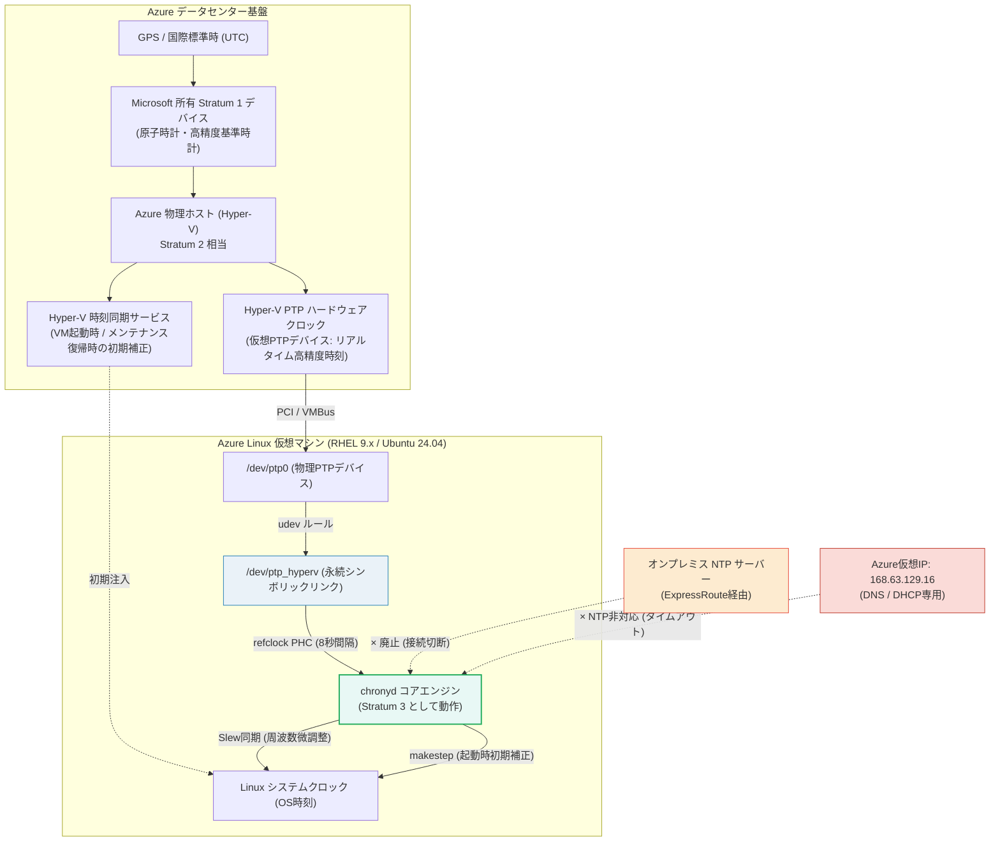
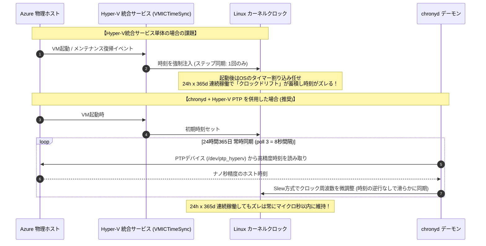
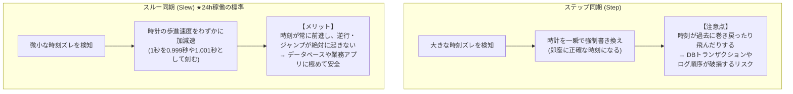
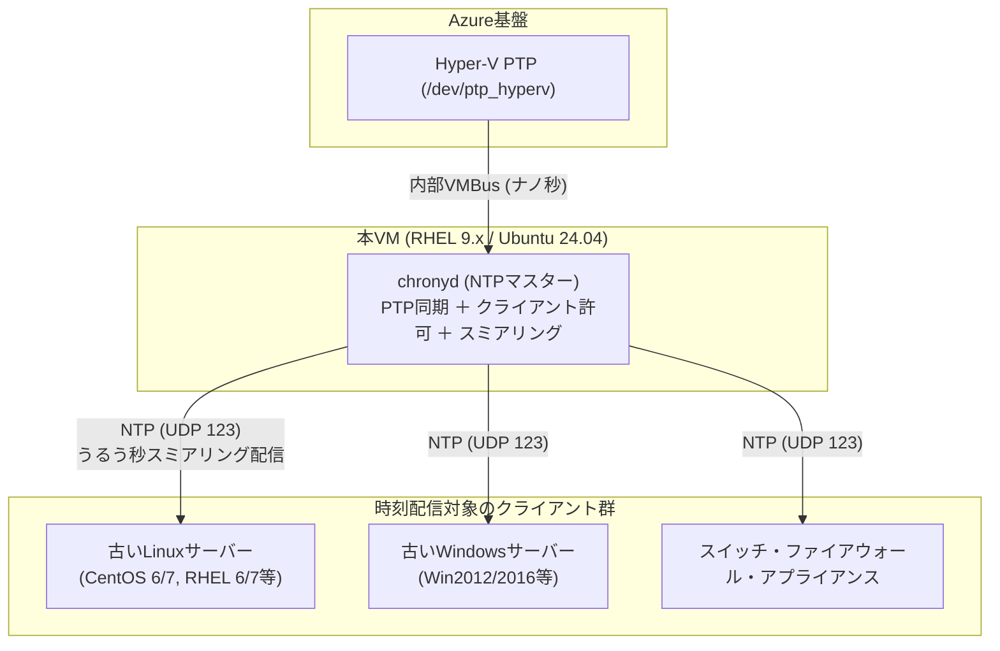

# AZURE：仮想マシンの時刻同期設定：Linux編 (Hyper-V PTP & chrony)

オンプレミスデータセンターの廃止に伴い、ExpressRoute経由で接続していたオンプレミスのマスターNTPサーバーから、Azure環境内で完結する時刻同期方式へ移行するための解説文書です。

Azure上のLinux仮想マシン（RHEL 9.x / Ubuntu 24.04）において、**24時間365日常時稼働しても時刻ドリフト（時計のズレ）を起こさず、高精度かつ安定して定期同期し続けるためのベストプラクティス**を解説します。

---

## 1. 全体アーキテクチャと時刻同期の仕組み

### 1.1 時刻同期アーキテクチャ図

AzureのLinux VMにおける時刻同期は、従来のネットワーク経由NTPではなく、**ハイパーバイザー（Azureホスト）が提供する仮想ハードウェアクロック（Hyper-V PTP デバイス）** を `chronyd` の基準時計（`refclock PHC`）として直接参照するのが公式推奨のベストプラクティスです。



---

### 1.2 時刻取得方式の比較表

| 比較項目 | ① Hyper-V PTP (`/dev/ptp_hyperv`) ★推奨 | ② 外部パブリックNTP (`pool.ntp.org`) | ③ オンプレNTP (ExpressRoute) ※今回廃止 | ④ Azure仮想IP (`168.63.129.16`) ※不可 |
| :--- | :--- | :--- | :--- | :--- |
| **通信経路** | **ハイパーバイザー内部バス (VMBus)** | インターネット経由 (UDP 123) | ExpressRoute / 閉域網 (UDP 123) | VNet仮想ルーター (プラットフォーム) |
| **精度** | **サブミリ秒〜マイクロ秒単位 (最高精度)** | 数ミリ秒〜数十ミリ秒 (ネットワーク遅延有) | 数ミリ秒〜十数ミリ秒 (回線遅延有) | **利用不可 (応答なし)** |
| **ネットワーク要件** | **完全閉域OK (インターネット通信不要)** | NSG/FWでアウトバウンドUDP 123開放が必要 | ExpressRoute回線の維持が必要 | - |
| **外部依存性** | **なし (Azure基盤内で完結)** | 外部NTPサーバーの停止・遅延リスクあり | オンプレインフラ・専用線障害リスクあり | - |
| **総合評価** | **◎ Azure環境における最適解** | ◯ バックアップ用途なら可 | × 廃止対象 | **× NTPサーバー機能は存在しない** |

> [!WARNING]
> **`168.63.129.16` にNTPリクエストを送信してはならない理由**  
> `168.63.129.16` はAzureプラットフォームサービス（VMエージェント、DNS、DHCP、ロードバランサーのヘルスプローブなど）専用の仮想パブリックIPアドレスです。**NTPサーバーデーモンは稼働していない**ため、`chrony.conf` に `server 168.63.129.16` と記述しても通信がタイムアウトし、同期できません。

---

## 2. 「起動時のみ」ではなく「24h x 365d 常時定期同期」する仕組み

### 2.1 Hyper-V Time Sync 単体と chronyd の違い

Hyper-Vの統合サービスに含まれる「時刻同期機能（VMICTimeSync）」のみに依存した場合、以下のような課題が発生します。



- **Hyper-V 統合サービス（単体）**:
  VM起動時や、Azureの「メモリ保持メンテナンス（VMが最大数十秒一時停止する無停止保守）」からの復帰時などの**イベント発生時にのみ**、ホストの時刻を強制注入します。定常稼働中は定期的な時刻調整を行わないため、放置するとOSカーネルの周波数誤差によって時計が徐々にズレていきます。
- **chronyd による常時定期同期**:
  `refclock PHC /dev/ptp_hyperv poll 3 dpoll -2 offset 0 stratum 2` を設定すると、**8秒ごと（`poll 3` = $2^3$ 秒）にPTPデバイスから時刻を取得**します。ズレを検知するとOSクロックの進み具合（周波数）をミリ秒〜ナノ秒単位で微調整（Slew同期）し続けるため、**24時間365日一度もOSを再起動しなくても、時計がズレることは一切ありません**。

---

### 2.2 ステップ同期 vs スルー同期 (`makestep` の選定)

時計の調整方法には「ステップ同期（時間を飛ばす／巻き戻す）」と「スルー同期（時間を徐々に進めて合わせる）」の2種類があります。



| 設定ディレクティブ | 動作内容 | 推奨システム |
| :--- | :--- | :--- |
| **`makestep 1.0 3`**<br>*(★標準・強く推奨)* | 起動直後の**最初の3回の更新のみ**、ズレが1.0秒以上あればステップ同期を行う。**4回目以降の定常稼働中はスルー同期のみ**行い、時刻ジャンプを禁止する。 | **データベース (RDBMS)、業務API、バッチ処理、監査ログ対象サーバー**。<br/>※稼働中に時刻が巻き戻る事故を絶対に防ぎたい環境。 |
| **`makestep 1.0 -1`** | **常時（稼働中も無期限に）**、1.0秒以上のズレがあればステップ同期を行う。 | Azureのメモリ保持メンテナンス等で生じた数十秒のズレを即座に補正したいステートレスなWebサーバー等。 |

---

## 3. 事前確認: PTPデバイスと udev ルール

### 3.1 デバイスの存在確認

LinuxカーネルのPTPモジュール（`ptp_hyperv`）がロードされ、Azureホストクロックを指すシンボリックリンク `/dev/ptp_hyperv` が作成されているか確認します。

```bash
# シンボリックリンクの確認
ls -l /dev/ptp_hyperv
```

**正常時の出力例:**
```text
lrwxrwxrwx 1 root root 4 Sep 17 10:00 /dev/ptp_hyperv -> ptp0
```

### 3.2 シンボリックリンクが存在しない場合の対処

古いOSイメージや一部のカスタムイメージでは、シンボリックリンク作成用のudevルールが不足している場合があります。以下のコマンドでルールを作成し、即時反映させます。

```bash
# udev ルールファイルの作成 (sudo tee を使用)
sudo tee /etc/udev/rules.d/99-ptp_hyperv.rules << "EOF"
ACTION!="add", GOTO="ptp_hyperv"
SUBSYSTEM=="ptp", ATTR{clock_name}=="hyperv", SYMLINK += "ptp_hyperv"
LABEL="ptp_hyperv"
EOF

# udev ルールの再読み込みとトリガー
sudo udevadm control --reload
sudo udevadm trigger --subsystem-match=ptp --action=add

# 作成されたことを確認
ls -l /dev/ptp_hyperv
```

> [!NOTE]
> `sudo tee /etc/udev/rules.d/... << "EOF"` と `sudo bash -c 'cat > /etc/udev/rules.d/... << "EOF"'` は**完全に同じ結果（同じ内容のファイル作成）**になります。`sudo tee` の方がクォートのエスケープ事故が起きにくく、コンソール上に書き込まれた内容が表示されるため視覚的に確認しやすく推奨されます。出力を非表示にしたい場合は末尾に `> /dev/null` を付与してください。

---

## 4. RHEL 9.x の設定手順

### 4.1 設定ファイル (`/etc/chrony.conf`)

Azure VM (RHEL 9.7) の標準イメージには、初期状態で Hyper-V PTP の参照設定が含まれています。  
オリジナルの設定ファイルの項目順序を維持したまま、**不要なディレクティブをコメントアウトし、`refclock` 行末に `stratum 2` を追記するだけ**で推奨設定へ移行できます。

```bash
# バックアップ取得
sudo cp -p /etc/chrony.conf /etc/chrony.conf.bak.$(date +%Y%m%d)
sudo vi /etc/chrony.conf
```

**`/etc/chrony.conf` 推奨設定内容（オリジナル順序準拠）:**

```text
# ==============================================================================
# Azure VM (RHEL 9.x) chrony.conf 推奨設定
# ※ Azure標準の項目順序に完全準拠。不要項目はコメントアウトして無効化しています。
# ==============================================================================

# [1] Azure物理ホストのPTPデバイスを参照
# 推奨変更: 末尾に 'stratum 2' を追記 (VM自身をStratum 3として動作させ階層構造を安定化)
refclock PHC /dev/ptp_hyperv poll 3 dpoll -2 offset 0 stratum 2

# [2] DHCP経由で配布されるNTPソースの自動読み込みディレクトリ
# 不要化: 不意な外部NTP設定の混入やソース競合を防ぐためコメントアウト
# sourcedir /run/chrony-dhcp

# [3] クロックドリフト (周波数誤差) の保存先 (必須)
driftfile /var/lib/chrony/drift

# [4] 起動時の初期同期のみ1秒以上のズレがあればステップ同期、定常時はスルー同期 (必須)
makestep 1.0 3

# [5] カーネルRTC (リアルタイムクロック) への定期同期 (必須)
rtcsync

# [6] NTP対称鍵・認証キーファイル
# 不要化: PTPローカル同期環境では認証鍵は不要のためコメントアウト
# keyfile /etc/chrony.keys

# [7] NTS (Network Time Security) のキードリフト保存先
# 不要化: NTS認証を使用しないためコメントアウト
# ntsdumpdir /var/lib/chrony

# [8] システムうるう秒テーブル (right/UTC) の参照
# 不要化: Azure物理ホスト側でうるう秒が適切に処理・平滑化されるためコメントアウト
# leapsectz right/UTC

# [9] ログディレクトリ
logdir /var/log/chrony
```

#### オリジナルからの変更点一覧 (RHEL 9.7)

| 行順 | 設定項目 (ディレクティブ) | オリジナル | 推奨設定 | 変更内容・理由 |
| :---: | :--- | :--- | :--- | :--- |
| 1 | `refclock` | `... offset 0` | `... offset 0 stratum 2` | **`stratum 2` を追記**。ホストをStratum 2、VMをStratum 3として階層を明示。 |
| 2 | `sourcedir /run/chrony-dhcp` | 有効 | **`# ` コメントアウト** | DHCPによる意図しないNTPサーバー自動追加を無効化。 |
| 3 | `driftfile` | 有効 | そのまま維持 | クロック周波数の補正値保存に必須。 |
| 4 | `makestep 1.0 3` | 有効 | そのまま維持 | 起動初期のみステップ補正、稼働中の時刻逆行を防止。 |
| 5 | `rtcsync` | 有効 | そのまま維持 | カーネルからハードウェアクロック(RTC)への定期同期。 |
| 6 | `keyfile /etc/chrony.keys` | 有効 | **`# ` コメントアウト** | PHCローカル同期では認証キーを使用しないため不要。 |
| 7 | `ntsdumpdir /var/lib/chrony`| 有効 | **`# ` コメントアウト** | NTS (Network Time Security) を使用しないため不要。 |
| 8 | `leapsectz right/UTC` | 有効 | **`# ` コメントアウト** | Azureホスト側でうるう秒が吸収・平滑化されるため不要。 |
| 9 | `logdir` | 有効 | そのまま維持 | ログディレクトリ。 |

> [!TIP]
> **ワンライナーでの一括適用手順 (RHEL 9.x):**  
> 手動で `vi` 編集する代わりに、以下の `sed` コマンドでオリジナルから推奨設定へ一括変換することも可能です。
> ```bash
> # バックアップ取得
> sudo cp -p /etc/chrony.conf /etc/chrony.conf.bak.$(date +%Y%m%d)
> 
> # 不要項目のコメントアウトと stratum 2 の追記
> sudo sed -i \
>   -e 's/^refclock PHC \/dev\/ptp_hyperv poll 3 dpoll -2 offset 0$/refclock PHC \/dev\/ptp_hyperv poll 3 dpoll -2 offset 0 stratum 2/' \
>   -e 's/^sourcedir \/run\/chrony-dhcp/# sourcedir \/run\/chrony-dhcp/' \
>   -e 's/^keyfile \/etc\/chrony.keys/# keyfile \/etc\/chrony.keys/' \
>   -e 's/^ntsdumpdir \/var\/lib\/chrony/# ntsdumpdir \/var\/lib\/chrony/' \
>   -e 's/^leapsectz right\/UTC/# leapsectz right\/UTC/' \
>   /etc/chrony.conf
> 
> # 差分確認
> diff -u /etc/chrony.conf.bak.$(date +%Y%m%d) /etc/chrony.conf
> ```

> [!NOTE]
> **本VMを社内NTPサーバーとして運用し他サーバーへ時刻配信する場合:**  
> 本VM自身をVNet内やオンプレミスの古いOSサーバー・ネットワーク機器等に対するNTPサーバーとして動作させる場合は、追加のクライアント許可（`allow`）やうるう秒スミアリング設定が必要です。詳細は [第8章](#8-オプション-自vmをvnet内のntpサーバーとして運用する場合の設定-古いos機器への時刻配信) を参照してください。

### 4.2 反映と有効化 (RHEL 9.x)

```bash
# 設定ファイルの構文チェック
sudo chronyd -q -t 1

# サービスの再起動
sudo systemctl restart chronyd

# 自動起動の有効化確認
sudo systemctl enable chronyd
sudo systemctl status chronyd
```

---

## 5. Ubuntu 24.04 の設定手順

### 5.1 `systemd-timesyncd` との競合防止

Ubuntu 24.04 では、軽量な時刻同期デーモンである `systemd-timesyncd` が標準で有効化されている場合があります。`chrony` と二重起動するとクロック調整が競合して同期が不安定になるため、必ず停止・無効化します。

```bash
# systemd-timesyncd の停止と無効化
sudo systemctl stop systemd-timesyncd
sudo systemctl disable systemd-timesyncd
sudo systemctl mask systemd-timesyncd
```

### 5.2 設定ファイル (`/etc/chrony/chrony.conf`)

Azure VM (Ubuntu 24.04) の標準イメージでも、設定ファイルの末尾（12行目）に Hyper-V PTP の参照設定が含まれています。  
オリジナルの設定ファイルの項目順序を維持したまま、**不要なディレクティブをコメントアウトし、末尾の `refclock` 行に `stratum 2` を追記するだけ**で推奨設定へ移行できます。

```bash
# バックアップ取得
sudo cp -p /etc/chrony/chrony.conf /etc/chrony/chrony.conf.bak.$(date +%Y%m%d)
sudo vi /etc/chrony/chrony.conf
```

**`/etc/chrony/chrony.conf` 推奨設定内容（オリジナル順序準拠）:**

```text
# ==============================================================================
# Azure VM (Ubuntu 24.04) chrony.conf 推奨設定
# ※ Azure標準の項目順序に完全準拠。不要項目はコメントアウトして無効化しています。
# ==============================================================================

# [1] 追加設定ディレクトリ (.conf)
# 不要化: 設定を一元管理し、予期せぬ外部設定ファイルの読み込みを防ぐためコメントアウト
# confdir /etc/chrony/conf.d

# [2] DHCP経由で配布されるNTPソースの自動読み込みディレクトリ
# 不要化: DHCPからの不意な外部NTP混入・競合を防ぐためコメントアウト
# sourcedir /run/chrony-dhcp

# [3] 追加NTPソース設定ディレクトリ (sources.d)
# 不要化: 意図しない外部ソース読み込みを防ぐためコメントアウト
# sourcedir /etc/chrony/sources.d

# [4] NTP対称鍵・認証キーファイル
# 不要化: PTPローカル同期環境では認証鍵は不要のためコメントアウト
# keyfile /etc/chrony/chrony.keys

# [5] クロックドリフト (周波数誤差) の保存先 (必須)
driftfile /var/lib/chrony/chrony.drift

# [6] NTS (Network Time Security) のキードリフト保存先
# 不要化: NTS認証を使用しないためコメントアウト
# ntsdumpdir /var/lib/chrony

# [7] ログディレクトリ
logdir /var/log/chrony

# [8] 周波数推定における最大許容スキュー (Ubuntu標準: 100.0)
maxupdateskew 100.0

# [9] カーネルRTC (リアルタイムクロック) への定期同期 (必須)
rtcsync

# [10] 起動初期の3回のみ1秒以上のズレがあればステップ同期、定常時はスルー同期 (必須)
makestep 1 3

# [11] システムうるう秒テーブル (right/UTC) の参照
# 不要化: Azure物理ホスト側でうるう秒が適切に処理・平滑化されるためコメントアウト
# leapsectz right/UTC

# [12] Azure物理ホストのPTPデバイスを参照 (8秒ごとに定期問い合わせ)
# 推奨変更: 末尾に 'stratum 2' を追記 (VM自身をStratum 3として動作させ階層構造を安定化)
refclock PHC /dev/ptp_hyperv poll 3 dpoll -2 offset 0 stratum 2
```

#### オリジナルからの変更点一覧 (Ubuntu 24.04)

| 行順 | 設定項目 (ディレクティブ) | オリジナル | 推奨設定 | 変更内容・理由 |
| :---: | :--- | :--- | :--- | :--- |
| 1 | `confdir /etc/chrony/conf.d` | 有効 | **`# ` コメントアウト** | 個別設定の競合を防ぎ、設定を一元管理するため。 |
| 2 | `sourcedir /run/chrony-dhcp` | 有効 | **`# ` コメントアウト** | DHCPによる意図しないNTPサーバー自動追加を無効化。 |
| 3 | `sourcedir /etc/chrony/sources.d` | 有効 | **`# ` コメントアウト** | 外部NTPソース設定ファイルの読み込みを防止。 |
| 4 | `keyfile /etc/chrony/chrony.keys` | 有効 | **`# ` コメントアウト** | PHCローカル同期では認証キーを使用しないため不要。 |
| 5 | `driftfile` | 有効 | そのまま維持 | クロック周波数の補正値保存に必須。 |
| 6 | `ntsdumpdir /var/lib/chrony` | 有効 | **`# ` コメントアウト** | NTS (Network Time Security) を使用しないため不要。 |
| 7 | `logdir` | 有効 | そのまま維持 | ログディレクトリ。 |
| 8 | `maxupdateskew 100.0` | 有効 | そのまま維持 | 周波数推定の許容最大スキュー（Ubuntu標準）。 |
| 9 | `rtcsync` | 有効 | そのまま維持 | カーネルからハードウェアクロック(RTC)への定期同期。 |
| 10 | `makestep 1 3` | 有効 | そのまま維持 | 起動初期のみステップ補正、稼働中の時刻逆行を防止。 |
| 11 | `leapsectz right/UTC` | 有効 | **`# ` コメントアウト** | Azureホスト側でうるう秒が吸収・平滑化されるため不要。 |
| 12 | `refclock` | `... offset 0` | `... offset 0 stratum 2` | **`stratum 2` を追記**。ホストをStratum 2、VMをStratum 3として階層を明示。 |

> [!TIP]
> **ワンライナーでの一括適用手順 (Ubuntu 24.04):**  
> 手動で `vi` 編集する代わりに、以下の `sed` コマンドでオリジナルから推奨設定へ一括変換することも可能です。
> ```bash
> # バックアップ取得
> sudo cp -p /etc/chrony/chrony.conf /etc/chrony/chrony.conf.bak.$(date +%Y%m%d)
> 
> # 不要項目のコメントアウトと stratum 2 の追記
> sudo sed -i \
>   -e 's/^confdir \/etc\/chrony\/conf.d/# confdir \/etc\/chrony\/conf.d/' \
>   -e 's/^sourcedir \/run\/chrony-dhcp/# sourcedir \/run\/chrony-dhcp/' \
>   -e 's/^sourcedir \/etc\/chrony\/sources.d/# sourcedir \/etc\/chrony\/sources.d/' \
>   -e 's/^keyfile \/etc\/chrony\/chrony.keys/# keyfile \/etc\/chrony\/chrony.keys/' \
>   -e 's/^ntsdumpdir \/var\/lib\/chrony/# ntsdumpdir \/var\/lib\/chrony/' \
>   -e 's/^leapsectz right\/UTC/# leapsectz right\/UTC/' \
>   -e 's/^refclock PHC \/dev\/ptp_hyperv poll 3 dpoll -2 offset 0$/refclock PHC \/dev\/ptp_hyperv poll 3 dpoll -2 offset 0 stratum 2/' \
>   /etc/chrony/chrony.conf
> 
> # 差分確認
> diff -u /etc/chrony/chrony.conf.bak.$(date +%Y%m%d) /etc/chrony/chrony.conf
> ```

> [!NOTE]
> **本VMを社内NTPサーバーとして運用し他サーバーへ時刻配信する場合:**  
> 本VM自身をVNet内やオンプレミスの古いOSサーバー・ネットワーク機器等に対するNTPサーバーとして動作させる場合は、親ファイルで `confdir /etc/chrony/conf.d` のコメントアウトを解除し、`/etc/chrony/conf.d/custom.conf` 等に設定を配置します。詳細は [第8章](#8-オプション-自vmをvnet内のntpサーバーとして運用する場合の設定-古いos機器への時刻配信) を参照してください。

### 5.3 反映と有効化 (Ubuntu 24.04)

```bash
# サービスの再起動
sudo systemctl restart chrony

# 自動起動の有効化確認
sudo systemctl enable chrony
sudo systemctl status chrony
```

## 6. 動作確認と検証手順

設定後、数分待ってから以下のコマンドで同期状態を検証します。  
*(※ 以下のステータス確認・参照系コマンドはすべて一般ユーザー権限で実行可能であり、**`sudo` を付ける必要はありません**)*

### 6.1 同期ソースの標準確認 (`chronyc sources`)

オプションなしで実行した際の標準出力です。

```bash
chronyc sources
```

**正常な出力例（完全閉域 / PTP単独構成の場合）:**
```text
MS Name/IP address         Stratum Poll Reach LastRx Last sample               
===============================================================================
#* PHC0                          2    3   377     6    -15ns[  -28ns] +/-  240ns
```

**正常な出力例（外部NTPプールを予備として残している場合）:**
```text
MS Name/IP address         Stratum Poll Reach LastRx Last sample               
===============================================================================
#* PHC0                          2    3   377     6    -15ns[  -28ns] +/-  240ns
^+ 2.rhel.pool.ntp.org           2    6   377    25  -1200us[-1150us] +/-   25ms
```

---

### 6.2 同期ソースの詳細確認 (`chronyc sources -v`)

`-v`（Verbose）オプションを付与すると、ステータス記号の凡例（各列の意味）がヘッダーに表示されます。

```bash
chronyc sources -v
```

**正常な出力例:**
```text
  .-- Source mode  '^' = server, '=' = peer, '#' = local clock.
 / .- Mode Normal, '+' = combined, '*' = best, '-' = not combined,
| /             'x' = may be in error, '~' = too variable, '?' = unusable.
||                                                 Clock stratum
||                                                 |  Polling interval (log2)
||                                                 |  | Last rx    Last offset
||                                                 |  |  |    |  (which is adjusted)
||                                                 |  |  |    |     |   Estimated error
||                                                 |  |  |    |     |           |
MS Name/IP address         Stratum Poll Reach LastRx Last sample
===============================================================================
#* PHC0                          2    3   377     5    -12ns[  -24ns] +/-  250ns
```

**確認ポイント**:
- **`MS` 列**: 最も重要な確認項目です。**`#*`** になっていることを確認します。
  - `#`: ローカル参照クロック (PHC)
  - `*`: 現在同期ターゲットとして選択されている最適ソース (Best)
- **`Stratum`**: 設定どおり `2` になっていること。
- **`Poll`**: `3`（$2^3 = 8$ 秒間隔で問い合わせ）になっていること。
- **`Reach`**: 時間経過とともに `377`（8進数表示で直近8回連続成功を表す最大値）に達すること。

---

### 6.3 同期ステータス・ドリフトの確認 (`chronyc tracking`)

```bash
chronyc tracking
```

**正常な出力例:**
```text
Reference ID    : 50484330 (PHC0)
Stratum         : 3
Ref time (UTC)  : Thu Sep 17 10:20:00 2026
System time     : 0.000000015 seconds slow of NTP time
Last offset     : -0.000000008 seconds
RMS offset      : 0.000000025 seconds
Frequency       : -12.345 ppm slow
Residual freq   : +0.002 ppm
Skew            : 0.040 ppm
Root delay      : 0.000000000 seconds
Root dispersion : 0.000030000 seconds
Update interval : 8.0 seconds
Leap status     : Normal
```

**確認ポイント**:
- **`Reference ID`**: `PHC0`（PTPクロック）になっていること。
- **`Stratum`**: `3`（ホストがStratum 2のため、VM自身はStratum 3）。
- **`System time` / `Last offset`**: ズレが極小（通常は数十ナノ秒〜数マイクロ秒以内）に抑えられていること。
- **`Update interval`**: 約 `8.0 seconds` で常時定期更新されていること。
- **`Leap status`**: `Normal` であること。

---

### 6.4 統計情報の確認 (`chronyc sourcestats -v`)

```bash
chronyc sourcestats -v
```

**正常な出力例:**
```text
                             .- Number of sample points in measurement set.
                            /    .- Number of residual runs with same sign.
                           |    /    .- Length of measurement set (time).
                           |   |    /      .- Est. help (skew) of drift rate.
                           |   |   |      /           .- Est. error of drift.
                           |   |   |     |           /         .- Est. offset.
                           |   |   |     |          |         /   |- Offset error
Name/IP Address            NP  NR  Span  Frequency  Freq Skew  Offset  Std Dev
===============================================================================
PHC0                       64  32   512     -0.001      0.010    +0ns    30ns
```

- **`Span`**: サンプリング計測時間。稼働とともに増加し、安定してデータが蓄積されていることが分かります。
- **`Offset` / `Std Dev`**: 標準偏差が極めて小さく、ジッターのない安定した同期が行われていることが確認できます。

---

## 7. トラブルシューティング

| 現象 | 主な原因 | 対処方法 |
| :--- | :--- | :--- |
| `chronyc sources` で `#?` や `?` となり同期しない | デバイスのパーミッション問題、または udev ルール未適用 | 1. `ls -l /dev/ptp_hyperv` でリンク先を確認。<br/>2. セクション3.2のudevルールを再適用。<br/>3. `sudo dmesg \| grep -i ptp` でカーネルがPTPを認識しているか確認。 |
| chronyd起動時に `/dev/ptp_hyperv: No such file or directory` エラー | systemd起動時にudevによるリンク作成が間に合っていない | `systemctl edit chronyd` で以下を追加し、デバイス準備完了を待つよう設定:<br/>`[Unit]`<br/>`Wants=dev-ptp_hyperv.device`<br/>`After=dev-ptp_hyperv.device` |
| Ubuntu 24.04 で時間が急に飛ぶ / 不安定 | `systemd-timesyncd` が並行稼働している | `sudo systemctl stop systemd-timesyncd && sudo systemctl mask systemd-timesyncd` を実行し、chrony単独稼働にする。 |
| `168.63.129.16` を指定したが同期しない | そもそもNTPサーバーではない | `chrony.conf` から `server 168.63.129.16` を削除し、`refclock PHC /dev/ptp_hyperv` を使用する。 |

---

## 8. (オプション) 自VMをVNet内のNTPサーバーとして運用する場合の設定 (古いOS・機器への時刻配信)

### 8.1 アーキテクチャとユースケース

Azure上のLinux VM自身がHyper-V PTP経由でAzureホストと同期するだけでなく、**「自VNet内やオンプレミスに残る古いOS（Linux旧バージョン、Windows Server旧版、ネットワーク機器等）に対して、高精度なNTPサーバーとして時刻を配信・中継したい」** というケースがあります。

Hyper-V PTPデバイスはAzure仮想マシンの内部バス専用であるため、古いOSや別サーバーが直接参照することはできません。そこで、本VMを**信頼できる社内NTPサーバー（Stratum 3）**として仕立てることで、環境全体の時刻同期を集約できます。



---

### 8.2 設定内容と各ディレクティブの技術的役割

他サーバーに時刻を配信する場合、単なるクライアント設定に加えて以下のディレクティブが必要（または強く推奨）となります。

```text
# ==============================================================================
# NTPサーバー機能および古いOS向けうるう秒スミアリング設定
# ==============================================================================

# [1] クライアントからのNTPアクセス許可 (★必須)
# chronyはデフォルトで全クライアントのアクセスを遮断するため、許可サブネットを明記します
allow 192.168.0.0/16
allow 10.0.0.0/8

# [2] ローカルクロックのフォールバック配信 (★強く推奨)
# 万が一、Azureホストとの同期が一時的に失われた場合でも、自らの時計をStratum 10として
# クライアントへ時刻を配り続け、古いOS側で「同期エラー」が発生するのを防ぎます
local stratum 10

# [3] クライアントアクセスログの無効化 (★推奨: パフォーマンス・リソース保護)
# 多数のクライアントからの要求ログをメモリに保持しないことで、不要なメモリ消費を抑えます
noclientlog

# [4] 急激な時刻変動のログ記録 (★推奨: 監視用)
# クロックが0.5秒以上調整された場合にsyslogへ警告を出力します
logchange 0.5

# [5] 古いOS向けうるう秒スミアリング (Leap Smearing) 設定 (★古いOS保護に極めて有用)
# 古いLinuxカーネルやJava、データベースがうるう秒のステップ同期(時刻巻き戻し)で
# クラッシュやハングを起こす「うるう秒バグ」を回避するため、時間を滑らかに微調整して配ります
leapsecmode slew
maxslewrate 1000
smoothtime 400 0.001 leaponly
```

#### 各項目の必要性・判定詳細

| 設定項目 | 判定 | 理由・役割 |
| :--- | :---: | :--- |
| **`allow <CIDR>`** | **★必須** | chronydはデフォルトで外部からのNTPリクエスト（UDP 123）を全て破棄します。これがないと、クライアントから問い合わせがあっても時刻を提供できません。 |
| **`local stratum 10`** | **★強く推奨** | 通常、chronyは自らが上位と正常同期していないとクライアントへの応答を停止します。この設定により、万一ホストPTPとの通信が途切れても、孤立状態でクライアントへ時刻を提供し続けることができます。 |
| **`noclientlog`** | **★強く推奨** | クライアント接続元のログをメモリ上に記録しません。多数のクライアントが接続するNTPサーバー運用では、メモリ枯渇やオーバーヘッドを防ぐために必須のベストプラクティスです。 |
| **`logchange 0.5`** | **◯推奨** | 0.5秒以上の大きな時刻補正が発生したときにsyslogへ記録します。時刻の急変を監視・検知するのに役立ちます。 |
| **うるう秒スミアリング<br>(`smoothtime` 等)** | **◎古いOSに極めて有用** | 古いLinux（カーネルのfutexバグ等）や古いDBMSは、うるう秒で「1秒巻き戻る（23:59:59 → 23:59:59）」と高負荷無限ループやトランザクション不整合を起こす危険があります。`smoothtime` を使うことで、クライアントには時計の逆行を起こさせず、徐々に時間を合わせて配ることができます。 |
| **`stratumweight 0`** | △任意 (影響小) | 複数ソース選択時のStratum差による重み付けを無視する設定です。Hyper-V PTP単一ソース運用の場合は動作に影響しませんが、記述を残していても問題ありません。 |

---

### 8.3 OS別の設定反映手順

#### Ubuntu 24.04 の場合
別ファイル `/etc/chrony/conf.d/custom.conf` に設定を分離して管理するのが便利です。

```bash
# 1. 親設定ファイル (/etc/chrony/chrony.conf) で confdir のコメントアウトを解除
sudo sed -i 's/^# confdir \/etc\/chrony\/conf.d/confdir \/etc\/chrony\/conf.d/' /etc/chrony/chrony.conf

# 2. 追加設定ファイルを作成
sudo tee /etc/chrony/conf.d/custom.conf << "EOF"
# Allow NTP client access from local network
allow 192.168.0.0/16
allow 10.0.0.0/8

# Serve time even if not synchronized to any upstream
local stratum 10

# Disable logging of client accesses
noclientlog

# Send a message to syslog if a clock adjustment is larger than 0.5 seconds
logchange 0.5

# 古いOS向けのうるう秒スミアリング設定
leapsecmode slew
maxslewrate 1000
smoothtime 400 0.001 leaponly
EOF

# 3. 反映
sudo systemctl restart chrony
```

#### RHEL 9.x の場合
`/etc/chrony.conf` の末尾に直接追記するか、またはディレクトリ読み込みを有効化して配置します。

```bash
# /etc/chrony.conf の末尾に設定を追記
sudo tee -a /etc/chrony.conf << "EOF"

# ==============================================================================
# NTP Server & Leap Smearing for Local Network Clients
# ==============================================================================
allow 192.168.0.0/16
allow 10.0.0.0/8
local stratum 10
noclientlog
logchange 0.5
leapsecmode slew
maxslewrate 1000
smoothtime 400 0.001 leaponly
EOF

# 構文チェックと反映
sudo chronyd -q -t 1
sudo systemctl restart chronyd
```

---

### 8.4 Azure NSG (ネットワークセキュリティグループ) の設定要件

自VMをNTPサーバーとして動作させる場合、クライアントから自VMへの通信を通すため、AzureのNSGで以下の受信セキュリティ規則を追加する必要があります。

| 項目 | 設定値 |
| :--- | :--- |
| **ソース (送信元)** | `192.168.0.0/16`, `10.0.0.0/8` (またはクライアントのサブネット) |
| **送信元ポート範囲** | `*` |
| **宛先** | `VirtualNetwork` (または本VMのプライベートIP) |
| **宛先ポート範囲** | **`123`** |
| **プロトコル** | **`UDP`** |
| **アクション** | **`許可 (Allow)`** |

---

## 9. まとめ

1. **オンプレNTP廃止後の標準**:
   Azureでは物理ホストが最高精度のStratum 1と同期しており、ハイパーバイザー経由の **`refclock PHC /dev/ptp_hyperv`** を使うことで、ネットワーク不要・最高精度の時刻同期が実現できます。
2. **24時間365日の連続運用**:
   `poll 3`（8秒間隔サンプリング）と `makestep 1.0 3`（稼働中スルー同期強制）により、**OSが数年間無停止で稼働しても、時刻逆行事故を起こさずマイクロ秒単位で常時同期**し続けます。
3. **閉域網での完全自律**:
   インターネットへのアウトバウンド（UDP 123）開放が一切不要なため、セキュリティが厳しい金融・基盤系システムの完全プライベートサブネットにも最適です。
4. **社内NTPサーバーとしての活用**:
   PTPを参照できない古いOSや他サーバー群がある場合、本VMに `allow` や `smoothtime`（うるう秒スミアリング）を設定することで、**Azureホストの高精度時刻を安全に中継・配信する堅牢な社内NTPサーバー**として活用できます。
