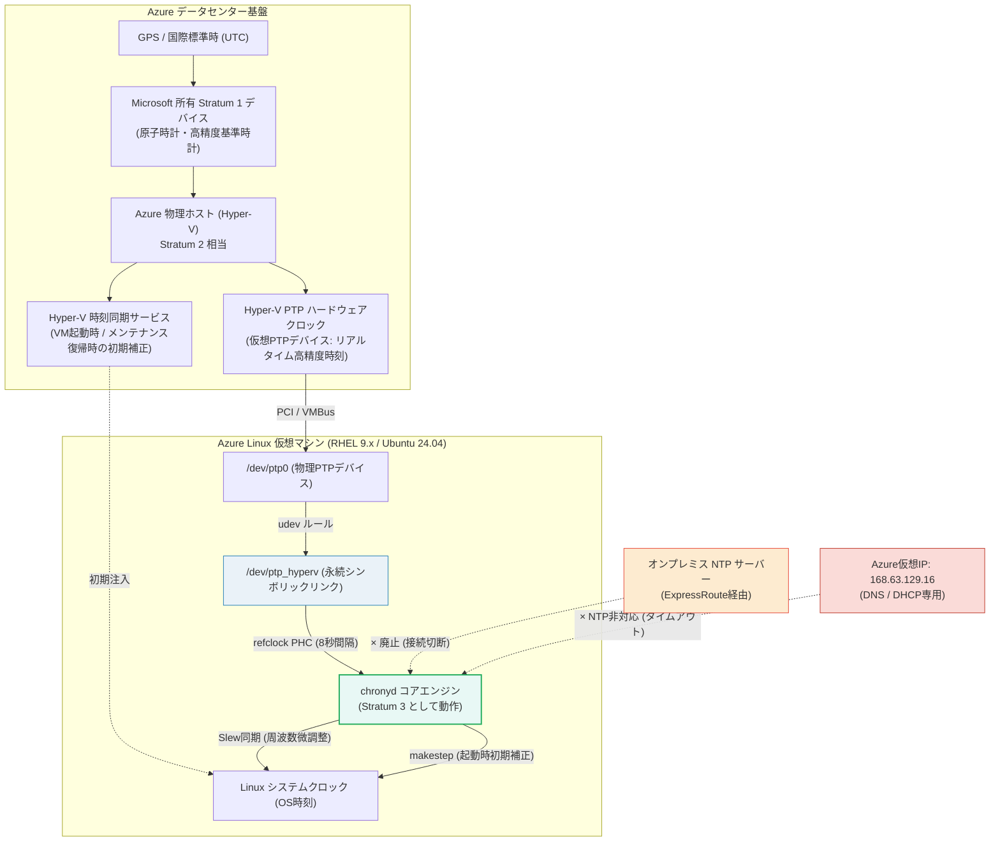
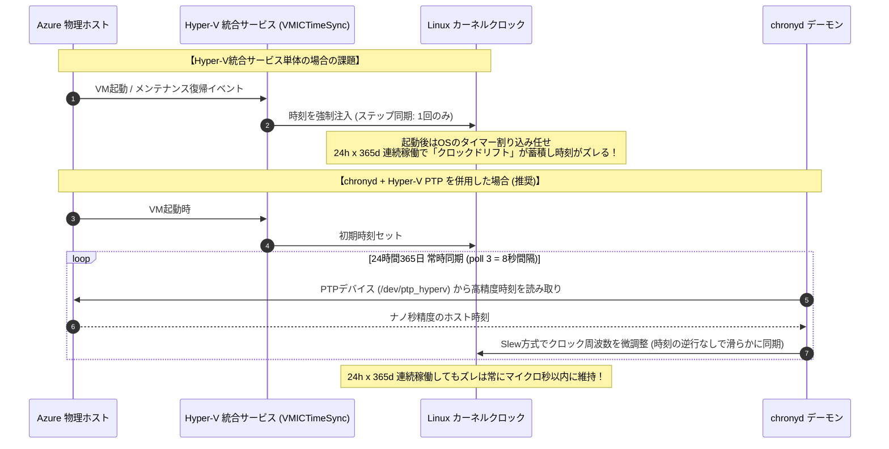

# AZURE：仮想マシンの時刻同期設定：Linux編 (Hyper-V PTP & chrony)

オンプレミスデータセンターの廃止に伴い、ExpressRoute経由で接続していたオンプレミスのマスターNTPサーバーから、Azure環境内で完結する時刻同期方式へ移行するための解説文書です。

Azure上のLinux仮想マシン（RHEL 9.x / Ubuntu 24.04）において、**24時間365日常時稼働しても時刻ドリフト（時計のズレ）を起こさず、高精度かつ安定して定期同期し続けるためのベストプラクティス**を解説します。

---

## 1. 全体アーキテクチャと時刻同期の仕組み

### 1.1 時刻同期アーキテクチャ図

AzureのLinux VMにおける時刻同期は、従来のネットワーク経由NTPではなく、**ハイパーバイザー（Azureホスト）が提供する仮想ハードウェアクロック（Hyper-V PTP デバイス）** を `chronyd` の基準時計（`refclock PHC`）として直接参照するのが公式推奨のベストプラクティスです。



---

### 1.2 時刻取得方式の比較表

| 比較項目 | ① Hyper-V PTP (`/dev/ptp_hyperv`) ★推奨 | ② 外部パブリックNTP (`pool.ntp.org`) | ③ オンプレNTP (ExpressRoute) ※今回廃止 | ④ Azure仮想IP (`168.63.129.16`) ※不可 |
| :--- | :--- | :--- | :--- | :--- |
| **通信経路** | **ハイパーバイザー内部バス (VMBus)** | インターネット経由 (UDP 123) | ExpressRoute / 閉域網 (UDP 123) | VNet仮想ルーター (プラットフォーム) |
| **精度** | **サブミリ秒〜マイクロ秒単位 (最高精度)** | 数ミリ秒〜数十ミリ秒 (ネットワーク遅延有) | 数ミリ秒〜十数ミリ秒 (回線遅延有) | **利用不可 (応答なし)** |
| **ネットワーク要件** | **完全閉域OK (インターネット通信不要)** | NSG/FWでアウトバウンドUDP 123開放が必要 | ExpressRoute回線の維持が必要 | - |
| **外部依存性** | **なし (Azure基盤内で完結)** | 外部NTPサーバーの停止・遅延リスクあり | オンプレインフラ・専用線障害リスクあり | - |
| **総合評価** | **◎ Azure環境における最適解** | ◯ バックアップ用途なら可 | × 廃止対象 | **× NTPサーバー機能は存在しない** |

> [!WARNING]
> **`168.63.129.16` にNTPリクエストを送信してはならない理由**  
> `168.63.129.16` はAzureプラットフォームサービス（VMエージェント、DNS、DHCP、ロードバランサーのヘルスプローブなど）専用の仮想パブリックIPアドレスです。**NTPサーバーデーモンは稼働していない**ため、`chrony.conf` に `server 168.63.129.16` と記述しても通信がタイムアウトし、同期できません。

---

## 2. 「起動時のみ」ではなく「24h x 365d 常時定期同期」する仕組み

### 2.1 Hyper-V Time Sync 単体と chronyd の違い

Hyper-Vの統合サービスに含まれる「時刻同期機能（VMICTimeSync）」のみに依存した場合、以下のような課題が発生します。



- **Hyper-V 統合サービス（単体）**:
  VM起動時や、Azureの「メモリ保持メンテナンス（VMが最大数十秒一時停止する無停止保守）」からの復帰時などの**イベント発生時にのみ**、ホストの時刻を強制注入します。定常稼働中は定期的な時刻調整を行わないため、放置するとOSカーネルの周波数誤差によって時計が徐々にズレていきます。
- **chronyd による常時定期同期**:
  `refclock PHC /dev/ptp_hyperv poll 3 dpoll -2 offset 0 stratum 2` を設定すると、**8秒ごと（`poll 3` = $2^3$ 秒）にPTPデバイスから時刻を取得**します。ズレを検知するとOSクロックの進み具合（周波数）をミリ秒〜ナノ秒単位で微調整（Slew同期）し続けるため、**24時間365日一度もOSを再起動しなくても、時計がズレることは一切ありません**。

---

### 2.2 ステップ同期 vs スルー同期 (`makestep` の選定)

時計の調整方法には「ステップ同期（時間を飛ばす／巻き戻す）」と「スルー同期（時間を徐々に進めて合わせる）」の2種類があります。


| 設定ディレクティブ | 動作内容 | 推奨システム |
| :--- | :--- | :--- |
| **`makestep 1.0 3`**<br>*(★標準・強く推奨)* | 起動直後の**最初の3回の更新のみ**、ズレが1.0秒以上あればステップ同期を行う。**4回目以降の定常稼働中はスルー同期のみ**行い、時刻ジャンプを禁止する。 | **データベース (RDBMS)、業務API、バッチ処理、監査ログ対象サーバー**。<br/>※稼働中に時刻が巻き戻る事故を絶対に防ぎたい環境。 |
| **`makestep 1.0 -1`** | **常時（稼働中も無期限に）**、1.0秒以上のズレがあればステップ同期を行う。 | Azureのメモリ保持メンテナンス等で生じた数十秒のズレを即座に補正したいステートレスなWebサーバー等。 |

---

## 3. 事前確認: PTPデバイスと udev ルール

### 3.1 デバイスの存在確認

LinuxカーネルのPTPモジュール（`ptp_hyperv`）がロードされ、Azureホストクロックを指すシンボリックリンク `/dev/ptp_hyperv` が作成されているか確認します。

```bash
# シンボリックリンクの確認
ls -l /dev/ptp_hyperv
```

**正常時の出力例:**
```text
lrwxrwxrwx 1 root root 4 Sep 17 10:00 /dev/ptp_hyperv -> ptp0
```

### 3.2 シンボリックリンクが存在しない場合の対処

古いOSイメージや一部のカスタムイメージでは、シンボリックリンク作成用のudevルールが不足している場合があります。以下のコマンドでルールを作成し、即時反映させます。

```bash
# udev ルールファイルの作成 (sudo tee を使用)
sudo tee /etc/udev/rules.d/99-ptp_hyperv.rules << "EOF"
ACTION!="add", GOTO="ptp_hyperv"
SUBSYSTEM=="ptp", ATTR{clock_name}=="hyperv", SYMLINK += "ptp_hyperv"
LABEL="ptp_hyperv"
EOF

# udev ルールの再読み込みとトリガー
sudo udevadm control --reload
sudo udevadm trigger --subsystem-match=ptp --action=add

# 作成されたことを確認
ls -l /dev/ptp_hyperv
```

> [!NOTE]
> `sudo tee /etc/udev/rules.d/... << "EOF"` と `sudo bash -c 'cat > /etc/udev/rules.d/... << "EOF"'` は**完全に同じ結果（同じ内容のファイル作成）**になります。`sudo tee` の方がクォートのエスケープ事故が起きにくく、コンソール上に書き込まれた内容が表示されるため視覚的に確認しやすく推奨されます。出力を非表示にしたい場合は末尾に `> /dev/null` を付与してください。

---

## 4. RHEL 9.x の設定手順

### 4.1 設定ファイル (`/etc/chrony.conf`)

既存の `/etc/chrony.conf` のバックアップを取得した後、以下の内容に編集します。

```bash
# バックアップ取得
sudo cp -p /etc/chrony.conf /etc/chrony.conf.bak.$(date +%Y%m%d)
sudo vi /etc/chrony.conf
```

**`/etc/chrony.conf` 設定内容:**

```text
# ==============================================================================
# Azure Host PTP (Precision Time Protocol) Configuration
# ==============================================================================
# Azure物理ホストのPTPデバイスを参照
# poll 3: 2^3 = 8秒ごとに定期問い合わせ
# dpoll -2: 差分ポーリングレート
# stratum 2: ホストをStratum 2として扱い、VM自身はStratum 3として動作
refclock PHC /dev/ptp_hyperv poll 3 dpoll -2 offset 0 stratum 2

# ==============================================================================
# 既存のNTPソースの無効化
# ==============================================================================
# オンプレミスNTPサーバー指定や外部デフォルトプールを無効化
# (完全閉域環境の場合はすべてコメントアウト)
# pool 2.rhel.pool.ntp.org iburst
# server 10.x.x.x iburst

# ==============================================================================
# クロック調整・システム設定
# ==============================================================================
# クロックドリフト（周波数誤差）の保存先
driftfile /var/lib/chrony/drift

# 起動時の初期同期のみ1秒以上のズレがあればステップ同期
# 稼働中はスルー同期のみ行い、時刻の巻き戻り・ジャンプを防止
makestep 1.0 3

# カーネルのリアルタイムクロック (RTC) への定期同期
rtcsync

# ログディレクトリ
logdir /var/log/chrony

# RHEL 9の追加設定ディレクトリ
include /etc/chrony.d/*.conf
```

> [!NOTE]
> インターネット通信が可能で、AzureホストPTPの予備（フォールバック）として外部プールを残したい場合は、`pool 2.rhel.pool.ntp.org iburst` を有効のままにして構いません。`stratum 2` が指定されているPTPクロックが最優先ソースとして自動選定されます。

### 4.2 反映と有効化 (RHEL 9.x)

```bash
# 設定ファイルの構文チェック
sudo chronyd -q -t 1

# サービスの再起動
sudo systemctl restart chronyd

# 自動起動の有効化確認
sudo systemctl enable chronyd
sudo systemctl status chronyd
```

---

## 5. Ubuntu 24.04 の設定手順

### 5.1 `systemd-timesyncd` との競合防止

Ubuntu 24.04 では、軽量な時刻同期デーモンである `systemd-timesyncd` が標準で有効化されている場合があります。`chrony` と二重起動するとクロック調整が競合して同期が不安定になるため、必ず停止・無効化します。

```bash
# systemd-timesyncd の停止と無効化
sudo systemctl stop systemd-timesyncd
sudo systemctl disable systemd-timesyncd
sudo systemctl mask systemd-timesyncd
```

### 5.2 設定ファイル (`/etc/chrony/chrony.conf`)

既存ファイルのバックアップを取得後、編集します。

```bash
# バックアップ取得
sudo cp -p /etc/chrony/chrony.conf /etc/chrony/chrony.conf.bak.$(date +%Y%m%d)
sudo vi /etc/chrony/chrony.conf
```

**`/etc/chrony/chrony.conf` 設定内容:**

```text
# ==============================================================================
# Azure Host PTP (Precision Time Protocol) Configuration
# ==============================================================================
# Azure物理ホストのPTPデバイスを参照 (8秒ごとに定期問い合わせ)
refclock PHC /dev/ptp_hyperv poll 3 dpoll -2 offset 0 stratum 2

# ==============================================================================
# 既存の外部プール / オンプレミスNTPの無効化
# ==============================================================================
# (完全閉域環境の場合はコメントアウト)
# pool ntp.ubuntu.com iburst maxsources 4
# pool 0.ubuntu.pool.ntp.org iburst maxsources 1
# pool 1.ubuntu.pool.ntp.org iburst maxsources 1
# pool 2.ubuntu.pool.ntp.org iburst maxsources 2

# ==============================================================================
# 一般設定 (Ubuntu 24.04 標準)
# ==============================================================================
# 認証キーファイル
keyfile /etc/chrony/chrony.keys

# クロックドリフトの保存先
driftfile /var/lib/chrony/chrony.drift

# ログディレクトリ
logdir /var/log/chrony

# 最大許容スキュー
maxupdateskew 100.0

# カーネルRTCへの同期
rtcsync

# 起動初期のみステップ同期、稼働中はスルー同期
makestep 1 3

# 追加設定ソースディレクトリ
sourcedir /run/chrony-dhcp
sourcedir /etc/chrony/sources.d
```

### 5.3 反映と有効化 (Ubuntu 24.04)

```bash
# サービスの再起動
sudo systemctl restart chrony

# 自動起動の有効化確認
sudo systemctl enable chrony
sudo systemctl status chrony
```

## 6. 動作確認と検証手順

設定後、数分待ってから以下のコマンドで同期状態を検証します。  
*(※ 以下のステータス確認・参照系コマンドはすべて一般ユーザー権限で実行可能であり、**`sudo` を付ける必要はありません**)*

### 6.1 同期ソースの標準確認 (`chronyc sources`)

オプションなしで実行した際の標準出力です。

```bash
chronyc sources
```

**正常な出力例（完全閉域 / PTP単独構成の場合）:**
```text
MS Name/IP address         Stratum Poll Reach LastRx Last sample               
===============================================================================
#* PHC0                          2    3   377     6    -15ns[  -28ns] +/-  240ns
```

**正常な出力例（外部NTPプールを予備として残している場合）:**
```text
MS Name/IP address         Stratum Poll Reach LastRx Last sample               
===============================================================================
#* PHC0                          2    3   377     6    -15ns[  -28ns] +/-  240ns
^+ 2.rhel.pool.ntp.org           2    6   377    25  -1200us[-1150us] +/-   25ms
```

---

### 6.2 同期ソースの詳細確認 (`chronyc sources -v`)

`-v`（Verbose）オプションを付与すると、ステータス記号の凡例（各列の意味）がヘッダーに表示されます。

```bash
chronyc sources -v
```

**正常な出力例:**
```text
  .-- Source mode  '^' = server, '=' = peer, '#' = local clock.
 / .- Mode Normal, '+' = combined, '*' = best, '-' = not combined,
| /             'x' = may be in error, '~' = too variable, '?' = unusable.
||                                                 Clock stratum
||                                                 |  Polling interval (log2)
||                                                 |  | Last rx    Last offset
||                                                 |  |  |    |  (which is adjusted)
||                                                 |  |  |    |     |   Estimated error
||                                                 |  |  |    |     |           |
MS Name/IP address         Stratum Poll Reach LastRx Last sample
===============================================================================
#* PHC0                          2    3   377     5    -12ns[  -24ns] +/-  250ns
```

**確認ポイント**:
- **`MS` 列**: 最も重要な確認項目です。**`#*`** になっていることを確認します。
  - `#`: ローカル参照クロック (PHC)
  - `*`: 現在同期ターゲットとして選択されている最適ソース (Best)
- **`Stratum`**: 設定どおり `2` になっていること。
- **`Poll`**: `3`（$2^3 = 8$ 秒間隔で問い合わせ）になっていること。
- **`Reach`**: 時間経過とともに `377`（8進数表示で直近8回連続成功を表す最大値）に達すること。

---

### 6.3 同期ステータス・ドリフトの確認 (`chronyc tracking`)

```bash
chronyc tracking
```

**正常な出力例:**
```text
Reference ID    : 50484330 (PHC0)
Stratum         : 3
Ref time (UTC)  : Thu Sep 17 10:20:00 2026
System time     : 0.000000015 seconds slow of NTP time
Last offset     : -0.000000008 seconds
RMS offset      : 0.000000025 seconds
Frequency       : -12.345 ppm slow
Residual freq   : +0.002 ppm
Skew            : 0.040 ppm
Root delay      : 0.000000000 seconds
Root dispersion : 0.000030000 seconds
Update interval : 8.0 seconds
Leap status     : Normal
```

**確認ポイント**:
- **`Reference ID`**: `PHC0`（PTPクロック）になっていること。
- **`Stratum`**: `3`（ホストがStratum 2のため、VM自身はStratum 3）。
- **`System time` / `Last offset`**: ズレが極小（通常は数十ナノ秒〜数マイクロ秒以内）に抑えられていること。
- **`Update interval`**: 約 `8.0 seconds` で常時定期更新されていること。
- **`Leap status`**: `Normal` であること。

---

### 6.4 統計情報の確認 (`chronyc sourcestats -v`)

```bash
chronyc sourcestats -v
```

**正常な出力例:**
```text
                             .- Number of sample points in measurement set.
                            /    .- Number of residual runs with same sign.
                           |    /    .- Length of measurement set (time).
                           |   |    /      .- Est. help (skew) of drift rate.
                           |   |   |      /           .- Est. error of drift.
                           |   |   |     |           /         .- Est. offset.
                           |   |   |     |          |         /   |- Offset error
Name/IP Address            NP  NR  Span  Frequency  Freq Skew  Offset  Std Dev
===============================================================================
PHC0                       64  32   512     -0.001      0.010    +0ns    30ns
```

- **`Span`**: サンプリング計測時間。稼働とともに増加し、安定してデータが蓄積されていることが分かります。
- **`Offset` / `Std Dev`**: 標準偏差が極めて小さく、ジッターのない安定した同期が行われていることが確認できます。

---

## 7. トラブルシューティング

| 現象 | 主な原因 | 対処方法 |
| :--- | :--- | :--- |
| `chronyc sources` で `#?` や `?` となり同期しない | デバイスのパーミッション問題、または udev ルール未適用 | 1. `ls -l /dev/ptp_hyperv` でリンク先を確認。<br/>2. セクション3.2のudevルールを再適用。<br/>3. `sudo dmesg \| grep -i ptp` でカーネルがPTPを認識しているか確認。 |
| chronyd起動時に `/dev/ptp_hyperv: No such file or directory` エラー | systemd起動時にudevによるリンク作成が間に合っていない | `systemctl edit chronyd` で以下を追加し、デバイス準備完了を待つよう設定:<br/>`[Unit]`<br/>`Wants=dev-ptp_hyperv.device`<br/>`After=dev-ptp_hyperv.device` |
| Ubuntu 24.04 で時間が急に飛ぶ / 不安定 | `systemd-timesyncd` が並行稼働している | `sudo systemctl stop systemd-timesyncd && sudo systemctl mask systemd-timesyncd` を実行し、chrony単独稼働にする。 |
| `168.63.129.16` を指定したが同期しない | そもそもNTPサーバーではない | `chrony.conf` から `server 168.63.129.16` を削除し、`refclock PHC /dev/ptp_hyperv` を使用する。 |

---

## 8. まとめ

1. **オンプレNTP廃止後の標準**:
   Azureでは物理ホストが最高精度のStratum 1と同期しており、ハイパーバイザー経由の **`refclock PHC /dev/ptp_hyperv`** を使うことで、ネットワーク不要・最高精度の時刻同期が実現できます。
2. **24時間365日の連続運用**:
   `poll 3`（8秒間隔サンプリング）と `makestep 1.0 3`（稼働中スルー同期強制）により、**OSが数年間無停止で稼働しても、時刻逆行事故を起こさずマイクロ秒単位で常時同期**し続けます。
3. **閉域網での完全自律**:
   インターネットへのアウトバウンド（UDP 123）開放が一切不要なため、セキュリティが厳しい金融・基盤系システムの完全プライベートサブネットにも最適です。
