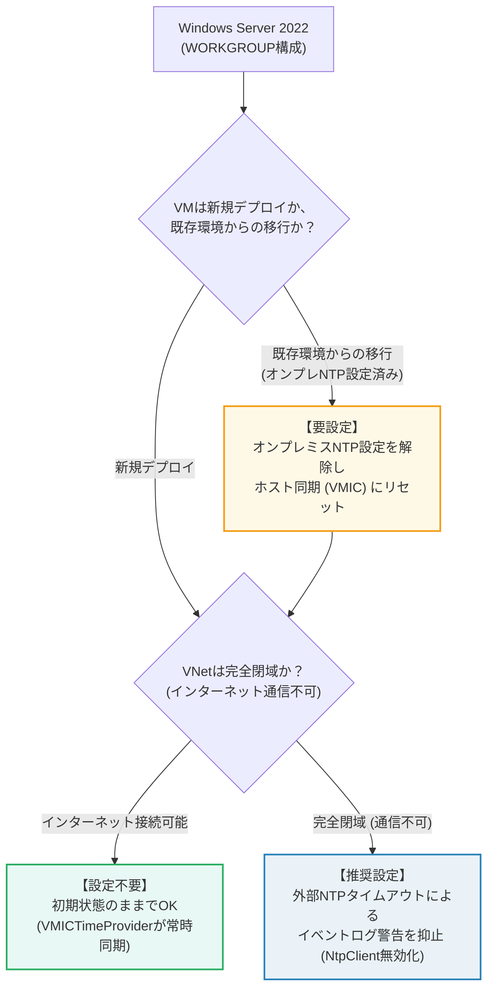
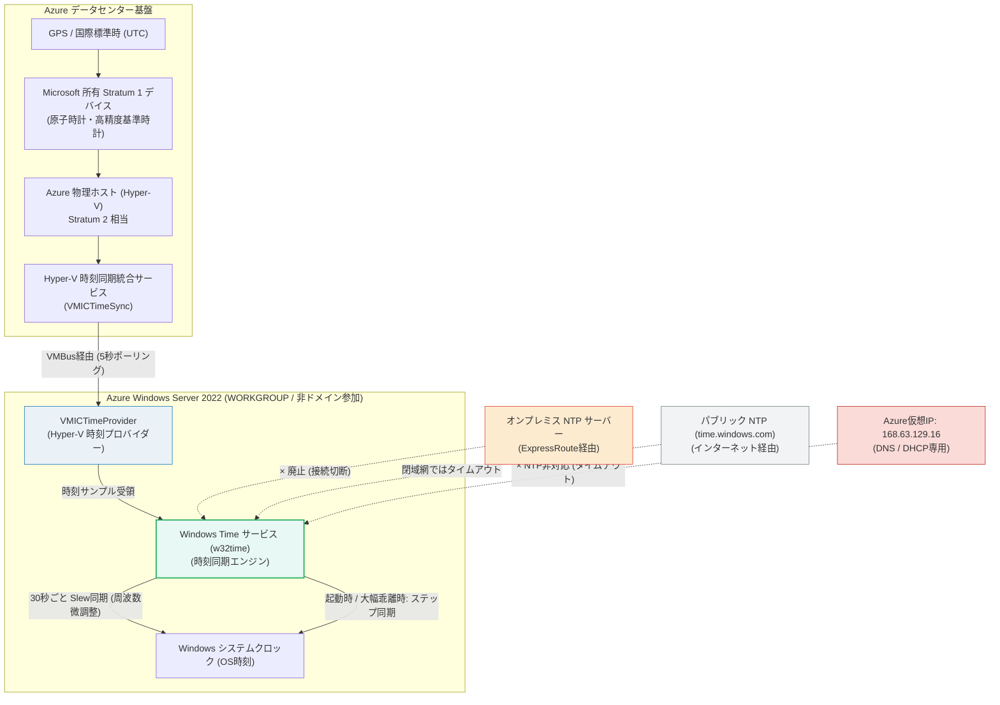
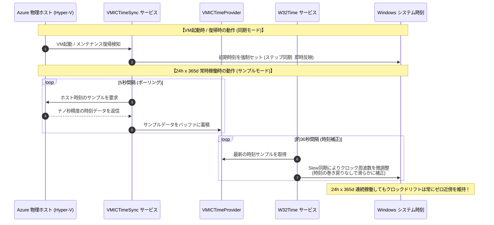

# AZURE：仮想マシンの時刻同期設定：Windows非ドメイン参加サーバ編 (Hyper-V統合サービス & W32Time)

オンプレミスデータセンターの廃止（ExpressRoute撤去）に伴い、Active Directoryに参加していないスタンドアロン（WORKGROUP構成）のWindows Server 2022仮想マシンにおいて、**「設定が必要なのか、初期状態で提供されるのか」**、および **「24時間365日常時稼働しても時刻がズレないベストプラクティス設定」** を解説します。

---

## 1. 結論：「設定は必要か？初期状態で提供されるか？」

### 1.1 結論まとめ

- **新規デプロイするVMの場合**:  
  **原則として「追加設定は不要」です。最初から24時間365日、Azure物理ホストと定期的に時刻同期される状態で提供されます。**  
  Azure Marketplace提供のWindows Server 2022イメージは、Hyper-V統合サービス（`VMICTimeProvider`）がデフォルトで有効化されており、W32Timeサービスと連携して常時定期的に時刻調整（スルー同期）が行われます。
- **オンプレミスNTPを手動設定していた「既存VM」の場合**:  
  **「設定変更（古いNTP設定の解除）が必要」です。**  
  ExpressRoute廃止によりオンプレミスNTPへの通信がタイムアウトするため、手動設定されたNTPサーバーを解除し、Azureホスト同期（`VMIC`）に戻す作業が必要です。
- **完全閉域（インターネット通信不可）環境の場合**:  
  **「イベントログ警告抑止の推奨設定」があります。**  
  デフォルトでは副次的に外部NTP（`time.windows.com`）も登録されているため、インターネットに出られない環境ではシステムイベントログにタイムアウト警告（イベントID 129/134）が定期的に記録されます。時刻同期自体はホスト経由で行われますが、ログをクリーンに保つため外部NTP（NtpClient）を無効化することが推奨されます。

---

### 1.2 設定要否の判断フローチャート



---

## 2. 全体アーキテクチャと時刻同期の仕組み

### 2.1 アーキテクチャ図

Windows Server 2022では、Windows標準の時刻デーモン **W32Time (Windows Time サービス)** と、Azure基盤（Hyper-V）の **VMICTimeSync サービス** が密接に連携して動作します。



> [!WARNING]
> **Windowsでも `168.63.129.16` はNTPサーバーとして利用不可**  
> Linuxと同様、Azureプラットフォーム仮想IP `168.63.129.16` はDNSやヘルスプローブ専用です。NTPサーバーデーモンは稼働していないため、NTP同期先として指定してはなりません。

---

### 2.2 24時間365日 常時定期同期のメカニズム

Windows Server 2016以降（2019 / 2022含む）の「Accurate Time（高精度時刻同期）」機能により、W32Timeサービスは **「サンプルモード」** と **「同期モード」** の2段階で動作します。



1. **サンプルモード (Sample Mode - 定常稼働中)**:
   - W32Timeが稼働している間、`VMICTimeSync` は **5秒ごと** にAzure物理ホストをポーリングして時刻サンプルを取得します。
   - W32Timeサービスは約 **30秒ごと** に最新サンプルを採用し、クロックの周波数を微調整（スルー同期）します。
   - **時間を巻き戻したりジャンプさせたりしない** ため、データベース（SQL Server等）や業務アプリケーションを稼働させたまま、安全に24時間365日高精度（サブミリ秒単位）を保ち続けます。
2. **同期モード (Sync Mode - イベント発生時)**:
   - VM起動時、またはAzureのメモリ保持メンテナンス（VMが最大数十秒一時停止する無停止保守）からの復帰時、あるいは時計が5秒以上大幅にズレた場合にのみ作動し、即座にステップ同期（時刻強制合わせ）を行います。

---

### 2.3 Linux (chrony) と Windows (W32Time) の仕様対比表

| 比較項目 | Linux (RHEL 9.x / Ubuntu 24.04) | Windows Server 2022 (WORKGROUP) |
| :--- | :--- | :--- |
| **時刻同期デーモン** | `chronyd` | `W32Time` (Windows Time サービス) |
| **ホスト連携モジュール** | `ptp_hyperv` (PTPハードウェアクロック) | `VMICTimeSync` / `VMICTimeProvider` |
| **デバイス / ソース名** | `/dev/ptp_hyperv` (`PHC0`) | `VM IC Time Synchronization Provider` |
| **定常ポーリング間隔** | `poll 3` (8秒間隔) | 5秒サンプリング / 約30秒ごとにSlew補正 |
| **定常補正方式** | スルー同期 (周波数微調整) | スルー同期 (周波数微調整) |
| **閉域網での通信** | 不要 (ハイパーバイザー内部完結) | 不要 (ハイパーバイザー内部完結) |
| **標準イメージ初期状態** | chrony設定ファイルの修正が推奨 | **最初からホスト同期が有効 (設定不要)** |

---

## 3. 設定手順（既存VMの移行および閉域網最適化）

### 3.1 既存VM: オンプレミスNTPの解除とホスト同期リセット

これまでオンプレミスNTPサーバーを手動設定していた既存VMは、以下の手順で設定をAzureホスト同期（デフォルト）にリセットします。

管理者権限の PowerShell または コマンドプロンプトで実行します。

```powershell
# 1. 現在の同期ソースを確認 (オンプレミスNTPのIPが表示されることを確認)
w32tm /query /source

# 2. 同期フラグを VMIC (Hyper-Vホスト同期) に設定
w32tm /config /syncfromflags:VMIC /update

# 3. Windows Time サービスを再起動
Restart-Service w32time

# 4. 強制再同期を実行
w32tm /resync /force

# 5. ソースがホスト同期に切り替わったことを確認
w32tm /query /source
```

**確認**: `w32tm /query /source` の結果が **`VM IC Time Synchronization Provider`** となればリセット完了です。

---

### 3.2 完全閉域環境: イベントログ警告（イベントID 129/134）の抑止（推奨）

完全閉域環境（インターネット接続なし）では、Windowsがバックグラウンドで `time.windows.com` に到達しようとしてタイムアウト警告ログを出力する場合があります。  
以下のPowerShellコマンドで `NtpClient` プロバイダーを無効化し、`VMICTimeProvider` 単独稼働にすることで警告を防止できます。

```powershell
# NtpClient を無効化 (レジストリ Enabled = 0)
Set-ItemProperty -Path "HKLM:\SYSTEM\CurrentControlSet\Services\W32Time\TimeProviders\NtpClient" -Name "Enabled" -Value 0

# W32Time サービスを再起動して反映
Restart-Service w32time
w32tm /resync /force
```

> [!TIP]
> **元に戻す場合 (インターネット通信を許可した場合)**:
> ```powershell
> Set-ItemProperty -Path "HKLM:\SYSTEM\CurrentControlSet\Services\W32Time\TimeProviders\NtpClient" -Name "Enabled" -Value 1
> Restart-Service w32time
> ```

---

### 3.3 24時間365日稼働に向けたサービスの自動起動確認

WORKGROUP環境のWindows Serverでは、Windows Time サービス（`w32time`）のスタートアップの種類が `Manual (Trigger Start)`（手動・トリガー開始）になっている場合があります。  
無停止運用において常にサービスが常駐するよう、スタートアップの種類を **「自動（Automatic）」** に設定しておくことが推奨されます。

```powershell
# スタートアップの種類を「自動」に変更
Set-Service -Name w32time -StartupType Automatic

# サービスが実行中であることを確認
Get-Service -Name w32time | Select-Object Name, Status, StartType
```

---

## 4. 動作確認とステータス検証手順

### 4.1 同期ソースの確認 (`w32tm /query /source`)

```powershell
w32tm /query /source
```

**正常な出力:**
```text
VM IC Time Synchronization Provider
```

- **`VM IC Time Synchronization Provider`** と表示されていれば、Azureホストと正常に同期しています。
- `Local CMOS Clock` や `Free-running System Clock` と表示されている場合は、同期が失敗しているため後述のトラブルシューティングを確認してください。

---

### 4.2 同期ステータスの詳細確認 (`w32tm /query /status`)

```powershell
w32tm /query /status
```

**正常な出力例:**
```text
閏インジケーター: 0 (警告なし)
階層: 2 (二次参照 - 適切に NTP で同期)
精度: -23 (ティックごとに 119.209ns)
ルート遅延: 0.0000000s
ルート分散: 0.0100000s
参照 ID: 0x564D4943 (ソース名:  "VMIC")
最終正常同期時刻: 2026/09/17 19:30:15
ソース: VM IC Time Synchronization Provider
ポーリング間隔: 6 (64s)
```

**確認ポイント**:
- **`ソース`**: `VM IC Time Synchronization Provider`
- **`参照 ID`**: `0x564D4943`（ASCIIで `VMIC` を表す）
- **`階層 (Stratum)`**: `2`（Azure物理ホストがStratum 2相当）
- **`最終正常同期時刻`**: 直近の日時で更新されていること

---

### 4.3 システムイベントログの確認

イベントビューアー（`eventvwr.msc`）を開き、`Windows ログ` > `システム` を確認します。

- **イベントソース**: `Time-Service`
- **確認すべき主要イベント**:

| イベントID | 種類 | メッセージ内容と判断 |
| :--- | :--- | :--- |
| **イベントID 35** | 情報 | **「タイム サービスはシステム時刻を時刻ソース VM IC Time Synchronization Provider と同期しています。」**<br>→ 正常にAzureホストと同期が開始・維持されている証拠です。 |
| **イベントID 37** | 情報 | **「タイム サービスは時刻プロバイダー NtpClient から時刻同期を受信しています。」**<br>→ NtpClientが有効な場合に出力されます。 |
| **イベントID 129 / 134** | 警告 | **「タイム プロバイダー NtpClient: ピア ... から有効な応答を受信できませんでした。」**<br>→ 完全閉域環境で外部NTPへ到達できない場合の警告です。時刻自体はVMICで同期されているため深刻ではありませんが、セクション3.2の設定で抑止可能です。 |

---

## 5. トラブルシューティング

| 現象 | 原因 | 対処方法 |
| :--- | :--- | :--- |
| ソースが `Local CMOS Clock` または `Free-running System Clock` になる | W32Timeが停止している、または同期設定が破損している | 以下のコマンドで設定を再登録し再同期する:<br>`net stop w32time`<br>`w32tm /unregister`<br>`w32tm /register`<br>`net start w32time`<br>`w32tm /resync /force` |
| `w32tm /resync` で「時刻データが利用できなかったため、コンピューターは同期しませんでした」と出る | Hyper-V統合サービス（Time Synchronization）が無効化されている | レジストリ `HKLM\SYSTEM\CurrentControlSet\Services\W32Time\TimeProviders\VMICTimeProvider` の `Enabled` が `1` であるか確認し、サービスを再起動する。 |
| イベントログにイベントID 129 や 134 が頻繁に出力される | 完全閉域環境で外部NTPへのアクセスがタイムアウトしている | セクション3.2の手順で `NtpClient` の `Enabled` を `0` に設定する。 |

> [!IMPORTANT]
> **将来 Active Directory ドメインに参加させる場合の注意点**  
> WORKGROUP構成では上記のとおり `VM IC Time Synchronization Provider`（ホスト同期）がベストプラクティスです。  
> ただし、将来このサーバーを **Active Directoryのドメインコントローラー（特にPDCエミュレーター）** に昇格させる場合は、AD全体のNTP階層構造（外部NTP参照）を優先するため、逆に `VMICTimeProvider` を無効化（`Enabled = 0`）することがMicrosoftの推奨プラクティスとなります（通常のドメインメンバーサーバーやWORKGROUPサーバーであれば本ドキュメントの設定のままで問題ありません）。

---

## 6. まとめ

1. **設定の要否**:
   - 新規作成するWORKGROUPのWindows Server 2022 VMは、**初期状態で最初からAzure物理ホスト（`VMICTimeProvider`）と24h x 365d定期同期される構成**になっており、特別な設定作業は不要です。
   - オンプレミスNTPを設定していた既存VMのみ、`w32tm /config /syncfromflags:VMIC /update` でホスト同期にリセットしてください。
2. **24時間365日の連続運用**:
   - 内部で5秒ごとのサンプリングと約30秒ごとのスルー同期（微調整）が自律的に行われるため、OSを長期間再起動しなくても時刻の巻き戻りやドリフトは発生しません。
3. **閉域網での完全自立**:
   - ハイパーバイザーのVMBusを経由して時刻を受信するため、インターネット（UDP 123）の開放は不要です。
