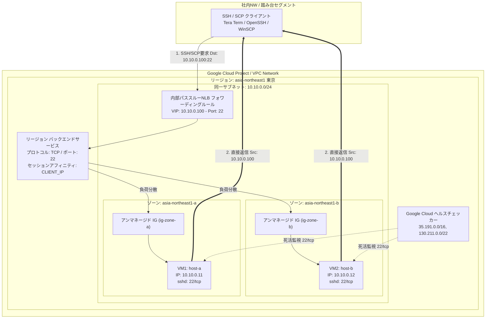
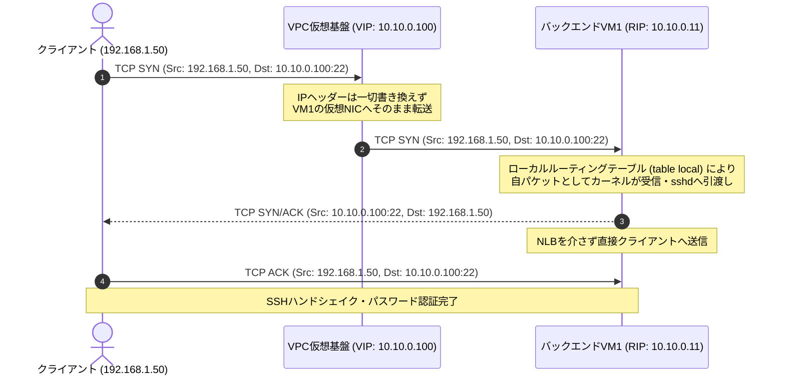
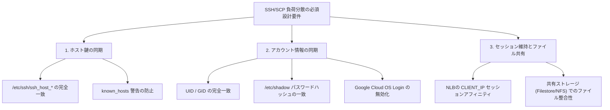

# Google Cloud 内部パススルーNLBによるSSH/SCP（22/tcp）負荷分散 統合設計・構築ガイド

本書は、Google Cloudの内部パススルーネットワークロードバランサ（Internal Passthrough Network Load Balancer / 旧称: 内部TCP/UDPロードバランサ）を使用し、2台のLinux（RHEL）仮想マシンに対してSSHおよびSCP（TCPポート22・パスワード認証）をマルチゾーン構成で冗長化・負荷分散するための技術設計・構築手順書です。

---

## 1. システム構成図と全体像

Google Cloudのサブネットはリージョンリソースであるため、**単一のサブネット（同一CIDR）のままマルチゾーン（ゾーンA / ゾーンB）へバックエンドVMを冗長配置**できます。



---

## 2. アーキテクチャ比較と技術要件

### 2.1 一般的なオンプレミスDSRとGoogle Cloud Passthrough NLBの比較

| 項目 | 一般的なオンプレミスDSR（LVS等） | Google Cloud 内部パススルーNLB | 新人向け解説 |
|---|---|---|---|
| **ロードバランサの実体** | 専用アプライアンス / VIPを持つLinux | 仮想化層（Andromeda / Maglev）の分散処理 | インフラ内に「LBという単一の箱」は存在せず、VPC全体で分散処理されます。単一障害点（SPOF）やボトルネックがありません。 |
| **ARP競合対策** | **必須** (`arp_ignore=1`, `arp_announce=2`) | **不要** | Google Cloud VPCはL3エミュレーションネットワークであり、物理的なARPブロードキャストは流れません。 |
| **iptables REDIRECT** | **非推奨 / 不要** | **非推奨 / 不要** | 宛先IPを書き換えるDNAT/REDIRECTを行うと、戻りパケットの送信元IPが不整合となり通信断を引き起こします。 |
| **VMでのVIP受信設定** | `lo` に `<VIP>/32` を設定 | OSのローカルルーティングテーブル（`local`）にVIP宛てルートを追加 | Google公式イメージかつ `google-guest-agent` 稼働時は自動追加されます。 |
| **戻りパケットの経路** | VMからクライアントへデフォルトGW経由で直返 | VMからクライアントへVPCルータ経由で直返 | LBを経由しないため、大容量ファイル転送（SCP）でもLBの帯域制限を受けません。 |

---

### 2.2 パススルー通信パケットフロー（詳細シーケンス）



---

## 3. SSH/SCP負荷分散における3大考慮事項



### ① SSHホスト鍵（Host Key）の完全一致
- **現象:** クライアントがVIPに接続した際、初回はVM1、2回目はVM2へ振り分けられると、公開鍵指紋が異なるため `WARNING: REMOTE HOST IDENTIFICATION HAS CHANGED!` が発生し、中間者攻撃とみなされ接続拒否されます。
- **対策:** VM1で生成されたホスト秘密鍵・公開鍵（`/etc/ssh/ssh_host_*`）をVM2に完全コピーします。

### ② アカウント情報（UID/GID・パスワードハッシュ）の完全一致
- **現象:** パスワードを変更した際、片方のVMしか更新されていないと、接続先によって認証失敗（Permission denied）が発生します。またUID/GIDが異なるとファイルの所有権が不整合になります。
- **対策:** ユーザ作成時に明示的にUID/GIDを指定し、`/etc/shadow` の暗号化ハッシュ文字列を同期させます。

### ③ セッションアフィニティ（Session Affinity）
- **現象:** SCPで大容量ファイルを転送中、接続先ノードが切り替わるとTCPセッションが切断されます。
- **対策:** NLBのセッションアフィニティを `CLIENT_IP`（クライアントIP固定）に設定します。

---

## 4. 設計パラメータ一覧

本手順書で使用するパラメータの定義例です。

| 分類 | パラメータ名 | 設定値（例） | 説明 |
|---|---|---|---|
| **ネットワーク** | VPCネットワーク | `vpc-production` | 既存または新規VPC |
| | サブネット名 | `snet-tokyo-app` | リージョンサブネット |
| | サブネットCIDR | `10.10.0.0/24` | VM1, VM2, VIP共通 |
| **NLB** | フォワーディングルールIP (VIP) | `10.10.0.100` | 内部固定プライベートIP |
| | プロトコル / ポート | `TCP / 22` | SSH/SCP |
| | セッションアフィニティ | `CLIENT_IP` | 同一端末からの通信を固定 |
| | 接続ドレイン（Draining） | `300秒` | 保守時の安全な切断猶予 |
| **バックエンド** | VM1 (ゾーンA) | `vm-ssh-01` (`10.10.0.11`) | ゾーン: `asia-northeast1-a` |
| | VM2 (ゾーンB) | `vm-ssh-02` (`10.10.0.12`) | ゾーン: `asia-northeast1-b` |
| | インスタンスグループ | `ig-ssh-zone-a`, `ig-ssh-zone-b` | アンマネージド（各ゾーンに1つ） |
| | ネットワークタグ | `ssh-nlb-backend` | ファイアウォール適用対象 |
| **ヘルスチェック** | 方式 / ポート | `TCP / 22` | 死活監視用 |
| | チェック間隔 / 閾値 | 5秒間隔 / 正常:2回, 異常:2回 | 標準値 |
| | 送信元IPレンジ | `35.191.0.0/16`, `130.211.0.0/22` | Google Cloud共通プローブIP |
| **OS / 認証** | 対象OS | Red Hat Enterprise Linux 8 / 9 | 公式イメージ |
| | 接続ユーザ | `appuser` (UID: 2001, GID: 2001) | パスワード認証 |

---

## 5. Google Cloud側（インフラ層）構築手順

### Step 1: ネットワークタグ・ファイアウォールルールの作成

```bash
# 1. ヘルスチェッカーからの疎通許可
gcloud compute firewall-rules create fw-allow-health-check-ssh \
    --network=vpc-production \
    --action=ALLOW \
    --direction=INGRESS \
    --source-ranges=35.191.0.0/16,130.211.0.0/22 \
    --target-tags=ssh-nlb-backend \
    --rules=tcp:22 \
    --description="Allow Google Cloud Health Check to SSH"

# 2. クライアントセグメントからのSSH疎通許可 (例: 社内NW 192.168.0.0/16)
gcloud compute firewall-rules create fw-allow-client-ssh \
    --network=vpc-production \
    --action=ALLOW \
    --direction=INGRESS \
    --source-ranges=192.168.0.0/16 \
    --target-tags=ssh-nlb-backend \
    --rules=tcp:22 \
    --description="Allow Client SSH access to NLB VIP"
```

---

### Step 2: アンマネージドインスタンスグループの作成とVM登録

アンマネージドインスタンスグループはゾーン単位のリソースであるため、2つのゾーンにそれぞれ作成します。

```bash
# ゾーンAのインスタンスグループ作成とVM1登録
gcloud compute instance-groups unmanaged create ig-ssh-zone-a \
    --zone=asia-northeast1-a

gcloud compute instance-groups unmanaged add-instances ig-ssh-zone-a \
    --zone=asia-northeast1-a \
    --instances=vm-ssh-01

# ゾーンBのインスタンスグループ作成とVM2登録
gcloud compute instance-groups unmanaged create ig-ssh-zone-b \
    --zone=asia-northeast1-b

gcloud compute instance-groups unmanaged add-instances ig-ssh-zone-b \
    --zone=asia-northeast1-b \
    --instances=vm-ssh-02
```

---

### Step 3: ヘルスチェック・バックエンドサービス・フォワーディングルールの作成

```bash
# 1. TCP 22番のヘルスチェックを作成 (リージョンリソース)
gcloud compute health-checks create tcp hc-ssh-22 \
    --region=asia-northeast1 \
    --port=22 \
    --check-interval=5s \
    --timeout=5s \
    --healthy-threshold=2 \
    --unhealthy-threshold=2

# 2. リージョンバックエンドサービスを作成 (CLIENT_IPセッションアフィニティ)
gcloud compute backend-services create be-ssh-service \
    --region=asia-northeast1 \
    --load-balancing-scheme=INTERNAL \
    --protocol=TCP \
    --health-checks=hc-ssh-22 \
    --health-checks-region=asia-northeast1 \
    --session-affinity=CLIENT_IP \
    --connection-draining-timeout=300s

# 3. 2つのインスタンスグループをバックエンドサービスに追加
gcloud compute backend-services add-backend be-ssh-service \
    --region=asia-northeast1 \
    --instance-group=ig-ssh-zone-a \
    --instance-group-zone=asia-northeast1-a

gcloud compute backend-services add-backend be-ssh-service \
    --region=asia-northeast1 \
    --instance-group=ig-ssh-zone-b \
    --instance-group-zone=asia-northeast1-b

# 4. フォワーディングルールの作成 (VIPの払い出し)
gcloud compute forwarding-rules create fwd-ssh-nlb \
    --region=asia-northeast1 \
    --load-balancing-scheme=INTERNAL \
    --network=vpc-production \
    --subnet=snet-tokyo-app \
    --address=10.10.0.100 \
    --ip-protocol=TCP \
    --ports=22 \
    --backend-service=be-ssh-service
```

---

## 6. OS側（RHEL 8 / 9）構築・設定手順

### Step 1: OS Loginの無効化（2台共通）

```bash
# インスタンスメタデータで確認 (TRUEの場合は無効化が必要)
curl -H "Metadata-Flavor: Google" http://metadata.google.internal/computeMetadata/v1/instance/attributes/enable-oslogin
```

---

### Step 2: SSHホスト鍵の同期（VM1 → VM2）

#### ① VM1でホスト鍵をアーカイブ
```bash
sudo tar -czf /tmp/ssh_host_keys.tar.gz -C /etc/ssh ssh_host_*_key ssh_host_*_key.pub
```

#### ② 安全な方法でVM2へ転送後、VM2で適用
```bash
sudo tar -xzf /tmp/ssh_host_keys.tar.gz -C /etc/ssh/
sudo chown root:root /etc/ssh/ssh_host_*
sudo chmod 600 /etc/ssh/ssh_host_*_key
sudo chmod 644 /etc/ssh/ssh_host_*_key.pub

sudo systemctl restart sshd
```

#### ③ 検証（フィンガープリント比較）
```bash
ssh-keygen -lf /etc/ssh/ssh_host_ed25519_key.pub
ssh-keygen -lf /etc/ssh/ssh_host_rsa_key.pub
```

---

### Step 3: パスワード認証の有効化（2台共通）

```bash
sudo tee /etc/ssh/sshd_config.d/50-password-auth.conf << 'EOF'
PasswordAuthentication yes
KbdInteractiveAuthentication yes
PermitRootLogin no
EOF

sudo sshd -t
sudo systemctl restart sshd
```

---

### Step 4: ユーザ作成とパスワードハッシュの同期

```bash
# VM1・VM2でユーザ作成
sudo groupadd -g 2001 appuser
sudo useradd -u 2001 -g 2001 -m -s /bin/bash appuser

# VM1でパスワード設定
sudo passwd appuser

# VM1のハッシュ値をVM2に適用
VM1_HASH=$(sudo grep "^appuser:" /etc/shadow | cut -d: -f2)
sudo usermod -p "${VM1_HASH}" appuser
```

---

### Step 5: ローカルルーティングテーブル（VIP受信）の確認

```bash
# 確認
ip route show table local | grep 10.10.0.100

# 出力されない場合の手動追加スクリプト
sudo tee /etc/NetworkManager/dispatcher.d/99-nlb-local-route.sh << 'EOF'
#!/bin/bash
INTERFACE=$1
ACTION=$2
VIP="10.10.0.100"
if [ "$ACTION" = "up" ]; then
    ip route add to local ${VIP}/32 dev ${INTERFACE} proto kernel scope host 2>/dev/null || true
fi
EOF
sudo chmod +x /etc/NetworkManager/dispatcher.d/99-nlb-local-route.sh
sudo ip route add to local 10.10.0.100/32 dev ens4 proto kernel scope host
```

---

### Step 6: OS内ファイアウォール（firewalld）の開放

```bash
sudo firewall-cmd --permanent --add-service=ssh
sudo firewall-cmd --reload
```

---

## 7. 担当者作業チェックリスト & テスト計画書

### 作業チェックリスト
- [ ] **GCP設定**:
  - [ ] VM1（Zone-a）とVM2（Zone-b）が同一サブネットで起動しているか
  - [ ] 2つのアンマネージドIGが作成され、各VMが正しく紐づけられているか
  - [ ] ファイアウォールでヘルスチェックレンジ（`35.191.0.0/16`, `130.211.0.0/22`）の22/tcpが許可されているか
  - [ ] NLBバックエンドサービスのヘルスチェックステータスが両ノードとも「HEALTHY」になっているか
- [ ] **OS設定**:
  - [ ] `enable-oslogin` が無効化されているか
  - [ ] 両VMで `/etc/ssh/ssh_host_*` のフィンガープリントが一致しているか
  - [ ] `id appuser` でUID=2001, GID=2001になっているか
  - [ ] 両VMの `/etc/shadow` のハッシュ値が一致しているか
  - [ ] `ip route show table local` にVIPエントリが存在するか

### 疎通テスト項目
1. **初回SSH接続テスト**: `ssh appuser@10.10.0.100` でパスワード認証ログインできること。
2. **ホスト鍵整合性テスト**: 連続接続やノード切り替え時に `REMOTE HOST IDENTIFICATION HAS CHANGED` が発生しないこと。
3. **SCPファイル転送テスト**: `scp` によるデータ転送が中断せず完了すること。
4. **ノード障害時フェイルオーバーテスト**: 片方の `sshd` 停止時にヘルスチェックによって自動切り離しが行われ、他系へ通信が継続すること。
