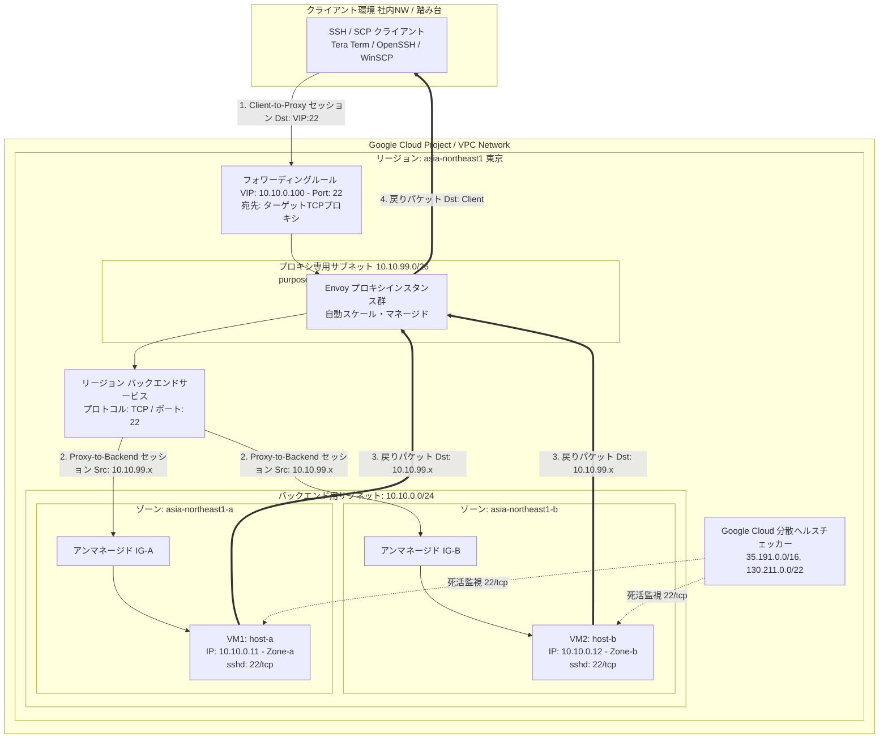
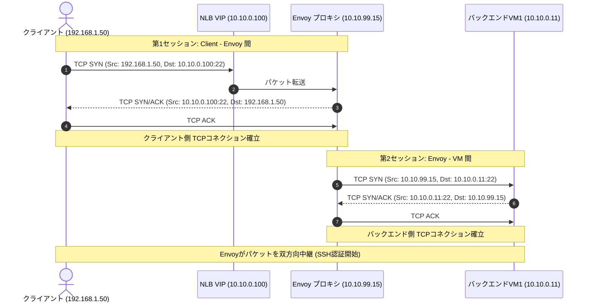

# Google Cloud 内部プロキシNLBによるSSH/SCP（22/tcp）負荷分散 統合設計・構築ガイド

本書は、Google Cloudの**内部リージョンTCPプロキシロードバランサ（Internal Regional TCP Proxy Load Balancer / Envoyベース）**を使用し、2台のLinux（RHEL）仮想マシンに対してSSHおよびSCP（TCPポート22・パスワード認証）をマルチゾーン構成で負荷分散・冗長化するための技術設計・構築手順書です。

パススルー型（DSR）とは異なり、**EnvoyプロキシがTCPセッションを中継するリバースプロキシ構成**となります。

---

## 1. プロキシ型NLBの全体アーキテクチャ

内部プロキシロードバランサでは、VPC内に**プロキシ専用サブネット（Proxy-only Subnet）**を配置し、そこにデプロイされるEnvoyプロキシがクライアントとバックエンドVMの間でTCPコネクションを二重に確立します。



---

## 2. パススルー型（DSR）とプロキシ型の決定的な違い

新人エンジニアが最も混乱しやすいポイントです。プロキシ型を採用することで、OS側の設定やパケットの流れが大きく変わります。

| 比較項目 | 内部パススルーNLB（DSR） | 内部プロキシNLB（Envoy） | 設計上の注意点 |
|---|---|---|---|
| **通信アーキテクチャ** | パススルー（DSR方式） | リバースプロキシ（TCP終端・再送） | プロキシ型はTCPコネクションを一旦Envoyで終端します。 |
| **プロキシ専用サブネット** | **不要** | **必須** (`REGIONAL_MANAGED_PROXY`) | リージョン内に最小 `/26`（64IP）以上の専用サブネットを事前確保する必要があります。 |
| **VM着信時の宛先IP (Dst)** | **VIPのまま届く** (`10.10.0.100`) | **VMの個別IPになる** (`10.10.0.11`) | **プロキシ型ではOS側のVIP受信設定（localルート追加）が一切不要**です。 |
| **VM着信時の送信元IP (Src)** | **クライアントの実IP** | **プロキシ専用サブネットのIP** | バックエンドVMのログやsshdにはEnvoyのIPが記録されます。 |
| **ファイアウォール許可元** | クライアント実IP & ヘルスチェッカー | **プロキシ専用サブネット & ヘルスチェッカー** | クライアントIPを直接VMのFWで許可しても通信できません。プロキシ専用サブネットの許可が必要です。 |
| **戻りパケットの経路** | VMからクライアントへ直返 | VMからEnvoyへ返却され、Envoyがクライアントへ返却 | 双方向ともEnvoyを通過します。 |

---

## 3. パケットフローとコネクション遷移



---

## 4. 設計パラメータ一覧

| 分類 | パラメータ名 | 設定値（例） | 説明 |
|---|---|---|---|
| **ネットワーク** | VPCネットワーク | `vpc-production` | 共通VPC |
| | バックエンド用サブネット | `snet-tokyo-backend` (`10.10.0.0/24`) | VM1, VM2, VIPを配置 |
| | **プロキシ専用サブネット** | `snet-tokyo-proxy` (`10.10.99.0/26`) | **purpose: REGIONAL_MANAGED_PROXY** |
| **ロードバランサ** | フォワーディングルールIP (VIP) | `10.10.0.100` | 内部固定プライベートIP |
| | ターゲットTCPプロキシ | `tp-ssh-proxy` | TCPプロキシリソース |
| | バックエンドサービス | `be-ssh-proxy-service` | プロトコル: TCP / ポート: 22 |
| | セッションアフィニティ | `CLIENT_IP` | 同一端末からの接続を固定 |
| **バックエンド** | VM1 (ゾーンA) | `vm-ssh-01` (`10.10.0.11`) | `asia-northeast1-a` |
| | VM2 (ゾーンB) | `vm-ssh-02` (`10.10.0.12`) | `asia-northeast1-b` |
| | インスタンスグループ | `ig-ssh-zone-a`, `ig-ssh-zone-b` | アンマネージド（各ゾーン1つ） |
| | ネットワークタグ | `ssh-proxy-backend` | ファイアウォール適用対象 |
| **ヘルスチェック** | プロトコル / ポート | `TCP / 22` | 死活監視用 |
| | プローブ送信元IP | `35.191.0.0/16`, `130.211.0.0/22` | Google Cloud共通IP |

---

## 5. Google Cloud側（インフラ層）構築手順

### Step 1: プロキシ専用サブネット（Proxy-only Subnet）の作成

内部プロキシロードバランサを使用するリージョンごとに、必ず1つのプロキシ専用サブネットが必要です。

```bash
gcloud compute networks subnets create snet-tokyo-proxy \
    --network=vpc-production \
    --region=asia-northeast1 \
    --range=10.10.99.0/26 \
    --purpose=REGIONAL_MANAGED_PROXY \
    --role=ACTIVE
```

> **【新人向け注意】**
> - `--purpose=REGIONAL_MANAGED_PROXY` を必ず指定します。
> - 通常のVMはこのサブネット内に配置できません。Envoyプロキシ専用の領域です。

---

### Step 2: VPC ファイアウォールルールの作成

バックエンドVMに対して、**「プロキシ専用サブネット」**と**「ヘルスチェッカー」**からの `22/tcp` を許可します。

```bash
# 1. プロキシ専用サブネットからの通信許可 (EnvoyからのSSH/SCP接続)
gcloud compute firewall-rules create fw-allow-proxy-to-backend \
    --network=vpc-production \
    --action=ALLOW \
    --direction=INGRESS \
    --source-ranges=10.10.99.0/26 \
    --target-tags=ssh-proxy-backend \
    --rules=tcp:22 \
    --description="Allow Envoy Proxy Subnet to Backend SSH"

# 2. ヘルスチェッカーからの死活監視許可
gcloud compute firewall-rules create fw-allow-hc-to-backend \
    --network=vpc-production \
    --action=ALLOW \
    --direction=INGRESS \
    --source-ranges=35.191.0.0/16,130.211.0.0/22 \
    --target-tags=ssh-proxy-backend \
    --rules=tcp:22 \
    --description="Allow Google Health Checker to Backend SSH"

# 3. クライアントからNLB VIPへのアクセス許可 (VIP宛て)
gcloud compute firewall-rules create fw-allow-client-to-vip \
    --network=vpc-production \
    --action=ALLOW \
    --direction=INGRESS \
    --source-ranges=192.168.0.0/16 \
    --destination-ranges=10.10.0.100/32 \
    --rules=tcp:22 \
    --description="Allow Client access to NLB VIP"
```

---

### Step 3: アンマネージドインスタンスグループの作成

マルチゾーン対応のため、Zone-aとZone-bにそれぞれグループを作成します。

```bash
# Zone-a 側
gcloud compute instance-groups unmanaged create ig-ssh-zone-a --zone=asia-northeast1-a
gcloud compute instance-groups unmanaged add-instances ig-ssh-zone-a \
    --zone=asia-northeast1-a \
    --instances=vm-ssh-01

# Zone-b 側
gcloud compute instance-groups unmanaged create ig-ssh-zone-b --zone=asia-northeast1-b
gcloud compute instance-groups unmanaged add-instances ig-ssh-zone-b \
    --zone=asia-northeast1-b \
    --instances=vm-ssh-02
```

---

### Step 4: ヘルスチェック・バックエンドサービス・ターゲットプロキシの作成

```bash
# 1. リージョンヘルスチェックの作成
gcloud compute health-checks create tcp hc-ssh-proxy-22 \
    --region=asia-northeast1 \
    --port=22 \
    --check-interval=5s \
    --timeout=5s \
    --healthy-threshold=2 \
    --unhealthy-threshold=2

# 2. リージョンバックエンドサービスの作成
# ※ load-balancing-scheme に INTERNAL_MANAGED を指定
gcloud compute backend-services create be-ssh-proxy-service \
    --region=asia-northeast1 \
    --load-balancing-scheme=INTERNAL_MANAGED \
    --protocol=TCP \
    --health-checks=hc-ssh-proxy-22 \
    --health-checks-region=asia-northeast1 \
    --session-affinity=CLIENT_IP \
    --connection-draining-timeout=300s

# 3. 2つのゾーンのIGをバックエンドサービスに追加
gcloud compute backend-services add-backend be-ssh-proxy-service \
    --region=asia-northeast1 \
    --instance-group=ig-ssh-zone-a \
    --instance-group-zone=asia-northeast1-a

gcloud compute backend-services add-backend be-ssh-proxy-service \
    --region=asia-northeast1 \
    --instance-group=ig-ssh-zone-b \
    --instance-group-zone=asia-northeast1-b

# 4. リージョンターゲットTCPプロキシの作成
gcloud compute target-tcp-proxies create tp-ssh-proxy \
    --region=asia-northeast1 \
    --backend-service=be-ssh-proxy-service

# 5. リージョンフォワーディングルールの作成 (VIPの割り当て)
gcloud compute forwarding-rules create fwd-ssh-proxy-nlb \
    --region=asia-northeast1 \
    --load-balancing-scheme=INTERNAL_MANAGED \
    --network=vpc-production \
    --subnet=snet-tokyo-backend \
    --address=10.10.0.100 \
    --ports=22 \
    --target-tcp-proxy=tp-ssh-proxy \
    --target-tcp-proxy-region=asia-northeast1
```

---

## 6. OS側（RHEL 8 / 9）構築・設定手順

プロキシ型NLBでは、**パススルー型で必要だった「ローカルルーティングテーブル（VIP宛てルート）の設定」が完全に不要**です。パケットは直接VM自身のプライベートIP宛てに届きます。

### Step 1: OS Loginの無効化確認
OSローカルユーザでパスワード認証を行うため、OS Loginを無効化します。
```bash
curl -H "Metadata-Flavor: Google" http://metadata.google.internal/computeMetadata/v1/instance/attributes/enable-oslogin
# TRUE の場合は、インスタンス設定で enable-oslogin=FALSE に変更
```

---

### Step 2: SSHホスト鍵（Host Key）の同期（VM1 → VM2）

接続ごとに警告（`REMOTE HOST IDENTIFICATION HAS CHANGED`）が出るのを防ぐため、2台のホスト鍵を完全に一致させます。

```bash
# 【VM1で実行】ホスト鍵をアーカイブ
sudo tar -czf /tmp/ssh_host_keys.tar.gz -C /etc/ssh ssh_host_*_key ssh_host_*_key.pub

# 【VM2へ転送後、VM2で実行】
sudo tar -xzf /tmp/ssh_host_keys.tar.gz -C /etc/ssh/
sudo chown root:root /etc/ssh/ssh_host_*
sudo chmod 600 /etc/ssh/ssh_host_*_key
sudo chmod 644 /etc/ssh/ssh_host_*_key.pub
sudo systemctl restart sshd

# フィンガープリントの一致確認
ssh-keygen -lf /etc/ssh/ssh_host_ed25519_key.pub
```

---

### Step 3: パスワード認証の有効化（2台共通）

```bash
sudo tee /etc/ssh/sshd_config.d/50-password-auth.conf << 'EOF'
PasswordAuthentication yes
KbdInteractiveAuthentication yes
PermitRootLogin no
EOF

sudo sshd -t
sudo systemctl restart sshd
```

---

### Step 4: ユーザ作成とパスワードハッシュの同期

```bash
# 両ノードで共通UID/GIDを指定して作成
sudo groupadd -g 2001 appuser
sudo useradd -u 2001 -g 2001 -m -s /bin/bash appuser

# VM1でパスワード設定
sudo passwd appuser

# VM1のハッシュ値をVM2へ反映
VM1_HASH=$(sudo grep "^appuser:" /etc/shadow | cut -d: -f2)
sudo usermod -p "${VM1_HASH}" appuser
```

---

### Step 5: firewalldの設定

Envoyプロキシ専用サブネット（`10.10.99.0/26`）およびヘルスチェッカーからの接続を許可します。

```bash
# プロキシ専用サブネットからの22番を許可
sudo firewall-cmd --permanent --add-rich-rule='rule family="ipv4" source address="10.10.99.0/26" port port="22" protocol="tcp" accept'

# ヘルスチェッカーからの22番を許可
sudo firewall-cmd --permanent --add-rich-rule='rule family="ipv4" source address="35.191.0.0/16" port port="22" protocol="tcp" accept'
sudo firewall-cmd --permanent --add-rich-rule='rule family="ipv4" source address="130.211.0.0/22" port port="22" protocol="tcp" accept'

# 反映
sudo firewall-cmd --reload
```

---

## 7. 担当者作業チェックリスト & テスト計画書

### 作業チェックリスト
- [ ] **GCP設定**:
  - [ ] プロキシ専用サブネット（`purpose=REGIONAL_MANAGED_PROXY`）がリージョン内に作成されているか
  - [ ] バックエンドサービスの `load-balancing-scheme` が `INTERNAL_MANAGED` になっているか
  - [ ] Zone-a と Zone-b のアンマネージドIGがバックエンドサービスに登録されているか
  - [ ] VPCファイアウォールでプロキシ専用サブネット（`10.10.99.0/26`）からの `tcp:22` がバックエンドVMに許可されているか
  - [ ] バックエンドサービスの詳細で両ノードが「HEALTHY」と判定されているか
- [ ] **OS設定**:
  - [ ] **（不要確認）** `ip route table local` へのVIP追加作業を**行っていない**こと（プロキシ型では設定不要）
  - [ ] 両VMで `/etc/ssh/ssh_host_*` のフィンガープリントが一致していること
  - [ ] 両VMの `/etc/shadow` のパスワードハッシュ値が一致していること
  - [ ] firewalldでプロキシ専用サブネットからの通信が許可されていること

### 疎通テスト項目
1. **初回SSH接続テスト**:
   - `ssh appuser@10.10.0.100` でパスワード認証ログインできること。
   - VM上で `w` または `who` を実行し、接続元IPが「プロキシ専用サブネット（`10.10.99.x`）」になっていることを確認する。
2. **ホスト鍵キャッシュ整合性テスト**:
   - 連続して再接続しても、`known_hosts` の中間者攻撃警告が出ないこと。
3. **フェイルオーバーテスト**:
   - 片方のVMのsshdを停止させた際、ヘルスチェックによって自動切り離しが行われ、別ゾーンのVMへ透過的に接続できること。
